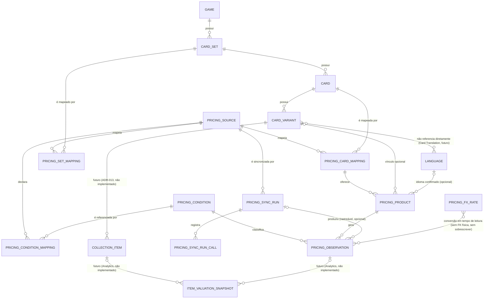

# Modelo de Dados — Pricing (Preço de Mercado)

| Campo | Valor |
|--------|-------|
| **Documento** | Modelo de Dados — Pricing |
| **Arquivo** | `docs/05f-pricing.md` |
| **Versão** | 1.0 |
| **Status** | **Proposto — nenhuma tabela criada no Supabase.** Modelagem conceitual e lógica aprovada para documentação; implementação física (migrations) depende de ciclo próprio, ainda não iniciado. |
| **Objetivo** | Modelo lógico e físico do domínio Pricing — observações de mercado por fonte externa, independente de Catálogo Editorial e de Ownership, conforme `ADR-029` e `ADR-006`. |
| **Escopo** | Entidades de Pricing: fonte, mapeamento de Set/Card por fonte, produto (impressão+idioma reportados pela fonte), condição canônica, observação de preço, câmbio, auditoria de sincronização. Não inclui a modelagem física de Item Valuation (Analytics), deliberadamente adiada — ver seção própria ao final. |
| **Dependências** | `04-domain-model.md` (seções "Pricing (Preço de Mercado)" e "Item Valuation (Avaliação do Item)"), `adr/ADR-006-separation-of-catalog-ownership-and-analytics.md`, `adr/ADR-029-pricing-domain-model.md`, `standards/STD-001-database-standards.md`, `standards/STD-002-domain-modeling.md`, `05b-cartas-e-raridade.md` (Card/Card Variant), `05c-assets-e-importacao.md` (Language/Asset Source — padrão de referência, não reaproveitado por tabela). |
| **Documentos Relacionados** | `05-modelo-de-dados.md` (índice), `ROADMAP.md` (seção "Next"), `PROVA-TECNICA-JUSTTCG-PRICING-2026-08-16.md` (fora de `docs/`, prova técnica de homologação de fonte, não normativa). |

---

# Nota de Origem e Estado Real do Repositório (2026-08-16)

Este documento nasce diretamente da sequência estratégica aprovada por Fabrício em 2026-08-16 (`ROADMAP.md`, seção "Now"/"Next"): **Card Variant (fundação encerrada) → Pricing/Market Data (esta modelagem) → Collection → Analytics/Valuation.** Card Variant está formalmente encerrado como fundação (`ADR-028`); Coleções (`Collection`, `Collection Item`) segue **não implementada** — apenas conceitualmente decidida (`ADR-013`, `ADR-014`, `04-domain-model.md`), sem modelo físico.

**Duas consequências diretas desse estado real, refletidas em todo este documento:**

1. Toda referência a `card`, `card_variant`, `card_variant_type`, `language`, `game` neste documento aponta para tabelas **já existentes e confirmadas** no Supabase (conferidas em `05b-cartas-e-raridade.md`/`05c-assets-e-importacao.md`, ambos reconstruídos por introspecção direta do schema físico em 2026-08-16, mesma data). **Tentativa de reconfirmação em tempo real, nesta sessão, via `execute_sql`/`list_tables` (MCP Supabase), retornou erro `503` (serviço indisponível) em cinco tentativas consecutivas — não foi possível revalidar o schema ao vivo.** Este documento se apoia na documentação mais recente (mesmo dia) como evidência confiável, não substitui a revalidação ao vivo — qualquer sessão futura que inicie a implementação física deste módulo deve confirmar o schema de `card`/`card_variant`/`card_variant_type`/`language` diretamente no Supabase antes de escrever a primeira migration, exatamente como o ritual de qualquer novo ciclo já exige (`CLAUDE.md`).
2. Toda referência a `Collection Item` (o exemplar físico do usuário) é **conceitual e prospectiva** — usada apenas para explicar os cenários de valuation (ver seção "Item Valuation", ao final) e para justificar por que certas colunas (ex.: condição de conservação) **não** entram em Pricing. Nenhuma FK física deste documento aponta para uma tabela de Collection Item, porque ela ainda não existe.

---

# Por que Pricing é um Domínio Independente (resumo — decisão completa em `ADR-029`)

`ADR-006` já separa o domínio em três responsabilidades: Catálogo Editorial, Patrimônio do Usuário (Ownership) e Analytics. Pricing não se encaixa em nenhuma das três sem distorção:

- **Não é Catálogo Editorial** — um preço de mercado não é um dado editorial oficial do jogo; é uma observação de terceiros, sujeita a mudar a cada instante, nunca uma característica permanente da Card/Card Variant.
- **Não é Ownership** — Pricing existe independentemente de qualquer usuário possuir a carta. O mesmo dado de preço serve a todos os usuários simultaneamente (é informação de mercado global), diferente de `card_variant_id`/condição/idioma de um Collection Item específico.
- **Não é Analytics puro** — Analytics (`ADR-006`, "Sempre que uma informação puder ser calculada de forma confiável, ela não deverá ser persistida redundantemente sem justificativa técnica específica") pressupõe dado derivado de Catálogo + Ownership. Pricing é, ele mesmo, um dado primário capturado de fontes externas — precisa ser persistido, teve seu próprio ciclo de importação/auditoria, e é o que Analytics consumirá depois, junto de Ownership, para produzir Item Valuation.

Pricing é, portanto, um **quarto domínio de peso equivalente**, seguindo a mesma arquitetura já validada por Catálogo Editorial: fonte externa → mapeamento/staging → dado confirmado, nunca escrita direta e nunca dependência estrutural em tempo real (`ADR-008`, estendido aqui pela primeira vez para além do Catálogo).

---

# Visão Geral das Entidades

| Entidade | Papel | Classificação (STD-002) |
|---|---|---|
| `pricing_source` | Cadastro de fontes externas de preço (JustTCG, TCGplayer, futuras fontes BR). | Reference Data |
| `pricing_condition` | Catálogo canônico de condições físicas de conservação (Near Mint, Lightly Played, ...). | Reference Data |
| `pricing_condition_mapping` | De-para entre o código de condição de cada fonte e a condição canônica. | Value Object (subordinado a `pricing_source`) |
| `pricing_set_mapping` | Correspondência entre `card_set` e o identificador de Set de cada fonte, com estado de confirmação. | Identity Entity (identidade própria: uma correspondência específica Set↔Fonte) |
| `pricing_card_mapping` | Correspondência entre `card` e o identificador de Card de cada fonte, com estado de confirmação. | Identity Entity |
| `pricing_product` | Produto/impressão específico que a fonte reporta para uma Card (printing + idioma), com vínculo opcional a `card_variant`. | Identity Entity |
| `pricing_fx_rate` | Taxas de câmbio históricas, diárias, rastreáveis — nunca aplicadas retroativamente ao preço original. | Reference Data (série temporal) |
| `pricing_observation` | Fato de preço observado num instante, na moeda/mercado/condição originais da fonte — imutável, nunca sobrescrito. | Identity Entity (fato de série temporal) |
| `pricing_sync_run` | Execução de sincronização com uma fonte (auditoria de alto nível: status, contagens, cota). | Identity Entity |
| `pricing_sync_run_call` | Cada chamada individual feita durante uma `pricing_sync_run` (auditoria granular: endpoint, status HTTP, erro sanitizado, cota restante). | Value Object (subordinado a `pricing_sync_run`) |

`item_valuation_snapshot` (Analytics, não Pricing) é tratada à parte, ao final deste documento — ver "Item Valuation — Direção Futura (não implementada nesta rodada)".

---

# Diagrama de Relacionamento — Catálogo, Pricing e Ownership



`COLLECTION_ITEM` e `ITEM_VALUATION_SNAPSHOT` aparecem apenas para deixar explícito onde Pricing se conecta ao restante do domínio quando Collection existir — nenhuma das duas é criada por este documento.

---

# `pricing_source` (Fonte de Preço)

## O que é? / O que não é? / Qual problema resolve? (STD-002)

**O que é:** o cadastro de uma fonte externa de dados de mercado (ex.: JustTCG, TCGplayer, uma futura fonte brasileira). Registra, entre outras coisas, o **escopo de mercado** da fonte (`market_scope`) — a distinção arquitetural que impede que uma fonte internacional seja tratada como "Valor Brasil" (premissa 9 do pedido original desta modelagem).

**O que não é:** não é `asset_source` (Catálogo Editorial, `05c-assets-e-importacao.md`) reaproveitada. Apesar do padrão estrutural ser deliberadamente o mesmo (mesma disciplina já validada em produção), `asset_source` governa fontes de sincronização de **catálogo/imagens** (TCGdex, importação manual) — um domínio conceitualmente distinto de mercado/preço, mesmo que uma futura fonte possa, coincidentemente, servir aos dois papéis. Ver "Divergências em relação à hipótese inicial", no `ADR-029`, para o racional completo dessa decisão.

**Qual problema resolve:** permite múltiplas fontes coexistirem e serem substituídas sem reconstrução funcional (premissa 3 do pedido) — nenhuma tabela de Pricing referencia "JustTCG" diretamente; todas referenciam `pricing_source.id`.

## Modelo Lógico

```text
Pricing Source

Identidade
----------
id
code

Descrição
----------
name
source_type
market_scope
base_currency
base_url
api_base_url
documentation_url
terms_url
attribution_text
requires_commercial_agreement
supports_api
is_active
source_order

Auditoria
----------
created_at
updated_at
```

## Atributos

**id** — identidade técnica (UUID).

**code** — identificação técnica estável (`JUSTTCG`, `TCGPLAYER`), maiúsculo, único globalmente (fonte não pertence a um Game específico — mesmo padrão de `asset_source`, já que uma fonte de preço pode cobrir múltiplos TCGs).

**name** — nome de apresentação ("JustTCG", "TCGplayer").

**source_type** — `API` / `DATASET` / `MANUAL`, mesmo vocabulário de `asset_source`.

**market_scope** — `INTERNATIONAL` ou `BRAZIL`. Campo arquitetural central desta entidade: só uma fonte com `market_scope = 'BRAZIL'` pode originar uma classificação `BRAZIL_ITEM_VALUATION` (ver seção "Item Valuation"). Nenhuma fonte internacional pode ser promovida a "Brasil" por conversão de moeda — a distinção é da fonte, nunca da moeda do preço.

**base_currency** — moeda nativa típica da fonte (`USD`, `BRL`), ISO 4217. Informativo/default — não restringe `pricing_observation.currency_code`, porque uma única fonte pode reportar preços em mais de uma moeda (ex.: achado real do discovery de 2026-08-16: o campo `pricing` embutido da TCGdex combina Cardmarket em EUR e TCGplayer em USD).

**documentation_url / terms_url / attribution_text** — suportam o achado de risco legal já registrado no discovery (Cardmarket/TCGplayer restringem redistribuição comercial de preço sem acordo prévio) sem resolvê-lo — `terms_url` e `attribution_text` existem para que a UI, quando publicar dado de preço, sempre tenha de onde citar a atribuição exigida.

**requires_commercial_agreement** — booleano, default `FALSE`. Sinaliza explicitamente (sem resolver) o achado de risco legal do discovery — nenhuma tela deve publicar dado de uma fonte com esta flag `TRUE` fora do escopo já autorizado (hoje, nenhum) sem confirmação jurídica/comercial prévia.

**supports_api / is_active / source_order** — mesmo papel de `asset_source`.

## Campos que Não Incluiremos Agora

- **Limite de cota/rate limit estruturado (`daily_limit`, `per_minute_limit`)** — Free Tier da JustTCG tem esses números, mas são um detalhe operacional de integração, não uma característica de domínio da fonte; documentar em código/config da futura Edge Function é suficiente (mesmo raciocínio de simplicidade já aplicado a outras entidades — AP-004).
- **Múltiplas moedas suportadas como lista estruturada** — `base_currency` como default único é suficiente para o MVP; se uma fonte futura precisar de uma lista fechada de moedas suportadas, isso pode virar uma tabela `pricing_source_currency` própria, sem quebrar o modelo atual.

## Regras de Negócio

1. `code` único e imutável após criação (mesmo padrão de `card_variant_type.code`).
2. `market_scope` é definido na criação da fonte e não deve mudar depois de existir qualquer `pricing_observation` associada (mudar o escopo de mercado de uma fonte já usada invalidaria retroativamente toda classificação de valuation já exibida) — reforçado por rotina administrativa futura, não por `CHECK` (não há como expressar "não há filhos" via `CHECK`).
3. Nenhuma exclusão física — apenas `is_active = FALSE` (mesmo padrão de `card_variant_type`/`asset_source`).
4. Nenhum preço pode ser gravado (`pricing_observation`) sem que a fonte exista e esteja ativa — garantido pela FK obrigatória em toda a cadeia (`pricing_card_mapping` → `pricing_product` → `pricing_observation`).

## Modelo Físico (PostgreSQL) — Proposto, Ainda Não Executado

```sql
CREATE TABLE public.pricing_source (
    id                             UUID PRIMARY KEY DEFAULT gen_random_uuid(),
    code                           TEXT NOT NULL,
    name                           TEXT NOT NULL,
    source_type                    TEXT NOT NULL,
    market_scope                   TEXT NOT NULL,
    base_currency                  TEXT NOT NULL,
    base_url                       TEXT,
    api_base_url                   TEXT,
    documentation_url              TEXT,
    terms_url                      TEXT,
    attribution_text               TEXT,
    requires_commercial_agreement  BOOLEAN NOT NULL DEFAULT FALSE,
    supports_api                   BOOLEAN NOT NULL DEFAULT FALSE,
    is_active                      BOOLEAN NOT NULL DEFAULT TRUE,
    source_order                   INTEGER NOT NULL,
    created_at                     TIMESTAMPTZ NOT NULL DEFAULT NOW(),
    updated_at                     TIMESTAMPTZ NOT NULL DEFAULT NOW(),

    CONSTRAINT uq_pricing_source_code UNIQUE (code),
    CONSTRAINT uq_pricing_source_order UNIQUE (source_order),
    CONSTRAINT ck_pricing_source_code_format
        CHECK (code = UPPER(code) AND code ~ '^[A-Z][A-Z0-9_]*$'),
    CONSTRAINT ck_pricing_source_name_not_blank CHECK (BTRIM(name) <> ''),
    CONSTRAINT ck_pricing_source_type
        CHECK (source_type IN ('API', 'DATASET', 'MANUAL')),
    CONSTRAINT ck_pricing_source_market_scope
        CHECK (market_scope IN ('INTERNATIONAL', 'BRAZIL')),
    CONSTRAINT ck_pricing_source_base_currency_format
        CHECK (base_currency ~ '^[A-Z]{3}$'),
    CONSTRAINT ck_pricing_source_base_url
        CHECK (base_url IS NULL OR (BTRIM(base_url) <> '' AND base_url ~* '^https://')),
    CONSTRAINT ck_pricing_source_api_base_url
        CHECK (api_base_url IS NULL OR (BTRIM(api_base_url) <> '' AND api_base_url ~* '^https://')),
    CONSTRAINT ck_pricing_source_documentation_url
        CHECK (documentation_url IS NULL OR (BTRIM(documentation_url) <> '' AND documentation_url ~* '^https://')),
    CONSTRAINT ck_pricing_source_terms_url
        CHECK (terms_url IS NULL OR (BTRIM(terms_url) <> '' AND terms_url ~* '^https://')),
    CONSTRAINT ck_pricing_source_source_order_positive
        CHECK (source_order > 0)
);

CREATE TRIGGER trg_pricing_source_set_updated_at
    BEFORE UPDATE ON public.pricing_source
    FOR EACH ROW EXECUTE FUNCTION set_updated_at();

ALTER TABLE public.pricing_source ENABLE ROW LEVEL SECURITY;
```

**Cardinalidade:** 1 `pricing_source` → N `pricing_set_mapping`, N `pricing_card_mapping`, N `pricing_condition_mapping`, N `pricing_sync_run`.

**Política de exclusão:** sem `DELETE` físico previsto (nenhuma rotina administrativa de exclusão) — apenas `is_active = FALSE`. Toda FK de tabelas filhas para `pricing_source_id` deve ser `ON DELETE RESTRICT` (nunca perder mapeamentos/observações por exclusão em cascata de uma fonte).

**RLS e Grants (proposto, mesmo padrão de `card_variant_type`/`asset_source`):** RLS habilitado; uma única policy `pricing_admin_select` (`SELECT`, `(select is_admin())`). Toda escrita via função `SECURITY DEFINER` futura (`admin_create_pricing_source()` e equivalentes, ainda não implementadas). `authenticated`: só `SELECT`. `anon`: nenhum privilégio. `service_role`: `SELECT` (leitura durante sincronização). `TRUNCATE`/`REFERENCES`/`TRIGGER`/`MAINTAIN` revogados de `anon`/`authenticated` desde a criação (STD-001, versão `1.19`).

## Testes Mínimos de Integridade Previstos

- inserir duas fontes com o mesmo `code` deve falhar (`uq_pricing_source_code`);
- inserir `market_scope` fora de `INTERNATIONAL`/`BRAZIL` deve falhar;
- inserir `base_currency` com formato diferente de 3 letras maiúsculas deve falhar;
- confirmar RLS: sessão anônima não lê nenhuma linha; sessão autenticada não-admin não lê nenhuma linha; sessão admin lê todas.

## Definition of Done (quando a implementação for iniciada)

- [ ] tabela criada no Supabase;
- [ ] RLS + policy `pricing_admin_select`;
- [ ] `GRANT`s mínimos (`authenticated` só `SELECT`, `anon` nenhum, `TRUNCATE`/`REFERENCES`/`TRIGGER`/`MAINTAIN` revogados);
- [ ] trigger de `updated_at`;
- [ ] seed real das fontes homologadas (depende da conclusão da prova técnica de cada fonte — ver `PROVA-TECNICA-JUSTTCG-PRICING-2026-08-16.md`, fora de `docs/`);
- [ ] validação estrutural + de dados.

---

# `pricing_condition` (Condição Canônica)

## O que é? / O que não é? / Qual problema resolve?

**O que é:** catálogo pequeno e controlado das condições físicas de conservação usadas pela indústria de colecionáveis (Near Mint, Lightly Played, ...) — Reference Data global, sem `game_id`, mesmo padrão de `language`.

**O que não é:** não é uma característica do Card Variant nem da carta editorial — condição nunca pertence ao Catálogo (`ADR-006`: "condição de conservação" está explicitamente listada como atributo do Patrimônio do Usuário, não do Catálogo). Em Pricing, a condição também não descreve nenhuma cópia física — descreve apenas **em qual condição a fonte externa está reportando aquele preço específico** (ex.: JustTCG reporta um preço por condição). É a mesma lista de valores que, futuramente, o Collection Item usará para descrever a condição real do exemplar do usuário — mas são usos distintos da mesma Reference Data, nunca a mesma linha de dado.

**Qual problema resolve:** sem uma condição canônica, cada fonte externa usaria seu próprio vocabulário (`"NM"`, `"Near Mint"`, `"Mint - Near Mint"`) sem possibilidade de comparação entre fontes — `pricing_condition_mapping` (próxima seção) resolve o de-para.

## Modelo Lógico

```text
Pricing Condition

Identidade
----------
id
code

Descrição
----------
name
condition_order

Auditoria
----------
created_at
updated_at
```

## Atributos

**id** — identidade técnica.

**code** — código canônico e estável (`MINT`, `NEAR_MINT`, `LIGHTLY_PLAYED`, `MODERATELY_PLAYED`, `HEAVILY_PLAYED`, `DAMAGED`), maiúsculo, único.

**name** — nome de apresentação, em português.

**condition_order** — ordem lógica da melhor para a pior condição, única (mesmo padrão de `display_order`), usada para exibição e para regras futuras de "condição mínima aceitável".

## Campos que Não Incluiremos Agora

- **Fator de desconto padrão por condição** (ex.: "Lightly Played vale 80% de Near Mint") — é uma regra de negócio de Analytics/Valuation, calculada a partir de dado real de mercado, não uma constante fixa em Reference Data (evita persistir uma regra derivada como se fosse dado primário — mesmo princípio de `ADR-006`).
- **`is_active`** — ao contrário de `card_variant_type`, o vocabulário de condição física é estável há décadas na indústria (não é uma taxonomia editorial sujeita a expansão por Set/era); simplificação deliberada (AP-004) — se um caso real exigir desativação futura, a coluna pode ser adicionada de forma aditiva, mesmo caminho já usado em `card_variant_type` (Query `2152`).

## Regras de Negócio

1. `code` único, imutável após criação.
2. `condition_order` único e positivo.
3. Nenhuma exclusão física prevista — catálogo estável, gerido por seed/migration, não por CRUD administrativo em tempo de execução.

## Modelo Físico (PostgreSQL) — Proposto, Ainda Não Executado

```sql
CREATE TABLE public.pricing_condition (
    id               UUID PRIMARY KEY DEFAULT gen_random_uuid(),
    code             TEXT NOT NULL,
    name             TEXT NOT NULL,
    condition_order  INTEGER NOT NULL,
    created_at       TIMESTAMPTZ NOT NULL DEFAULT NOW(),
    updated_at       TIMESTAMPTZ NOT NULL DEFAULT NOW(),

    CONSTRAINT uq_pricing_condition_code UNIQUE (code),
    CONSTRAINT uq_pricing_condition_order UNIQUE (condition_order),
    CONSTRAINT ck_pricing_condition_code_format
        CHECK (code = UPPER(code) AND code ~ '^[A-Z][A-Z0-9_]*$'),
    CONSTRAINT ck_pricing_condition_name_not_blank CHECK (BTRIM(name) <> ''),
    CONSTRAINT ck_pricing_condition_order_positive CHECK (condition_order > 0)
);

CREATE TRIGGER trg_pricing_condition_set_updated_at
    BEFORE UPDATE ON public.pricing_condition
    FOR EACH ROW EXECUTE FUNCTION set_updated_at();

ALTER TABLE public.pricing_condition ENABLE ROW LEVEL SECURITY;
```

**Cardinalidade:** 1 `pricing_condition` → N `pricing_condition_mapping`, N `pricing_observation`.

**Política de exclusão:** sem `DELETE` previsto. FKs filhas `ON DELETE RESTRICT`.

**RLS e Grants:** mesmo padrão de `pricing_source` — `pricing_admin_select`, `authenticated` só `SELECT`, `anon` nenhum. Diferente de `pricing_source`, este catálogo é candidato natural a leitura pública futura (a condição em si não é sensível) quando alguma tela de usuário final precisar exibi-la — não implementado agora, mesma disciplina já registrada em `ADR-028` para o seletor futuro de Card Variant.

## Testes Mínimos de Integridade Previstos

- `code` duplicado falha; `condition_order` duplicado falha; `condition_order <= 0` falha.

## Definition of Done

- [ ] tabela criada, RLS, trigger, seed real (6 condições canônicas — texto exato a validar contra o vocabulário confirmado da(s) fonte(s) homologada(s)), validação.

---

# `pricing_condition_mapping` (De-Para de Condição por Fonte)

## O que é? / O que não é? / Qual problema resolve?

**O que é:** o de-para entre o texto de condição usado por uma fonte específica (`"Near Mint"`, `"NM"`) e uma `pricing_condition` canônica. Mesmo papel arquitetural de `card_variant_type_external_mapping` (`05b-cartas-e-raridade.md`), aplicado a condição em vez de acabamento.

**O que não é:** não resolve idioma nem printing — só condição.

**Qual problema resolve:** permite comparar preços entre fontes que usam vocabulários de condição diferentes, sem normalizar a fonte original (o texto bruto da fonte é preservado em `pricing_observation`/`pricing_product`, nunca descartado).

## Modelo Lógico

```text
Pricing Condition Mapping

Identidade
----------
id

Relacionamento
----------
pricing_source_id
condition_id

Descrição
----------
external_condition_code

Auditoria
----------
created_at
updated_at
```

## Atributos

**pricing_source_id** — fonte que declarou este código de condição.

**external_condition_code** — texto exato retornado pela fonte (ex.: `"Near Mint"`), preservado como veio, sem normalização de caixa/acento (diferente de `card_variant_type_external_mapping`, que normaliza — aqui a normalização não é necessária porque a cardinalidade de valores possíveis por fonte é pequena e estável, tipicamente listada na própria documentação da API).

**condition_id** — condição canônica correspondente.

## Regras de Negócio

1. Único por fonte + código externo (`UNIQUE (pricing_source_id, external_condition_code)`) — a mesma fonte nunca mapeia o mesmo texto para duas condições diferentes.
2. Uma fonte pode ter várias linhas apontando para a mesma `condition_id` (ex.: `"NM"` e `"Near Mint"` da mesma fonte, se a fonte for inconsistente) — não há `UNIQUE` no sentido inverso.

## Modelo Físico (PostgreSQL) — Proposto, Ainda Não Executado

```sql
CREATE TABLE public.pricing_condition_mapping (
    id                        UUID PRIMARY KEY DEFAULT gen_random_uuid(),
    pricing_source_id         UUID NOT NULL REFERENCES public.pricing_source (id) ON DELETE RESTRICT,
    external_condition_code   TEXT NOT NULL,
    condition_id              UUID NOT NULL REFERENCES public.pricing_condition (id) ON DELETE RESTRICT,
    created_at                TIMESTAMPTZ NOT NULL DEFAULT NOW(),
    updated_at                TIMESTAMPTZ NOT NULL DEFAULT NOW(),

    CONSTRAINT uq_pricing_condition_mapping_source_external
        UNIQUE (pricing_source_id, external_condition_code),
    CONSTRAINT ck_pricing_condition_mapping_external_code_not_blank
        CHECK (BTRIM(external_condition_code) <> '')
);

CREATE INDEX ix_pricing_condition_mapping_condition_id
    ON public.pricing_condition_mapping (condition_id);

CREATE TRIGGER trg_pricing_condition_mapping_set_updated_at
    BEFORE UPDATE ON public.pricing_condition_mapping
    FOR EACH ROW EXECUTE FUNCTION set_updated_at();

ALTER TABLE public.pricing_condition_mapping ENABLE ROW LEVEL SECURITY;
```

**Cardinalidade:** `pricing_source` 1—N `pricing_condition_mapping` N—1 `pricing_condition`.

**Política de exclusão:** `ON DELETE RESTRICT` nas duas FKs — um mapeamento nunca deve desaparecer silenciosamente por exclusão de fonte ou condição (nenhuma das duas tem exclusão física prevista de qualquer forma).

**RLS e Grants:** `pricing_admin_select`; escrita só por função `SECURITY DEFINER` administrativa futura (`admin_create_pricing_condition_mapping()`), mesmo padrão de `admin_resolve_catalog_variant_import_mapping()`. `service_role` com `SELECT` (leitura durante sincronização, para resolver a condição de cada observação recebida).

## Testes Mínimos de Integridade Previstos

- mesma fonte + mesmo `external_condition_code` duas vezes falha;
- `external_condition_code` vazio falha.

## Definition of Done

- [ ] tabela criada, RLS, trigger, validação. Seed real depende da homologação de cada fonte (não antes da prova técnica confirmar o vocabulário real).

---

# `pricing_set_mapping` (Correspondência de Set por Fonte)

## O que é? / O que não é? / Qual problema resolve?

**O que é:** o registro de que um `card_set` do catálogo corresponde a um Set identificado por uma fonte externa — com estado de correspondência explícito (`CONFIRMED`/`PENDING`/`REJECTED`), método e evidência da confirmação. Modela exatamente a mesma necessidade que a prova técnica da JustTCG (`Fase A`, revisão 5) já executou manualmente via `Find-SetCorrespondente` no script local — esta tabela é o destino natural desse resultado quando a homologação avançar para implementação.

**O que não é:** não é `card_set_external_reference` (Catálogo Editorial) reaproveitada — apesar do formato quase idêntico (mesmas duas `UNIQUE`s), os dois têm propósitos e níveis de confiança diferentes: `card_set_external_reference` assume que a API de catálogo (TCGdex) publica o identificador correto diretamente, sem necessidade de correspondência heurística; fontes de Pricing (JustTCG e equivalentes) não publicam os códigos internos MMKYU e exigem correspondência por sinais (nome, data, tamanho) sujeita a ambiguidade — daí os campos adicionais de estado/método/evidência, ausentes do modelo de Catálogo.

**Qual problema resolve:** garante que nenhum preço seja atribuído a um Set errado por coincidência de nome — nenhuma linha de `pricing_product`/`pricing_observation` é gerada para um Set cujo mapeamento não esteja `CONFIRMED`.

## Modelo Lógico

```text
Pricing Set Mapping

Identidade
----------
id

Relacionamento
----------
card_set_id
pricing_source_id

Descrição
----------
external_set_id
external_set_name

Correspondência
----------
match_status
match_method
match_evidence
confirmed_at
confirmed_by

Auditoria
----------
created_at
updated_at
```

## Atributos

**card_set_id / pricing_source_id** — a Set do catálogo e a fonte que a está mapeando.

**external_set_id** — identificador do Set na fonte (ex.: `"me01-mega-evolution-pokemon"`, achado real da prova técnica).

**external_set_name** — nome do Set como a fonte o descreve, preservado para auditoria/depuração (a mesma divergência de nome que já exigiu correspondência por sinais múltiplos na prova técnica).

**match_status** — `CONFIRMED` / `PENDING` / `REJECTED`. Só um mapeamento `CONFIRMED` autoriza a criação de `pricing_card_mapping`/`pricing_product` para Cards daquele Set.

**match_method** — texto curto descrevendo como a correspondência foi obtida (ex.: `"2_DE_3_SINAIS: nome+data"`, `"OVERRIDE_MANUAL"`) — espelha exatamente o campo `Criterio` já implementado e validado em `Find-SetCorrespondente` no script local da prova técnica.

**match_evidence** — `JSONB`, guarda os dados brutos que sustentaram a decisão (candidatos avaliados, sinais individuais) — espelha o campo `Candidatos` do mesmo script, cuja ausência foi justamente o defeito corrigido na 3ª rodada de revisão estática.

**confirmed_at / confirmed_by** — quando e por qual administrador o `match_status` foi definido como `CONFIRMED` ou `REJECTED` (nunca preenchido para `PENDING`). `confirmed_by` é `UUID` solto, sem FK física — mesmo padrão já usado por `catalog_variant_import_job.initiated_by` (`05b-cartas-e-raridade.md`) e pelo modelo de auditoria de `ADR-021` (sobrevive à exclusão do usuário administrador).

## Campos que Não Incluiremos Agora

- **Histórico de mudanças de `match_status`** — se uma correspondência for revista (`CONFIRMED` → `REJECTED` após um erro identificado), esta tabela reflete apenas o estado atual; um histórico completo de decisões viraria uma tabela de auditoria própria (mesmo padrão de `catalog_admin_action_log`) apenas se houver necessidade real recorrente — não modelada agora (AP-004).

## Regras de Negócio

1. `UNIQUE (card_set_id, pricing_source_id)` — um Card Set tem no máximo um mapeamento por fonte.
2. `UNIQUE (pricing_source_id, external_set_id)` — um Set externo de uma fonte corresponde a no máximo um Card Set (nunca dois Card Sets MMKYU mapeados para o mesmo Set externo).
3. `confirmed_at`/`confirmed_by` só podem estar preenchidos quando `match_status IN ('CONFIRMED', 'REJECTED')` — verificado por `CHECK`.
4. Nenhuma linha de `pricing_card_mapping` deve ser criada para uma Card cujo `card_set_id` não tenha `pricing_set_mapping.match_status = 'CONFIRMED'` para a mesma fonte — regra de negócio garantida pela rotina de escrita (função `SECURITY DEFINER` futura), não expressável como `CHECK` entre tabelas diferentes.

## Modelo Físico (PostgreSQL) — Proposto, Ainda Não Executado

```sql
CREATE TABLE public.pricing_set_mapping (
    id                 UUID PRIMARY KEY DEFAULT gen_random_uuid(),
    card_set_id        UUID NOT NULL REFERENCES public.card_set (id) ON DELETE CASCADE,
    pricing_source_id  UUID NOT NULL REFERENCES public.pricing_source (id) ON DELETE RESTRICT,
    external_set_id    TEXT NOT NULL,
    external_set_name  TEXT,
    match_status       TEXT NOT NULL DEFAULT 'PENDING',
    match_method       TEXT,
    match_evidence     JSONB NOT NULL DEFAULT '{}'::JSONB,
    confirmed_at       TIMESTAMPTZ,
    confirmed_by       UUID,
    created_at         TIMESTAMPTZ NOT NULL DEFAULT NOW(),
    updated_at         TIMESTAMPTZ NOT NULL DEFAULT NOW(),

    CONSTRAINT uq_pricing_set_mapping_card_set_source
        UNIQUE (card_set_id, pricing_source_id),
    CONSTRAINT uq_pricing_set_mapping_source_external
        UNIQUE (pricing_source_id, external_set_id),
    CONSTRAINT ck_pricing_set_mapping_external_set_id_not_blank
        CHECK (BTRIM(external_set_id) <> ''),
    CONSTRAINT ck_pricing_set_mapping_status
        CHECK (match_status IN ('CONFIRMED', 'PENDING', 'REJECTED')),
    CONSTRAINT ck_pricing_set_mapping_evidence_is_object
        CHECK (jsonb_typeof(match_evidence) = 'object'),
    CONSTRAINT ck_pricing_set_mapping_confirmation_consistency
        CHECK (
            (match_status = 'PENDING' AND confirmed_at IS NULL AND confirmed_by IS NULL)
            OR (match_status IN ('CONFIRMED', 'REJECTED') AND confirmed_at IS NOT NULL AND confirmed_by IS NOT NULL)
        )
);

CREATE INDEX ix_pricing_set_mapping_pricing_source_id
    ON public.pricing_set_mapping (pricing_source_id);
CREATE INDEX ix_pricing_set_mapping_status
    ON public.pricing_set_mapping (match_status);

CREATE TRIGGER trg_pricing_set_mapping_set_updated_at
    BEFORE UPDATE ON public.pricing_set_mapping
    FOR EACH ROW EXECUTE FUNCTION set_updated_at();

ALTER TABLE public.pricing_set_mapping ENABLE ROW LEVEL SECURITY;
```

**Cardinalidade:** `card_set` 1—N `pricing_set_mapping` (um por fonte) N—1 `pricing_source`.

**Política de exclusão:** `card_set_id` em `ON DELETE CASCADE` (mesmo padrão de `card_set_external_reference` — se um Card Set for fisicamente excluído do catálogo, o que hoje não acontece na prática porque Catálogo usa soft delete, seu mapeamento de preço deixa de fazer sentido). `pricing_source_id` em `ON DELETE RESTRICT` (nunca perder mapeamentos por exclusão de fonte).

**RLS e Grants:** `pricing_admin_select`. Escrita só por funções `SECURITY DEFINER` administrativas futuras (`admin_confirm_pricing_set_mapping()`/`admin_reject_pricing_set_mapping()`, mesmo padrão de `admin_resolve_catalog_variant_import_mapping()`). `service_role` com `SELECT`/`INSERT` (a futura Edge Function de sincronização grava propostas como `PENDING`, nunca `CONFIRMED` diretamente — confirmação é sempre decisão administrativa humana, mesmo princípio já aplicado a Card Variant em `ADR-028`).

## Testes Mínimos de Integridade Previstos

- duas linhas para o mesmo `(card_set_id, pricing_source_id)` falha;
- duas linhas para o mesmo `(pricing_source_id, external_set_id)` falha;
- `match_status = 'CONFIRMED'` sem `confirmed_at`/`confirmed_by` falha;
- `match_status = 'PENDING'` com `confirmed_at` preenchido falha.

## Definition of Done

- [ ] tabela criada, RLS, trigger, validação; nenhum dado real até a homologação de pelo menos uma fonte estar concluída.

---

# `pricing_card_mapping` (Correspondência de Card por Fonte)

Mesmo papel de `pricing_set_mapping`, um nível abaixo (Card em vez de Card Set) — mesma estrutura, mesmas garantias, adaptada ao nível de granularidade da Card.

## O que é? / O que não é? / Qual problema resolve?

**O que é:** o registro de que uma `card` do catálogo corresponde a uma Card identificada por uma fonte externa, com o mesmo estado de correspondência/evidência de `pricing_set_mapping`. Corresponde diretamente aos estados `Encontrada`/`PendenteCorrespondencia`/`AusenteConfirmada` já validados na Fase B da prova técnica da JustTCG — `AusenteConfirmada` mapeia para não ter nenhuma linha aqui (a ausência de correspondência não é um `REJECTED`, é a inexistência da linha), enquanto `Encontrada` mapeia para `CONFIRMED` e `PendenteCorrespondencia` mapeia para `PENDING`.

**O que não é:** não é `card_external_reference` (Catálogo Editorial) reaproveitada, pela mesma razão de `pricing_set_mapping` acima. Também não é `pricing_product` — esta tabela identifica a **Card** na fonte externa (nível "esta é a mesma carta"); `pricing_product` (próxima seção) identifica cada **impressão/variante específica** que a fonte reporta para essa Card.

**Qual problema resolve:** separa a pergunta "esta é a mesma Card?" (aqui) da pergunta "qual acabamento/idioma esta fonte está reportando para ela?" (`pricing_product`) — a mesma separação conceitual corrigida na revisão 2 da prova técnica (printing ≠ correspondência de Card).

## Modelo Lógico

```text
Pricing Card Mapping

Identidade
----------
id

Relacionamento
----------
card_id
pricing_source_id

Descrição
----------
external_card_id
external_card_name

Correspondência
----------
match_status
match_method
match_evidence
confirmed_at
confirmed_by

Auditoria
----------
created_at
updated_at
```

## Atributos

Mesma semântica de `pricing_set_mapping`, com `card_id`/`external_card_id`/`external_card_name` no lugar de `card_set_id`/`external_set_id`/`external_set_name`. `match_evidence` aqui tende a registrar o número/nome normalizado comparado (mesma lógica de `Find-CartaEmLista` da prova técnica): número obrigatório batendo, nome ou alias batendo.

## Regras de Negócio

1. `UNIQUE (card_id, pricing_source_id)`.
2. `UNIQUE (pricing_source_id, external_card_id)`.
3. Mesma regra de consistência `confirmed_at`/`confirmed_by` vs. `match_status`.
4. Uma linha só deve existir aqui para uma Card cujo Card Set já tenha `pricing_set_mapping.match_status = 'CONFIRMED'` na mesma fonte — mesma regra de dependência hierárquica de `pricing_set_mapping`, garantida pela rotina de escrita.
5. Uma Card sem correspondência confirmada nem pendente **não gera linha nenhuma** — corresponde ao estado `AusenteConfirmada` da prova técnica; a ausência de linha é o próprio dado, não um valor de `match_status` (evita a ambiguidade, já identificada na prova técnica, entre "não testamos ainda" e "confirmadamente ausente" — aqui resolvida por "não existe linha" = nunca testado/sem tentativa registrada, `match_status = 'REJECTED'` = tentativa real que concluiu ausência).

## Modelo Físico (PostgreSQL) — Proposto, Ainda Não Executado

```sql
CREATE TABLE public.pricing_card_mapping (
    id                 UUID PRIMARY KEY DEFAULT gen_random_uuid(),
    card_id            UUID NOT NULL REFERENCES public.card (id) ON DELETE CASCADE,
    pricing_source_id  UUID NOT NULL REFERENCES public.pricing_source (id) ON DELETE RESTRICT,
    external_card_id   TEXT NOT NULL,
    external_card_name TEXT,
    match_status       TEXT NOT NULL DEFAULT 'PENDING',
    match_method       TEXT,
    match_evidence     JSONB NOT NULL DEFAULT '{}'::JSONB,
    confirmed_at       TIMESTAMPTZ,
    confirmed_by       UUID,
    created_at         TIMESTAMPTZ NOT NULL DEFAULT NOW(),
    updated_at         TIMESTAMPTZ NOT NULL DEFAULT NOW(),

    CONSTRAINT uq_pricing_card_mapping_card_source
        UNIQUE (card_id, pricing_source_id),
    CONSTRAINT uq_pricing_card_mapping_source_external
        UNIQUE (pricing_source_id, external_card_id),
    CONSTRAINT ck_pricing_card_mapping_external_card_id_not_blank
        CHECK (BTRIM(external_card_id) <> ''),
    CONSTRAINT ck_pricing_card_mapping_status
        CHECK (match_status IN ('CONFIRMED', 'PENDING', 'REJECTED')),
    CONSTRAINT ck_pricing_card_mapping_evidence_is_object
        CHECK (jsonb_typeof(match_evidence) = 'object'),
    CONSTRAINT ck_pricing_card_mapping_confirmation_consistency
        CHECK (
            (match_status = 'PENDING' AND confirmed_at IS NULL AND confirmed_by IS NULL)
            OR (match_status IN ('CONFIRMED', 'REJECTED') AND confirmed_at IS NOT NULL AND confirmed_by IS NOT NULL)
        )
);

CREATE INDEX ix_pricing_card_mapping_pricing_source_id
    ON public.pricing_card_mapping (pricing_source_id);
CREATE INDEX ix_pricing_card_mapping_status
    ON public.pricing_card_mapping (match_status);

CREATE TRIGGER trg_pricing_card_mapping_set_updated_at
    BEFORE UPDATE ON public.pricing_card_mapping
    FOR EACH ROW EXECUTE FUNCTION set_updated_at();

ALTER TABLE public.pricing_card_mapping ENABLE ROW LEVEL SECURITY;
```

**Cardinalidade:** `card` 1—N `pricing_card_mapping` (um por fonte) N—1 `pricing_source`.

**Política de exclusão:** `card_id` em `ON DELETE CASCADE` (mesmo padrão de `card_external_reference`); `pricing_source_id` em `ON DELETE RESTRICT`.

**RLS e Grants:** idêntico a `pricing_set_mapping`.

## Testes Mínimos de Integridade Previstos

Mesmos casos de `pricing_set_mapping`, adaptados ao nível de Card.

## Definition of Done

- [ ] tabela criada, RLS, trigger, validação.

---

# `pricing_product` (Produto/Impressão Reportado pela Fonte)

## O que é? / O que não é? / Qual problema resolve?

**O que é:** cada impressão/variante específica que uma fonte reporta para uma Card já mapeada (`pricing_card_mapping`) — printing (`source_printing_label`) e estado de idioma (`language_status`), com vínculo **opcional** a um `card_variant` do catálogo quando a correspondência de acabamento for inequívoca. Corresponde diretamente ao conceito `Variantes`/`ConvertTo-VarianteSanitizada` já implementado e validado na prova técnica da JustTCG, incluindo o mesmo tri-estado de idioma (`PTBRConfirmado`/`NaoPTBRConfirmado`/`NaoDeterminado`, aqui `CONFIRMED`/`NOT_CONFIRMED`/`UNDETERMINED`).

**O que não é:** **não é um Card Variant novo, nem um gatilho para criar um.** `card_variant_id` é sempre um vínculo a um Card Variant **já existente e editorial** (`ADR-028`) — `pricing_product` nunca cria `card_variant`, só referencia opcionalmente um já confirmado pelo Catálogo Editorial. Também não representa condição — condição é dimensão de `pricing_observation` (premissa 6 do pedido: condição pertence ao item físico e à cotação, nunca ao Card Variant nem, aqui, ao produto).

**Qual problema resolve:** separa "qual printing+idioma a fonte está reportando" (aqui, estável ao longo do tempo) de "qual foi o preço observado agora, nesta condição" (`pricing_observation`, muda a cada sincronização) — a mesma separação estrutural que a prova técnica da JustTCG já precisou fazer entre a resolução de variante e o histórico de preço.

## Modelo Lógico

```text
Pricing Product

Identidade
----------
id

Relacionamento
----------
pricing_card_mapping_id
card_variant_id (opcional)
confirmed_language_id (opcional)

Descrição
----------
external_product_id
source_printing_label
language_status
is_active

Auditoria
----------
created_at
updated_at
```

## Atributos

**pricing_card_mapping_id** — a correspondência de Card + Fonte à qual este produto pertence.

**external_product_id** — identificador do produto/variante na fonte (ex.: `variantId`/`tcgplayerId` da JustTCG).

**source_printing_label** — texto bruto de printing como a fonte descreve (ex.: `"Holofoil"`, `"Holofoil - English"` antes do parsing de idioma — ver `Split-PrintingLanguage` na prova técnica).

**language_status** — `CONFIRMED` / `NOT_CONFIRMED` / `UNDETERMINED`. Calculado por regra idêntica à já validada na prova técnica (`Get-StatusIdiomaCarta`): `CONFIRMED` quando a fonte identifica explicitamente um idioma PT-BR com preço; `NOT_CONFIRMED` quando a fonte identifica explicitamente um idioma diferente de PT-BR; `UNDETERMINED` quando a fonte não declara idioma para aquele produto.

**confirmed_language_id** — FK opcional para `language` (`05c-assets-e-importacao.md`), preenchida só quando `language_status = 'CONFIRMED'`.

**card_variant_id** — FK opcional para `card_variant`. Vincula apenas a dimensão de **acabamento/printing** (nunca idioma — `card_variant` não modela idioma, `ADR-016`/`ADR-028`) a um Card Variant já existente e ativo no Catálogo Editorial. Um `pricing_product` sem vínculo (`NULL`) ainda é válido — apenas não participa de nenhuma classificação de valuation por item (ver "Item Valuation"), só de referência internacional de carta.

**is_active** — a fonte pode parar de listar um produto (ex.: retirado do mercado); `is_active = FALSE` preserva o histórico de `pricing_observation` já coletado sem sinalizar o produto como disponível para novas observações.

## Campos que Não Incluiremos Agora

- **`printing_type` estruturado (separado de `source_printing_label`)** — a prova técnica já demonstrou (`Split-PrintingLanguage`) que a separação tipo/idioma é útil, mas persistir o tipo normalizado seria redundante com `card_variant_id` quando o vínculo existe, e prematuro quando não existe (a normalização de texto livre por fonte é melhor resolvida em código de sincronização, não em uma coluna adicional aqui).

## Regras de Negócio

1. `UNIQUE (pricing_card_mapping_id, external_product_id)` — a fonte não pode reportar dois produtos com o mesmo identificador para a mesma Card.
2. `confirmed_language_id` só pode estar preenchido quando `language_status = 'CONFIRMED'` — `CHECK` cruzado.
3. `card_variant_id`, quando preenchido, nunca implica nada sobre `language_status` — são dimensões independentes (premissa 10 do pedido: uma impressão inglesa nunca herda automaticamente o valor de uma cópia PT-BR do usuário; aqui, o inverso simétrico também vale — vincular o acabamento não confirma o idioma).
4. Nenhuma rotina de sincronização cria `card_variant` a partir de `pricing_product` — o vínculo é sempre para um `card_variant_id` pré-existente, resolvido por correspondência (heurística ou manual), nunca inferido automaticamente como novo.

## Modelo Físico (PostgreSQL) — Proposto, Ainda Não Executado

```sql
CREATE TABLE public.pricing_product (
    id                        UUID PRIMARY KEY DEFAULT gen_random_uuid(),
    pricing_card_mapping_id   UUID NOT NULL REFERENCES public.pricing_card_mapping (id) ON DELETE CASCADE,
    external_product_id       TEXT NOT NULL,
    source_printing_label     TEXT NOT NULL,
    language_status           TEXT NOT NULL DEFAULT 'UNDETERMINED',
    confirmed_language_id     UUID REFERENCES public.language (id) ON DELETE RESTRICT,
    card_variant_id           UUID REFERENCES public.card_variant (id) ON DELETE SET NULL,
    is_active                 BOOLEAN NOT NULL DEFAULT TRUE,
    created_at                TIMESTAMPTZ NOT NULL DEFAULT NOW(),
    updated_at                TIMESTAMPTZ NOT NULL DEFAULT NOW(),

    CONSTRAINT uq_pricing_product_mapping_external
        UNIQUE (pricing_card_mapping_id, external_product_id),
    CONSTRAINT ck_pricing_product_printing_label_not_blank
        CHECK (BTRIM(source_printing_label) <> ''),
    CONSTRAINT ck_pricing_product_language_status
        CHECK (language_status IN ('CONFIRMED', 'NOT_CONFIRMED', 'UNDETERMINED')),
    CONSTRAINT ck_pricing_product_confirmed_language_consistency
        CHECK (
            (language_status = 'CONFIRMED' AND confirmed_language_id IS NOT NULL)
            OR (language_status <> 'CONFIRMED' AND confirmed_language_id IS NULL)
        )
);

CREATE INDEX ix_pricing_product_pricing_card_mapping_id
    ON public.pricing_product (pricing_card_mapping_id);
CREATE INDEX ix_pricing_product_card_variant_id
    ON public.pricing_product (card_variant_id) WHERE card_variant_id IS NOT NULL;

CREATE TRIGGER trg_pricing_product_set_updated_at
    BEFORE UPDATE ON public.pricing_product
    FOR EACH ROW EXECUTE FUNCTION set_updated_at();

ALTER TABLE public.pricing_product ENABLE ROW LEVEL SECURITY;
```

**Cardinalidade:** `pricing_card_mapping` 1—N `pricing_product`; `card_variant` 0..1—N `pricing_product` (opcional, N para permitir que produtos de fontes diferentes apontem para o mesmo Card Variant); `language` 0..1—N `pricing_product`.

**Política de exclusão:** `pricing_card_mapping_id` em `ON DELETE CASCADE` (produtos não fazem sentido sem o mapeamento de Card que os originou). `card_variant_id` em `ON DELETE SET NULL` (deliberadamente **não** `CASCADE` — remover um vínculo de Card Variant nunca deve apagar histórico de preço; hoje, na prática, `card_variant` nunca é excluída fisicamente, `ADR-028`). `confirmed_language_id` em `ON DELETE RESTRICT` (idioma é Reference Data estável, nunca removida).

**RLS e Grants:** `pricing_admin_select`. Escrita por função `SECURITY DEFINER` administrativa futura + `service_role` (a sincronização grava/atualiza produtos automaticamente, diferente de `pricing_set_mapping`/`pricing_card_mapping`, porque aqui não há ambiguidade de correspondência a decidir — o produto já pertence a uma Card já confirmada; só o vínculo opcional `card_variant_id` exige decisão administrativa quando não for auto-resolvível com confiança).

## Testes Mínimos de Integridade Previstos

- `external_product_id` duplicado dentro do mesmo `pricing_card_mapping_id` falha;
- `language_status = 'CONFIRMED'` sem `confirmed_language_id` falha e vice-versa;
- `card_variant_id` apontando para uma variante de `card_id` diferente do `card_id` implícito em `pricing_card_mapping` deve ser impedido por regra de negócio na função de escrita (não expressável como `CHECK` entre tabelas sem trigger próprio — candidato a um trigger de consistência futuro, mesmo padrão de `validate_card_variant_game_consistency()`).

## Definition of Done

- [ ] tabela criada, RLS, trigger, validação (incluindo o teste de consistência `card_variant_id` × `card_id`, via trigger futuro).

---

# `pricing_fx_rate` (Taxa de Câmbio)

## O que é? / O que não é? / Qual problema resolve?

**O que é:** série temporal de taxas de câmbio diárias, de uma fonte oficial (PTAX do Banco Central, recomendação do discovery de 2026-08-16), usada exclusivamente para exibir uma conversão informativa — nunca para alterar o preço original.

**O que não é:** não é o preço convertido em si (isso nunca é persistido — ver `pricing_observation`, abaixo). Não é uma fonte de mercado (`pricing_source`) — câmbio é infraestrutura de apresentação, não uma observação de preço de carta.

**Qual problema resolve:** permite rastrear exatamente qual taxa, de qual data, foi usada para qualquer conversão exibida ao usuário (premissa "conversão cambial rastreável"), sem jamais sobrescrever `pricing_observation.price`/`currency_code` (premissa 8: BRL é sempre informativo).

## Modelo Lógico

```text
Pricing FX Rate

Identidade
----------
id

Descrição
----------
from_currency
to_currency
rate
rate_date
rate_source_code

Auditoria
----------
created_at
```

## Atributos

**from_currency / to_currency** — ISO 4217 (`USD`→`BRL`).

**rate** — quantas unidades de `to_currency` equivalem a uma unidade de `from_currency`, na data `rate_date`.

**rate_date** — data (não timestamp) a que a taxa se refere — PTAX publica uma taxa por dia útil.

**rate_source_code** — de onde veio a taxa (`BCB_PTAX` como default/único valor conhecido hoje; `CHECK` deliberadamente aberto a outros códigos futuros, não fechado como `ENUM` de um único valor, para não exigir migration ao adicionar uma segunda fonte de câmbio).

**Sem `updated_at`** — divergência deliberada do padrão mínimo de STD-001 (ver nota de imutabilidade abaixo).

## Regras de Negócio

1. `UNIQUE (from_currency, to_currency, rate_date, rate_source_code)` — no máximo uma taxa por par de moedas, por data, por fonte de câmbio.
2. `rate > 0`.
3. **Imutável por convenção de uso** — uma linha nunca é `UPDATE`ada; se uma taxa precisar de correção, uma nova linha não é possível (mesma `rate_date` colidiria com a `UNIQUE`) — a correção correta é a fonte oficial (BCB) já não permitir retificação de PTAX publicado; na prática, `rate_date` já passada nunca muda.

## Modelo Físico (PostgreSQL) — Proposto, Ainda Não Executado

```sql
CREATE TABLE public.pricing_fx_rate (
    id                UUID PRIMARY KEY DEFAULT gen_random_uuid(),
    from_currency     TEXT NOT NULL,
    to_currency       TEXT NOT NULL,
    rate              NUMERIC(18,8) NOT NULL,
    rate_date         DATE NOT NULL,
    rate_source_code  TEXT NOT NULL DEFAULT 'BCB_PTAX',
    created_at        TIMESTAMPTZ NOT NULL DEFAULT NOW(),

    CONSTRAINT uq_pricing_fx_rate_pair_date_source
        UNIQUE (from_currency, to_currency, rate_date, rate_source_code),
    CONSTRAINT ck_pricing_fx_rate_from_currency_format
        CHECK (from_currency ~ '^[A-Z]{3}$'),
    CONSTRAINT ck_pricing_fx_rate_to_currency_format
        CHECK (to_currency ~ '^[A-Z]{3}$'),
    CONSTRAINT ck_pricing_fx_rate_different_currencies
        CHECK (from_currency <> to_currency),
    CONSTRAINT ck_pricing_fx_rate_positive
        CHECK (rate > 0)
);

CREATE INDEX ix_pricing_fx_rate_lookup
    ON public.pricing_fx_rate (from_currency, to_currency, rate_date DESC);

ALTER TABLE public.pricing_fx_rate ENABLE ROW LEVEL SECURITY;
```

Sem trigger de `updated_at` — a tabela não tem essa coluna (imutável por design, ver acima).

**Cardinalidade:** independente — nenhuma FK física a partir de `pricing_observation` (a conversão é feita em tempo de leitura, por `JOIN` na data mais próxima disponível, nunca por chave estrangeira fixa — uma observação de anos atrás deve continuar podendo ser convertida por qualquer taxa futura sem exigir uma linha nova).

**Política de exclusão:** sem exclusão prevista — série histórica permanente, mesmo espírito de `pricing_observation`.

**RLS e Grants:** RLS habilitado; **candidata a leitura pública** (`authenticated`, possivelmente até `anon`) desde o início, diferente das demais tabelas deste documento — taxa de câmbio não é dado sensível nem específico do domínio de colecionáveis; decisão final de exposição fica para o ciclo de implementação, não fechada aqui. Escrita só por `service_role` (uma rotina agendada de ingestão diária da PTAX, não uma função administrativa manual).

## Testes Mínimos de Integridade Previstos

- mesma tupla `(from_currency, to_currency, rate_date, rate_source_code)` duas vezes falha;
- `from_currency = to_currency` falha;
- `rate <= 0` falha.

## Definition of Done

- [ ] tabela criada, RLS, validação; rotina de ingestão diária da PTAX é item de implementação futura, fora do escopo desta modelagem.

---

# `pricing_observation` (Observação de Preço)

## O que é? / O que não é? / Qual problema resolve?

**O que é:** o fato central do domínio — um preço observado, num instante, para um `pricing_product`, numa condição, moeda e mercado originais da fonte. **Imutável**: cada sincronização gera novas linhas, nunca atualiza uma existente — satisfaz diretamente a exigência "preços atuais e históricos sem sobrescrever o passado".

**O que não é:** não é o preço convertido para BRL (isso é calculado em tempo de leitura via `pricing_fx_rate`, nunca persistido aqui). Não é a avaliação de um item específico do usuário (`item_valuation_snapshot`, Analytics, ver seção final) — é dado de mercado global, o mesmo para todos os usuários.

**Qual problema resolve:** permite reconstruir a evolução de preço de qualquer produto ao longo do tempo, auditar de qual sincronização cada preço veio, e nunca perder o dado bruto originalmente recebido da fonte.

## Modelo Lógico

```text
Pricing Observation

Identidade
----------
id

Relacionamento
----------
pricing_product_id
condition_id
sync_run_id (opcional)

Descrição
----------
price_type
price
currency_code
market
observed_at
raw_payload

Auditoria
----------
created_at
```

## Atributos

**pricing_product_id / condition_id** — o produto e a condição a que este preço se refere.

**price_type** — `MARKET` / `LOW` / `MID` / `HIGH` / `LISTING` / `LAST_SALE`. `MARKET` cobre o caso mais comum (preço único reportado, ex.: JustTCG); os demais cobrem fontes com múltiplos preços por produto (ex.: TCGplayer Low/Mid/High).

**price** — o valor numérico, na moeda original da observação — nunca convertido, nunca ajustado.

**currency_code** — ISO 4217 da moeda em que `price` foi reportado (não necessariamente igual a `pricing_source.base_currency` — ver nota sobre TCGdex/Cardmarket+TCGplayer, seção `pricing_source`).

**market** — identificação livre (curta) do mercado/mecanismo que originou o preço (ex.: `"TCGPLAYER"`, `"CARDMARKET"`, `"JUSTTCG_AGGREGATE"`) — dimensão independente de `currency_code` (premissa 7: moeda e mercado são conceitos independentes). Não é `pricing_source` de novo (`pricing_product_id` já resolve isso transitivamente) — é o mercado **subjacente** que a fonte está reportando, relevante quando uma fonte agrega mais de um mercado (achado real do discovery).

**observed_at** — o instante que a própria fonte declara para este preço (ex.: `lastUpdated` da JustTCG) — não o instante em que o MMKYU persistiu a linha (isso é `created_at`).

**raw_payload** — `JSONB`, o trecho bruto da resposta da fonte que originou esta observação — preserva o "dado bruto da fonte" (requisito explícito), independente das colunas normalizadas acima.

**sync_run_id** — rastreia de qual execução de sincronização esta observação veio; `NULL` permitido para entradas manuais/backfill futuras.

**Sem `updated_at`** — mesma divergência deliberada de `pricing_fx_rate`, pela mesma razão: a tabela é um log de fatos imutáveis, nunca atualizado.

## Campos que Não Incluiremos Agora

- **`price_change_24h`/variações percentuais** — dado derivado, calculável a partir da própria série (`pricing_observation` anterior do mesmo produto/condição), não deve ser persistido como coluna própria sem justificativa concreta de performance (`ADR-006`) — se a fonte já o fornece pronto (ex.: JustTCG), pode entrar dentro de `raw_payload`, não como coluna normalizada.

## Regras de Negócio

1. **Idempotência**: `UNIQUE (pricing_product_id, condition_id, price_type, observed_at)` — a mesma observação (mesmo produto, condição, tipo de preço, instante declarado pela fonte) nunca é gravada duas vezes; sincronizações repetidas usam `ON CONFLICT DO NOTHING`, mesmo padrão idempotente já exigido para Seeds (STD-001, Seção 10).
2. `price >= 0`.
3. Nenhum `UPDATE`/`DELETE` de linha existente é suportado por nenhuma rotina — apenas `INSERT`.
4. `raw_payload` sempre um objeto JSON (`jsonb_typeof(raw_payload) = 'object'`), nunca vazio de fato quando a linha vem de sincronização automática (validado em código, não em `CHECK`, para permitir entradas manuais futuras sem payload bruto).

## Modelo Físico (PostgreSQL) — Proposto, Ainda Não Executado

```sql
CREATE TABLE public.pricing_observation (
    id                   UUID PRIMARY KEY DEFAULT gen_random_uuid(),
    pricing_product_id   UUID NOT NULL REFERENCES public.pricing_product (id) ON DELETE RESTRICT,
    condition_id         UUID NOT NULL REFERENCES public.pricing_condition (id) ON DELETE RESTRICT,
    sync_run_id          UUID REFERENCES public.pricing_sync_run (id) ON DELETE SET NULL,
    price_type           TEXT NOT NULL DEFAULT 'MARKET',
    price                NUMERIC(12,2) NOT NULL,
    currency_code        TEXT NOT NULL,
    market               TEXT,
    observed_at          TIMESTAMPTZ NOT NULL,
    raw_payload          JSONB NOT NULL DEFAULT '{}'::JSONB,
    created_at           TIMESTAMPTZ NOT NULL DEFAULT NOW(),

    CONSTRAINT uq_pricing_observation_product_condition_type_instant
        UNIQUE (pricing_product_id, condition_id, price_type, observed_at),
    CONSTRAINT ck_pricing_observation_price_type
        CHECK (price_type IN ('MARKET', 'LOW', 'MID', 'HIGH', 'LISTING', 'LAST_SALE')),
    CONSTRAINT ck_pricing_observation_price_non_negative
        CHECK (price >= 0),
    CONSTRAINT ck_pricing_observation_currency_format
        CHECK (currency_code ~ '^[A-Z]{3}$'),
    CONSTRAINT ck_pricing_observation_raw_payload_is_object
        CHECK (jsonb_typeof(raw_payload) = 'object')
);

CREATE INDEX ix_pricing_observation_pricing_product_id
    ON public.pricing_observation (pricing_product_id);
CREATE INDEX ix_pricing_observation_latest_lookup
    ON public.pricing_observation (pricing_product_id, condition_id, price_type, observed_at DESC);
CREATE INDEX ix_pricing_observation_sync_run_id
    ON public.pricing_observation (sync_run_id) WHERE sync_run_id IS NOT NULL;

ALTER TABLE public.pricing_observation ENABLE ROW LEVEL SECURITY;
```

Sem trigger de `updated_at` (a tabela não tem essa coluna — imutabilidade por design, mesma nota de `pricing_fx_rate`).

**Cardinalidade:** `pricing_product` 1—N `pricing_observation`; `pricing_condition` 1—N `pricing_observation`; `pricing_sync_run` 0..1—N `pricing_observation` (opcional).

**Política de exclusão:** `pricing_product_id`/`condition_id` em `ON DELETE RESTRICT` — histórico de preço nunca é perdido por exclusão em cascata (para remover um produto de fato, primeiro seria preciso decidir explicitamente o destino de suas observações, nunca um `CASCADE` silencioso). `sync_run_id` em `ON DELETE SET NULL` (retenção do log de sincronização é independente da retenção do fato de preço em si).

**RLS e Grants:** RLS habilitado; policy `pricing_admin_select` por ora (mesmo raciocínio já registrado em `ADR-028` para Card Variant — uma policy de leitura para usuário final só é desenhada quando a tela que precisa dela existir, hoje nenhuma). Escrita só `service_role`, `INSERT` apenas (sem `UPDATE`/`DELETE` concedido a nenhuma role de aplicação — reforça a imutabilidade a nível de privilégio, não só de convenção).

## Testes Mínimos de Integridade Previstos

- reinserir a mesma tupla de idempotência não deve gerar erro nem duplicata (`ON CONFLICT DO NOTHING`);
- `price < 0` falha;
- `currency_code` fora do formato `AAA` falha;
- confirmar que nenhuma role de aplicação tem `UPDATE`/`DELETE` na tabela.

## Definition of Done

- [ ] tabela criada, RLS, `GRANT`s (só `INSERT` para `service_role`, `SELECT` admin), validação de idempotência real contra uma fonte homologada.

---

# `pricing_sync_run` (Execução de Sincronização)

## O que é? / O que não é? / Qual problema resolve?

**O que é:** o registro de alto nível de uma execução de sincronização com uma fonte — status, contagens, cota consumida. Mesmo papel arquitetural de `catalog_variant_import_job`/`asset_import_run` (Catálogo Editorial), adaptado a Pricing. Corresponde ao conceito já implementado e testado na prova técnica da JustTCG (contador `ProvaRequestCount`, teto de segurança, status `Sucesso`/`FalhaTecnica`/`OrcamentoInterrompido`).

**O que não é:** não é `catalog_import_job`/`catalog_variant_import_job` reaproveitada (independência de domínio, `ADR-006`/`ADR-029`) — mesmo padrão estrutural, tabela própria.

**Qual problema resolve:** permite auditar quando, quantas chamadas, com que resultado e sob qual cota cada sincronização ocorreu — sem essa tabela, um erro de cota ou uma falha parcial de sincronização não teria rastro algum.

## Modelo Lógico

```text
Pricing Sync Run

Identidade
----------
id

Relacionamento
----------
pricing_source_id

Descrição
----------
run_type
status
requests_made
requests_remaining_at_end
rate_limit_hits
error_summary
triggered_by

Tempo
----------
started_at
finished_at

Auditoria
----------
created_at
updated_at
```

## Atributos

**pricing_source_id** — a fonte sincronizada.

**run_type** — `SET_DISCOVERY` / `CARD_SYNC` / `PRICE_REFRESH` — o tipo de operação executada (mapeando, respectivamente, às Fases A e B já validadas na prova técnica, mais uma futura atualização periódica de preço sem redescoberta de correspondência).

**status** — `RECEIVED` / `PROCESSING` / `COMPLETED` / `COMPLETED_WITH_ERRORS` / `FAILED` / `CANCELLED` — mesmo vocabulário de `catalog_variant_import_job.status`.

**requests_made / requests_remaining_at_end / rate_limit_hits** — contadores de cota, espelhando exatamente `$Global:ProvaRequestCount`/`ProvaUltimaCotaRestante`/contagem de 429 já implementados e validados na prova técnica.

**error_summary** — texto curto, sempre sanitizado (nunca contém segredo — mesma disciplina de `Protect-SensitiveText` já validada na prova técnica).

**triggered_by** — `MANUAL` / `SCHEDULED` — quem iniciou a execução.

**started_at / finished_at** — janela real de execução (`finished_at` nulo enquanto `status` não for terminal).

## Regras de Negócio

1. `finished_at IS NOT NULL` somente quando `status` for terminal (`COMPLETED`/`COMPLETED_WITH_ERRORS`/`FAILED`/`CANCELLED`).
2. Todos os contadores `>= 0`.
3. Nenhuma linha é excluída — log de auditoria permanente, mesmo espírito de `catalog_admin_action_log`.

## Modelo Físico (PostgreSQL) — Proposto, Ainda Não Executado

```sql
CREATE TABLE public.pricing_sync_run (
    id                          UUID PRIMARY KEY DEFAULT gen_random_uuid(),
    pricing_source_id           UUID NOT NULL REFERENCES public.pricing_source (id) ON DELETE RESTRICT,
    run_type                    TEXT NOT NULL,
    status                      TEXT NOT NULL DEFAULT 'RECEIVED',
    requests_made               INTEGER NOT NULL DEFAULT 0,
    requests_remaining_at_end   INTEGER,
    rate_limit_hits             INTEGER NOT NULL DEFAULT 0,
    error_summary               TEXT,
    triggered_by                TEXT NOT NULL DEFAULT 'MANUAL',
    started_at                  TIMESTAMPTZ NOT NULL DEFAULT NOW(),
    finished_at                 TIMESTAMPTZ,
    created_at                  TIMESTAMPTZ NOT NULL DEFAULT NOW(),
    updated_at                  TIMESTAMPTZ NOT NULL DEFAULT NOW(),

    CONSTRAINT ck_pricing_sync_run_type
        CHECK (run_type IN ('SET_DISCOVERY', 'CARD_SYNC', 'PRICE_REFRESH')),
    CONSTRAINT ck_pricing_sync_run_status
        CHECK (status IN ('RECEIVED', 'PROCESSING', 'COMPLETED', 'COMPLETED_WITH_ERRORS', 'FAILED', 'CANCELLED')),
    CONSTRAINT ck_pricing_sync_run_triggered_by
        CHECK (triggered_by IN ('MANUAL', 'SCHEDULED')),
    CONSTRAINT ck_pricing_sync_run_counts_non_negative
        CHECK (requests_made >= 0 AND rate_limit_hits >= 0
               AND (requests_remaining_at_end IS NULL OR requests_remaining_at_end >= 0)),
    CONSTRAINT ck_pricing_sync_run_finished_consistency
        CHECK (
            (status IN ('RECEIVED', 'PROCESSING') AND finished_at IS NULL)
            OR (status IN ('COMPLETED', 'COMPLETED_WITH_ERRORS', 'FAILED', 'CANCELLED') AND finished_at IS NOT NULL)
        )
);

CREATE INDEX ix_pricing_sync_run_pricing_source_id
    ON public.pricing_sync_run (pricing_source_id);
CREATE INDEX ix_pricing_sync_run_status
    ON public.pricing_sync_run (status);

CREATE TRIGGER trg_pricing_sync_run_set_updated_at
    BEFORE UPDATE ON public.pricing_sync_run
    FOR EACH ROW EXECUTE FUNCTION set_updated_at();

ALTER TABLE public.pricing_sync_run ENABLE ROW LEVEL SECURITY;
```

**Cardinalidade:** `pricing_source` 1—N `pricing_sync_run` 1—N `pricing_sync_run_call`; `pricing_sync_run` 0..1—N `pricing_observation`.

**Política de exclusão:** `pricing_source_id` em `ON DELETE RESTRICT`. Nenhuma exclusão de `pricing_sync_run` prevista — log permanente.

**RLS e Grants:** `pricing_admin_select`. `service_role` com `SELECT`/`INSERT`/`UPDATE` (grava e atualiza status/contadores ao longo da própria execução — mesmo padrão de `catalog_variant_import_job`).

## Testes Mínimos de Integridade Previstos

- `status` terminal sem `finished_at` falha e vice-versa;
- contador negativo falha.

## Definition of Done

- [ ] tabela criada, RLS, trigger, validação.

---

# `pricing_sync_run_call` (Chamada Individual de Sincronização)

## O que é? / O que não é? / Qual problema resolve?

**O que é:** o registro de cada chamada HTTP individual feita durante uma `pricing_sync_run` — endpoint, status HTTP, resultado lógico, erro sanitizado, cota restante informada pela fonte após a chamada. Corresponde exatamente ao `$Global:ProvaRequestLog` já implementado, testado e validado (incluindo o log duplo de retry após 429) na prova técnica da JustTCG — este documento eleva esse mecanismo, já comprovado em ambiente real, a uma tabela permanente.

**O que não é:** não substitui `pricing_sync_run` — é o detalhe granular; `pricing_sync_run` é o resumo agregado. Não armazena a chave de API nem qualquer segredo, em nenhuma circunstância — `error_detail` é sempre sanitizado antes de persistir (mesma disciplina de redação já validada em `Protect-SensitiveText`).

**Qual problema resolve:** permite depurar exatamente qual chamada falhou, com qual código HTTP, e confirmar quanto de cota restava a cada instante — sem essa granularidade, um `FAILED` em `pricing_sync_run` não diria em qual das dezenas de chamadas o problema ocorreu.

## Modelo Lógico

```text
Pricing Sync Run Call

Identidade
----------
id

Relacionamento
----------
sync_run_id

Descrição
----------
sequence_number
endpoint
http_status_code
outcome
error_detail
api_requests_remaining

Tempo
----------
called_at
```

## Atributos

**sync_run_id** — a execução a que esta chamada pertence.

**sequence_number** — ordem da chamada dentro da execução (1, 2, 3, ...), único por `sync_run_id`.

**endpoint** — endpoint chamado (ex.: `/v1/sets`, `/v1/cards`), sem query string sensível.

**http_status_code** — código HTTP retornado (nulo se a chamada nem chegou a completar, ex.: timeout).

**outcome** — `SUCCESS` / `TECHNICAL_FAILURE` / `BUDGET_STOPPED` — o mesmo contrato de três estados já validado (`Sucesso`/`FalhaTecnica`/`OrcamentoInterrompido`) no wrapper HTTP da prova técnica.

**error_detail** — texto sanitizado do erro, nunca a chave de API nem cabeçalhos de autenticação (mesma redação defensiva de `Protect-SensitiveText`: qualquer padrão `tcg_[A-Za-z0-9]+`, `x-api-key:`, `Authorization:`, `Bearer ...` é removido antes de persistir).

**api_requests_remaining** — cota restante informada pela própria fonte após esta chamada (quando disponível).

**called_at** — instante real da chamada.

## Regras de Negócio

1. `UNIQUE (sync_run_id, sequence_number)`.
2. `error_detail` nunca deve conter os padrões sensíveis listados acima — garantido pela rotina de escrita (sanitização antes do `INSERT`), não expressável como `CHECK` sem duplicar a lógica de redação em SQL (decisão deliberada de manter a sanitização em código de aplicação/Edge Function, ponto único de verdade, mesmo já validado na prova técnica em PowerShell).
3. Nenhuma exclusão prevista — log permanente, mesmo espírito de `pricing_sync_run`.

## Modelo Físico (PostgreSQL) — Proposto, Ainda Não Executado

```sql
CREATE TABLE public.pricing_sync_run_call (
    id                        UUID PRIMARY KEY DEFAULT gen_random_uuid(),
    sync_run_id               UUID NOT NULL REFERENCES public.pricing_sync_run (id) ON DELETE CASCADE,
    sequence_number            INTEGER NOT NULL,
    endpoint                   TEXT NOT NULL,
    http_status_code           INTEGER,
    outcome                    TEXT NOT NULL,
    error_detail               TEXT,
    api_requests_remaining     INTEGER,
    called_at                  TIMESTAMPTZ NOT NULL DEFAULT NOW(),

    CONSTRAINT uq_pricing_sync_run_call_run_sequence
        UNIQUE (sync_run_id, sequence_number),
    CONSTRAINT ck_pricing_sync_run_call_sequence_positive
        CHECK (sequence_number > 0),
    CONSTRAINT ck_pricing_sync_run_call_endpoint_not_blank
        CHECK (BTRIM(endpoint) <> ''),
    CONSTRAINT ck_pricing_sync_run_call_outcome
        CHECK (outcome IN ('SUCCESS', 'TECHNICAL_FAILURE', 'BUDGET_STOPPED')),
    CONSTRAINT ck_pricing_sync_run_call_remaining_non_negative
        CHECK (api_requests_remaining IS NULL OR api_requests_remaining >= 0)
);

CREATE INDEX ix_pricing_sync_run_call_sync_run_id
    ON public.pricing_sync_run_call (sync_run_id);

ALTER TABLE public.pricing_sync_run_call ENABLE ROW LEVEL SECURITY;
```

Sem trigger de `updated_at` — log de eventos, imutável (mesma nota de `pricing_observation`).

**Cardinalidade:** `pricing_sync_run` 1—N `pricing_sync_run_call`.

**Política de exclusão:** `sync_run_id` em `ON DELETE CASCADE` (uma chamada não tem sentido sem a execução que a originou — diferente de `pricing_observation`, que preserva o fato de preço mesmo se o log de sincronização for eventualmente descartado).

**RLS e Grants:** `pricing_admin_select`. `service_role` com `SELECT`/`INSERT` apenas (log append-only, sem `UPDATE`).

## Testes Mínimos de Integridade Previstos

- `sequence_number` duplicado no mesmo `sync_run_id` falha;
- `outcome` fora do vocabulário falha;
- confirmar, por varredura de texto, que nenhuma linha real de `error_detail` contém um padrão de chave (`tcg_[A-Za-z0-9]+` ou equivalente da fonte) — mesmo tipo de verificação já documentada em `INSTRUCOES-EXECUCAO-PROVA-JUSTTCG.md` (fora de `docs/`) para o script local.

## Definition of Done

- [ ] tabela criada, RLS, validação, incluindo o teste de varredura de segredo acima.

---

# Item Valuation — Direção Futura (não implementada nesta rodada)

Esta seção **não cria nenhuma tabela**. Existe para (a) satisfazer o pedido de modelar conceitualmente as classificações de valuation e os oito cenários obrigatórios, e (b) deixar registrado, sem comprometer fisicamente nada, onde Pricing se conecta a Ownership/Analytics quando Collection existir — evitando que a modelagem de Pricing feita agora precise ser refeita depois.

## Classificações de Valuation (conceituais)

Correspondem à Analytics (`ADR-006`), calculadas a partir de Pricing + (futura) Ownership — nunca persistidas como enumeração fixa em Pricing, porque a classificação depende de um Collection Item concreto, que ainda não existe.

| Classificação | Quando se aplica |
|---|---|
| `INTERNATIONAL_CARD_REFERENCE` | Existe `pricing_observation` para a Card, mas a impressão e/ou o idioma reportados pela fonte **não** são equivalentes ao Collection Item específico (ex.: só existe preço para a impressão em inglês, o item do usuário é PT-BR) — preço de referência, nunca do item. |
| `INTERNATIONAL_ITEM_VALUATION` | `pricing_product.card_variant_id`, idioma confirmado e condição são todos compatíveis com o Collection Item, mas a fonte tem `pricing_source.market_scope = 'INTERNATIONAL'` — preço de mercado internacional, nunca chamado de "Valor Brasil". |
| `BRAZIL_ITEM_VALUATION` | Mesma compatibilidade de `INTERNATIONAL_ITEM_VALUATION`, mas a fonte tem `pricing_source.market_scope = 'BRAZIL'` — única classificação que pode legitimamente aparecer como "Valor Brasil" na interface (premissa 9 do pedido), e só existe quando uma fonte desse escopo estiver homologada e mapeada. |
| `NOT_VALUED` | Nenhuma `pricing_observation` compatível foi encontrada, ou a correspondência de Card/produto segue `PENDING`/inexistente — nunca inventar um valor por aproximação. |

## Rascunho conceitual de `item_valuation_snapshot` (Analytics, não Pricing — não implementar agora)

Quando Collection existir, um `item_valuation_snapshot` provavelmente referenciará: `collection_item_id` (futuro), `pricing_observation_id` (a observação usada como base), `classification` (uma das quatro acima), `converted_price`/`converted_currency` (quando uma conversão via `pricing_fx_rate` foi aplicada, sempre rotulada como informativa), `valued_at`. Persistir esse snapshot (em vez de calcular sempre em tempo real) seria uma exceção deliberada ao princípio de não persistir dado derivado (`ADR-006`), justificada especificamente por preservar o histórico de valuation de um item mesmo que a observação de preço original que o sustentou seja, futuramente, superada por uma mais recente — mesma lógica de "preços... sem sobrescrever o passado" aplicada um nível acima. Esta é uma direção, não uma decisão física — fica para quando Collection e a primeira necessidade real de Analytics existirem.

## Cenários Obrigatórios de Validação (como o modelo acima resolve cada um)

1. **Item PT-BR, preço só para impressão em inglês** — `pricing_product` do card_variant correspondente tem `language_status = 'NOT_CONFIRMED'` (idioma inglês) → classificação `INTERNATIONAL_CARD_REFERENCE`.
2. **Item PT-BR, impressão PT-BR confirmada pela fonte, preço de mercado internacional** — `pricing_product.language_status = 'CONFIRMED'` (PT-BR), `card_variant_id` correto, mas `pricing_source.market_scope = 'INTERNATIONAL'` → `INTERNATIONAL_ITEM_VALUATION`, nunca "Valor Brasil".
3. **Item PT-BR, evidência direta de fonte do mercado brasileiro** — mesmo caso acima, mas `pricing_source.market_scope = 'BRAZIL'` → `BRAZIL_ITEM_VALUATION`.
4. **Mesma variante editorial em NM e LP** — duas linhas de `pricing_observation` para o mesmo `pricing_product_id`, `condition_id` diferente — nunca duas linhas de `pricing_product`/`card_variant`.
5. **Holofoil comum vs. Holofoil + Pokémon Center Stamp** — dois `pricing_product` distintos (dois `external_product_id`/`source_printing_label` diferentes), cada um com seu próprio vínculo opcional a `card_variant_id` — caso real já identificado na amostra da prova técnica da JustTCG (Riolu `#010`, MEP).
6. **Preço original em USD, exibido informativamente em BRL** — `pricing_observation.price`/`currency_code` permanecem `USD`, inalterados; a exibição em BRL é obtida por leitura conjunta com `pricing_fx_rate` (data mais próxima de `observed_at`), nunca persistida sobre a observação original.
7. **Correspondência confirmada, idioma não determinado** — `pricing_card_mapping.match_status = 'CONFIRMED'`, mas o `pricing_product` correspondente tem `language_status = 'UNDETERMINED'` — nenhuma classificação de item é produzida (no máximo `NOT_VALUED` ou `INTERNATIONAL_CARD_REFERENCE`, nunca uma equivalência de item assumida por omissão) — mesmo tratamento já validado como "indeterminado, nunca negativo" na prova técnica.
8. **Fonte sem cobertura ou correspondência ambígua** — nenhuma linha `CONFIRMED` em `pricing_set_mapping`/`pricing_card_mapping` (ficam `PENDING` ou nunca chegam a existir) → nenhum `pricing_product`/`pricing_observation` é criado; a Card permanece `NOT_VALUED` para aquela fonte, sem dado especulativo.

---

# Numeração Futura (STD-001) — Candidata, Não Comprometida

Seguindo o Modelo Modular de Numeração (`STD-001`, Seção 10: `1000`–`1999` Identidade e Acesso; `2000`–`2999` Catálogo Editorial — Escrita e Ingestão), o próximo milhar inteiro disponível para um módulo novo é `3000`–`3999`. Este documento **não reserva** esse milhar — STD-001 é explícito: "novos módulos recebem milhar próprio quando efetivamente aprovados, não por reserva antecipada." Registrado aqui apenas como candidato natural, a confirmar no início real da implementação física:

```text
3000–3009  pricing_source            (estrutura)
3010–3019  pricing_condition
3020–3029  pricing_condition_mapping
3030–3039  pricing_set_mapping
3040–3049  pricing_card_mapping
3050–3059  pricing_product
3060–3069  pricing_fx_rate
3070–3079  pricing_observation
3080–3089  pricing_sync_run
3090–3099  pricing_sync_run_call
3700–3799  Seeds
3800–3899  Validações
3900–3999  Reserva
```

---

# Revision History

| Versão | Descrição |
|---------|-----------|
| 1.0 | Criação deste documento (2026-08-16) — modelagem conceitual e lógica completa do domínio Pricing (10 entidades: `pricing_source`, `pricing_condition`, `pricing_condition_mapping`, `pricing_set_mapping`, `pricing_card_mapping`, `pricing_product`, `pricing_fx_rate`, `pricing_observation`, `pricing_sync_run`, `pricing_sync_run_call`), decorrente da sequência estratégica aprovada por Fabrício (`ROADMAP.md`, 2026-08-16: Card Variant → Pricing → Collection → Analytics). Formaliza a decisão em `adr/ADR-029-pricing-domain-model.md`. Nenhuma tabela criada no Supabase; nenhuma migration executada; item de implementação futura, dependente de ciclo próprio e da conclusão em paralelo da homologação de pelo menos uma fonte (`PROVA-TECNICA-JUSTTCG-PRICING-2026-08-16.md`, fora de `docs/`, ainda pendente — ver seção "Nota de Origem"). |
