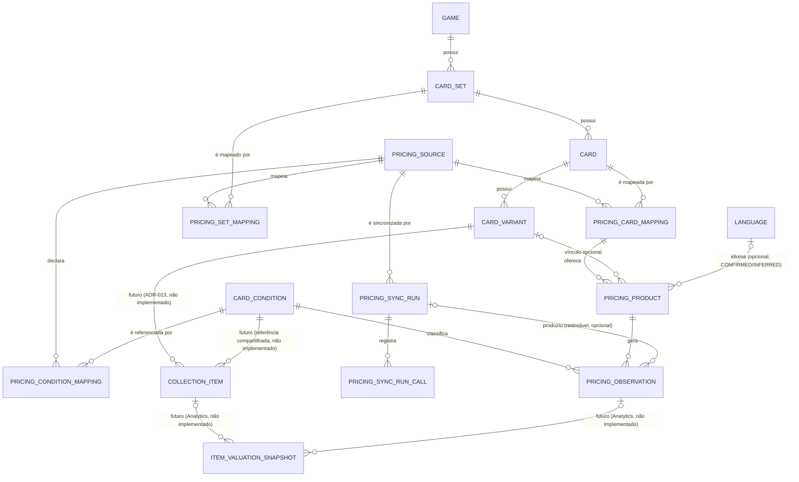

# Modelo de Dados — Pricing (Preço de Mercado)

| Campo | Valor |
|--------|-------|
| **Documento** | Modelo de Dados — Pricing |
| **Arquivo** | `docs/05f-pricing.md` |
| **Versão** | 1.53 |
| **Status** | **Fundação física concluída — dez das dez entidades `CONFIRMADO EXECUTADO` no Supabase** (`pricing_source`, `card_condition`, `pricing_condition_mapping` — Incremento P1; `pricing_set_mapping`, `pricing_card_mapping` — Incremento P2; `pricing_sync_run`, `pricing_sync_run_call` — Incremento P3; `pricing_product` — Incremento P4; `pricing_fx_rate` — Incremento P5; `pricing_observation` — Incremento P6). **Incremento P7 (2026-08-17): primeira fonte cadastrada** — `JUSTTCG` em `pricing_source` (Query `3700`), homologada para piloto técnico de produtos/printings/condições/preços USD/histórico, `is_active = FALSE` (não homologada para PT-BR nem "Valor Brasil"; uso comercial pendente de plano pago compatível). **Incremento P8 (2026-08-17): conector `scripts/sync-justtcg-pricing.ts`, encerrado com evidência real** — duas execuções consecutivas `COMPLETED` (7 requisições cada, 2 Sets/6 cartas/32 produtos/32 observações, segunda execução com zero escrita nova), zero duplicidade/rate limit/segredo, `is_active` permanece `FALSE` (ver Revision History `1.15`). **Correção pós-P8 (2026-08-17): `pricing_sync_run.confirmed_by` validado por trigger `BEFORE INSERT`**, não por RPC de UUID livre — preserva `ADR-021` integralmente (ver Revision History `1.11`). **Correção pós-P8, segunda rodada (2026-08-17): bug real em `findCard()`** — filtro de embed sem hint `!inner` não restringia as linhas de `card`, causando `CARD_QUERY_FAILED` na Fase B do piloto real (ver Revision History `1.12`); só código de conector, sem migration. **Correção pós-P8, terceira rodada (2026-08-17): finalização garantida** — `runRealPilot()` agora finaliza `pricing_sync_run` como `FAILED` em qualquer exceção não tratada (nunca mais fica preso em `PROCESSING`); run `19a04057-9660-438f-b945-4f05e364df0f`, travado pelo bug de `findCard()`, corrigido retroativamente para `FAILED` (ver Revision History `1.13`). **Correção pós-P8, quarta rodada (2026-08-17): telemetria de escrita** — `productsWritten`/`observationsWritten` agora contam só inserts novos (contadores `productsResolved`/`observationsResolved` separados para "processado, novo ou existente"); prova de idempotência do runner corrigida para exigir zero escrita nova na segunda execução, não igualdade cega de contadores (ver Revision History `1.14`). **Incremento P9 (2026-08-17): script `scripts/sync-ptax-fx-rate.ts` — ingestão PTAX, encerrado com evidência real** — regra cambial definida (venda PTAX, `rate_date` = data efetiva, sem taxa artificial em fim de semana/feriado), validada por `AskUserQuestion` antes da implementação. Piloto real executado por Fabrício localmente e **confirmado diretamente no Supabase pelo agente**: 6 taxas PTAX Venda gravadas (10, 11, 12, 13, 14 e 17/08/2026), zero linha para o fim de semana 15–16/08, zero duplicidade, segunda execução com zero escrita nova (idempotência real). Três correções pós-piloto aplicadas só no conector/runner, sem migration: parâmetro OData correto (`dataFinalCotacao`, não `dataFinal`); telemetria via `upsert(..., ignoreDuplicates: true).select()` distinguindo insert novo (`written`) de conflito ignorado (`resolved`), sem depender de texto de erro; `User-Agent` explícito não-browser no runner PowerShell (Windows PowerShell 5.1 + chave `sb_secret_*` eram rejeitados pelo gateway do Supabase com um User-Agent padrão de navegador). `get_advisors` (segurança e performance): zero achado novo referenciando `pricing_fx_rate`. Varredura de segredo negativa nos dois arquivos alterados (ver Revision History `1.17`). **Incremento P10 (2026-08-17): projeção de leitura `pricing_observation_brl_equivalent`** — view (`security_invoker = true`, Query `3900`) que calcula, em tempo real, o equivalente em BRL de observações USD via a última `pricing_fx_rate`/`BCB_PTAX` com `rate_date <=` data UTC de `observed_at`; sem taxa aplicável, `FX_RATE_UNAVAILABLE` explícito; rótulo fixo "Equivalente em BRL pela PTAX Venda" embutido na projeção. Sem alteração de `pricing_observation`/`pricing_fx_rate`, sem ampliação de acesso (mesma RLS herdada das tabelas base), validada com dado real (32 observações) e fixtures sintéticas (data exata, fim de semana, antes da primeira taxa, impossibilidade de dupla conversão) — ver Revision History `1.18`. **Incremento P11 (2026-08-17): contrato seguro de leitura por card — função `get_card_pricing_snapshot(uuid)`** (Query `3901`, `SECURITY DEFINER`, mesmo padrão de `ADR-030`) — qualquer usuário autenticado, sem exigir perfil administrativo, lê o snapshot mais recente de preço por produto/condição/tipo/mercado de uma carta, com equivalente BRL (Incremento P10), mapping `CONFIRMED`/produto ativo/fonte ativa, nunca `external_product_id`/`raw_payload`/histórico completo; índice adicional (`ix_pricing_observation_snapshot_lookup`, Query `3902`) criado após achado real de performance. `JUSTTCG` permanece `is_active = FALSE` — contrato retorna zero linhas em produção — ver Revision History `1.19`. **Incremento P12 (2026-08-17→18, três rodadas de design): primeiro consumidor de frontend — resumo de preço da carta.** V1 (painel dentro do modal) e V2 (ícone + popover só-no-hover) descartadas antes de produção — nenhuma das duas chegou a ser commitada/pushada, ver Revision History `1.20`/`1.21` e a seção "Causa raiz" no corpo do documento. **Desenho final (2026-08-18): resumo em BRL inline na identificação de cada carta do grid, sempre visível quando há dado, nunca dependente de hover** — busca em lote (`POST /api/cards/pricing/batch`, novo) para todas as cartas visíveis de uma vez; hover/foco/toque só abrem um popover de detalhe reaproveitando o dado já recebido. Mesmo contrato de leitura por carta (`get_card_pricing_snapshot`, P11; modo prévia via `?pricingPreview=1` só com `is_admin()` confirmado no servidor, reaproveitando `pricing_admin_select`/`card_condition_admin_select` já existentes desde P1–P6 — nenhuma RPC nova, nenhum grant ampliado) — inalterado nas três rodadas — ver Revision History `1.22`. Demais nove entidades seguem vazias. **Pricing ainda não é operacional em produção**: segue pendente plano comercial contratado para a fonte poder ser reativada; painel de frontend já implementado, mas exibido apenas em modo de homologação administrativa até lá. **Incremento P12 formalmente encerrado (2026-08-18, Rodada 8/migration `3904`)** — hierarquia de printing Normal → Holofoil → Reverse Holofoil corrige o bug real encontrado pelo teste "Reverse-only"; validação local completa (desktop/mobile, claro/escuro, toque, teclado, `build` de produção) aprovada por Fabrício; commits `6324b66`/`0dad413` sincronizados com `origin/main` — ver seção "Encerramento Formal do Incremento P12", acima, para objetivo/escopo/critérios de aceite/evidências consolidados. Próximo incremento recomendado: **P13 — Orquestração Programada de Pricing** (agendamento da ingestão PTAX e, quando `JUSTTCG.is_active` for reativada por decisão comercial, do conector de sincronização — ver `docs/ROADMAP.md`, seção "Next"). **Incremento P13.1 (2026-08-18): fundação de schema aplicada** — `FX_REFRESH`/`fx_source_code` em `pricing_sync_run` (Migrations `3905`–`3907`, `CONFIRMADO EXECUTADO`), `confirmed_by` opcional para execuções `SCHEDULED`, dois índices únicos parciais para concorrência; arquitetura-alvo completa (Cron/`pg_net`/Edge Function/Vault) registrada em `ADR-031`; nenhuma extensão habilitada, nenhum código JustTCG. **Incremento P13.2 (2026-08-18): módulo compartilhado e execução manual auditável** — lógica de negócio de `scripts/sync-ptax-fx-rate.ts` extraída para `supabase/functions/_shared/pricing-ptax/` (núcleo puro, pronto para reuso pela Edge Function de P13.3); janela padrão calculada (10 datas corridas, America/Sao_Paulo) com override validado para backfill; retry HTTP (3 tentativas, 1s/3s); execução manual real exige `--confirmed-by=`, abre `pricing_sync_run`/`FX_REFRESH` e captura conflito de concorrência (`23505`) antes de qualquer chamada ao BCB; divergência de taxa nunca sobrescreve. Nenhuma migration nova. 56 asserções offline validadas (ver Revision History `1.33`). **Incremento P13.3 (2026-08-18): Edge Function `ptax-fx-refresh` implementada, corrigida estruturalmente (porta `PtaxSyncRunPort` + adapter único, abandonando a tentativa anterior de mimetizar a API fluente do PostgREST), registrada no runner nativo do Deno, implantada em produção (`qjfutqujxrbzgrtkpgkg`, versão `1`, `ACTIVE`, `verify_jwt=false`) e validada por piloto real autenticado — run `e75e8fca-1c2e-498a-a473-18afa74c152d`, `HTTP 200`/`COMPLETED`, `inserted=0`/`unchanged=7`/`divergent=0`/`invalid=0`, dois testes negativos de autenticação confirmando `HTTP 401`/zero efeito no banco. **P13.3 formalmente encerrado; P13 como um todo permanece em andamento — próximo passo real é P13.4 (Cron/Vault e agendamento real).** **Incremento P13.4 (2026-08-18): agendamento automático implementado** — migration `3910` habilita `pg_cron`/`pg_net` e cria o Job único `ptax-fx-refresh-weekdays` (segunda a sexta, `22:00 UTC`/`19:00 America/Sao_Paulo`), chamando `net.http_post` diretamente com URL/`apikey` resolvidos por nome no Vault (nunca valor literal no comando); chamada controlada real confirmou `HTTP 200`/`COMPLETED`. **Antecipação da validação autônoma (2026-08-19)**: `pg_cron 1.6.4` confirmado sem overload de timestamp absoluto para one-shot; Job temporário protegido por data (`27 0 19 8 *`), comando idêntico ao permanente, disparado pelo próprio `pg_cron` sem chamada manual, evidência completa correlacionada (`cron.job_run_details`→`net._http_response`→`pricing_sync_run`→`pricing_sync_run_call`) e removido logo após a auditoria. **P13.4 e P13 — Orquestração Programada de Pricing formalmente encerrados (2026-08-19)** — ver seção "Encerramento Formal do Incremento P13", abaixo. **Incremento P14.1 (2026-08-19): condição comercial satisfeita** — `JUSTTCG.is_active` passa de `FALSE` para `TRUE` (Query `3911`), piloto real confirmando o caminho técnico. **Incremento P14.2 (2026-08-19, mesmo dia), formalmente encerrado**: conector reescrito para descoberta paginada em lotes de até 100 cartas/requisição, resolução de Set por `release_date` exata, correspondência de carta por número de coleção primário; piloto real do Set `BASE4` validado (130 mappings — 127 `CONFIRMED`/3 `PENDING`, 635 produtos/635 observações), achado de performance registrado (persistência sequencial, ~156s). **Incremento P14.3 (2026-08-19, mesmo dia), formalmente encerrado — persistência em lotes, hardening de segurança e deduplicação por mudança real de preço**: quatro funções `SECURITY INVOKER` restritas a `service_role` (Migrations `3912`–`3915`, `CONFIRMADO EXECUTADO`) substituem o padrão sequencial e o `.upsert()` inviável do PostgREST — promoção de mapeamento exclusivamente `PENDING`/`NOT_FOUND`→`CONFIRMED` (nunca rebaixa/troca identidade de uma linha `CONFIRMED`), pré-busca de observação por tupla exata (corrige produto cartesiano) e, na correção final, por última observação por grupo (corrige duplicidade de preço idêntico em dias diferentes — a regra passa a ser "histórico só por mudança real de preço", não por execução). Robustez de credencial corrigida (`resolveEntryDecision()`): `--fixture-check` sempre offline explícito; fora dele, qualquer credencial ausente encerra com código diferente de zero, sem rede, sem fallback silencioso. Piloto real aprovado — run `8e4367ad-f95d-41b6-bbbe-449bd7fb635f`, `COMPLETED`, 3 chamadas HTTP, 13 operações Supabase, **14,87s (contra ~156s do P14.2, ~10x mais rápido)**, 635 observações resolvidas/152 escritas (todas com mudança real de preço, zero redundante), `BASE4` inalterado (127 `CONFIRMED`/3 `PENDING`). **P14 como um todo permanece em andamento** — próximo incremento recomendado: expandir o mesmo padrão de descoberta+persistência em lotes para todos os Sets restantes do catálogo. Ver seção "Incremento P14.3", abaixo. **Incremento P14.4.1 (2026-08-19, mesmo dia), formalmente encerrado — Inventário de Cobertura e Plano de Ondas**: modo `--expansion-plan` (somente leitura) inventaria e classifica os 45 Sets/7.429 cartas locais ativas contra a lista de Sets da JustTCG — 3 `ALREADY_CONFIRMED`/420 cartas (`BASE1`/`BASE4`/`ME1`), 31 `SAFE_CANDIDATE`/5.805 cartas, 9 `AMBIGUOUS`/1.064 cartas, 2 `NOT_FOUND`/140 cartas (`GYM1`/`MEE`) — e agrupa os Sets pendentes em 15 ondas, nenhuma `oversized`, estimando 89 requisições (74 páginas de cartas + 15 resoluções de Set) para o inventário completo, estimativa sujeita a divergência real e a um orçamento de requisições que o executor deve impor. Fix crítico de truncamento silencioso do Data API em 1.000 linhas (migrations `3916`/`3917`, `CONFIRMADO EXECUTADO`) precedeu a execução real válida — ver seção "Incremento P14.4.1", abaixo. Execução real: exit code 0, 1 `GET /v1/sets`, zero escrita. `tsc --strict` limpo, 184/184 asserções. **Incremento P14.4.2 (2026-08-19, mesmo dia), formalmente encerrado — Executor Explícito de Ondas, Onda 1 Real e Correção de Hierarquia de Printing (Migration 3918)**: `executeExpansionWave()` consome o plano do P14.4.1 e executa exatamente uma onda por vez (nunca todos os Sets automaticamente), com orçamento de requisições imposto localmente e telemetria via `pricing_sync_run`/`pricing_sync_run_call`. **Onda 1 executada de verdade** (run `598610e6-c23a-47aa-ad65-88113a008984`, `CARD_SYNC`/`MANUAL`/`COMPLETED`, 6 requisições) sobre `BASE2`/`BASE3`/`BASE5`/`GYM2` — 341 `pricing_card_mapping` (338 `CONFIRMED`/3 `PENDING`), **3.375 `pricing_product`/3.375 `pricing_observation`** persistidos, confirmados por auditoria somente-leitura pós-execução. **Bug real encontrado pela mesma auditoria**: preço não aparecia no frontend para nenhuma das 3.375 linhas, apesar da persistência correta — causa raiz, `get_cards_pricing_summary` (migration `3904`) filtrava só os três printings da era moderna (`Normal`/`Holofoil`/`Reverse Holofoil`), excluindo os rótulos que a JustTCG usa para a era clássica (WOTC) — `Unlimited`/`1st Edition`/`Unlimited Holofoil`/`1st Edition Holofoil` —, 100% das 3.375 linhas caíam fora do filtro. **Migration `3918` (`CONFIRMADO EXECUTADO`)** estende a hierarquia para sete valores — `Normal → Holofoil → Reverse Holofoil → Unlimited → Unlimited Holofoil → 1st Edition → 1st Edition Holofoil` (Ilimitada antes de 1ª Edição — decisão de produto de Fabrício: edição padrão mais comum tem prioridade sobre a premium), sem fallback genérico. Divergência sinalizada e resolvida: `SECURITY DEFINER` da função (e da irmã `get_card_pricing_snapshot`) **preservado deliberadamente**, por decisão explícita de Fabrício via `AskUserQuestion`, não trocado por `SECURITY INVOKER` como o pedido original sugeria. Testada transacionalmente antes da aplicação real; validado `BASE4` sem regressão, `BASE2`/`BASE3`/`BASE5`/`GYM2` agora com `has_pricing=true`, mapping `PENDING` corretamente sem preço, `get_advisors` sem achado novo, custo de performance real e limitado (página de 24 cartas: 24,5ms/1.704 buffers → 57,0ms/2.609 buffers). Frontend (`card-price-summary.tsx`): `PRINTING_LABEL_PT`/`PRINTING_ORDER` estendidos às quatro traduções PT-BR novas (Ilimitada/Ilimitada Holográfica/1ª Edição/1ª Edição Holográfica). **Segundo defeito real, encontrado por Fabrício após o fix acima**: popover de detalhe travava em "Carregando detalhes…" no primeiro hover de uma carta, só resolvendo ao fechar e reabrir — causa raiz confirmada, o `useEffect` de `CardPriceDetails` tinha `liveStatus` na própria lista de dependências, que ele mesmo definia via `setLiveStatus("loading")`, disparando um re-run/cleanup imediato que cancelava a própria requisição em voo antes da resposta chegar (o resultado ainda ia parar em `liveDetailCache`, por isso reabrir mostrava o dado na hora). Corrigido removendo `liveStatus` das dependências (guard interno preservado — necessário para não recriar um flash de carregamento em reabertura com cache já quente); `fetchLiveDetail` (`pricing-batch-client.ts`) ganhou deduplicação de chamadas em voo (`liveDetailInFlight`), exigida pelo contrato ainda que não fosse a causa do bug relatado. 6 testes novos 100% Node nativo (`node:test`/`node:assert`, sem novo framework), `tsc --noEmit` limpo, validação visual aprovada por Fabrício. **Limpeza técnica de encerramento (mesma rodada)**: guard `liveStatus !== "idle"` revisado e confirmado necessário, mantido sem alteração; `allowImportingTsExtensions` (`web/tsconfig.json`) testado empiricamente contra a alternativa de mapeamento `.js`→`.ts` — `tsc` aceita, mas o loader nativo do Node (`--experimental-strip-types`) rejeita com `ERR_MODULE_NOT_FOUND` (Node não remapeia especificador `.js` para arquivo `.ts` sem um loader ciente de TypeScript, como `ts-node`/`tsx`, nenhum presente no projeto) — flag confirmada necessária, mantida; `web/tsconfig.tsbuildinfo` fora do diff; `tsc --noEmit` e os 6 testes revalidados. **P14.4.2 formalmente encerrado. P14 como um todo permanece em andamento** — próximo incremento recomendado: **P14.4.3 — execução manual e auditada das ondas seguras remanescentes** (14 das 15 ondas do plano do P14.4.1, onda a onda, mesma disciplina de confirmação e orçamento local). **Incremento P14.4.4 (2026-08-19→20), formalmente encerrado — Matching Canônico por Set+Número, Reparo Real de Mappings Pendentes e Saneamento de Resíduos.** Regra de correspondência reescrita para depender exclusivamente do Card Set externo já `CONFIRMED` + `collector_number` normalizado, deduplicado por `external_card_id` — nome nunca decide, só evidência; exatamente um `external_card_id` distinto = `SAFE`/`CONFIRMED`, zero = `ABSENT`/`NOT_FOUND`, mais de um = `AMBIGUOUS`/`PENDING`. **Reparo real executado** — run `66c9e878-2469-453c-86ab-e31875f68f79`: 54 mappings avaliados, **53 promovidos a `CONFIRMED`**, 316 `pricing_product`/316 `pricing_observation` criados, zero divergência estrutural; único `NOT_FOUND` restante, `BASE1` Machamp `#008` (ausência real na JustTCG, não defeito de matching). **Migration `3920`** (`CONFIRMADO EXECUTADO`) transfere a autoridade temporal de `confirmed_at` de `pricing_card_mapping`/`pricing_set_mapping` ao relógio do servidor (mesma correção já aplicada a `pricing_sync_run` em P13.2), preservando histórico sem backfill; `confirmed_by` permanece responsabilidade exclusiva do operador. **Migration `3921`** (`CONFIRMADO EXECUTADO`) saneia o único mapping legado com `external_card_id='ext-teste'` — ID canônico comprovado por 3 requisições controladas à JustTCG (Set `ME1` já `CONFIRMED`, candidato único entre 227 cartas), 7 produtos/14 observações preservados intactos, idempotência comprovada por reaplicação real. **P14.4.4 formalmente encerrado — nenhum resíduo técnico conhecido permanece.** O Incremento P14 como um todo **permanece em andamento** — próximo incremento recomendado, por reconciliação da documentação existente: **P14.4.3 — execução manual e auditada das ondas seguras remanescentes**, já recomendado ao final do P14.4.2 e ainda sem encerramento documental formal próprio. Ver seção "Incremento P14.4.4", abaixo. **Incremento P15 (2026-08-21) — Orquestração Programada de Preços JustTCG, formalizada em `ADR-032` (novo)**: reaproveita a arquitetura Cron/`pg_net`/Edge Function/Vault já validada por PTAX (`ADR-031`), fatiada em ondas independentes (`_shared/pricing-justtcg-refresh/wave-plan.ts`). Edge Function `justtcg-price-refresh` implantada em produção (versão `1→2`); migration `3926` (exclusão mútua `CARD_SYNC`×`PRICE_REFRESH`, `CONFIRMADO EXECUTADO`); migration `3927` (agendamento Cron, 30 ondas diárias, **`CONFIRMADO EXECUTADO`, aplicada em 2026-08-21 a pedido explícito de Fabrício** — 30 jobs `active=true`, agenda `22:30`–`00:55 UTC`). **Incidente real de produção corrigido no mesmo dia**: piloto com `WAVE_PAGE_CAP=30`/`MAX_WAVES=10` causou `shutdown_reason=WallClockTime` do worker aos ~150s, dois runs presos em `PROCESSING` (2.401+790 observações preservadas, terminalizados como `FAILED`); corrigido com `WAVE_PAGE_CAP=10`/`MAX_WAVES=30` (mesma capacidade de 300 páginas/dia), deadline interno de 110s e checkpoint incremental de telemetria por Set — garantia estrutural de nunca mais ficar preso em `PROCESSING`. Piloto real pós-correção validado: `HTTP 200`/`COMPLETED`, 57,36s, 44 observações novas, 3.564 preços reaproveitados sem escrita, zero erro. **Correção (2026-08-22): o mecanismo por ondas (30 jobs `pg_cron`, `justtcg-price-refresh-wave-*`) descrito acima foi desativado permanentemente (`active=false`) após a auditoria R1/R5 identificar risco de duplicidade econômica na resolução de `pricing_product`** — corrigido pela RPC `resolve_pricing_products_batch` (migration `3930`) e substituído pelo **dispatcher durável por Set** (`justtcg-price-refresh-set` + job `justtcg-price-refresh-set-dispatcher`, `*/5 * * * *`, 1 Set elegível por invocação via `open_pricing_set_refresh_attempt`), agora o mecanismo definitivo e ativo em produção, validado por ciclo automático completo (45/45 Sets `SUCCESS`, 2026-08-22). Ver `ADR-032` revisão `1.3` e seção "Incremento P15", abaixo, para o histórico completo — os itens A–E abaixo descrevem a implementação original, hoje substituída. **Política de Sincronização de Pricing — `pricing_refresh_policy` (2026-08-22)**: migration `3937` (`CONFIRMADO EXECUTADO`) cria `pricing_refresh_policy` (frequência de refresh por `pricing_source`, `frequency_days` restrito a `1`/`2`/`3`/`5`, seed `JUSTTCG=1`) e `pricing_admin_action_log` (auditoria zero-grant, mesmo padrão de `catalog_admin_action_log`), mais as RPCs admin `admin_set_pricing_refresh_frequency()`/`get_pricing_refresh_policy()`; `close_pricing_set_refresh_attempt()` alterado cirurgicamente para calcular `next_due_at` a partir da frequência configurada (fallback 1 dia) no branch `SUCCESS` — o dispatcher (`*/5 * * * *`) continua inalterado, e a política só vale a partir do **próximo** `SUCCESS` de cada Set. Migration `3938` (`CONFIRMADO EXECUTADO`) corrige um `ON CONFLICT (pricing_source_id)` ambíguo contra a variável de saída homônima de `RETURNS TABLE`, encontrado na validação funcional pós-3937, apontando o conflito pelo nome real da constraint (`ON CONFLICT ON CONSTRAINT pricing_refresh_policy_pricing_source_id_key`). Validação final 10/10 concluída. Ver `ADR-032` revisão `1.4`. **Desde então (2026-08-22→23): Pricing Admin/"Valor de Mercado" completo (11 rotas, Blocos 1–5), Central de Relatórios com 2 de 7 relatórios aprovados (Preço por Carta, Valor por Set), ECharts adotado (`ADR-033`), Fase B — Resíduos de Pricing iniciada — ver seção "Estado Atual do Pricing — Síntese Executiva", logo abaixo, para o estado vigente completo; este campo permanece como registro histórico de P1–P15.** |
| **Objetivo** | Modelo lógico e físico do domínio Pricing — observações de mercado por fonte externa, independente de Catálogo Editorial e de Ownership, conforme `ADR-029` e `ADR-006`. |
| **Escopo** | Entidades de Pricing: fonte, mapeamento de Set/Card por fonte, produto (impressão+idioma reportados pela fonte), condição canônica, observação de preço, câmbio, auditoria de sincronização. Não inclui a modelagem física de Item Valuation (Analytics), deliberadamente adiada — ver seção própria ao final. |
| **Dependências** | `04-domain-model.md` (seções "Pricing (Preço de Mercado)" e "Item Valuation (Avaliação do Item)"), `adr/ADR-006-separation-of-catalog-ownership-and-analytics.md`, `adr/ADR-029-pricing-domain-model.md`, `standards/STD-001-database-standards.md`, `standards/STD-002-domain-modeling.md`, `05b-cartas-e-raridade.md` (Card/Card Variant), `05c-assets-e-importacao.md` (Language/Asset Source — padrão de referência, não reaproveitado por tabela). |
| **Documentos Relacionados** | `05-modelo-de-dados.md` (índice), `ROADMAP.md` (seção "Next"), `PROVA-TECNICA-JUSTTCG-PRICING-2026-08-16.md` (fora de `docs/`, prova técnica de homologação de fonte, não normativa). |

---

# Nota de Origem e Estado Real do Repositório (2026-08-16)

Este documento nasce diretamente da sequência estratégica aprovada por Fabrício em 2026-08-16 (`ROADMAP.md`, seção "Now"/"Next"): **Card Variant (fundação encerrada) → Pricing/Market Data (esta modelagem) → Collection → Analytics/Valuation.** Card Variant está formalmente encerrado como fundação (`ADR-028`); Coleções (`Collection`, `Collection Item`) segue **não implementada** — apenas conceitualmente decidida (`ADR-013`, `ADR-014`, `04-domain-model.md`), sem modelo físico.

**Duas consequências diretas desse estado real, refletidas em todo este documento:**

1. Toda referência a `card`, `card_variant`, `card_variant_type`, `language`, `game` neste documento aponta para tabelas **já existentes e confirmadas** no Supabase (conferidas em `05b-cartas-e-raridade.md`/`05c-assets-e-importacao.md`, ambos reconstruídos por introspecção direta do schema físico em 2026-08-16, mesma data). **Tentativa de reconfirmação em tempo real, nesta sessão, via `execute_sql`/`list_tables` (MCP Supabase), retornou erro `503` (serviço indisponível) em cinco tentativas consecutivas — não foi possível revalidar o schema ao vivo.** Este documento se apoia na documentação mais recente (mesmo dia) como evidência confiável, não substitui a revalidação ao vivo — qualquer sessão futura que inicie a implementação física deste módulo deve confirmar o schema de `card`/`card_variant`/`card_variant_type`/`language` diretamente no Supabase antes de escrever a primeira migration, exatamente como o ritual de qualquer novo ciclo já exige (`CLAUDE.md`).
2. Toda referência a `Collection Item` (o exemplar físico do usuário) é **conceitual e prospectiva** — usada apenas para explicar os cenários de valuation (ver seção "Item Valuation", ao final) e para justificar por que certas colunas (ex.: condição de conservação) **não** entram em Pricing. Nenhuma FK física deste documento aponta para uma tabela de Collection Item, porque ela ainda não existe.

---

# Estado Atual do Pricing — Síntese Executiva (2026-08-23)

Esta seção é a referência rápida do **estado vigente** do domínio Pricing. As seções seguintes deste documento (entidade por entidade, incrementos `P1`–`P15` e além) permanecem como **evolução histórica** — o registro detalhado de como se chegou até aqui — e não foram reescritas. Reconciliação feita em 2026-08-23, a pedido explícito de Fabrício, exclusivamente documental (nenhum código/migration/RPC alterado nesta rodada).

## A. Estado atual do Pricing

Pricing está **operacional em produção**. `JUSTTCG` é a fonte ativa (`is_active = TRUE` desde P14.1, 2026-08-19) de dados USD/internacionais; PTAX é a fonte ativa de câmbio. O refresh de preços é automático (dispatcher durável por Set, ver seção B), cobrindo os 45 Sets do catálogo no ciclo atual. `PENDING`/`NOT_FOUND` são tratados como backlog administrável (Fase B, ver abaixo), nunca como dado silenciosamente ausente — princípio geral do domínio: **"melhor `PENDING` explícito do que identidade econômica errada."**

## B. Política de atualização

O **dispatcher durável por Set** (`justtcg-price-refresh-set-dispatcher`, `pg_cron */5 * * * *`, migrations `3934`/`3935`) é hoje o **único mecanismo ativo** de refresh de preços JustTCG — processa um Set elegível por invocação via `open_pricing_set_refresh_attempt()`. Os antigos 30 jobs por onda (`justtcg-price-refresh-wave-1..30`, migration `3927`) foram desativados permanentemente (`active=false`) em 2026-08-22 após auditoria adversarial (achados R1/R5) identificar risco de duplicidade econômica na resolução de `pricing_product` sob concorrência; a causa estrutural foi corrigida pela RPC `resolve_pricing_products_batch` (migration `3930`).

Elegibilidade de um Set para refresh é determinada por **política de frequência** (`pricing_refresh_policy`, migration `3937`, `CONFIRMADO EXECUTADO` em 2026-08-22): `frequency_days` restrito a `1`/`2`/`3`/`5`, seed `JUSTTCG=1`, ajustável por RPC administrativa (`admin_set_pricing_refresh_frequency()`). Mudança de frequência é **lazy** — só vale a partir do próximo `SUCCESS` daquele Set, nunca reagenda retroativamente. `next_due_at` (armazenado em `pricing_set_refresh_state`) é recalculado por `close_pricing_set_refresh_attempt()` no branch `SUCCESS`, somando `frequency_days` ao momento da conclusão (fallback de 1 dia se não houver política configurada). Migration `3938` (`CONFIRMADO EXECUTADO`) corrigiu um `ON CONFLICT` ambíguo introduzido pela `3937`.

## C. Pricing Admin / Valor de Mercado

Nome visível ao usuário: **"Valor de Mercado"**. Domínio interno/técnico: `pricing`. Módulo administrativo completo, **11 rotas** em `web/app/pricing/**`, organizadas em três categorias:

- **Gerencial** — `/pricing` (Visão Geral), `/pricing/saude-fontes` (Saúde das Fontes), `/pricing/historico-execucoes` (Histórico de Execuções), `/pricing/relatorios` (Central de Relatórios).
- **Cadastros** — `/pricing/fontes`, `/pricing/mapeamentos-sets`, `/pricing/mapeamentos-cartas`, `/pricing/condicoes`.
- **Operações** — `/pricing/pendencias`, `/pricing/resolucao-mapeamentos`, `/pricing/sincronizacoes`.

## D. Blocos 1–5 (backend do Pricing Admin, implementados 2026-08-22→23)

- **Bloco 1 — Visão Geral**: RPC `get_pricing_admin_overview()` (migration `3939`, KPIs) e, na v2/v3, gráficos de tendência de cobertura e execuções diárias (`admin_get_pricing_coverage_trend`/`admin_get_pricing_sync_run_daily`, migrations `3945`/`3946`) e consumo de API (`admin_get_pricing_api_usage_daily`, migration `3947`).
- **Bloco 2 — Pendências / Resolução de Mapeamentos**: três RPCs (migration `3940`) para listar e resolver mappings `PENDING`/`AMBIGUOUS`/`NOT_FOUND`.
- **Bloco 3 — Saúde das Fontes / Histórico de Execuções / Sincronizações**: quatro RPCs (migration `3941`).
- **Bloco 4 — Cadastros**: quatro RPCs de leitura + seis RPCs de escrita (migration `3942`) para Fontes/Mapeamentos de Sets/Mapeamentos de Cartas/Condições.
- **Bloco 5 — Central de Relatórios**: backend de relatórios (migrations `3943` — sem arquivo físico versionado, gap conhecido e já documentado no cabeçalho da `3944` — `3944`, que a redefine e adiciona `admin_get_pricing_report_set_cards`, e `3948`, correção de conversão FX no histórico de Preço por Carta — ver seção E).

Todas as migrations `3937`–`3949` estão `CONFIRMADO EXECUTADO` em produção (2026-08-22/23). **Migration `3948`, assim como a `3943`, não tem arquivo físico versionado em `database/migrations/`** — mesmo gap já conhecido e documentado, não uma migration de conteúdo desconhecido: seu conteúdo real (conversão FX do histórico em `admin_get_pricing_report_card`) foi confirmado por Fabrício em 2026-08-23 e está descrito na seção E. Pendência remanescente: versionar o arquivo físico de ambas (`3943`/`3948`) numa rodada futura que já esteja alterando código, não nesta (documental).

## E. Preço por Carta — relatório aprovado

**Migration `3948` (`CONFIRMADO EXECUTADO`, 2026-08-23) — conversão FX no histórico do relatório**: antes dela, o preço atual da carta podia ser exibido em BRL, mas o histórico do gráfico continuava usando o preço nativo em USD (inconsistência real percebida por Fabrício ao selecionar BRL). Corrigida em `admin_get_pricing_report_card`: `price`/`currency_code` nativos preservados; `price_display` adicionado ao histórico; `fx_status` explícito; cada ponto histórico convertido usando a taxa PTAX **correspondente à data daquela própria observação** (nunca a cotação atual para converter preços antigos); sem taxa aplicável, retorno explícito `FX_RATE_UNAVAILABLE` — nunca tratamento silencioso como zero. Gráfico, tooltip, labels finais e cálculo de variação passaram a usar `price_display`, não mais o preço nativo. Relatório **aprovado por Fabrício em 2026-08-23**.

## F. Valor por Set — relatório aprovado

**Não é um ranking.** A ordem de exibição das cartas é a **ordem editorial do Set** (`collector_order`, migration `3949`, `CONFIRMADO EXECUTADO` em 2026-08-23 — aplicada por Fabrício via SQL Editor após bloqueio do classificador do Auto Mode), corrigindo `admin_get_pricing_report_set_cards` (migration `3944`), que antes ordenava por valor econômico. Uma coluna `ranking` pode ainda existir internamente, mas não dirige mais a apresentação. Impressão multi-página aprovada (ver seção G). Relatório **aprovado por Fabrício em 2026-08-23**.

## G. Impressão (requisito transversal)

Todo relatório impresso deve repetir o cabeçalho padrão (`RelatorioCabecalho`) em toda quebra de página — mecanismo: `RelatorioCabecalho` vive dentro do `<thead>`, num `<th colSpan>` acima da linha de colunas (não como bloco solto acima da `<table>`), mesmo padrão já usado pelos relatórios do Catálogo Editorial (`app/catalogo/relatorios/checklist/page.tsx`, `docs/05e-catalogo-editorial.md`). Blocos de resumo específicos de um relatório (não o cabeçalho padrão) vivem como primeira linha do `<tbody>`, aparecendo uma única vez. **Gap residual conhecido**: `PrecoPorCartaPrintFolha` ainda não foi auditada quanto a este mesmo mecanismo de repetição — só `ValorPorSetPrintFolha` teve o defeito relatado e corrigido nesta rodada (2026-08-23); recomenda-se confirmar `PrecoPorCartaPrintFolha` antes de aprovar novos relatórios multi-página.

## H. Performance

P0 fechado: causa raiz de lentidão (6–16s) era a cadeia auth→RPCs→Header de perfil, corrigida por `getCachedUserProfile()` e busca paralela; alvo de ~500–700ms a quente atingido. Não perseguir os picos antigos sem nova evidência de regressão.

---

# Por que Pricing é um Domínio Independente (resumo — decisão completa em `ADR-029`)

`ADR-006` já separa o domínio em três responsabilidades: Catálogo Editorial, Patrimônio do Usuário (Ownership) e Analytics. Pricing não se encaixa em nenhuma das três sem distorção:

- **Não é Catálogo Editorial** — um preço de mercado não é um dado editorial oficial do jogo; é uma observação de terceiros, sujeita a mudar a cada instante, nunca uma característica permanente da Card/Card Variant.
- **Não é Ownership** — Pricing existe independentemente de qualquer usuário possuir a carta. O mesmo dado de preço serve a todos os usuários simultaneamente (é informação de mercado global), diferente de `card_variant_id`/condição/idioma de um Collection Item específico.
- **Não é Analytics puro** — Analytics (`ADR-006`, "Sempre que uma informação puder ser calculada de forma confiável, ela não deverá ser persistida redundantemente sem justificativa técnica específica") pressupõe dado derivado de Catálogo + Ownership. Pricing é, ele mesmo, um dado primário capturado de fontes externas — precisa ser persistido, teve seu próprio ciclo de importação/auditoria, e é o que Analytics consumirá depois, junto de Ownership, para produzir Item Valuation.

Pricing é, portanto, um **quarto domínio de peso equivalente**, seguindo a mesma arquitetura já validada por Catálogo Editorial: fonte externa → mapeamento/staging → dado confirmado, nunca escrita direta e nunca dependência estrutural em tempo real (`ADR-008`, estendido aqui pela primeira vez para além do Catálogo).

---

# Visão Geral das Entidades

| Entidade | Papel | Classificação (STD-002) |
|---|---|---|
| `pricing_source` | Cadastro de fontes externas de preço (JustTCG, TCGplayer, futuras fontes BR). Carrega apenas a classificação/default declarado de mercado — nunca a autorização final de "Valor Brasil", que depende da observação (ver `pricing_observation`). | Reference Data |
| `card_condition` | Catálogo canônico de condições físicas de conservação (Near Mint, Lightly Played, ...) — **referência compartilhada, não exclusiva de Pricing** (ver nota na própria seção). | Reference Data |
| `pricing_condition_mapping` | De-para entre o código de condição de cada fonte e a `card_condition` canônica. | Value Object (subordinado a `pricing_source`) |
| `pricing_set_mapping` | Correspondência entre `card_set` e o identificador de Set de cada fonte, com estado de confirmação (`CONFIRMED`/`PENDING`/`NOT_FOUND`/`REJECTED`). | Identity Entity (identidade própria: uma correspondência específica Set↔Fonte) |
| `pricing_card_mapping` | Correspondência entre `card` e o identificador de Card de cada fonte, com estado de confirmação (`CONFIRMED`/`PENDING`/`NOT_FOUND`/`REJECTED`). | Identity Entity |
| `pricing_product` | Produto/impressão específico que a fonte reporta para uma Card (printing + idioma, multi-idioma — não apenas PT-BR/não-PT-BR), com vínculo opcional a `card_variant`. | Identity Entity |
| `pricing_fx_rate` | Taxas de câmbio históricas, diárias, rastreáveis — nunca aplicadas retroativamente ao preço original. | Reference Data (série temporal) |
| `pricing_observation` | Fato de preço observado num instante, na moeda/mercado/condição originais da fonte — imutável, nunca sobrescrito. Carrega a evidência de mercado (`market_scope`/`market_label`/`market_evidence`) que autoriza, ou não, a classificação "Valor Brasil". | Identity Entity (fato de série temporal) |
| `pricing_sync_run` | Execução de sincronização com uma fonte (auditoria de alto nível: status, contagens, cota). | Identity Entity |
| `pricing_sync_run_call` | Cada chamada individual feita durante uma `pricing_sync_run` (auditoria granular: endpoint, status HTTP, erro sanitizado, cota restante). | Value Object (subordinado a `pricing_sync_run`) |

`item_valuation_snapshot` (Analytics, não Pricing) é tratada à parte, ao final deste documento — ver "Item Valuation — Direção Futura (não implementada nesta rodada)".

**Nota sobre o total de entidades**: este documento descreve dez entidades no total, mas apenas nove pertencem exclusivamente ao domínio Pricing — `card_condition` é uma referência compartilhada e neutra (ver correção registrada na Revision History, versão `1.1`), descrita aqui porque nasceu da necessidade de Pricing, não porque pertence a este domínio.

---

# Diagrama de Relacionamento — Catálogo, Pricing e Ownership



`COLLECTION_ITEM` e `ITEM_VALUATION_SNAPSHOT` aparecem apenas para deixar explícito onde Pricing se conecta ao restante do domínio quando Collection existir — nenhuma das duas é criada por este documento.

**Duas relações conceituais, deliberadamente fora do diagrama acima, por não existir FK física** (correção de precisão — versão `1.1`): (1) `Card Variant` e `Language` — Card Translation ainda não modela essa referência fisicamente (`04-domain-model.md`); é uma direção futura, não uma FK existente ou proposta por este documento. (2) `Pricing FX Rate` e `Pricing Observation` — a conversão de moeda é sempre uma junção em tempo de leitura (pela data mais próxima de `rate_date`), nunca uma chave estrangeira física, para que uma observação antiga continue convertível por qualquer taxa futura sem exigir nova linha. Desenhar essas duas relações como ER contradiria o próprio texto deste documento, que já as declara sem FK.

---

# `pricing_source` (Fonte de Preço)

## O que é? / O que não é? / Qual problema resolve? (STD-002)

**O que é:** o cadastro de uma fonte externa de dados de mercado (ex.: JustTCG, TCGplayer, uma futura fonte brasileira). Registra, entre outras coisas, o **escopo de mercado declarado por padrão** da fonte (`default_market_scope`) — uma classificação/capacidade informativa, usada como valor inicial ao gravar novas observações, mas que **não autoriza sozinha** nenhuma classificação de "Valor Brasil" (correção de precisão, versão `1.1` — ver `pricing_observation`, onde a decisão final realmente reside).

**O que não é:** não é `asset_source` (Catálogo Editorial, `05c-assets-e-importacao.md`) reaproveitada. Apesar do padrão estrutural ser deliberadamente o mesmo (mesma disciplina já validada em produção), `asset_source` governa fontes de sincronização de **catálogo/imagens** (TCGdex, importação manual) — um domínio conceitualmente distinto de mercado/preço, mesmo que uma futura fonte possa, coincidentemente, servir aos dois papéis. Ver "Divergências em relação à hipótese inicial", no `ADR-029`, para o racional completo dessa decisão.

**Qual problema resolve:** permite múltiplas fontes coexistirem e serem substituídas sem reconstrução funcional (premissa 3 do pedido) — nenhuma tabela de Pricing referencia "JustTCG" diretamente; todas referenciam `pricing_source.id`.

## Modelo Lógico

```text
Pricing Source

Identidade
----------
id
code

Descrição
----------
name
source_type
default_market_scope
base_currency
base_url
api_base_url
documentation_url
terms_url
attribution_text
requires_commercial_agreement
supports_api
is_active
source_order

Auditoria
----------
created_at
updated_at
```

## Atributos

**id** — identidade técnica (UUID).

**code** — identificação técnica estável (`JUSTTCG`, `TCGPLAYER`), maiúsculo, único globalmente (fonte não pertence a um Game específico — mesmo padrão de `asset_source`, já que uma fonte de preço pode cobrir múltiplos TCGs).

**name** — nome de apresentação ("JustTCG", "TCGplayer").

**source_type** — `API` / `DATASET` / `MANUAL`, mesmo vocabulário de `asset_source`.

**default_market_scope** — `INTERNATIONAL` ou `BRAZIL`. **Correção de precisão (versão `1.1`)**: este campo deixou de ser a autoridade final sobre "Valor Brasil". Ele representa apenas a classificação/capacidade declarada e default da fonte — útil como valor inicial ao normalizar uma nova observação, e como sinal de que uma fonte *pode* produzir evidência de mercado brasileiro — mas **isoladamente nunca autoriza** a classificação `BRAZIL_ITEM_VALUATION`. Essa decisão passa a depender da evidência registrada na própria `pricing_observation` (`market_scope`/`market_evidence`, ver seção correspondente), porque uma fonte agregadora pode reportar preços de mercados diferentes ao mesmo tempo (ex.: JustTCG combina Cardmarket/TCGplayer, ambos internacionais; uma futura fonte BR pode agregar um mercado brasileiro e, eventualmente, um mercado internacional secundário) — fixar isso só na fonte impediria representar corretamente esse caso sem duplicar artificialmente o cadastro da fonte. Nenhuma fonte internacional pode ser promovida a "Brasil" por conversão de moeda — isso continua verdadeiro e é reforçado, não enfraquecido, por esta correção.

**base_currency** — moeda nativa típica da fonte (`USD`, `BRL`), ISO 4217. Informativo/default — não restringe `pricing_observation.currency_code`, porque uma única fonte pode reportar preços em mais de uma moeda (ex.: achado real do discovery de 2026-08-16: o campo `pricing` embutido da TCGdex combina Cardmarket em EUR e TCGplayer em USD).

**documentation_url / terms_url / attribution_text** — suportam o achado de risco legal já registrado no discovery (Cardmarket/TCGplayer restringem redistribuição comercial de preço sem acordo prévio) sem resolvê-lo — `terms_url` e `attribution_text` existem para que a UI, quando publicar dado de preço, sempre tenha de onde citar a atribuição exigida.

**requires_commercial_agreement** — booleano, default `FALSE`. Sinaliza explicitamente (sem resolver) o achado de risco legal do discovery — nenhuma tela deve publicar dado de uma fonte com esta flag `TRUE` fora do escopo já autorizado (hoje, nenhum) sem confirmação jurídica/comercial prévia.

**supports_api / is_active / source_order** — mesmo papel de `asset_source`.

## Campos que Não Incluiremos Agora

- **Limite de cota/rate limit estruturado (`daily_limit`, `per_minute_limit`)** — Free Tier da JustTCG tem esses números, mas são um detalhe operacional de integração, não uma característica de domínio da fonte; documentar em código/config da futura Edge Function é suficiente (mesmo raciocínio de simplicidade já aplicado a outras entidades — AP-004).
- **Múltiplas moedas suportadas como lista estruturada** — `base_currency` como default único é suficiente para o MVP; se uma fonte futura precisar de uma lista fechada de moedas suportadas, isso pode virar uma tabela `pricing_source_currency` própria, sem quebrar o modelo atual.

## Regras de Negócio

1. `code` único e imutável após criação (mesmo padrão de `card_variant_type.code`).
2. `default_market_scope` pode ser ajustado ao longo do tempo (é um default, não uma trava) sem qualquer efeito retroativo sobre `pricing_observation` já gravadas — cada observação carrega seu próprio `market_scope`/`market_evidence`, imutáveis por si (ver `pricing_observation`). Mudar o default da fonte nunca reclassifica um preço já persistido.
3. Nenhuma exclusão física — apenas `is_active = FALSE` (mesmo padrão de `card_variant_type`/`asset_source`).
4. Nenhum preço pode ser gravado (`pricing_observation`) sem que a fonte exista e esteja ativa — garantido pela FK obrigatória em toda a cadeia (`pricing_card_mapping` → `pricing_product` → `pricing_observation`).
5. `default_market_scope`, isoladamente, nunca autoriza a classificação `BRAZIL_ITEM_VALUATION` — regra obrigatória detalhada em `pricing_observation` e na seção "Item Valuation".

## Modelo Físico (PostgreSQL) — CONFIRMADO EXECUTADO (Incremento P1, 2026-08-16, Query `3000`/`3001`/`3002`)

```sql
CREATE TABLE public.pricing_source (
    id                             UUID PRIMARY KEY DEFAULT gen_random_uuid(),
    code                           TEXT NOT NULL,
    name                           TEXT NOT NULL,
    source_type                    TEXT NOT NULL,
    default_market_scope           TEXT NOT NULL,
    base_currency                  TEXT NOT NULL,
    base_url                       TEXT,
    api_base_url                   TEXT,
    documentation_url              TEXT,
    terms_url                      TEXT,
    attribution_text               TEXT,
    requires_commercial_agreement  BOOLEAN NOT NULL DEFAULT FALSE,
    supports_api                   BOOLEAN NOT NULL DEFAULT FALSE,
    is_active                      BOOLEAN NOT NULL DEFAULT TRUE,
    source_order                   INTEGER NOT NULL,
    created_at                     TIMESTAMPTZ NOT NULL DEFAULT NOW(),
    updated_at                     TIMESTAMPTZ NOT NULL DEFAULT NOW(),

    CONSTRAINT uq_pricing_source_code UNIQUE (code),
    CONSTRAINT uq_pricing_source_order UNIQUE (source_order),
    CONSTRAINT ck_pricing_source_code_format
        CHECK (code = UPPER(code) AND code ~ '^[A-Z][A-Z0-9_]*$'),
    CONSTRAINT ck_pricing_source_name_not_blank CHECK (BTRIM(name) <> ''),
    CONSTRAINT ck_pricing_source_type
        CHECK (source_type IN ('API', 'DATASET', 'MANUAL')),
    CONSTRAINT ck_pricing_source_default_market_scope
        CHECK (default_market_scope IN ('INTERNATIONAL', 'BRAZIL')),
    CONSTRAINT ck_pricing_source_base_currency_format
        CHECK (base_currency ~ '^[A-Z]{3}$'),
    CONSTRAINT ck_pricing_source_base_url
        CHECK (base_url IS NULL OR (BTRIM(base_url) <> '' AND base_url ~* '^https://')),
    CONSTRAINT ck_pricing_source_api_base_url
        CHECK (api_base_url IS NULL OR (BTRIM(api_base_url) <> '' AND api_base_url ~* '^https://')),
    CONSTRAINT ck_pricing_source_documentation_url
        CHECK (documentation_url IS NULL OR (BTRIM(documentation_url) <> '' AND documentation_url ~* '^https://')),
    CONSTRAINT ck_pricing_source_terms_url
        CHECK (terms_url IS NULL OR (BTRIM(terms_url) <> '' AND terms_url ~* '^https://')),
    CONSTRAINT ck_pricing_source_source_order_positive
        CHECK (source_order > 0)
);

CREATE TRIGGER trg_pricing_source_set_updated_at
    BEFORE UPDATE ON public.pricing_source
    FOR EACH ROW EXECUTE FUNCTION set_updated_at();

ALTER TABLE public.pricing_source ENABLE ROW LEVEL SECURITY;
```

**Cardinalidade:** 1 `pricing_source` → N `pricing_set_mapping`, N `pricing_card_mapping`, N `pricing_condition_mapping`, N `pricing_sync_run`.

**Política de exclusão:** sem `DELETE` físico previsto (nenhuma rotina administrativa de exclusão) — apenas `is_active = FALSE`. Toda FK de tabelas filhas para `pricing_source_id` deve ser `ON DELETE RESTRICT` (nunca perder mapeamentos/observações por exclusão em cascata de uma fonte).

**RLS e Grants — CONFIRMADO EXECUTADO (mesmo padrão de `card_variant_type`/`asset_source`):** RLS habilitado; uma única policy `pricing_admin_select` (`SELECT`, `(select is_admin())`). Toda escrita via função `SECURITY DEFINER` futura (`admin_create_pricing_source()` e equivalentes, ainda não implementadas — fora de escopo do Incremento P1). `authenticated`: só `SELECT`. `anon`: nenhum privilégio. `service_role`: `SELECT` (leitura durante sincronização futura — concedido em Query `3002`, corrigindo uma omissão detectada na validação do próprio Incremento P1). `TRUNCATE`/`REFERENCES`/`TRIGGER`/`MAINTAIN` revogados de `anon`/`authenticated` desde a criação (STD-001, versão `1.19`).

## Testes Mínimos de Integridade Previstos

- inserir duas fontes com o mesmo `code` deve falhar (`uq_pricing_source_code`);
- inserir `default_market_scope` fora de `INTERNATIONAL`/`BRAZIL` deve falhar;
- inserir `base_currency` com formato diferente de 3 letras maiúsculas deve falhar;
- confirmar RLS: sessão anônima não lê nenhuma linha; sessão autenticada não-admin não lê nenhuma linha; sessão admin lê todas.

## Definition of Done

- [x] tabela criada no Supabase (Incremento P1, 2026-08-16);
- [x] RLS + policy `pricing_admin_select`;
- [x] `GRANT`s mínimos (`authenticated` só `SELECT`, `anon` nenhum, `service_role` só `SELECT`, `TRUNCATE`/`REFERENCES`/`TRIGGER`/`MAINTAIN` revogados);
- [x] trigger de `updated_at`;
- [x] seed real de fonte — **Incremento P7 (2026-08-17)**: `JUSTTCG` cadastrada (Query `3700`), `is_active = FALSE` (piloto técnico condicionado, não produção — ver seção "Incremento P7", abaixo, e `ADR-029`); demais fontes candidatas seguem sem seed;
- [x] validação estrutural + de dados (12 itens, Incremento P1; mais 8 itens específicos do seed, Incremento P7).

## Incremento P7 — Homologação Condicionada da JustTCG (2026-08-17)

Primeira linha real em `pricing_source`, a pedido explícito de Fabrício, decorrente da conclusão (com ressalva) da prova técnica interrompida por limitação de cota em 2026-08-16 (`PROVA-TECNICA-JUSTTCG-PRICING-2026-08-16.md`, fora de `docs/`). Resultado da prova, conforme reportado por Fabrício: 19/19 cartas e 7/7 Card Sets encontrados; preços em USD, printings, condições e histórico disponíveis; zero falha técnica; 15 requisições; nenhum segredo persistido. **Decisão A aprovada** (existência/qualidade de dado de produto/preço/histórico). **Decisão B inconclusiva** — idioma das 18 consultas novas ficou `UNDETERMINED` (não confundir com "reprovada": a fonte simplesmente não fornece sinal confiável de idioma).

**Decisão registrada**: JustTCG homologada para **piloto técnico** de produtos, printings, condições, preços originais em USD e histórico. **Não homologada** para determinar PT-BR nem como preço do mercado brasileiro — nenhuma tela ou processo futuro pode inferir idioma pelo fato de o preço estar em USD; sem evidência direta, `pricing_product.language_status = 'UNDETERMINED'` e `language_id = NULL` (regra já prevista no modelo desde a correção arquitetural, versão `1.1` — este incremento apenas confirma que a JustTCG, na prática, cai nesse caso).

**Query `3700`** (`database/migrations/3700_seed_pricing_source_justtcg.sql`) — `INSERT ... ON CONFLICT (code) DO NOTHING`, seguindo exatamente o modelo físico já `CONFIRMADO EXECUTADO` no Incremento P1, sem alterar estrutura/RLS/grants:

| Coluna | Valor | Racional |
|---|---|---|
| `code` | `JUSTTCG` | Identificador técnico estável. |
| `name` | `JustTCG` | Nome de apresentação. |
| `source_type` | `API` | Fonte é uma API REST (`api.justtcg.com/v1`). |
| `default_market_scope` | `INTERNATIONAL` | A fonte agrega Cardmarket/TCGplayer, ambos internacionais; não fornece evidência de mercado brasileiro (Decisão B inconclusiva) — classificação/default, nunca autoridade final (`ADR-029`). |
| `base_currency` | `USD` | Confirmado pela prova técnica. |
| `base_url` / `api_base_url` | `https://justtcg.com` / `https://api.justtcg.com/v1` | Confirmados na documentação oficial (`justtcg.com/docs/quickstart`, 2026-08-17). |
| `documentation_url` / `terms_url` | `https://justtcg.com/docs` / `https://justtcg.com/terms` | Idem — Termos consultados diretamente nesta rodada (`justtcg.com/terms`, "Last updated: 7/27/2026"). |
| `attribution_text` | Texto de atribuição em pt-BR | Suporta o uso futuro de atribuição (Termos, Seção 7.4: apreciada, não obrigatória em planos pagos). |
| `requires_commercial_agreement` | `TRUE` | Termos vigentes (Seção 6/7.1): tier gratuito é só pessoal/não comercial; uso comercial (exibição a usuário final, cache, combinação com outras fontes) exige assinatura paga com licença comercial explícita. Nenhuma tela deve publicar dado desta fonte sem confirmar previamente um plano compatível contratado. |
| `supports_api` | `TRUE` | — |
| `is_active` | **`FALSE`** | Decisão deliberada, não omissão. A única semântica real desta coluna no modelo é "não excluída fisicamente" (Regra de Negócio 3, mesmo padrão de `card_variant_type`/`asset_source`) — hoje sem nenhum consumidor operacional (nenhuma Edge Function/cron/mapping/sincronização existe, todos fora de escopo deste incremento). Mantida `FALSE` para não sinalizar, num futuro picker/consulta `WHERE is_active`, uma fonte pronta para uso operacional — o que ainda não é o caso: plano comercial compatível não está contratado e a Decisão B segue inconclusiva. Reavaliar para `TRUE` é decisão de um incremento futuro (plano pago contratado + mecanismo de sincronização real). |
| `source_order` | `1` | Primeira e única fonte cadastrada até o momento. |

**Validação (8 itens, transacional onde aplicável)**: linha única confirmada (`code = 'JUSTTCG'`); reexecução do mesmo `INSERT` confirmada idempotente (`ON CONFLICT DO NOTHING`, contagem permanece `1`); RLS/policy (`pricing_admin_select`) e `GRANT`s (`authenticated` só `SELECT`, `anon` nenhum, `service_role` só `SELECT`) confirmados idênticos ao estado pré-migration; `get_advisors` (segurança e performance) sem nenhum achado novo referenciando `pricing_source`; varredura defensiva por padrão de segredo (`tcg_`/`Bearer `/`Authorization`/`x-api-key`) nos valores da própria linha, negativa; nenhuma outra tabela do domínio tocada (`pricing_condition_mapping`/`pricing_product`/`pricing_observation` etc. seguem vazias); nenhuma Edge Function, credencial, conector, mapping, sincronização, PTAX, scheduler ou tela de frontend criados — todos deliberadamente fora de escopo; nenhuma migration histórica alterada (`3700` é arquivo novo, `3000`–`3090` permanecem intocadas).

**Termos de uso da JustTCG, consultados diretamente nesta rodada** (`justtcg.com/terms`, "Last updated: 7/27/2026") — sem divergência material frente à decisão registrada por Fabrício: tier gratuito restrito a uso pessoal/não comercial (Seção 6); qualquer uso comercial (exibição a usuário final, métricas derivadas, cache/armazenamento, combinação com outras fontes) exige assinatura paga com licença comercial explícita (Seção 7.1); permanece proibido, em qualquer tier, revender/redistribuir o dado bruto como feed ou construir um produto substituto/concorrente da própria JustTCG (Seção 7.3). Nenhum plano pago está contratado neste incremento — `requires_commercial_agreement = TRUE` documenta essa exigência, sem resolvê-la.

**Fora de escopo, confirmado não implementado**: chamadas à API (além das já feitas na prova técnica, fora deste incremento), credencial/API key, conector, `pricing_set_mapping`/`pricing_card_mapping`/`pricing_product`/`pricing_condition_mapping` reais, `pricing_observation`, PTAX, scheduler/Edge Function de sincronização, e qualquer tela de frontend. Nenhum commit/push realizado.

## Incremento P8 — Conector JustTCG e Piloto Controlado (2026-08-17)

Primeiro fluxo real JustTCG → Pricing, a pedido explícito de Fabrício, exclusivamente server-side e acionado manualmente por administrador (nunca em resposta a requisição HTTP, nunca agendado, nunca chamado pelo frontend). `pricing_source.is_active` permanece `FALSE` — este incremento não reabre a homologação comercial, apenas constrói o caminho técnico que a exercitará quando aprovada.

**Arquitetura**: script Deno standalone (`scripts/sync-justtcg-pricing.ts`), mesmo precedente de `scripts/import-manual-assets.ts` — roda localmente sob demanda com `SUPABASE_SERVICE_ROLE_KEY`, nunca implantado como Edge Function. `getJustTcgSource()` é o único ponto do repositório autorizado a ler `pricing_source WHERE code = 'JUSTTCG'` apesar de `is_active = FALSE` — literal fixo, deliberadamente sem versão genérica reaproveitável por outra fonte.

**Divergência material identificada e resolvida antes de prosseguir** (`AskUserQuestion`, aprovada por Fabrício): `card_condition` estava vazia (0 linhas) e `service_role` tinha apenas `SELECT` em `pricing_set_mapping`/`pricing_card_mapping` — ambos bloqueios estruturais já previstos como pendência explícita nas versões `1.2`/`1.3` deste documento ("capacidade de escrita adiada para incremento futuro de sincronização"). Resolvido com:

- **Query `3091`** (`database/migrations/3091_grant_service_role_insert_pricing_mapping_tables.sql`) — `GRANT INSERT` (só `INSERT`, nunca `UPDATE`/`DELETE`) a `service_role` em `pricing_set_mapping`/`pricing_card_mapping`, com `REVOKE` explícito dos demais privilégios (mesmo padrão de defesa em profundidade de `pricing_product`/`pricing_observation`). Corrigir um mapeamento existente (`REJECTED` → nova tentativa, etc.) permanece fora de escopo, exigindo decisão própria futura.
- **Query `3701`** (`database/migrations/3701_seed_card_condition_canonical.sql`) — seed das cinco condições canônicas confirmadas pela prova técnica real (`prova-justtcg-resultados.json`, 2026-08-17): `Near Mint`/`Lightly Played`/`Moderately Played`/`Heavily Played`/`Damaged` (`NM`/`LP`/`MP`/`HP`/`DMG`, ordem 1–5) — não seis, como as versões `1.0`–`1.8` deste documento cogitavam hipoteticamente; o vocabulário real observado tem cinco valores.
- **Query `3702`** (`database/migrations/3702_seed_pricing_condition_mapping_justtcg.sql`) — de-para das cinco strings exatas da JustTCG para as cinco condições canônicas acima, restrito a `pricing_source.code = 'JUSTTCG'`.

**Piloto controlado, hardcoded no script**: restrito a dois Card Sets (`ME1`, `BASE1`) e até três cartas por Set — as mesmas nove cartas já validadas na prova técnica de 2026-08-17. O script nunca amplia o catálogo (não cria `card_set`/`card`, só lê os já existentes). Fase A (`/v1/sets`, uma chamada cobrindo os dois Sets) resolve `pricing_set_mapping` por correspondência com os identificadores externos já confirmados na prova técnica; Fase B (`/v1/cards?q=<nome>`, uma chamada por carta) resolve `pricing_card_mapping`, depois `pricing_product`/`pricing_observation` por variante, com `condition_id` resolvido via `pricing_condition_mapping` (Query `3702`) e idioma sempre `UNDETERMINED`/`NULL` sem sufixo explícito no campo `printing` (regra obrigatória, nunca inferido pelo fato de o preço estar em USD). Preço original preservado em USD (`price_type = 'MARKET'`, `market_label = 'JUSTTCG_AGGREGATE'`, `market_scope = 'UNDETERMINED'` — Valor Brasil/PTAX fora de escopo). Toda escrita usa `INSERT ... ON CONFLICT DO NOTHING` contra a chave natural de cada tabela — idempotência obrigatória, mesmo padrão já usado em P1–P6, reexecuções nunca alteram uma linha existente. Execução completa (Fases A e B) registrada em uma única `pricing_sync_run` (`run_type = 'CARD_SYNC'`), com cada chamada HTTP registrada em `pricing_sync_run_call` (`outcome` `SUCCESS`/`TECHNICAL_FAILURE`/`BUDGET_STOPPED`); 401 aborta a execução inteira, 429 aplica um backoff e uma única retentativa, teto local de requisições conservador independente do plano contratado. Toda string logada/persistida passa por sanitização defensiva (`tcg_`/`x-api-key`/`Authorization`/`Bearer` redigidos) antes de tocar `error_summary`/`error_detail`/`raw_payload`.

**Correção pós-P8, segunda rodada (2026-08-17): bug real em `findCard()`.** Piloto real executado por Fabrício falhou em `CARD_QUERY_FAILED: JSON object requested, multiple (or no) rows returned` na Fase B, depois do trigger de `confirmed_by` (acima) já ter validado com sucesso. Causa raiz: `findCard()` filtrava `.eq("card_set.code", setCode)` sobre o recurso embutido `card_set:card_set_id(id, code)` sem o hint `!inner` — em PostgREST, um filtro sobre um embed *to-one* sem `!inner` não restringe as linhas de `card` retornadas (só zera o objeto embutido quando não bate), então a query real dependia apenas de `collector_number`, que reinicia em cada Card Set. Confirmado por SQL direto: `collector_number = '001'` bate em 37 cartas de Sets diferentes, incluindo exatamente os dois primeiros alvos do piloto (`Bulbasaur`/`ME1` e `Alakazam`/`BASE1`, ambos `numero: "001"`) — `.maybeSingle()` recebia múltiplas linhas e falhava. Corrigido trocando o embed para `card_set:card_set_id!inner(id, code)`, tornando o filtro um `INNER JOIN` real. Revisão de todos os demais `.select()` do arquivo confirmou que este era o único ponto com esse padrão. Não houve mudança de schema/migration — correção só em `scripts/sync-justtcg-pricing.ts`, validada por `ts.transpileModule` (zero diagnóstico) e `git diff --stat` (único arquivo alterado). Nenhum commit/push realizado.

**Correção pós-P8, terceira rodada (2026-08-17): finalização garantida + correção retroativa do run `19a04057-9660-438f-b945-4f05e364df0f`.** O bug de `findCard()` (acima) derrubou o piloto real por uma exceção não tratada, e `runRealPilot()` só chamava `finalizeSyncRun()` nos pontos de falha explicitamente previstos (401, Fase A sem sucesso) e no caminho de sucesso — uma exceção fora desses pontos nunca finalizava o run, deixando-o preso em `PROCESSING`/`finished_at = NULL` para sempre. Confirmado no Supabase: o run ficou preso exatamente depois da Fase A ter gravado com sucesso os dois `pricing_set_mapping` do piloto (`ME1`→`me01-mega-evolution-pokemon`, `BASE1`→`base-set-pokemon`, ambos `CONFIRMED`) e antes de qualquer `pricing_card_mapping`/`pricing_product`/`pricing_observation` (`requests_made = 0` na linha travada não reflete zero chamadas HTTP reais — só reflete que `finalizeSyncRun` nunca rodou para persistir o contador). Corrigido com um bloco `try/catch` envolvendo Fase A/B e a finalização de sucesso: qualquer exceção que escape desse bloco cai no `catch`, que finaliza o run como `FAILED` com a mensagem do erro (sanitizada pelo próprio `finalizeSyncRun`) antes de relançar — uma flag `syncRunFinalized` evita finalizar duas vezes quando um caminho já tratado (401/Fase A) já finalizou explicitamente antes de lançar. O run `19a04057-9660-438f-b945-4f05e364df0f` foi corrigido retroativamente por `UPDATE` direto (dado, não schema — sem migration): `status = 'FAILED'`, `finished_at = now()`, `error_summary` sanitizado explicando a causa; `requests_made` desta execução específica permanece indeterminado (nunca foi persistido) e foi mantido em `0` por não haver fonte confiável para reconstituí-lo. Os dois `pricing_set_mapping` `CONFIRMED` permanecem intocados. Validado diretamente no Supabase: `pricing_sync_run` só tem essa linha, agora `FAILED`; os dois mappings confirmados com `match_status = 'CONFIRMED'` e `confirmed_by` inalterado; `get_advisors` (segurança) sem achado novo referenciando `pricing_sync_run`. Nenhum commit/push realizado.

**Correção pós-P8, quarta rodada (2026-08-17): telemetria de escrita e prova de idempotência do runner.** `summary.productsWritten`/`summary.observationsWritten` contavam qualquer item resolvido (novo insert OU já existente via `duplicate key` ignorado, o equivalente client-side de `ON CONFLICT DO NOTHING`) — nunca distinguiam "escreveu de novo" de "já existia". Isso não é só uma imprecisão cosmética: a prova de idempotência do runner (`Executar-P8-JustTCG-Local.ps1`) comparava `productsWritten`/`observationsWritten` entre a primeira e a segunda execução exigindo igualdade — como esses contadores sempre contavam o total resolvido (idêntico nas duas execuções, já que processam os mesmos itens hardcoded), a prova passava por definição, mesmo que a segunda execução tivesse, hipoteticamente, escrito dados novos por engano; nunca provava de fato "zero escrita nova". Corrigido com dois contadores novos por entidade — `productsResolved`/`observationsResolved` (semântica antiga: todo item processado, novo ou existente) — e a semântica de `productsWritten`/`observationsWritten` restrita a inserts genuinamente novos, via uma classificação explícita do resultado do INSERT (`classifyInsertResult`: `NEW` sem erro / `CONFLICT_IGNORED` em `duplicate key` / `OTHER_ERROR` em qualquer outro erro, que continua abortando o item como falha real) e um acumulador puro (`accumulateWriteOutcome`), ambos testados diretamente em `runFixtureCheck()` com uma regressão específica: simula uma reexecução onde os três itens batem em `CONFLICT_IGNORED` e verifica `resolved=3, written=0` — a demonstração direta de que o bug antigo (que teria marcado `written=3` de novo) está corrigido. `finalStatus` (`COMPLETED_WITH_ERRORS` vs. `FAILED`) passou a usar `observationsResolved` em vez de `observationsWritten`, pelo mesmo motivo: o critério é "existe dado real persistido apesar dos erros", não "esta execução específica escreveu algo novo" — numa reexecução idempotente com erro em outro ponto, `observationsWritten` pode ser `0` mesmo com observações reais já confirmadas no banco. A prova de idempotência do runner foi reescrita para exigir, especificamente: as duas execuções terminando `COMPLETED`; zero falhas nas duas (`setsFailed`/`cardsFailed = 0` nos dois resumos, mais a ausência de qualquer linha `Erros:` na saída bruta); os mesmos itens resolvidos nas duas execuções (`setsResolved`/`cardsResolved`/`productsResolved`/`observationsResolved` iguais entre a execução 1 e a 2); e — a correção central — `productsWritten = 0` e `observationsWritten = 0` especificamente na segunda execução, provando por contagem real que nada novo foi escrito, não por coincidência estrutural. `runFixtureCheck()` validado localmente via harness `node` equivalente: 21/21 asserções aprovadas (16 anteriores + 5 novas desta correção). Sem mudança de dado, schema ou migration — correção só de código (`scripts/sync-justtcg-pricing.ts`, `scripts/Executar-P8-JustTCG-Local.ps1`). Nenhum commit/push realizado.

**Fechamento do Incremento P8 — Evidência Real Final (2026-08-17).** Piloto real executado por Fabrício localmente (`deno run --allow-env`, `JUSTTCG_API_KEY` configurada), já com as quatro correções acima (`confirmed_by`, `findCard()`, finalização garantida, telemetria de escrita) aplicadas. Confirmado diretamente no Supabase, não apenas relatado:

- **Duas execuções consecutivas `COMPLETED`** (par final da prova de idempotência, `pricing_sync_run` `59df722e-6862-4448-a3e6-8293464899bd` e `a687e729-de1c-4a5f-9416-ed8d9384505c`, 20:33–20:34 UTC), cada uma com **7 requisições** (`requests_made = 7`), **2 Sets resolvidos** (`ME1`/`BASE1`), **6 cartas resolvidas**, **32 produtos** e **32 observações**. A segunda execução do par terminou com `productsWritten = 0` e `observationsWritten = 0` — prova direta de zero escrita nova, exatamente o que a correção da telemetria (acima) passou a exigir da prova de idempotência do runner.
- **Sem duplicidade**: `pricing_set_mapping` (2), `pricing_card_mapping` (6), `pricing_product` (32) e `pricing_observation` (32) permanecem exatamente nesses totais no banco — confirmado por contagem direta, não só pelo resumo impresso pelo script. Nota de transparência: além do par final acima, um par anterior de execuções `COMPLETED` (`5a300ccf-5e01-474a-93d4-484c34a2fd1c`/`87be8f5c-fca3-49e2-8ef8-0986025b4450`, 20:19–20:20 UTC, mesmo padrão de 7 requisições/execução) também está registrado em `pricing_sync_run` — quatro execuções `COMPLETED` ao todo, mais o run `19a04057-9660-438f-b945-4f05e364df0f` (`FAILED`, corrigido retroativamente, ver acima). Os totais de `pricing_product`/`pricing_observation` (32/32) nunca variaram através das quatro execuções `COMPLETED` — evidência direta de idempotência real, não coincidência de um único par.
- **Zero rate limit**: `rate_limit_hits = 0` nas quatro execuções `COMPLETED`; as 28 chamadas registradas em `pricing_sync_run_call` (7 × 4) têm `outcome = 'SUCCESS'` em todas, nenhuma com `http_status_code = 429`, nenhuma `TECHNICAL_FAILURE`, nenhuma `BUDGET_STOPPED`.
- **Zero segredo**: varredura SQL direta sobre `pricing_sync_run.error_summary`, `pricing_sync_run_call.error_detail`, `pricing_set_mapping.match_evidence`, `pricing_card_mapping.match_evidence` e `pricing_observation.raw_payload`, procurando os quatro padrões (`tcg_[A-Za-z0-9]`/`x-api-key`/`authorization`/`bearer `) — zero ocorrência.
- **`pricing_source.is_active` permanece `FALSE`** (`requires_commercial_agreement = TRUE` inalterado) — confirmado após as quatro execuções. Este fechamento **não autoriza** produção comercial, PT-BR nem "Valor Brasil": a única semântica real de `is_active` é "não excluída fisicamente" (`05f-pricing.md`, Regra de Negócio 3), reativação para uso operacional real depende de plano pago contratado (Termos da JustTCG, Seção 6/7.1) e de decisão própria futura, nunca implícita neste fechamento técnico.
- `get_advisors` (segurança e performance) sem achado novo referenciando o domínio Pricing — apenas achados pré-existentes não relacionados (`rls_enabled_no_policy` em tabelas administrativas por design; `unindexed_foreign_keys`/`unused_index` em tabelas fora do domínio; `unused_index` esperado em índices de baixo volume do próprio domínio, já registrado nos Incrementos P1–P6).

**Fundação técnica do Incremento P8 encerrada**: conector real, validado ponta a ponta com dado real, idempotente, sem duplicidade, sem estouro de cota, sem vazamento de segredo, com finalização garantida do registro de auditoria. Nenhum commit/push realizado.

**Validação pós-migration (Query `3091`/`3701`/`3702`, estrutural)**: `card_condition` (5 linhas) e `pricing_condition_mapping` (5 linhas, todas `JUSTTCG`) confirmadas; `pricing_set_mapping`/`pricing_card_mapping` confirmadas com `service_role` = `INSERT`+`SELECT` exatos (via `information_schema.column_privileges`, não só `role_table_grants` — grants de coluna não aparecem na segunda); todas as oito tabelas tocadas (`card_condition`, `pricing_condition_mapping`, `pricing_set_mapping`, `pricing_card_mapping`, `pricing_product`, `pricing_observation`, `pricing_sync_run`, `pricing_sync_run_call`) confirmadas com RLS habilitada e exatamente uma policy cada.

**Fora de escopo, confirmado não implementado**: PTAX, BRL, "Valor Brasil", scheduler/cron, qualquer tela de frontend, ativação comercial da fonte (`is_active` permanece `FALSE`), ingestão em massa do catálogo. Nenhum commit/push realizado.

---

# `card_condition` (Condição Canônica — Referência Compartilhada)

**Correção de precisão (versão `1.1`)**: esta entidade se chamava `pricing_condition` na versão `1.0` deste documento. Renomeada para `card_condition` e reclassificada como **referência compartilhada e neutra** — não pertence ao domínio Pricing nem ao Catálogo Editorial. Ela é descrita neste documento porque nasceu da necessidade de Pricing (mesma disciplina de "documentar onde a decisão foi tomada"), mas o motivo da renomeação é justamente impedir que `Collection Item` (Ownership, futuro) passe a depender de uma tabela nominalmente pertencente a Pricing só porque foi definida aqui primeiro. Nenhuma reorganização física de onde este conteúdo mora em `docs/` foi feita nesta correção (fora de escopo) — só o nome da entidade e sua descrição de pertencimento.

## O que é? / O que não é? / Qual problema resolve?

**O que é:** catálogo pequeno e controlado das condições físicas de conservação usadas pela indústria de colecionáveis (Near Mint, Lightly Played, ...) — Reference Data global, sem `game_id`, mesmo padrão de `language`. **Referência compartilhada**: pertence conceitualmente nem a Pricing nem ao Catálogo Editorial — é consumida por `pricing_condition_mapping`/`pricing_observation` (Pricing, hoje) e será consumida por `collection_item` (Ownership, quando existir), sem que nenhum dos dois domínios seja dono dela.

**O que não é:** não é uma característica do Card Variant nem da carta editorial — condição nunca pertence ao Catálogo (`ADR-006`: "condição de conservação" está explicitamente listada como atributo do Patrimônio do Usuário, não do Catálogo). Também não é uma tabela exclusiva de Pricing — tratá-la como tal faria `Collection Item` depender de uma tabela do domínio Pricing para descrever a condição física do exemplar do usuário, uma dependência de domínio incorreta (mesmo tipo de erro que `ADR-006` já previne entre Catálogo e Ownership). Em Pricing, a condição descreve apenas **em qual condição a fonte externa está reportando aquele preço específico** (ex.: JustTCG reporta um preço por condição) — é a mesma lista de valores que, futuramente, o Collection Item usará para descrever a condição real do exemplar do usuário, mas são usos distintos da mesma Reference Data, nunca a mesma linha de dado.

**Qual problema resolve:** sem uma condição canônica, cada fonte externa usaria seu próprio vocabulário (`"NM"`, `"Near Mint"`, `"Mint - Near Mint"`) sem possibilidade de comparação entre fontes — `pricing_condition_mapping` (próxima seção) resolve o de-para. Como referência compartilhada, também resolve o problema de origem: impede que uma futura `collection_item.condition_id` precise apontar para dentro do schema de Pricing.

## Modelo Lógico

```text
Card Condition

Identidade
----------
id
code

Descrição
----------
name
condition_order

Auditoria
----------
created_at
updated_at
```

## Atributos

**id** — identidade técnica.

**code** — código canônico e estável (`MINT`, `NEAR_MINT`, `LIGHTLY_PLAYED`, `MODERATELY_PLAYED`, `HEAVILY_PLAYED`, `DAMAGED`), maiúsculo, único.

**name** — nome de apresentação, em português.

**condition_order** — ordem lógica da melhor para a pior condição, única (mesmo padrão de `display_order`), usada para exibição e para regras futuras de "condição mínima aceitável".

## Campos que Não Incluiremos Agora

- **Fator de desconto padrão por condição** (ex.: "Lightly Played vale 80% de Near Mint") — é uma regra de negócio de Analytics/Valuation, calculada a partir de dado real de mercado, não uma constante fixa em Reference Data (evita persistir uma regra derivada como se fosse dado primário — mesmo princípio de `ADR-006`).
- **`is_active`** — ao contrário de `card_variant_type`, o vocabulário de condição física é estável há décadas na indústria (não é uma taxonomia editorial sujeita a expansão por Set/era); simplificação deliberada (AP-004) — se um caso real exigir desativação futura, a coluna pode ser adicionada de forma aditiva, mesmo caminho já usado em `card_variant_type` (Query `2152`).

## Regras de Negócio

1. `code` único, imutável após criação.
2. `condition_order` único e positivo.
3. Nenhuma exclusão física prevista — catálogo estável, gerido por seed/migration, não por CRUD administrativo em tempo de execução.

## Modelo Físico (PostgreSQL) — CONFIRMADO EXECUTADO (Incremento P1, 2026-08-16, Query `3010`/`3011`, numeração dentro de `3000`–`3999` por decisão explícita de Fabrício — ver "Numeração", acima)

```sql
CREATE TABLE public.card_condition (
    id               UUID PRIMARY KEY DEFAULT gen_random_uuid(),
    code             TEXT NOT NULL,
    name             TEXT NOT NULL,
    condition_order  INTEGER NOT NULL,
    created_at       TIMESTAMPTZ NOT NULL DEFAULT NOW(),
    updated_at       TIMESTAMPTZ NOT NULL DEFAULT NOW(),

    CONSTRAINT uq_card_condition_code UNIQUE (code),
    CONSTRAINT uq_card_condition_order UNIQUE (condition_order),
    CONSTRAINT ck_card_condition_code_format
        CHECK (code = UPPER(code) AND code ~ '^[A-Z][A-Z0-9_]*$'),
    CONSTRAINT ck_card_condition_name_not_blank CHECK (BTRIM(name) <> ''),
    CONSTRAINT ck_card_condition_order_positive CHECK (condition_order > 0)
);

CREATE TRIGGER trg_card_condition_set_updated_at
    BEFORE UPDATE ON public.card_condition
    FOR EACH ROW EXECUTE FUNCTION set_updated_at();

ALTER TABLE public.card_condition ENABLE ROW LEVEL SECURITY;
```

**Cardinalidade:** 1 `card_condition` → N `pricing_condition_mapping`, N `pricing_observation`, e (futuro) N `collection_item`.

**Política de exclusão:** sem `DELETE` previsto. FKs filhas `ON DELETE RESTRICT`.

**RLS e Grants — CONFIRMADO EXECUTADO:** mesmo padrão de `pricing_source` — RLS habilitado; única policy é leitura administrativa, nomeada `card_condition_admin_select` (sem prefixo `pricing_`, por ser referência compartilhada, não exclusiva de Pricing — nomenclatura confirmada na implementação). `authenticated`: só `SELECT`. `anon`: nenhum privilégio. `service_role`: `SELECT`. Nenhuma policy de leitura para usuário final foi criada no Incremento P1 (fora de escopo) — este catálogo continua candidato natural a leitura pública futura quando alguma tela de usuário final precisar exibi-la (Pricing ou, futuramente, Collection), mesma disciplina já registrada em `ADR-028` para o seletor futuro de Card Variant. Nenhum CRUD administrativo foi criado no Incremento P1 (fora de escopo) — a tabela nasce sem nenhuma função de escrita.

## Testes Mínimos de Integridade Previstos

- `code` duplicado falha; `condition_order` duplicado falha; `condition_order <= 0` falha.

## Definition of Done

- [x] tabela criada, RLS, trigger, validação (Incremento P1, 2026-08-16);
- [x] seed real — **Incremento P8 (2026-08-17, Query `3701`)**: cinco condições canônicas (`NM`/`LP`/`MP`/`HP`/`DMG`), texto confirmado contra o vocabulário real observado na prova técnica da JustTCG — não seis, como cogitado hipoteticamente até a versão `1.8`;
- [x] organização documental: permanece em `05f-pricing.md` por ora (decisão de manter, não de mover — não há, neste momento, um conjunto real de entidades compartilhadas que justifique um documento neutro próprio; ver "Numeração", acima, para o mesmo raciocínio aplicado à numeração).

---

# `pricing_condition_mapping` (De-Para de Condição por Fonte)

## O que é? / O que não é? / Qual problema resolve?

**O que é:** o de-para entre o texto de condição usado por uma fonte específica (`"Near Mint"`, `"NM"`) e uma `card_condition` canônica (referência compartilhada — ver seção anterior). Mesmo papel arquitetural de `card_variant_type_external_mapping` (`05b-cartas-e-raridade.md`), aplicado a condição em vez de acabamento. Esta tabela em si (`pricing_condition_mapping`) permanece exclusiva de Pricing — é o de-para por fonte que não faz sentido fora deste domínio; só a condição canônica que ela referencia é compartilhada.

**O que não é:** não resolve idioma nem printing — só condição.

**Qual problema resolve:** permite comparar preços entre fontes que usam vocabulários de condição diferentes, sem normalizar a fonte original (o texto bruto da fonte é preservado em `pricing_observation`/`pricing_product`, nunca descartado).

## Modelo Lógico

```text
Pricing Condition Mapping

Identidade
----------
id

Relacionamento
----------
pricing_source_id
condition_id

Descrição
----------
external_condition_code

Auditoria
----------
created_at
updated_at
```

## Atributos

**pricing_source_id** — fonte que declarou este código de condição.

**external_condition_code** — texto exato retornado pela fonte (ex.: `"Near Mint"`), preservado como veio, sem normalização de caixa/acento (diferente de `card_variant_type_external_mapping`, que normaliza — aqui a normalização não é necessária porque a cardinalidade de valores possíveis por fonte é pequena e estável, tipicamente listada na própria documentação da API).

**condition_id** — a `card_condition` canônica correspondente (referência compartilhada, não uma tabela de Pricing — ver seção anterior).

## Regras de Negócio

1. Único por fonte + código externo (`UNIQUE (pricing_source_id, external_condition_code)`) — a mesma fonte nunca mapeia o mesmo texto para duas condições diferentes.
2. Uma fonte pode ter várias linhas apontando para a mesma `condition_id` (ex.: `"NM"` e `"Near Mint"` da mesma fonte, se a fonte for inconsistente) — não há `UNIQUE` no sentido inverso.

## Modelo Físico (PostgreSQL) — CONFIRMADO EXECUTADO (Incremento P1, 2026-08-16, Query `3020`/`3021`/`3002`)

```sql
CREATE TABLE public.pricing_condition_mapping (
    id                        UUID PRIMARY KEY DEFAULT gen_random_uuid(),
    pricing_source_id         UUID NOT NULL REFERENCES public.pricing_source (id) ON DELETE RESTRICT,
    external_condition_code   TEXT NOT NULL,
    condition_id              UUID NOT NULL REFERENCES public.card_condition (id) ON DELETE RESTRICT,
    created_at                TIMESTAMPTZ NOT NULL DEFAULT NOW(),
    updated_at                TIMESTAMPTZ NOT NULL DEFAULT NOW(),

    CONSTRAINT uq_pricing_condition_mapping_source_external
        UNIQUE (pricing_source_id, external_condition_code),
    CONSTRAINT ck_pricing_condition_mapping_external_code_not_blank
        CHECK (BTRIM(external_condition_code) <> '')
);

CREATE INDEX ix_pricing_condition_mapping_condition_id
    ON public.pricing_condition_mapping (condition_id);

CREATE TRIGGER trg_pricing_condition_mapping_set_updated_at
    BEFORE UPDATE ON public.pricing_condition_mapping
    FOR EACH ROW EXECUTE FUNCTION set_updated_at();

ALTER TABLE public.pricing_condition_mapping ENABLE ROW LEVEL SECURITY;
```

**Cardinalidade:** `pricing_source` 1—N `pricing_condition_mapping` N—1 `card_condition`.

**Política de exclusão:** `ON DELETE RESTRICT` nas duas FKs — um mapeamento nunca deve desaparecer silenciosamente por exclusão de fonte ou condição (nenhuma das duas tem exclusão física prevista de qualquer forma).

**RLS e Grants — CONFIRMADO EXECUTADO:** `pricing_admin_select` (RLS habilitado, `authenticated` só `SELECT`, `anon` nenhum). Escrita só por função `SECURITY DEFINER` administrativa futura (`admin_create_pricing_condition_mapping()`, ainda não implementada — fora de escopo do Incremento P1), mesmo padrão de `admin_resolve_catalog_variant_import_mapping()`. `service_role` com `SELECT` (leitura durante sincronização futura, para resolver a condição de cada observação recebida — concedido em Query `3002`, corrigindo uma omissão detectada na validação do próprio Incremento P1). Nenhuma função de sincronização criada no Incremento P1.

## Testes Mínimos de Integridade Previstos

- mesma fonte + mesmo `external_condition_code` duas vezes falha;
- `external_condition_code` vazio falha.

## Definition of Done

- [x] tabela criada, RLS, trigger, validação (Incremento P1, 2026-08-16);
- [x] seed real — **Incremento P8 (2026-08-17, Query `3702`)**: cinco linhas, de-para JustTCG → `card_condition`, restrito a `pricing_source.code = 'JUSTTCG'`; demais fontes seguem sem seed (nenhuma outra homologada).

---

# `pricing_set_mapping` (Correspondência de Set por Fonte)

## O que é? / O que não é? / Qual problema resolve?

**O que é:** o registro de que um `card_set` do catálogo corresponde a um Set identificado por uma fonte externa — com estado de correspondência explícito e inequívoco (`CONFIRMED`/`PENDING`/`NOT_FOUND`/`REJECTED`, correção de precisão versão `1.1` — ver "Correção de Precisão — Estados de Correspondência", abaixo), método e evidência da confirmação. Modela exatamente a mesma necessidade que a prova técnica da JustTCG (`Fase A`, revisão 5) já executou manualmente via `Find-SetCorrespondente` no script local — esta tabela é o destino natural desse resultado quando a homologação avançar para implementação.

### Correção de Precisão — Estados de Correspondência (versão `1.1`)

A versão `1.0` deste documento continha uma contradição real: afirmava, ao mesmo tempo, que a ausência de linha representa "Set ausente" e que ela representa "nunca testado", e tratava `REJECTED` como se também cobrisse "tentativa que concluiu ausência". Essas três afirmações não podem ser simultaneamente verdadeiras. Corrigido para quatro estados com semântica inequívoca:

- **ausência de linha** = nunca avaliado (nenhuma tentativa de correspondência foi feita ainda);
- **`PENDING`** = existem candidatos, mas a correspondência ainda é ambígua (nenhum vencedor claro);
- **`NOT_FOUND`** = a consulta à fonte foi concluída **com sucesso técnico** e nenhuma correspondência foi localizada — ausência confirmada **naquela fonte, naquele instante** (a fonte pode passar a cobrir o Set no futuro);
- **`CONFIRMED`** = correspondência confirmada;
- **`REJECTED`** = um candidato específico, ou uma correspondência específica, foi explicitamente rejeitado (situação diferente de "nenhum candidato existiu" — aqui um candidato existiu e foi descartado por decisão/regra).

Regra obrigatória: **falha técnica nunca gera `NOT_FOUND`.** Uma falha técnica (timeout, HTTP 5xx, `429`) durante a busca não prova ausência — ela só prova que a tentativa não foi concluída. Falhas técnicas permanecem registradas exclusivamente em `pricing_sync_run`/`pricing_sync_run_call` (`outcome = 'TECHNICAL_FAILURE'`), sem criar nem alterar nenhuma linha aqui. Exemplo real: um Set não localizado durante a Fase A da prova técnica da JustTCG, após uma busca tecnicamente bem-sucedida que não encontrou candidato algum, corresponde a `NOT_FOUND` — não a "ausência de linha" (que significaria que a busca nunca ocorreu) nem a `REJECTED` (que implicaria um candidato específico descartado).

**O que não é:** não é `card_set_external_reference` (Catálogo Editorial) reaproveitada — apesar do formato quase idêntico (mesmas duas `UNIQUE`s), os dois têm propósitos e níveis de confiança diferentes: `card_set_external_reference` assume que a API de catálogo (TCGdex) publica o identificador correto diretamente, sem necessidade de correspondência heurística; fontes de Pricing (JustTCG e equivalentes) não publicam os códigos internos MMKYU e exigem correspondência por sinais (nome, data, tamanho) sujeita a ambiguidade — daí os campos adicionais de estado/método/evidência, ausentes do modelo de Catálogo.

**Qual problema resolve:** garante que nenhum preço seja atribuído a um Set errado por coincidência de nome — nenhuma linha de `pricing_product`/`pricing_observation` é gerada para um Set cujo mapeamento não esteja `CONFIRMED`.

## Modelo Lógico

```text
Pricing Set Mapping

Identidade
----------
id

Relacionamento
----------
card_set_id
pricing_source_id

Descrição
----------
external_set_id
external_set_name

Correspondência
----------
match_status
match_method
match_evidence
confirmed_at
confirmed_by
last_checked_at

Auditoria
----------
created_at
updated_at
```

## Atributos

**card_set_id / pricing_source_id** — a Set do catálogo e a fonte que a está mapeando.

**external_set_id** — identificador do Set na fonte (ex.: `"me01-mega-evolution-pokemon"`, achado real da prova técnica). **Obrigatório quando `match_status = 'CONFIRMED'`** (é a própria correspondência confirmada); **opcional** para `PENDING` (pode ou não haver um candidato líder), `NOT_FOUND` (não há candidato a registrar) e `REJECTED` (pode registrar o candidato especificamente rejeitado, ou ficar vazio se a rejeição não apontou para nenhum candidato específico) — correção de precisão, versão `1.1`.

**external_set_name** — nome do Set como a fonte o descreve, preservado para auditoria/depuração (a mesma divergência de nome que já exigiu correspondência por sinais múltiplos na prova técnica).

**match_status** — `CONFIRMED` / `PENDING` / `NOT_FOUND` / `REJECTED` (correção de precisão, versão `1.1` — ver "Correção de Precisão — Estados de Correspondência", acima). Só um mapeamento `CONFIRMED` autoriza a criação de `pricing_card_mapping`/`pricing_product` para Cards daquele Set.

**match_method** — texto curto descrevendo como a correspondência (ou a ausência dela) foi obtida (ex.: `"2_DE_3_SINAIS: nome+data"`, `"OVERRIDE_MANUAL"`, `"BUSCA_SEM_CANDIDATO"`) — espelha exatamente o campo `Criterio` já implementado e validado em `Find-SetCorrespondente` no script local da prova técnica.

**match_evidence** — `JSONB`, guarda os dados brutos que sustentaram a decisão (candidatos avaliados, sinais individuais) — espelha o campo `Candidatos` do mesmo script, cuja ausência foi justamente o defeito corrigido na 3ª rodada de revisão estática.

**confirmed_at / confirmed_by** — quando e por qual administrador o `match_status` foi definido como `CONFIRMED` ou `REJECTED` — decisões administrativas explícitas (nunca preenchido para `PENDING` nem para `NOT_FOUND`, que não são decisões humanas — ver `last_checked_at`, abaixo). `confirmed_by` é `UUID` solto, sem FK física — mesmo padrão já usado por `catalog_variant_import_job.initiated_by` (`05b-cartas-e-raridade.md`) e pelo modelo de auditoria de `ADR-021` (sobrevive à exclusão do usuário administrador).

**last_checked_at** — campo novo (correção de precisão, versão `1.1`): quando a correspondência foi verificada pela última vez, especialmente relevante para `NOT_FOUND` — a cobertura de uma fonte externa pode mudar no futuro (um Set pode ser adicionado à fonte depois de uma primeira tentativa sem sucesso), então `NOT_FOUND` nunca deve ser tratado como definitivo sem considerar há quanto tempo foi verificado. Atualizado a cada tentativa de correspondência, independentemente do resultado.

## Campos que Não Incluiremos Agora

- **Histórico de mudanças de `match_status`** — se uma correspondência for revista (`CONFIRMED` → `REJECTED` após um erro identificado), esta tabela reflete apenas o estado atual; um histórico completo de decisões viraria uma tabela de auditoria própria (mesmo padrão de `catalog_admin_action_log`) apenas se houver necessidade real recorrente — não modelada agora (AP-004).

## Regras de Negócio

1. `UNIQUE (card_set_id, pricing_source_id)` — um Card Set tem no máximo um mapeamento por fonte (a linha evolui de estado via `UPDATE` — ex.: `NOT_FOUND` → `CONFIRMED` quando a fonte passar a cobrir o Set — em vez de gerar uma segunda linha).
2. `external_set_id` obrigatório quando `match_status = 'CONFIRMED'`; opcional para `PENDING`/`NOT_FOUND`/`REJECTED` — verificado por `CHECK` (correção de precisão, versão `1.1`).
3. Unicidade de `(pricing_source_id, external_set_id)` aplicada **apenas às linhas `CONFIRMED`**, via índice único parcial — um Set externo de uma fonte corresponde a no máximo um Card Set confirmado (nunca dois Card Sets MMKYU confirmados para o mesmo Set externo); linhas `PENDING`/`REJECTED` podem legitimamente referenciar o mesmo `external_set_id` como candidato avaliado e depois descartado para mais de um Card Set, sem violar unicidade (correção de precisão, versão `1.1` — ver nota abaixo sobre por que a `UNIQUE` simples da versão `1.0` era excessivamente restritiva).
4. `confirmed_at`/`confirmed_by` só podem estar preenchidos quando `match_status IN ('CONFIRMED', 'REJECTED')` — decisões administrativas explícitas, verificado por `CHECK`. `NOT_FOUND` e `PENDING` nunca preenchem `confirmed_at`/`confirmed_by` (não são decisões humanas) — usam `last_checked_at`.
5. Nenhuma linha de `pricing_card_mapping` deve ser criada para uma Card cujo `card_set_id` não tenha `pricing_set_mapping.match_status = 'CONFIRMED'` para a mesma fonte — regra de negócio garantida pela rotina de escrita (função `SECURITY DEFINER` futura), não expressável como `CHECK` entre tabelas diferentes.
6. Falha técnica durante a busca de correspondência nunca grava nem altera `match_status` desta tabela — permanece exclusivamente em `pricing_sync_run_call.outcome = 'TECHNICAL_FAILURE'` (ver "Correção de Precisão — Estados de Correspondência", acima).
7. **`match_status = 'NOT_FOUND'` exige `last_checked_at IS NOT NULL`** — verificado por `CHECK` (requisito explícito do Incremento P2, 2026-08-16, reforçando por constraint física a regra já descrita em `last_checked_at`, acima: `NOT_FOUND` é sempre o resultado de uma tentativa concluída, nunca um estado assumido por omissão).

## Modelo Físico (PostgreSQL) — CONFIRMADO EXECUTADO (Incremento P2, 2026-08-16, Query `3030`/`3031`)

```sql
CREATE TABLE public.pricing_set_mapping (
    id                 UUID PRIMARY KEY DEFAULT gen_random_uuid(),
    card_set_id        UUID NOT NULL REFERENCES public.card_set (id) ON DELETE CASCADE,
    pricing_source_id  UUID NOT NULL REFERENCES public.pricing_source (id) ON DELETE RESTRICT,
    external_set_id    TEXT,
    external_set_name  TEXT,
    match_status       TEXT NOT NULL DEFAULT 'PENDING',
    match_method       TEXT,
    match_evidence     JSONB NOT NULL DEFAULT '{}'::JSONB,
    confirmed_at       TIMESTAMPTZ,
    confirmed_by       UUID,
    last_checked_at    TIMESTAMPTZ,
    created_at         TIMESTAMPTZ NOT NULL DEFAULT NOW(),
    updated_at         TIMESTAMPTZ NOT NULL DEFAULT NOW(),

    CONSTRAINT uq_pricing_set_mapping_card_set_source
        UNIQUE (card_set_id, pricing_source_id),
    CONSTRAINT ck_pricing_set_mapping_external_set_id_not_blank
        CHECK (external_set_id IS NULL OR BTRIM(external_set_id) <> ''),
    CONSTRAINT ck_pricing_set_mapping_status
        CHECK (match_status IN ('CONFIRMED', 'PENDING', 'NOT_FOUND', 'REJECTED')),
    CONSTRAINT ck_pricing_set_mapping_confirmed_requires_external_id
        CHECK (match_status <> 'CONFIRMED' OR external_set_id IS NOT NULL),
    CONSTRAINT ck_pricing_set_mapping_evidence_is_object
        CHECK (jsonb_typeof(match_evidence) = 'object'),
    CONSTRAINT ck_pricing_set_mapping_confirmation_consistency
        CHECK (
            (match_status IN ('PENDING', 'NOT_FOUND') AND confirmed_at IS NULL AND confirmed_by IS NULL)
            OR (match_status IN ('CONFIRMED', 'REJECTED') AND confirmed_at IS NOT NULL AND confirmed_by IS NOT NULL)
        ),
    CONSTRAINT ck_pricing_set_mapping_not_found_requires_last_checked
        CHECK (match_status <> 'NOT_FOUND' OR last_checked_at IS NOT NULL)
);

-- Índice único parcial: unicidade de external_set_id por fonte só exigida para correspondências CONFIRMED
-- (correção de precisão, versão 1.1 — ver Regra de Negócio 3, acima).
CREATE UNIQUE INDEX uq_pricing_set_mapping_source_external_confirmed
    ON public.pricing_set_mapping (pricing_source_id, external_set_id)
    WHERE match_status = 'CONFIRMED';

CREATE INDEX ix_pricing_set_mapping_pricing_source_id
    ON public.pricing_set_mapping (pricing_source_id);
CREATE INDEX ix_pricing_set_mapping_status
    ON public.pricing_set_mapping (match_status);

CREATE TRIGGER trg_pricing_set_mapping_set_updated_at
    BEFORE UPDATE ON public.pricing_set_mapping
    FOR EACH ROW EXECUTE FUNCTION set_updated_at();

ALTER TABLE public.pricing_set_mapping ENABLE ROW LEVEL SECURITY;
```

**Cardinalidade:** `card_set` 1—N `pricing_set_mapping` (um por fonte) N—1 `pricing_source`.

**Política de exclusão:** `card_set_id` em `ON DELETE CASCADE` (mesmo padrão de `card_set_external_reference` — se um Card Set for fisicamente excluído do catálogo, o que hoje não acontece na prática porque Catálogo usa soft delete, seu mapeamento de preço deixa de fazer sentido). `pricing_source_id` em `ON DELETE RESTRICT` (nunca perder mapeamentos por exclusão de fonte).

**RLS e Grants — CONFIRMADO EXECUTADO (Incremento P2):** `pricing_admin_select` (RLS habilitado, `authenticated` só `SELECT`, `anon` nenhum privilégio, `TRUNCATE`/`REFERENCES`/`TRIGGER`/`MAINTAIN` revogados de `anon`/`authenticated`). Escrita administrativa (confirmar/rejeitar um candidato) segue exigindo função `SECURITY DEFINER` futura (`admin_confirm_pricing_set_mapping()`/`admin_reject_pricing_set_mapping()`, ainda não implementada). **`service_role`: apenas `SELECT` no Incremento P2** — decisão explícita de Fabrício (2026-08-16): a capacidade de escrita ficou deliberadamente adiada para um incremento futuro de sincronização. **Atualização — Incremento P8 (2026-08-17, Query `3091`):** esse incremento futuro chegou; `service_role` passou a ter também `INSERT` (nunca `UPDATE`/`DELETE`, com `REVOKE` explícito dos demais privilégios), habilitando o conector piloto da JustTCG (`scripts/sync-justtcg-pricing.ts`) a persistir diretamente correspondências `CONFIRMED` que ele mesmo resolve em tempo real. Corrigir um mapeamento já existente (`REJECTED` → nova tentativa, etc.) continua exigindo a função `SECURITY DEFINER` administrativa acima, não implementada.

## Testes Mínimos de Integridade Previstos (validados, Incremento P2 — transacional, `BEGIN`/`ROLLBACK`, sem dado residual)

- duas linhas para o mesmo `(card_set_id, pricing_source_id)` falha;
- duas linhas `CONFIRMED` para o mesmo `(pricing_source_id, external_set_id)` falha (índice único parcial) — validado; duas linhas `PENDING`/`REJECTED` para o mesmo `(pricing_source_id, external_set_id)` **não** falha (candidato avaliado mais de uma vez) — validado;
- `match_status = 'CONFIRMED'` sem `external_set_id` falha — validado;
- `match_status = 'CONFIRMED'` sem `confirmed_at`/`confirmed_by` falha (coberto pelo mesmo `CHECK` de consistência);
- `match_status = 'NOT_FOUND'` com `confirmed_at`/`confirmed_by` preenchidos falha (mesmo `CHECK`);
- `match_status = 'NOT_FOUND'` sem `last_checked_at` falha — validado;
- `match_status = 'PENDING'` com `confirmed_at` preenchido falha (mesmo `CHECK`);
- os quatro estados (`CONFIRMED`/`PENDING`/`NOT_FOUND`/`REJECTED`) inseridos com sucesso em suas formas válidas — validado;
- `anon` sem privilégio de leitura; `authenticated` não-admin não enxerga nenhuma linha via RLS; sessão admin enxerga todas — validado.

## Definition of Done

- [x] tabela criada no Supabase (Incremento P2, 2026-08-16);
- [x] RLS + policy `pricing_admin_select`;
- [x] `GRANT`s mínimos (`authenticated` só `SELECT`, `anon` nenhum, `service_role` só `SELECT` — sem `INSERT`/`UPDATE` neste incremento, `TRUNCATE`/`REFERENCES`/`TRIGGER`/`MAINTAIN` revogados);
- [x] trigger de `updated_at`;
- [x] `CHECK` de `NOT_FOUND` exige `last_checked_at`;
- [x] validação estrutural + transacional (15 itens, Incremento P2);
- [x] `service_role` com `INSERT` — **Incremento P8 (2026-08-17, Query `3091`)**, habilitando o conector piloto a persistir correspondências `CONFIRMED`;
- [ ] funções `SECURITY DEFINER` administrativas de confirmação/rejeição manual — **pendência explícita**, ainda fora de escopo;
- [ ] dado real — nenhuma linha inserida até o fechamento do Incremento P8 (piloto real não executado, `JUSTTCG_API_KEY` ausente no ambiente de execução do agente).

---

# `pricing_card_mapping` (Correspondência de Card por Fonte)

Mesmo papel de `pricing_set_mapping`, um nível abaixo (Card em vez de Card Set) — mesma estrutura, mesmas garantias, adaptada ao nível de granularidade da Card.

## O que é? / O que não é? / Qual problema resolve?

**O que é:** o registro de que uma `card` do catálogo corresponde a uma Card identificada por uma fonte externa, com o mesmo estado de correspondência/evidência de `pricing_set_mapping` (`CONFIRMED`/`PENDING`/`NOT_FOUND`/`REJECTED` — correção de precisão, versão `1.1`, ver seção anterior). Corresponde diretamente aos estados `Encontrada`/`PendenteCorrespondencia`/`AusenteConfirmada` já validados na Fase B da prova técnica da JustTCG: `Encontrada` mapeia para `CONFIRMED`; `PendenteCorrespondencia` mapeia para `PENDING`; **`AusenteConfirmada` mapeia para `NOT_FOUND`** — uma busca tecnicamente concluída que não localizou correspondência, distinta tanto da ausência de linha (nunca avaliado) quanto de `REJECTED` (um candidato específico rejeitado).

**Correção de precisão (versão `1.1`)**: a versão `1.0` deste documento continha exatamente a contradição que esta correção resolve — afirmava, na Regra de Negócio 5 (abaixo), que "a ausência de linha é o próprio dado" e, na mesma frase, que `match_status = 'REJECTED'` representava "tentativa real que concluiu ausência" — usando `REJECTED` para dois significados incompatíveis (candidato específico rejeitado vs. busca concluída sem candidato algum). Corrigido: ausência de linha = nunca avaliado; `NOT_FOUND` = busca concluída sem correspondência (o antigo `AusenteConfirmada`); `REJECTED` = candidato específico rejeitado.

**O que não é:** não é `card_external_reference` (Catálogo Editorial) reaproveitada, pela mesma razão de `pricing_set_mapping` acima. Também não é `pricing_product` — esta tabela identifica a **Card** na fonte externa (nível "esta é a mesma carta"); `pricing_product` (próxima seção) identifica cada **impressão/variante específica** que a fonte reporta para essa Card.

**Qual problema resolve:** separa a pergunta "esta é a mesma Card?" (aqui) da pergunta "qual acabamento/idioma esta fonte está reportando para ela?" (`pricing_product`) — a mesma separação conceitual corrigida na revisão 2 da prova técnica (printing ≠ correspondência de Card).

## Modelo Lógico

```text
Pricing Card Mapping

Identidade
----------
id

Relacionamento
----------
card_id
pricing_source_id

Descrição
----------
external_card_id
external_card_name

Correspondência
----------
match_status
match_method
match_evidence
confirmed_at
confirmed_by
last_checked_at

Auditoria
----------
created_at
updated_at
```

## Atributos

Mesma semântica de `pricing_set_mapping`, com `card_id`/`external_card_id`/`external_card_name` no lugar de `card_set_id`/`external_set_id`/`external_set_name`, incluindo a mesma correção de nulabilidade (`external_card_id` obrigatório só para `CONFIRMED`) e o mesmo `last_checked_at`. `match_evidence` aqui tende a registrar o número/nome normalizado comparado (mesma lógica de `Find-CartaEmLista` da prova técnica): número obrigatório batendo, nome ou alias batendo.

## Regras de Negócio

1. `UNIQUE (card_id, pricing_source_id)` — mesma lógica de evolução por `UPDATE` de `pricing_set_mapping` (Regra 1, acima).
2. `external_card_id` obrigatório quando `match_status = 'CONFIRMED'`; opcional para `PENDING`/`NOT_FOUND`/`REJECTED`.
3. Unicidade de `(pricing_source_id, external_card_id)` aplicada apenas às linhas `CONFIRMED`, via índice único parcial — mesma razão de `pricing_set_mapping`, Regra 3.
4. Mesma regra de consistência `confirmed_at`/`confirmed_by`/`last_checked_at` vs. `match_status` de `pricing_set_mapping`.
5. Uma linha só deve existir aqui para uma Card cujo Card Set já tenha `pricing_set_mapping.match_status = 'CONFIRMED'` na mesma fonte — mesma regra de dependência hierárquica de `pricing_set_mapping`, garantida pela rotina de escrita.
6. **Semântica corrigida (versão `1.1`) para os três casos possíveis de uma Card**: (a) **ausência de linha** — a Card nunca foi avaliada contra esta fonte (nenhuma tentativa registrada); (b) **`match_status = 'NOT_FOUND'`** — corresponde ao estado `AusenteConfirmada` da prova técnica: uma busca tecnicamente concluída que não localizou correspondência para esta Card, naquela fonte, naquele instante (`last_checked_at` registra quando); (c) **`match_status = 'REJECTED'`** — um candidato específico foi encontrado e explicitamente rejeitado (situação diferente de "nenhum candidato existiu"). A versão `1.0` deste documento colapsava (b) e (c) sob o mesmo rótulo `REJECTED`, contradição corrigida nesta versão.
7. Falha técnica nunca grava nem altera `match_status` — permanece exclusivamente em `pricing_sync_run_call.outcome = 'TECHNICAL_FAILURE'`.
8. **`match_status = 'NOT_FOUND'` exige `last_checked_at IS NOT NULL`** — verificado por `CHECK` (mesmo requisito de `pricing_set_mapping`, Regra 7, Incremento P2, 2026-08-16).

## Modelo Físico (PostgreSQL) — CONFIRMADO EXECUTADO (Incremento P2, 2026-08-16, Query `3040`/`3041`)

```sql
CREATE TABLE public.pricing_card_mapping (
    id                 UUID PRIMARY KEY DEFAULT gen_random_uuid(),
    card_id            UUID NOT NULL REFERENCES public.card (id) ON DELETE CASCADE,
    pricing_source_id  UUID NOT NULL REFERENCES public.pricing_source (id) ON DELETE RESTRICT,
    external_card_id   TEXT,
    external_card_name TEXT,
    match_status       TEXT NOT NULL DEFAULT 'PENDING',
    match_method       TEXT,
    match_evidence     JSONB NOT NULL DEFAULT '{}'::JSONB,
    confirmed_at       TIMESTAMPTZ,
    confirmed_by       UUID,
    last_checked_at    TIMESTAMPTZ,
    created_at         TIMESTAMPTZ NOT NULL DEFAULT NOW(),
    updated_at         TIMESTAMPTZ NOT NULL DEFAULT NOW(),

    CONSTRAINT uq_pricing_card_mapping_card_source
        UNIQUE (card_id, pricing_source_id),
    CONSTRAINT ck_pricing_card_mapping_external_card_id_not_blank
        CHECK (external_card_id IS NULL OR BTRIM(external_card_id) <> ''),
    CONSTRAINT ck_pricing_card_mapping_status
        CHECK (match_status IN ('CONFIRMED', 'PENDING', 'NOT_FOUND', 'REJECTED')),
    CONSTRAINT ck_pricing_card_mapping_confirmed_requires_external_id
        CHECK (match_status <> 'CONFIRMED' OR external_card_id IS NOT NULL),
    CONSTRAINT ck_pricing_card_mapping_evidence_is_object
        CHECK (jsonb_typeof(match_evidence) = 'object'),
    CONSTRAINT ck_pricing_card_mapping_confirmation_consistency
        CHECK (
            (match_status IN ('PENDING', 'NOT_FOUND') AND confirmed_at IS NULL AND confirmed_by IS NULL)
            OR (match_status IN ('CONFIRMED', 'REJECTED') AND confirmed_at IS NOT NULL AND confirmed_by IS NOT NULL)
        ),
    CONSTRAINT ck_pricing_card_mapping_not_found_requires_last_checked
        CHECK (match_status <> 'NOT_FOUND' OR last_checked_at IS NOT NULL)
);

-- Índice único parcial, mesma razão de pricing_set_mapping (Regra de Negócio 3, acima).
CREATE UNIQUE INDEX uq_pricing_card_mapping_source_external_confirmed
    ON public.pricing_card_mapping (pricing_source_id, external_card_id)
    WHERE match_status = 'CONFIRMED';

CREATE INDEX ix_pricing_card_mapping_pricing_source_id
    ON public.pricing_card_mapping (pricing_source_id);
CREATE INDEX ix_pricing_card_mapping_status
    ON public.pricing_card_mapping (match_status);

CREATE TRIGGER trg_pricing_card_mapping_set_updated_at
    BEFORE UPDATE ON public.pricing_card_mapping
    FOR EACH ROW EXECUTE FUNCTION set_updated_at();

ALTER TABLE public.pricing_card_mapping ENABLE ROW LEVEL SECURITY;
```

**Cardinalidade:** `card` 1—N `pricing_card_mapping` (um por fonte) N—1 `pricing_source`.

**Política de exclusão:** `card_id` em `ON DELETE CASCADE` (mesmo padrão de `card_external_reference`); `pricing_source_id` em `ON DELETE RESTRICT`.

**RLS e Grants — CONFIRMADO EXECUTADO (Incremento P2):** idêntico a `pricing_set_mapping`, incluindo o mesmo escopo deliberadamente reduzido de `service_role` (`SELECT` apenas no Incremento P2). **Atualização — Incremento P8 (2026-08-17, Query `3091`):** `service_role` passou a ter também `INSERT` (nunca `UPDATE`/`DELETE`), mesma decisão e mesma migration aplicada em conjunto com `pricing_set_mapping` — ver seção correspondente, acima, para o racional completo.

## Testes Mínimos de Integridade Previstos (validados, Incremento P2 — transacional, `BEGIN`/`ROLLBACK`, sem dado residual)

Mesmos casos de `pricing_set_mapping`, adaptados ao nível de Card — incluindo o teste específico de que `NOT_FOUND` e `REJECTED` são estados distintos e não podem ser confundidos por nenhuma rotina de escrita. Todos validados no Incremento P2.

## Definition of Done

- [x] tabela criada no Supabase (Incremento P2, 2026-08-16);
- [x] RLS + policy `pricing_admin_select`;
- [x] `GRANT`s mínimos (`authenticated` só `SELECT`, `anon` nenhum, `service_role` só `SELECT`, `TRUNCATE`/`REFERENCES`/`TRIGGER`/`MAINTAIN` revogados);
- [x] trigger de `updated_at`;
- [x] `CHECK` de `NOT_FOUND` exige `last_checked_at`;
- [x] validação estrutural + transacional (15 itens, Incremento P2);
- [x] `service_role` com `INSERT` — **Incremento P8 (2026-08-17, Query `3091`)**;
- [ ] funções `SECURITY DEFINER` administrativas de confirmação/rejeição manual — **pendência explícita**, ainda fora de escopo;
- [ ] dado real — nenhuma linha inserida até o fechamento do Incremento P8 (piloto real não executado, `JUSTTCG_API_KEY` ausente no ambiente de execução do agente).

---

# `pricing_product` (Produto/Impressão Reportado pela Fonte)

## O que é? / O que não é? / Qual problema resolve?

**O que é:** cada impressão/variante específica que uma fonte reporta para uma Card já mapeada (`pricing_card_mapping`) — printing (`source_printing_label`) e estado de idioma (`language_status`), com vínculo **opcional** a um `card_variant` do catálogo quando a correspondência de acabamento for inequívoca. Corresponde ao conceito `Variantes`/`ConvertTo-VarianteSanitizada` já implementado e validado na prova técnica da JustTCG, mas com o modelo de idioma **generalizado para multi-idioma real** (correção de precisão, versão `1.1` — ver "Correção de Precisão — Idioma Multi-Idioma", abaixo). O tri-estado original da prova técnica (`PTBRConfirmado`/`NaoPTBRConfirmado`/`NaoDeterminado`) era, por desenho, binário-PT-BR — suficiente para a prova, mas incorreto como modelo permanente de domínio.

### Correção de Precisão — Idioma Multi-Idioma (versão `1.1`)

A versão `1.0` deste documento herdava diretamente o tri-estado da prova técnica, que tratava `CONFIRMED` como sinônimo de "PT-BR confirmado" e `NOT_CONFIRMED` como sinônimo de "idioma diferente de PT-BR" — perdendo a identidade de qualquer idioma explicitamente informado que não fosse português (inglês, espanhol, japonês, etc.) e impedindo, por construção, que o modelo servisse a qualquer estratégia futura de cobertura multi-idioma. Corrigido para um modelo neutro:

- **`language_status`**: `CONFIRMED` (a fonte identifica explicitamente e com confiança um idioma específico — qualquer idioma, não só PT-BR) / `INFERRED` (o idioma foi inferido por heurística — ex.: análise de texto do `source_printing_label` — sem uma declaração explícita e dedicada da fonte) / `UNDETERMINED` (a fonte não declara nem permite inferir idioma algum para este produto).
- **`language_id`**: FK opcional para `language` (`05c-assets-e-importacao.md`), identificando **qual** idioma — obrigatória quando `language_status IN ('CONFIRMED', 'INFERRED')`, nula quando `language_status = 'UNDETERMINED'`.
- **Cobertura PT-BR (ou de qualquer idioma específico) deixa de ser um estado embutido em `language_status`** e passa a ser **derivada por comparação**, no momento da avaliação de valuation: `pricing_product.language_id = collection_item.language_id` (`collection_item`, futuro, ainda não implementado — comparação conceitual, registrada aqui para não exigir retrabalho do modelo quando Collection existir).
- **Regra de valuation direto**: exige `language_status = 'CONFIRMED'`. Idioma **inferido** (`INFERRED`) não autoriza equivalência direta do item — é informação útil (melhor que `UNDETERMINED`), mas não tem a mesma força probatória de uma declaração explícita da fonte; no máximo sustenta `INTERNATIONAL_CARD_REFERENCE`, nunca `INTERNATIONAL_ITEM_VALUATION`/`BRAZIL_ITEM_VALUATION` (ver "Item Valuation", ao final).

Removida, em todo este documento, qualquer semântica que tratasse `CONFIRMED` como sinônimo de PT-BR ou o antigo `NOT_CONFIRMED` como sinônimo de inglês.

**O que não é:** **não é um Card Variant novo, nem um gatilho para criar um.** `card_variant_id` é sempre um vínculo a um Card Variant **já existente e editorial** (`ADR-028`) — `pricing_product` nunca cria `card_variant`, só referencia opcionalmente um já confirmado pelo Catálogo Editorial. Também não representa condição — condição é dimensão de `pricing_observation` (premissa 6 do pedido: condição pertence ao item físico e à cotação, nunca ao Card Variant nem, aqui, ao produto).

**Qual problema resolve:** separa "qual printing+idioma a fonte está reportando" (aqui, estável ao longo do tempo) de "qual foi o preço observado agora, nesta condição" (`pricing_observation`, muda a cada sincronização) — a mesma separação estrutural que a prova técnica da JustTCG já precisou fazer entre a resolução de variante e o histórico de preço.

## Modelo Lógico

```text
Pricing Product

Identidade
----------
id

Relacionamento
----------
pricing_card_mapping_id
card_variant_id (opcional)
language_id (opcional)

Descrição
----------
external_product_id
source_printing_label
language_status
is_active

Auditoria
----------
created_at
updated_at
```

## Atributos

**pricing_card_mapping_id** — a correspondência de Card + Fonte à qual este produto pertence.

**external_product_id** — identificador do produto/variante na fonte (ex.: `variantId`/`tcgplayerId` da JustTCG).

**source_printing_label** — texto bruto de printing como a fonte descreve (ex.: `"Holofoil"`, `"Holofoil - English"` antes do parsing de idioma — ver `Split-PrintingLanguage` na prova técnica).

**language_status** — `CONFIRMED` / `INFERRED` / `UNDETERMINED` (correção de precisão, versão `1.1` — ver acima). `CONFIRMED` quando a fonte identifica explicitamente e com confiança um idioma específico (qualquer idioma — inglês, espanhol, japonês, PT-BR, o que a fonte declarar); `INFERRED` quando o idioma foi inferido por heurística (ex.: análise de texto livre), sem declaração dedicada da fonte; `UNDETERMINED` quando a fonte não declara nem permite inferir idioma algum para aquele produto. Generaliza a regra `Get-StatusIdiomaCarta` da prova técnica (antes binária PT-BR/não-PT-BR) para qualquer idioma.

**language_id** — FK opcional para `language` (`05c-assets-e-importacao.md`), identificando qual idioma. **Obrigatória** quando `language_status IN ('CONFIRMED', 'INFERRED')`; **nula** quando `language_status = 'UNDETERMINED'` (correção de precisão, versão `1.1` — renomeado de `confirmed_language_id`, que só cobria o caso `CONFIRMED`).

**card_variant_id** — FK opcional para `card_variant`. Vincula apenas a dimensão de **acabamento/printing** (nunca idioma — `card_variant` não modela idioma, `ADR-016`/`ADR-028`) a um Card Variant já existente e ativo no Catálogo Editorial. Um `pricing_product` sem vínculo (`NULL`) ainda é válido — apenas não participa de nenhuma classificação de valuation por item (ver "Item Valuation"), só de referência internacional de carta.

**is_active** — a fonte pode parar de listar um produto (ex.: retirado do mercado); `is_active = FALSE` preserva o histórico de `pricing_observation` já coletado sem sinalizar o produto como disponível para novas observações.

## Campos que Não Incluiremos Agora

- **`printing_type` estruturado (separado de `source_printing_label`)** — a prova técnica já demonstrou (`Split-PrintingLanguage`) que a separação tipo/idioma é útil, mas persistir o tipo normalizado seria redundante com `card_variant_id` quando o vínculo existe, e prematuro quando não existe (a normalização de texto livre por fonte é melhor resolvida em código de sincronização, não em uma coluna adicional aqui).

## Regras de Negócio

1. `UNIQUE (pricing_card_mapping_id, external_product_id)` — a fonte não pode reportar dois produtos com o mesmo identificador para a mesma Card.
2. `language_id` obrigatório quando `language_status IN ('CONFIRMED', 'INFERRED')`; nulo quando `language_status = 'UNDETERMINED'` — `CHECK` cruzado (correção de precisão, versão `1.1`).
3. `card_variant_id`, quando preenchido, nunca implica nada sobre `language_status`/`language_id` — são dimensões independentes (premissa 10 do pedido original: uma impressão inglesa nunca herda automaticamente o valor de uma cópia PT-BR do usuário; aqui, o inverso simétrico também vale — vincular o acabamento não confirma nem infere idioma).
4. Nenhuma rotina de sincronização cria `card_variant` a partir de `pricing_product` — o vínculo é sempre para um `card_variant_id` pré-existente, resolvido por correspondência (heurística ou manual), nunca inferido automaticamente como novo.
5. Cobertura de um idioma específico (PT-BR ou qualquer outro) para um `Collection Item` (futuro) é sempre calculada por comparação — `pricing_product.language_id = collection_item.language_id` —, nunca lida diretamente de `language_status` isolado; e só produz equivalência direta de item quando `language_status = 'CONFIRMED'` (nunca `INFERRED`).
6. Nenhum `pricing_product` deve ser criado para um `pricing_card_mapping` cujo `match_status` não seja `CONFIRMED` — mesma regra hierárquica já aplicada entre `pricing_set_mapping`/`pricing_card_mapping` (Regra 5 da seção anterior), garantida pela rotina de escrita (função `SECURITY DEFINER`/`service_role` futura), não expressável como `CHECK` entre tabelas diferentes (Incremento P4, 2026-08-16 — confirma a decisão já registrada como "O que não é", acima).
7. `card_variant_id`, quando preenchido, deveria referenciar uma variante do mesmo `card_id` implícito em `pricing_card_mapping` — regra de consistência ainda **não** aplicada por trigger físico neste incremento (permanece candidata a um trigger futuro, mesmo padrão de `validate_card_variant_game_consistency()`; decisão deliberada de não introduzir trigger cross-table sem necessidade concreta comprovada — Incremento P4).

## Modelo Físico (PostgreSQL) — CONFIRMADO EXECUTADO (Incremento P4, 2026-08-16, Query `3050`/`3051`/`3052`)

```sql
CREATE TABLE public.pricing_product (
    id                        UUID PRIMARY KEY DEFAULT gen_random_uuid(),
    pricing_card_mapping_id   UUID NOT NULL REFERENCES public.pricing_card_mapping (id) ON DELETE CASCADE,
    external_product_id       TEXT NOT NULL,
    source_printing_label     TEXT NOT NULL,
    language_status           TEXT NOT NULL DEFAULT 'UNDETERMINED',
    language_id               UUID REFERENCES public.language (id) ON DELETE RESTRICT,
    card_variant_id           UUID REFERENCES public.card_variant (id) ON DELETE SET NULL,
    is_active                 BOOLEAN NOT NULL DEFAULT TRUE,
    created_at                TIMESTAMPTZ NOT NULL DEFAULT NOW(),
    updated_at                TIMESTAMPTZ NOT NULL DEFAULT NOW(),

    CONSTRAINT uq_pricing_product_mapping_external
        UNIQUE (pricing_card_mapping_id, external_product_id),
    CONSTRAINT ck_pricing_product_external_product_id_not_blank
        CHECK (BTRIM(external_product_id) <> ''),
    CONSTRAINT ck_pricing_product_printing_label_not_blank
        CHECK (BTRIM(source_printing_label) <> ''),
    CONSTRAINT ck_pricing_product_language_status
        CHECK (language_status IN ('CONFIRMED', 'INFERRED', 'UNDETERMINED')),
    CONSTRAINT ck_pricing_product_language_id_consistency
        CHECK (
            (language_status IN ('CONFIRMED', 'INFERRED') AND language_id IS NOT NULL)
            OR (language_status = 'UNDETERMINED' AND language_id IS NULL)
        )
);

CREATE TRIGGER trg_pricing_product_set_updated_at
    BEFORE UPDATE ON public.pricing_product
    FOR EACH ROW EXECUTE FUNCTION set_updated_at();

ALTER TABLE public.pricing_product ENABLE ROW LEVEL SECURITY;
```

**Cardinalidade:** `pricing_card_mapping` 1—N `pricing_product`; `card_variant` 0..1—N `pricing_product` (opcional, N para permitir que produtos de fontes diferentes apontem para o mesmo Card Variant); `language` 0..1—N `pricing_product`.

**Política de exclusão:** `pricing_card_mapping_id` em `ON DELETE CASCADE` (produtos não fazem sentido sem o mapeamento de Card que os originou). `card_variant_id` em `ON DELETE SET NULL` (deliberadamente **não** `CASCADE` — remover um vínculo de Card Variant nunca deve apagar histórico de preço; hoje, na prática, `card_variant` nunca é excluída fisicamente, `ADR-028`). `language_id` em `ON DELETE RESTRICT` (idioma é Reference Data estável, nunca removida).

**Índices — desvio deliberado da hipótese inicial acima, decidido e validado no Incremento P4 (confirmado por `EXPLAIN (ANALYZE, BUFFERS)` sobre volume sintético de 5.000 produtos/500 mappings):**

```sql
-- Nenhum índice isolado em pricing_card_mapping_id: a própria UNIQUE
-- (pricing_card_mapping_id, external_product_id) já começa por esse prefixo
-- e serve integralmente a leitura "produtos de um mapping".

CREATE INDEX ix_pricing_product_external_product_id
    ON public.pricing_product (external_product_id);

CREATE INDEX ix_pricing_product_card_variant_id
    ON public.pricing_product (card_variant_id)
    WHERE card_variant_id IS NOT NULL;

CREATE INDEX ix_pricing_product_variant_language_confirmed
    ON public.pricing_product (card_variant_id, language_id)
    WHERE card_variant_id IS NOT NULL AND language_status = 'CONFIRMED';

-- Adicionado em Query 3052, após o advisor de performance apontar a FK
-- language_id sem cobertura (achado real pós-validação, mesmo padrão da
-- correção de grant feita em Query 3002 no Incremento P1):
CREATE INDEX ix_pricing_product_language_id
    ON public.pricing_product (language_id)
    WHERE language_id IS NOT NULL;
```

Cada um dos quatro padrões de acesso considerados (produtos de um mapping; produto por identidade externa; produtos vinculados a um `card_variant`; produto por `card_variant`+idioma confirmado) usou o índice pretendido nos planos de execução, sem `Seq Scan`. Um quinto padrão cogitado ("produtos ainda sem vínculo editorial") foi deliberadamente **não** indexado — o fluxo administrativo de resolução de vínculo ainda não existe, e criar um índice para uma consulta ainda não implementada contrariaria o princípio de não antecipar índices sem consulta real associada.

**RLS e Grants — CONFIRMADO EXECUTADO (Incremento P4, mais restritivo que P1–P3):** RLS habilitado; policy `pricing_admin_select` (`SELECT`, `(select is_admin())`). `anon`: nenhum privilégio. `authenticated`: só `SELECT`. `service_role`: `SELECT`/`INSERT` completos e `UPDATE` restrito por coluna (`GRANT UPDATE (source_printing_label, language_status, language_id, card_variant_id, is_active)`) — `id`, `pricing_card_mapping_id`, `external_product_id`, `created_at` permanecem imutáveis após o insert por privilégio, confirmado por teste real de `insufficient_privilege`; nenhum `DELETE`. Diferente de P1–P3 (que deixaram intocado o `TRUNCATE`/`REFERENCES`/`TRIGGER`/`MAINTAIN` que `pg_default_acl` concede por padrão a `service_role` em tabelas criadas por `postgres`), este incremento **revoga explicitamente** esses quatro privilégios de `service_role` — exigência mais restritiva explícita de Fabrício, confirmada por teste real de `TRUNCATE`/`DELETE` bloqueados.

## Testes Mínimos de Integridade Previstos (validados, Incremento P4 — 19 itens, transacional, `BEGIN`/`ROLLBACK`, sem dado residual)

- `external_product_id` duplicado dentro do mesmo `pricing_card_mapping_id` falha (confirmado);
- `language_status IN ('CONFIRMED', 'INFERRED')` sem `language_id` falha e vice-versa; `language_status = 'UNDETERMINED'` com `language_id` preenchido falha (confirmado, os três estados testados);
- isolamento de `anon`, bloqueio de escrita de `authenticated`, leitura administrativa completa, capacidade exata de `service_role` (`SELECT`/`INSERT`/`UPDATE` restrito por coluna), bloqueio de `UPDATE` nos campos imutáveis, bloqueio de `DELETE`/`TRUNCATE` — todos confirmados por teste real de `insufficient_privilege` com `SET LOCAL ROLE`;
- `card_variant_id` apontando para uma variante de `card_id` diferente do `card_id` implícito em `pricing_card_mapping` **continua** sem enforcement físico (Regra de Negócio 7, acima) — não testado porque deliberadamente não implementado neste incremento.

## Definition of Done

- [x] tabela criada, RLS, trigger, índices, grants (Incremento P4, 2026-08-16);
- [x] validação funcional/integridade/RLS/grants (19 itens);
- [x] validação de performance (4 planos `EXPLAIN (ANALYZE, BUFFERS)`, volume sintético);
- [ ] trigger de consistência `card_variant_id` × `card_id` (candidato futuro, Regra de Negócio 7 — não implementado);
- [ ] rotina de escrita (`service_role`/função administrativa aplicando a Regra de Negócio 6 — só criar produto quando `pricing_card_mapping.match_status = 'CONFIRMED'`) — fora de escopo do Incremento P4;
- [ ] dado real — nenhuma linha inserida (tabela vazia por decisão de escopo, nenhuma fonte homologada).

---

# `pricing_fx_rate` (Taxa de Câmbio)

## O que é? / O que não é? / Qual problema resolve?

**O que é:** série temporal de taxas de câmbio diárias, de uma fonte oficial (PTAX do Banco Central, recomendação do discovery de 2026-08-16), usada exclusivamente para exibir uma conversão informativa — nunca para alterar o preço original.

**O que não é:** não é o preço convertido em si (isso nunca é persistido — ver `pricing_observation`, abaixo). Não é uma fonte de mercado (`pricing_source`) — câmbio é infraestrutura de apresentação, não uma observação de preço de carta.

**Qual problema resolve:** permite rastrear exatamente qual taxa, de qual data, foi usada para qualquer conversão exibida ao usuário (premissa "conversão cambial rastreável"), sem jamais sobrescrever `pricing_observation.price`/`currency_code` (premissa 8: BRL é sempre informativo).

## Modelo Lógico

```text
Pricing FX Rate

Identidade
----------
id

Descrição
----------
from_currency
to_currency
rate
rate_date
rate_source_code

Auditoria
----------
created_at
```

## Atributos

**from_currency / to_currency** — ISO 4217 (`USD`→`BRL`).

**rate** — quantas unidades de `to_currency` equivalem a uma unidade de `from_currency`, na data `rate_date`. **Decisão registrada no Incremento P9 (2026-08-17, via `AskUserQuestion`, aprovada por Fabrício)**: quando `rate_source_code = 'BCB_PTAX'`, `rate` grava exclusivamente a **cotação de venda PTAX** (`cotacaoVenda` no retorno da API oficial do Banco Central — Portal de Dados Abertos, API Olinda PTAX v1) — nunca a cotação de compra, e a tabela não grava as duas. Justificativa: a PTAX publica sempre duas cotações distintas por dia útil (compra e venda); venda é a convenção de mercado para "quanto custa comprar 1 USD em BRL", o valor tipicamente citado como "o dólar está a R$X" e o mais adequado para converter informativamente um preço em USD (fonte JustTCG) para BRL. Qualquer exibição derivada desta conversão deve ser rotulada como **"equivalente em BRL pela PTAX Venda"**, nunca como "Valor Brasil" (conceito distinto, ver `pricing_observation`, "Correção de Precisão — Evidência de Mercado"). Guardar a cotação de compra além da venda exigiria uma segunda coluna — fora de escopo do Incremento P9, sem alteração de schema.

**rate_date** — data (não timestamp) a que a taxa se refere — PTAX publica uma taxa por dia útil. **Confirmado no Incremento P9**: `rate_date` é sempre a data efetiva da cotação publicada pelo Banco Central (nunca a data em que o script rodou, se diferente) — em fins de semana/feriados, sem pregão e sem cotação PTAX publicada, o script de ingestão não grava linha nenhuma para aquela data (nenhuma taxa artificial, nenhuma replicação da última cotação disponível sob uma `rate_date` que não é a real) — mesma disciplina de imutabilidade da Regra de Negócio 3. A leitura de "taxa vigente" para uma data sem cotação usa o padrão de consulta já suportado desde o Incremento P5 (taxa mais recente com `rate_date <= data de referência`).

**rate_source_code** — de onde veio a taxa (`BCB_PTAX` como default/único valor conhecido hoje; `CHECK` deliberadamente aberto a outros códigos futuros, não fechado como `ENUM` de um único valor, para não exigir migration ao adicionar uma segunda fonte de câmbio — mesmo padrão de formato técnico já usado em `pricing_source.code`, ver `ck_pricing_fx_rate_source_code_format` abaixo).

**Sem `updated_at`** — divergência deliberada do padrão mínimo de STD-001 (ver nota de imutabilidade abaixo).

## Regras de Negócio

1. `UNIQUE (from_currency, to_currency, rate_source_code, rate_date)` — no máximo uma taxa por par de moedas, por fonte de câmbio, por data. **Ordem de colunas decidida no Incremento P5** (correção de precisão em relação à ordem original desta versão, `(from_currency, to_currency, rate_date, rate_source_code)`): par de moedas e fonte primeiro, `rate_date` por último — a mesma unicidade semântica, mas agora a própria constraint serve como índice de consulta (ver "Modelo Físico", abaixo).
2. `rate > 0`.
3. **Imutável por convenção de uso** — uma linha nunca é `UPDATE`ada; se uma taxa precisar de correção, uma nova linha não é possível (mesma `rate_date` colidiria com a `UNIQUE`) — a correção correta é a fonte oficial (BCB) já não permitir retificação de PTAX publicado; na prática, `rate_date` já passada nunca muda.
4. `rate_source_code` não vazio, maiúsculo, formato técnico estável (`^[A-Z][A-Z0-9_]*$`, mesmo padrão de `pricing_source.code`) — nunca um enum fechado, para admitir uma segunda fonte de câmbio futura sem migration.

## Modelo Físico (PostgreSQL) — CONFIRMADO EXECUTADO (Incremento P5, 2026-08-16, Query `3060`)

```sql
CREATE TABLE public.pricing_fx_rate (
    id                UUID PRIMARY KEY DEFAULT gen_random_uuid(),
    from_currency     TEXT NOT NULL,
    to_currency       TEXT NOT NULL,
    rate              NUMERIC(18,8) NOT NULL,
    rate_date         DATE NOT NULL,
    rate_source_code  TEXT NOT NULL DEFAULT 'BCB_PTAX',
    created_at        TIMESTAMPTZ NOT NULL DEFAULT NOW(),

    CONSTRAINT uq_pricing_fx_rate_pair_source_date
        UNIQUE (from_currency, to_currency, rate_source_code, rate_date),
    CONSTRAINT ck_pricing_fx_rate_from_currency_format
        CHECK (from_currency ~ '^[A-Z]{3}$'),
    CONSTRAINT ck_pricing_fx_rate_to_currency_format
        CHECK (to_currency ~ '^[A-Z]{3}$'),
    CONSTRAINT ck_pricing_fx_rate_different_currencies
        CHECK (from_currency <> to_currency),
    CONSTRAINT ck_pricing_fx_rate_positive
        CHECK (rate > 0),
    CONSTRAINT ck_pricing_fx_rate_source_code_format
        CHECK (rate_source_code = UPPER(rate_source_code) AND rate_source_code ~ '^[A-Z][A-Z0-9_]*$')
);

ALTER TABLE public.pricing_fx_rate ENABLE ROW LEVEL SECURITY;

CREATE POLICY pricing_admin_select ON public.pricing_fx_rate
    FOR SELECT
    USING ((select is_admin()));

GRANT SELECT ON public.pricing_fx_rate TO authenticated;
GRANT SELECT, INSERT ON public.pricing_fx_rate TO service_role;

REVOKE UPDATE, DELETE, TRUNCATE, REFERENCES, TRIGGER, MAINTAIN
    ON public.pricing_fx_rate FROM service_role;
REVOKE TRUNCATE, REFERENCES, TRIGGER, MAINTAIN
    ON public.pricing_fx_rate FROM anon, authenticated;
```

**Desvio deliberado da hipótese original desta versão do documento — nenhum índice adicional `(from_currency, to_currency, rate_date DESC)` é criado.** A própria `UNIQUE`, com as colunas reordenadas (ver Regra de Negócio 1, acima), já serve integralmente unicidade **e** os três padrões de consulta reais previstos (taxa mais recente disponível até uma data; taxa de uma data exata; histórico de um par/fonte em intervalo de datas) — confirmado por `EXPLAIN (ANALYZE, BUFFERS)` sobre volume sintético de 7.830 linhas (5 pares de moeda × 2 fontes × ~3 anos de dias úteis) na validação de performance do Incremento P5: os três planos usam `Index Scan`/`Index Scan Backward` sobre `uq_pricing_fx_rate_pair_source_date`, sem `Seq Scan` e sem `Sort` adicional (B-tree percorrido nos dois sentidos, dispensando índice ou coluna `DESC` dedicados).

Sem trigger de `updated_at` — a tabela não tem essa coluna (imutável por design, ver acima).

**Cardinalidade:** independente — nenhuma FK física a partir de `pricing_observation` (a conversão é feita em tempo de leitura, por `JOIN` na data mais próxima disponível, nunca por chave estrangeira fixa — uma observação de anos atrás deve continuar podendo ser convertida por qualquer taxa futura sem exigir uma linha nova).

**Política de exclusão:** sem exclusão prevista — série histórica permanente, mesmo espírito de `pricing_observation`. Append-only por desenho: `service_role` recebe apenas `SELECT`/`INSERT`; `UPDATE`/`DELETE`/`TRUNCATE`/`REFERENCES`/`TRIGGER`/`MAINTAIN` revogados explicitamente (não confiar nos defaults de `pg_default_acl`, que concedem `TRUNCATE`/`REFERENCES`/`TRIGGER`/`MAINTAIN` a `service_role` em tabelas criadas pelo papel `postgres`).

**RLS e Grants — CONFIRMADO EXECUTADO (correção de precisão em relação à hipótese original desta versão, que cogitava leitura pública, inclusive `anon`, "desde o início"): decisão final do Incremento P5 é o padrão conservador já usado no restante do domínio.** `anon`: nenhum privilégio. `authenticated`: apenas `SELECT`, e leitura efetiva restrita a administrador via policy `pricing_admin_select` (`(select is_admin())`) — taxa cambial poderá futuramente ser exposta por view ou serviço próprio a usuário final, mas não neste incremento. `service_role`: apenas `SELECT`/`INSERT` (uma rotina agendada futura de ingestão diária da PTAX, ainda não implementada) — nenhuma escrita além de inserção, nenhuma exclusão, nenhuma sobrescrita de taxa histórica.

## Testes Mínimos de Integridade Previstos

- mesma tupla `(from_currency, to_currency, rate_source_code, rate_date)` duas vezes falha;
- `from_currency = to_currency` falha;
- `rate <= 0` falha;
- `rate_source_code` vazio ou fora do formato técnico falha; um novo código de fonte válido é aceito sem migration.

## Incremento P9 — Ingestão PTAX (2026-08-17)

Primeiro script real de ingestão de câmbio, a pedido explícito de Fabrício, exclusivamente server-side e acionado manualmente por administrador — mesmo padrão arquitetural do Incremento P8 (`scripts/sync-justtcg-pricing.ts`): nunca Edge Function, nunca agendado, nunca chamado pelo frontend. Não há API key do Banco Central (API pública, sem autenticação) nem credencial persistida — `SUPABASE_SERVICE_ROLE_KEY` só existe como variável de ambiente em tempo de execução local, nunca em arquivo ou log.

**Introspecção prévia (obrigatória antes de qualquer implementação, por instrução explícita de Fabrício: "Registre essa decisão na documentação antes da implementação")**: `pricing_fx_rate` (Query `3060`, CONFIRMADO EXECUTADO no Incremento P5) já modela exatamente o que este incremento precisa persistir — nenhuma alteração de schema/migration foi necessária. Da documentação existente antes do P9, `rate_date` já estava definido sem ambiguidade (data efetiva da cotação, não timestamp) e o padrão de leitura "taxa mais recente com `rate_date <= data de referência`" (já suportado desde o Incremento P5) já pressupõe implicitamente que nem todo dia tem cotação — mas **qual cotação gravar (compra ou venda) não estava definido em nenhum documento do repositório** (`05f-pricing.md` versões `1.0`–`1.14`, `ADR-029`) — única divergência genuína, apresentada a Fabrício via `AskUserQuestion` antes de qualquer código, nunca escolhida silenciosamente.

**Fonte oficial confirmada**: API Olinda PTAX v1 do Banco Central (`olinda.bcb.gov.br/olinda/servico/PTAX/versao/v1/odata/...`), pública, sem autenticação, documentada no Portal de Dados Abertos do BCB. Confirmado diretamente na documentação oficial (página CKAN do dataset, consultada nesta rodada): a API retorna, para cada dia útil, **duas cotações distintas** — "a Cotação de Compra e a Cotação de Venda da moeda Dólar contra a unidade monetária corrente" — nunca uma taxa única. Recursos relevantes: `CotacaoDolarDia` (data única) e `CotacaoDolarPeriodo` (intervalo de datas), formato JSON via parâmetro `$format=json`.

**Decisão registrada (aprovada por Fabrício, via `AskUserQuestion`)**: gravar exclusivamente a **cotação de venda PTAX** (`cotacaoVenda`) em `pricing_fx_rate.rate` — nunca a de compra, e nunca as duas. Regras complementares, todas confirmadas na mesma decisão e já incorporadas à seção "Atributos" acima: `rate_date` é sempre a data efetiva publicada pelo BCB (nunca a data de execução do script, se diferente); finais de semana e feriados — sem pregão, sem cotação PTAX publicada — não geram taxa artificial nem linha duplicada, o script simplesmente não grava nada para essas datas; qualquer exibição futura desta conversão deve rotular o resultado como **"equivalente em BRL pela PTAX Venda"**, nunca "Valor Brasil" (conceito distinto e fora de escopo, ver `pricing_observation`); `rate_source_code` permanece `'BCB_PTAX'`; nenhuma alteração de schema — armazenar a cotação de compra além da venda exigiria uma segunda coluna, decisão de um incremento futuro caso necessário.

**Arquitetura**: script Deno standalone (`scripts/sync-ptax-fx-rate.ts`), mesmo precedente estrutural de `scripts/sync-justtcg-pricing.ts` — busca `CotacaoDolarPeriodo` do BCB para um intervalo pequeno de datas recentes hardcoded, valida explicitamente a forma da resposta (falha alto e claro se `cotacaoVenda`/`dataHoraCotacao` não vierem no formato esperado, em vez de presumir silenciosamente), converte `dataHoraCotacao` para a data efetiva (`rate_date`), grava em `pricing_fx_rate` via `INSERT ... ON CONFLICT (from_currency, to_currency, rate_source_code, rate_date) DO NOTHING` (idempotência pela própria `UNIQUE` já `CONFIRMADO EXECUTADO`), preserva `from_currency='USD'`/`to_currency='BRL'` e a precisão retornada pela API dentro de `NUMERIC(18,8)` (já suficiente para os quatro decimais tipicamente publicados pela PTAX). Timeout de requisição, sanitização defensiva de qualquer payload logado/persistido (mesmas funções `sanitize()`/`sanitizeJson()` do padrão P8, redigindo `Authorization`/`Bearer`/`x-api-key` mesmo não sendo esperados nesta API pública — defesa em profundidade) e modo `--fixture-check` totalmente offline (zero chamada de rede, zero escrita no Supabase) reutilizam o mesmo padrão do conector JustTCG. Fora de escopo, deliberadamente não tocado: conversão de `pricing_observation`, "Valor Brasil", scheduler/cron, frontend, e qualquer dado da JustTCG.

**Fechamento — Evidência Real Final (2026-08-17, três rodadas de correção pós-piloto real, encerrando o incremento)**: o piloto real, executado por Fabrício via `scripts/Executar-P9-PTAX-Local.ps1`, expôs três problemas reais não previstos pela lógica offline, corrigidos só em código (nunca em schema/dado/migration):

1. **Parâmetro OData incorreto** — `buildPtaxPeriodUrl()` usava `dataFinal`, mas a API Olinda exige `dataFinalCotacao` (`HTTP 400` real, confirmado contra uma URL comprovadamente funcional fornecida por Fabrício via `Invoke-RestMethod`). Corrigido no conector, com fixture novo comparando a URL gerada, caractere a caractere, contra a URL confirmada.
2. **Telemetria insert vs. conflito frágil** — a versão original classificava `NEW`/`CONFLICT_IGNORED` por texto de erro (`"duplicate key"`), sob `INSERT` simples com `Prefer: return=minimal`. Substituído por `.upsert(..., { onConflict: "from_currency,to_currency,rate_source_code,rate_date", ignoreDuplicates: true }).select("rate_date")` — o Postgres resolve como `ON CONFLICT DO NOTHING` (sem exigir `GRANT UPDATE`, já ausente por desenho), e a classificação passa a depender só da forma da resposta (linha retornada = insert novo; array vazio sem erro = conflito ignorado), nunca de texto de mensagem.
3. **401 do Supabase no runner** — Windows PowerShell 5.1 envia um `User-Agent` padrão que se parece com o de um navegador; o gateway do Supabase rejeitava a chave `sb_secret_*` nesse contexto mesmo com o header `apikey` correto (sem `Authorization: Bearer`, já correto desde a correção anterior). Corrigido só no runner, com `-UserAgent "project-mimikyu-p9-runner/1.0"` explícito no `Invoke-RestMethod` de leitura.

**Evidência confirmada diretamente no Supabase pelo agente (não só relatada)**: `pricing_fx_rate` tem exatamente 6 linhas, `rate_source_code = 'BCB_PTAX'`, `from_currency = 'USD'`/`to_currency = 'BRL'` — `rate_date` em `10, 11, 12, 13, 14, 17/08/2026`, cada uma com a cotação de venda PTAX real publicada pelo BCB; zero linha para `15/08` ou `16/08` (fim de semana, confirmando a regra de ausência de taxa artificial); zero duplicidade (`count(*) = count(DISTINCT rate_date) = 6`). Segunda execução do runner sobre a mesma janela produziu `written = 0` (idempotência real, não só teórica). `get_advisors` (segurança e performance): zero achado novo referenciando `pricing_fx_rate`. Varredura de segredo (`eyJ`/`sk-`/`SUPABASE_SERVICE_ROLE_KEY=`) negativa em `scripts/sync-ptax-fx-rate.ts` e `scripts/Executar-P9-PTAX-Local.ps1`. Nenhuma migration nova, nenhum dado apagado ou recriado — as 6 linhas gravadas pelo piloto real de Fabrício permanecem intocadas. Nenhum commit/push realizado.

## Definition of Done

- [x] tabela criada, RLS, policy `pricing_admin_select`, `GRANT`s mínimos (Incremento P5, 2026-08-16, Query `3060`);
- [x] validação transacional de 22 itens + validação de performance com 3 planos de execução (Incremento P5);
- [x] regra cambial definida — cotação de venda PTAX, `rate_date` = data efetiva, sem taxa artificial em fins de semana/feriados (Incremento P9, 2026-08-17, decisão via `AskUserQuestion`, ver acima);
- [x] script de ingestão manual server-side (`scripts/sync-ptax-fx-rate.ts`, Incremento P9) — ver detalhes de validação/piloto na seção "Incremento P9", acima;
- [x] primeira taxa real cadastrada — piloto real executado por Fabrício e confirmado diretamente no Supabase: 6 taxas PTAX Venda (10–14 e 17/08/2026), zero linha de fim de semana, zero duplicidade, idempotência real (ver "Fechamento — Evidência Real Final", acima).

---

# `pricing_observation` (Observação de Preço)

## O que é? / O que não é? / Qual problema resolve?

**O que é:** o fato central do domínio — um preço observado, num instante, para um `pricing_product`, numa condição, moeda e mercado originais da fonte. **Imutável**: cada sincronização gera novas linhas, nunca atualiza uma existente — satisfaz diretamente a exigência "preços atuais e históricos sem sobrescrever o passado". **A partir da versão `1.1`, também é onde reside a decisão final sobre "Valor Brasil"** — ver "Correção de Precisão — Evidência de Mercado", abaixo.

**O que não é:** não é o preço convertido para BRL (isso é calculado em tempo de leitura via `pricing_fx_rate`, nunca persistido aqui). Não é a avaliação de um item específico do usuário (`item_valuation_snapshot`, Analytics, ver seção final) — é dado de mercado global, o mesmo para todos os usuários.

**Qual problema resolve:** permite reconstruir a evolução de preço de qualquer produto ao longo do tempo, auditar de qual sincronização cada preço veio, e nunca perder o dado bruto originalmente recebido da fonte. A partir da versão `1.1`, também resolve o problema de uma fonte agregadora reportar preços de mais de um mercado (ex.: internacional e brasileiro) sem exigir um cadastro de fonte artificialmente duplicado.

### Correção de Precisão — Evidência de Mercado (versão `1.1`)

A versão `1.0` deste documento determinava a classificação `BRAZIL_ITEM_VALUATION` exclusivamente por `pricing_source.market_scope` (então o único mecanismo de decisão). Isso não suporta corretamente uma fonte agregadora que reporte preços de vários mercados simultaneamente (ex.: JustTCG combina Cardmarket/TCGplayer, ambos internacionais; uma futura fonte BR pode agregar um mercado brasileiro e, eventualmente, um mercado internacional secundário) — fixar a decisão só na fonte forçaria cadastrar a mesma fonte várias vezes, artificialmente, para representar mercados diferentes.

Corrigido: `pricing_source.default_market_scope` (renomeado — ver seção `pricing_source`) permanece como classificação/default declarado da fonte, mas a **decisão final passa a depender da própria observação**, via três novos campos: `market_scope`, `market_label` (substituindo o antigo `market`, mesmo propósito, nome alinhado ao par `market_scope`/`market_evidence`) e `market_evidence`. **Regra obrigatória**: `BRAZIL_ITEM_VALUATION` só é autorizada quando a observação tiver `market_scope = 'BRAZIL'` **e** evidência de mercado brasileiro confirmada (`market_evidence_confirmed = TRUE`) — a classificação/default de `pricing_source` isoladamente nunca autoriza, sozinha, "Valor Brasil". Conversão cambial (`pricing_fx_rate`) continua sem alterar `market_scope` em nenhuma circunstância — reforça, não substitui, a regra já vigente na versão `1.0`.

## Modelo Lógico

```text
Pricing Observation

Identidade
----------
id

Relacionamento
----------
pricing_product_id
condition_id
sync_run_id (opcional)

Descrição
----------
price_type
price
currency_code
market_label
market_scope
market_evidence
market_evidence_confirmed
observed_at
raw_payload

Auditoria
----------
created_at
```

## Atributos

**pricing_product_id / condition_id** — o produto e a condição a que este preço se refere.

**price_type** — `MARKET` / `LOW` / `MID` / `HIGH` / `LISTING` / `LAST_SALE`. `MARKET` cobre o caso mais comum (preço único reportado, ex.: JustTCG); os demais cobrem fontes com múltiplos preços por produto (ex.: TCGplayer Low/Mid/High).

**price** — o valor numérico, na moeda original da observação — nunca convertido, nunca ajustado.

**currency_code** — ISO 4217 da moeda em que `price` foi reportado (não necessariamente igual a `pricing_source.base_currency` — ver nota sobre TCGdex/Cardmarket+TCGplayer, seção `pricing_source`).

**market_label** — identificação livre (curta) do mercado/mecanismo que originou o preço (ex.: `"TCGPLAYER"`, `"CARDMARKET"`, `"JUSTTCG_AGGREGATE"`) — dimensão independente de `currency_code` (premissa 7 do pedido original: moeda e mercado são conceitos independentes). Não é `pricing_source` de novo (`pricing_product_id` já resolve isso transitivamente) — é o mercado **subjacente** que a fonte está reportando, relevante quando uma fonte agrega mais de um mercado (achado real do discovery). Renomeado de `market` para `market_label` na versão `1.1`, para deixar explícito que é o rótulo textual do mercado, par de `market_scope`/`market_evidence` — mesmo propósito, mesma coluna, nome mais preciso.

**market_scope** — `INTERNATIONAL` / `BRAZIL` / `UNDETERMINED` (campo novo, versão `1.1`). A classificação de mercado **desta observação específica**, não da fonte — é este campo, não `pricing_source.default_market_scope`, que autoriza (ou não) a classificação futura `BRAZIL_ITEM_VALUATION`. Default `UNDETERMINED`; a rotina de sincronização deve preenchê-lo a partir da configuração conhecida do mercado subjacente (`market_label`) para aquela fonte — ex.: se a fonte já é sabidamente `market_label = 'LIGA_POKEMON_BR'`, a sincronização grava `market_scope = 'BRAZIL'` diretamente; se o mercado subjacente não é reconhecido, grava `UNDETERMINED` em vez de assumir o `default_market_scope` da fonte sem verificação.

**market_evidence** — `JSONB`, evidência normalizada que sustenta a classificação de `market_scope` desta observação (ex.: qual regra de mapeamento mercado→escopo foi aplicada, qual trecho do `raw_payload` identificou o mercado). Nunca vazio quando `market_scope <> 'UNDETERMINED'`.

**market_evidence_confirmed** — booleano, default `FALSE`. Estado de confirmação da evidência de mercado (avaliado como necessário nesta correção): `TRUE` quando o `market_scope` desta observação foi estabelecido por uma regra de mapeamento mercado→escopo já confirmada administrativamente para aquele `market_label` (não uma revisão manual por observação individual, o que seria inviável em escala — a confirmação ocorre uma vez, por mercado subjacente, na configuração da fonte/sincronização, e se propaga a todas as observações futuras daquele `market_label`). **Regra obrigatória**: `BRAZIL_ITEM_VALUATION` exige `market_scope = 'BRAZIL' AND market_evidence_confirmed = TRUE` — `market_scope = 'BRAZIL'` sozinho (ex.: uma heurística ainda não confirmada) não basta.

**observed_at** — o instante que a própria fonte declara para este preço (ex.: `lastUpdated` da JustTCG) — não o instante em que o MMKYU persistiu a linha (isso é `created_at`).

**raw_payload** — `JSONB`, o trecho bruto da resposta da fonte que originou esta observação — preserva o "dado bruto da fonte" (requisito explícito), independente das colunas normalizadas acima.

**sync_run_id** — rastreia de qual execução de sincronização esta observação veio; `NULL` permitido para entradas manuais/backfill futuras.

**Sem `updated_at`** — mesma divergência deliberada de `pricing_fx_rate`, pela mesma razão: a tabela é um log de fatos imutáveis, nunca atualizado.

## Campos que Não Incluiremos Agora

- **`price_change_24h`/variações percentuais** — dado derivado, calculável a partir da própria série (`pricing_observation` anterior do mesmo produto/condição), não deve ser persistido como coluna própria sem justificativa concreta de performance (`ADR-006`) — se a fonte já o fornece pronto (ex.: JustTCG), pode entrar dentro de `raw_payload`, não como coluna normalizada.

## Regras de Negócio

1. **Idempotência — identidade market-aware, correção obrigatória do Incremento P6.** A hipótese original desta versão do documento (`UNIQUE (pricing_product_id, condition_id, price_type, observed_at)`) era insuficiente para a própria semântica multi-mercado e multi-moeda já aprovada em `ADR-029`: uma fonte agregadora pode reportar, para o mesmo produto/condição/tipo/instante, mercados subjacentes ou moedas originais diferentes — fatos distintos que não podem colidir. Identidade corrigida: `UNIQUE NULLS NOT DISTINCT (pricing_product_id, condition_id, price_type, currency_code, market_label, observed_at)` — `NULLS NOT DISTINCT` (PostgreSQL 15+) garante que duas observações igualmente sem `market_label` também sejam consideradas duplicadas entre si, em vez de `NULL <> NULL` permitir infinitas linhas "iguais". `market_scope`/`market_evidence_confirmed` deliberadamente fora da identidade — são classificação e evidência do fato, não o fato externo em si. Sincronizações repetidas usam `ON CONFLICT ON CONSTRAINT uq_pricing_observation_identity_market_aware DO NOTHING`, mesmo padrão idempotente já exigido para Seeds (STD-001, Seção 10).
2. `price >= 0`.
3. Nenhum `UPDATE`/`DELETE` de linha existente é suportado por nenhuma rotina — apenas `INSERT`.
4. `raw_payload` sempre um objeto JSON (`jsonb_typeof(raw_payload) = 'object'`), nunca vazio de fato quando a linha vem de sincronização automática (validado em código, não em `CHECK`, para permitir entradas manuais futuras sem payload bruto).
5. `market_evidence` sempre um objeto JSON; nunca vazio quando `market_scope <> 'UNDETERMINED'` — `CHECK` cruzado (versão `1.1`).
6. `market_evidence_confirmed = TRUE` exige `market_scope <> 'UNDETERMINED'` — não é possível confirmar evidência de um mercado indeterminado (versão `1.1`).
7. **Regra obrigatória de "Valor Brasil"**: nenhuma rotina de Analytics (futura) deve classificar `BRAZIL_ITEM_VALUATION` a partir de uma observação cujo `market_scope <> 'BRAZIL'` ou `market_evidence_confirmed = FALSE` — reforçada na seção "Item Valuation", ao final (versão `1.1`).

## Modelo Físico (PostgreSQL) — CONFIRMADO EXECUTADO (Incremento P6, 2026-08-16, Query `3070`)

```sql
CREATE TABLE public.pricing_observation (
    id                          UUID PRIMARY KEY DEFAULT gen_random_uuid(),
    pricing_product_id          UUID NOT NULL REFERENCES public.pricing_product (id) ON DELETE RESTRICT,
    condition_id                UUID NOT NULL REFERENCES public.card_condition (id) ON DELETE RESTRICT,
    sync_run_id                 UUID REFERENCES public.pricing_sync_run (id) ON DELETE SET NULL,
    price_type                  TEXT NOT NULL DEFAULT 'MARKET',
    price                       NUMERIC(12,2) NOT NULL,
    currency_code                TEXT NOT NULL,
    market_label                TEXT,
    market_scope                TEXT NOT NULL DEFAULT 'UNDETERMINED',
    market_evidence             JSONB NOT NULL DEFAULT '{}'::JSONB,
    market_evidence_confirmed   BOOLEAN NOT NULL DEFAULT FALSE,
    observed_at                 TIMESTAMPTZ NOT NULL,
    raw_payload                 JSONB NOT NULL DEFAULT '{}'::JSONB,
    created_at                  TIMESTAMPTZ NOT NULL DEFAULT NOW(),

    -- Identidade market-aware (correção obrigatória do Incremento P6 — ver Regra de
    -- Negócio 1, acima). NULLS NOT DISTINCT confirmado suportado (PostgreSQL 17.6).
    CONSTRAINT uq_pricing_observation_identity_market_aware
        UNIQUE NULLS NOT DISTINCT (
            pricing_product_id, condition_id, price_type, currency_code, market_label, observed_at
        ),
    CONSTRAINT ck_pricing_observation_price_type
        CHECK (price_type IN ('MARKET', 'LOW', 'MID', 'HIGH', 'LISTING', 'LAST_SALE')),
    CONSTRAINT ck_pricing_observation_price_non_negative
        CHECK (price >= 0),
    CONSTRAINT ck_pricing_observation_currency_format
        CHECK (currency_code ~ '^[A-Z]{3}$'),
    CONSTRAINT ck_pricing_observation_market_label_not_blank
        CHECK (market_label IS NULL OR BTRIM(market_label) <> ''),
    CONSTRAINT ck_pricing_observation_market_scope
        CHECK (market_scope IN ('INTERNATIONAL', 'BRAZIL', 'UNDETERMINED')),
    CONSTRAINT ck_pricing_observation_market_evidence_is_object
        CHECK (jsonb_typeof(market_evidence) = 'object'),
    CONSTRAINT ck_pricing_observation_market_evidence_not_empty
        CHECK (market_scope = 'UNDETERMINED' OR market_evidence <> '{}'::JSONB),
    CONSTRAINT ck_pricing_observation_market_evidence_confirmed_requires_scope
        CHECK (NOT market_evidence_confirmed OR market_scope <> 'UNDETERMINED'),
    CONSTRAINT ck_pricing_observation_raw_payload_is_object
        CHECK (jsonb_typeof(raw_payload) = 'object')
);

-- Desvio deliberado da hipótese original desta versão: nenhum índice isolado em
-- pricing_product_id (já é a primeira coluna da própria UNIQUE market-aware). Índice de
-- leitura recente cobre "última observação de produto/condição/tipo" quando moeda/mercado
-- não são conhecidos previamente — a UNIQUE não serve esse padrão porque currency_code/
-- market_label ficam entre price_type e observed_at. condition_id não fica em posição
-- utilizável em nenhum índice acima (sempre precedido por pricing_product_id) e recebe
-- cobertura própria para a FK. Nenhum índice parcial dedicado a "Valor Brasil" foi criado
-- — o índice de leitura recente já resolveu esse padrão com poucos buffers em teste real
-- sobre 80.000 linhas sintéticas (ver validação de performance).
CREATE INDEX ix_pricing_observation_latest_lookup
    ON public.pricing_observation (pricing_product_id, condition_id, price_type, observed_at DESC);

CREATE INDEX ix_pricing_observation_condition_id
    ON public.pricing_observation (condition_id);

CREATE INDEX ix_pricing_observation_sync_run_id
    ON public.pricing_observation (sync_run_id) WHERE sync_run_id IS NOT NULL;

ALTER TABLE public.pricing_observation ENABLE ROW LEVEL SECURITY;

CREATE POLICY pricing_admin_select ON public.pricing_observation
    FOR SELECT
    USING ((select is_admin()));

GRANT SELECT ON public.pricing_observation TO authenticated;
GRANT SELECT, INSERT ON public.pricing_observation TO service_role;

REVOKE UPDATE, DELETE, TRUNCATE, REFERENCES, TRIGGER, MAINTAIN
    ON public.pricing_observation FROM service_role;
REVOKE TRUNCATE, REFERENCES, TRIGGER, MAINTAIN
    ON public.pricing_observation FROM anon, authenticated;
```

Sem trigger de `updated_at` (a tabela não tem essa coluna — imutabilidade por design, mesma nota de `pricing_fx_rate`).

**Cardinalidade:** `pricing_product` 1—N `pricing_observation`; `card_condition` 1—N `pricing_observation`; `pricing_sync_run` 0..1—N `pricing_observation` (opcional).

**Política de exclusão:** `pricing_product_id`/`condition_id` em `ON DELETE RESTRICT` — histórico de preço nunca é perdido por exclusão em cascata (para remover um produto de fato, primeiro seria preciso decidir explicitamente o destino de suas observações, nunca um `CASCADE` silencioso; validado fisicamente no Incremento P6 — tentativa real de exclusão de produto/condição referenciados bloqueada por `foreign_key_violation`). `sync_run_id` em `ON DELETE SET NULL` (retenção do log de sincronização é independente da retenção do fato de preço em si; validado fisicamente — exclusão real de uma execução de sincronização torna `sync_run_id` nulo nas observações associadas, sem apagá-las).

**RLS e Grants — CONFIRMADO EXECUTADO (Incremento P6):** mesmo padrão conservador já usado em `pricing_product`/`pricing_fx_rate`. `anon`: nenhum privilégio. `authenticated`: apenas `SELECT`, leitura efetiva restrita a administrador via policy `pricing_admin_select`. `service_role`: apenas `SELECT`/`INSERT` — `UPDATE`/`DELETE`/`TRUNCATE`/`REFERENCES`/`TRIGGER`/`MAINTAIN` revogados explicitamente, não confiando nos defaults de `pg_default_acl`. Imutabilidade reforçada a nível de privilégio, não só de convenção — reprocessamento de sincronização usa exclusivamente `ON CONFLICT DO NOTHING` contra a identidade market-aware.

**Particionamento — decisão explícita do Incremento P6: não particionar neste incremento.** Checkpoint de capacidade registrado antes do DDL: volume por sincronização pode variar de milhares a dezenas de milhares de linhas conforme a cobertura de produtos/condições/tipos de preço da fonte por ciclo; frequência diária pode escalar para centenas de milhares de linhas/mês; `raw_payload` (fragmentos pequenos, algumas centenas de bytes a poucos KB por linha) soma linearmente ao tamanho da tabela. Amostra real de 80.000 linhas sintéticas ocupou ~18 MB de tabela + ~20 MB de índices — extrapolação linear sugere a tabela permanecer na casa de poucos GB mesmo em milhões de linhas, ordem de grandeza que não justifica, por si só, a complexidade de particionar (constraints únicas em tabela particionada exigiriam incluir a chave de partição, alterando a estratégia de PK/identidade — decisão arquitetural própria, fora deste incremento). Sinais que justificariam reavaliar: contagem na casa de dezenas de milhões de linhas; tamanho de tabela+índices na casa de dezenas de GB; degradação real de latência nas consultas de leitura recente apesar dos índices; tempo de `VACUUM`/backup crescendo de forma perceptível. Nenhuma política de descarte/retenção destrutiva foi cogitada — o histórico permanece permanente por design.

## Testes Mínimos de Integridade Previstos

- reinserir a mesma tupla de idempotência (identidade market-aware completa) não deve gerar erro nem duplicata (`ON CONFLICT ON CONSTRAINT uq_pricing_observation_identity_market_aware DO NOTHING`);
- duas observações com `market_label IS NULL`, mesmas demais colunas de identidade, devem colidir (`NULLS NOT DISTINCT`);
- a mesma tupla exceto por `market_label`/`currency_code` diferentes não deve colidir (mercados/moedas distintos são fatos distintos);
- `price < 0` falha; `price = 0` é permitido;
- `currency_code` fora do formato `AAA` falha; `market_label` vazio (string, não `NULL`) falha;
- `market_scope` fora de `INTERNATIONAL`/`BRAZIL`/`UNDETERMINED` falha;
- `market_scope <> 'UNDETERMINED'` com `market_evidence = '{}'` falha;
- `market_evidence_confirmed = TRUE` com `market_scope = 'UNDETERMINED'` falha;
- `market_evidence`/`raw_payload` como array ou escalar JSON (não objeto) falham nos dois campos;
- gravar uma observação com `pricing_source.default_market_scope = 'BRAZIL'` mas `market_scope`/`market_evidence_confirmed` não preenchidos na própria observação **não** deve, sozinha, satisfazer nenhuma consulta de `BRAZIL_ITEM_VALUATION` (teste de regressão direto da correção da versão `1.1`);
- exclusão de `pricing_product`/`card_condition` referenciados é bloqueada (`RESTRICT`); exclusão de `pricing_sync_run` referenciado torna `sync_run_id` nulo sem apagar a observação (`SET NULL`);
- confirmar que nenhuma role de aplicação tem `UPDATE`/`DELETE`/`TRUNCATE`/`REFERENCES`/`TRIGGER`/`MAINTAIN` na tabela.

## Definition of Done

- [x] tabela criada, RLS, policy `pricing_admin_select`, `GRANT`s mínimos, identidade market-aware corrigida (Incremento P6, 2026-08-16, Query `3070`);
- [x] validação transacional de 32 itens + validação de performance com 5 planos de execução sobre 80.000 linhas sintéticas (Incremento P6);
- [ ] validação de idempotência real contra uma fonte homologada — depende da homologação de fonte, ainda pendente;
- [ ] primeira observação real cadastrada — depende de sincronização real, fora do escopo desta fundação física.

---

# `pricing_sync_run` (Execução de Sincronização)

## O que é? / O que não é? / Qual problema resolve?

**O que é:** o registro de alto nível de uma execução de sincronização com uma fonte — status, contagens, cota consumida. Mesmo papel arquitetural de `catalog_variant_import_job`/`asset_import_run` (Catálogo Editorial), adaptado a Pricing. Corresponde ao conceito já implementado e testado na prova técnica da JustTCG (contador `ProvaRequestCount`, teto de segurança, status `Sucesso`/`FalhaTecnica`/`OrcamentoInterrompido`).

**O que não é:** não é `catalog_import_job`/`catalog_variant_import_job` reaproveitada (independência de domínio, `ADR-006`/`ADR-029`) — mesmo padrão estrutural, tabela própria.

**Qual problema resolve:** permite auditar quando, quantas chamadas, com que resultado e sob qual cota cada sincronização ocorreu — sem essa tabela, um erro de cota ou uma falha parcial de sincronização não teria rastro algum.

## Modelo Lógico

```text
Pricing Sync Run

Identidade
----------
id

Relacionamento
----------
pricing_source_id

Descrição
----------
run_type
status
requests_made
requests_remaining_at_end
rate_limit_hits
error_summary
triggered_by

Tempo
----------
started_at
finished_at

Auditoria
----------
created_at
updated_at
```

## Atributos

**pricing_source_id** — a fonte sincronizada.

**run_type** — `SET_DISCOVERY` / `CARD_SYNC` / `PRICE_REFRESH` — o tipo de operação executada (mapeando, respectivamente, às Fases A e B já validadas na prova técnica, mais uma futura atualização periódica de preço sem redescoberta de correspondência).

**status** — `RECEIVED` / `PROCESSING` / `COMPLETED` / `COMPLETED_WITH_ERRORS` / `FAILED` / `CANCELLED` — mesmo vocabulário de `catalog_variant_import_job.status`.

**requests_made / requests_remaining_at_end / rate_limit_hits** — contadores de cota, espelhando exatamente `$Global:ProvaRequestCount`/`ProvaUltimaCotaRestante`/contagem de 429 já implementados e validados na prova técnica.

**error_summary** — texto curto, sempre sanitizado (nunca contém segredo — mesma disciplina de `Protect-SensitiveText` já validada na prova técnica).

**triggered_by** — `MANUAL` / `SCHEDULED` — quem iniciou a execução.

**started_at / finished_at** — janela real de execução (`finished_at` nulo enquanto `status` não for terminal).

## Regras de Negócio

1. `finished_at IS NOT NULL` somente quando `status` for terminal (`COMPLETED`/`COMPLETED_WITH_ERRORS`/`FAILED`/`CANCELLED`).
2. Todos os contadores `>= 0`.
3. Nenhuma linha é excluída — log de auditoria permanente, mesmo espírito de `catalog_admin_action_log`.
4. **`finished_at >= started_at` quando preenchido** — verificado por `CHECK` (requisito explícito do Incremento P3, reforçando por constraint física que a janela de execução nunca é temporalmente invertida).

## Modelo Físico (PostgreSQL) — CONFIRMADO EXECUTADO (Incremento P3, 2026-08-16, Query `3080`/`3081`; `confirmed_by` e trigger de validação administrativa acrescentados no Incremento P8, 2026-08-17, Query `3082`/`3083`)

```sql
CREATE TABLE public.pricing_sync_run (
    id                          UUID PRIMARY KEY DEFAULT gen_random_uuid(),
    pricing_source_id           UUID NOT NULL REFERENCES public.pricing_source (id) ON DELETE RESTRICT,
    run_type                    TEXT NOT NULL,
    status                      TEXT NOT NULL DEFAULT 'RECEIVED',
    requests_made               INTEGER NOT NULL DEFAULT 0,
    requests_remaining_at_end   INTEGER,
    rate_limit_hits             INTEGER NOT NULL DEFAULT 0,
    error_summary               TEXT,
    triggered_by                TEXT NOT NULL DEFAULT 'MANUAL',
    confirmed_by                UUID NOT NULL,
    started_at                  TIMESTAMPTZ NOT NULL DEFAULT NOW(),
    finished_at                 TIMESTAMPTZ,
    created_at                  TIMESTAMPTZ NOT NULL DEFAULT NOW(),
    updated_at                  TIMESTAMPTZ NOT NULL DEFAULT NOW(),

    CONSTRAINT ck_pricing_sync_run_type
        CHECK (run_type IN ('SET_DISCOVERY', 'CARD_SYNC', 'PRICE_REFRESH')),
    CONSTRAINT ck_pricing_sync_run_status
        CHECK (status IN ('RECEIVED', 'PROCESSING', 'COMPLETED', 'COMPLETED_WITH_ERRORS', 'FAILED', 'CANCELLED')),
    CONSTRAINT ck_pricing_sync_run_triggered_by
        CHECK (triggered_by IN ('MANUAL', 'SCHEDULED')),
    CONSTRAINT ck_pricing_sync_run_counts_non_negative
        CHECK (requests_made >= 0 AND rate_limit_hits >= 0
               AND (requests_remaining_at_end IS NULL OR requests_remaining_at_end >= 0)),
    CONSTRAINT ck_pricing_sync_run_finished_consistency
        CHECK (
            (status IN ('RECEIVED', 'PROCESSING') AND finished_at IS NULL)
            OR (status IN ('COMPLETED', 'COMPLETED_WITH_ERRORS', 'FAILED', 'CANCELLED') AND finished_at IS NOT NULL)
        ),
    CONSTRAINT ck_pricing_sync_run_finished_after_started
        CHECK (finished_at IS NULL OR finished_at >= started_at)
);

CREATE TRIGGER trg_pricing_sync_run_set_updated_at
    BEFORE UPDATE ON public.pricing_sync_run
    FOR EACH ROW EXECUTE FUNCTION set_updated_at();

ALTER TABLE public.pricing_sync_run ENABLE ROW LEVEL SECURITY;

-- Query 3083 (Incremento P8, 2026-08-17) — valida confirmed_by no INSERT, sem expor
-- nenhuma função RPC que aceite um UUID arbitrário como parâmetro (ver
-- ADR-021-administrative-role-model.md: esse padrão foi avaliado e rejeitado por
-- Fabrício para o módulo de Identidade e Acesso; preservado integralmente — nenhuma
-- alteração ao ADR-021 foi necessária, já que este trigger não é uma função RPC
-- pública, só dispara automaticamente como efeito colateral do INSERT).
CREATE OR REPLACE FUNCTION public.validate_pricing_sync_run_confirmed_by()
RETURNS TRIGGER
LANGUAGE plpgsql
SECURITY DEFINER
SET search_path = ''
AS $function$
BEGIN
    IF NOT EXISTS (
        SELECT 1 FROM public.admin_user WHERE id = NEW.confirmed_by
    ) THEN
        RAISE EXCEPTION 'PRICING_SYNC_RUN_CONFIRMED_BY_INVALID';
    END IF;
    RETURN NEW;
END;
$function$;

REVOKE EXECUTE ON FUNCTION public.validate_pricing_sync_run_confirmed_by()
    FROM PUBLIC, anon, authenticated, service_role;

CREATE TRIGGER trg_pricing_sync_run_validate_confirmed_by
    BEFORE INSERT ON public.pricing_sync_run
    FOR EACH ROW
    EXECUTE FUNCTION public.validate_pricing_sync_run_confirmed_by();
```

**`confirmed_by` (Incremento P8, 2026-08-17).** UUID do `admin_user` que confirma a execução — sem `FK` (mesmo precedente de `confirmed_by` em `pricing_set_mapping`/`pricing_card_mapping`: um `FK` direto impediria a auditoria de sobreviver a uma futura revogação do admin). Validado não por `SELECT` direto (`service_role` não tem esse privilégio, de propósito) nem por função RPC com parâmetro UUID livre (rejeitado pelo `ADR-021`), mas por um trigger `BEFORE INSERT` `SECURITY DEFINER` — `RETURNS TRIGGER` impede chamada direta via SQL, e o `EXECUTE` é revogado explicitamente de todos os papéis (inclusive `service_role`) como defesa em profundidade; o disparo automático do trigger não depende desse privilégio. Erro genérico (`PRICING_SYNC_RUN_CONFIRMED_BY_INVALID`, sem interpolar o UUID recebido) evita que a mensagem funcione como oráculo de enumeração de administradores. Por ser o primeiro `INSERT` do piloto (`scripts/sync-justtcg-pricing.ts`), um `confirmed_by` inválido aborta a execução antes de qualquer outro write — nenhuma Fase A/B do conector roda depois de um `SYNC_RUN_INSERT_FAILED`. Testado com UUID administrativo real (sucede) e UUID aleatório (`ERROR P0001: PRICING_SYNC_RUN_CONFIRMED_BY_INVALID`, nenhuma linha gravada) via `SET ROLE service_role` em transação com `ROLLBACK`.

**Índices — decisão do Incremento P3, deviando do par genérico originalmente cogitado (`pricing_source_id` isolado + `status` isolado) em favor do menor conjunto que atende às consultas reais previstas:**

```sql
CREATE INDEX ix_pricing_sync_run_source_started
    ON public.pricing_sync_run (pricing_source_id, started_at DESC);

CREATE INDEX ix_pricing_sync_run_active
    ON public.pricing_sync_run (pricing_source_id)
    WHERE status IN ('RECEIVED', 'PROCESSING');
```

`ix_pricing_sync_run_source_started` atende "últimas execuções de uma fonte" (`WHERE pricing_source_id = X ORDER BY started_at DESC`) — confirmado via `EXPLAIN (ANALYZE, BUFFERS)` real (Index Scan, sem ordenação adicional). `ix_pricing_sync_run_active` é um índice parcial (só `RECEIVED`/`PROCESSING`, tipicamente um punhado de linhas mesmo em volume alto) que atende tanto "execuções ativas de uma fonte" quanto "todas as execuções ativas" — confirmado com as duas variantes de consulta usando o mesmo índice. Um índice isolado em `status` foi deliberadamente descartado: `status` sozinho não é seletivo o bastante para a maioria dos valores (a esmagadora maioria das linhas é terminal), e a única consulta real por status é justamente a de execuções ativas, já coberta pelo índice parcial.

**Cardinalidade:** `pricing_source` 1—N `pricing_sync_run` 1—N `pricing_sync_run_call`; `pricing_sync_run` 0..1—N `pricing_observation`.

**Política de exclusão:** `pricing_source_id` em `ON DELETE RESTRICT`. Nenhuma exclusão de `pricing_sync_run` prevista — log permanente.

**RLS e Grants — CONFIRMADO EXECUTADO (Incremento P3):** RLS habilitado; policy `pricing_admin_select` (`SELECT`, `(select is_admin())`). `authenticated`: só `SELECT` (bloqueado de escrita — confirmado). `anon`: nenhum privilégio. **`service_role`: `SELECT`, `INSERT` e `UPDATE` restrito por coluna** — decisão explícita de Fabrício, mais restritiva que o modelo genérico "`SELECT`/`INSERT`/`UPDATE`" cogitado nas versões anteriores deste documento: `UPDATE` concedido apenas em `status`, `requests_made`, `requests_remaining_at_end`, `rate_limit_hits`, `error_summary`, `finished_at` (os campos operacionais do ciclo de vida da execução); `id`, `pricing_source_id`, `run_type`, `triggered_by`, `started_at`, `created_at` permanecem inalteráveis pelo fluxo normal após a inserção (nenhum `GRANT UPDATE` nessas colunas — confirmado por teste real: tentativa de alterar `run_type`/`pricing_source_id` via `service_role` falha com `insufficient_privilege`). Nenhum `GRANT DELETE` — histórico permanente, `DELETE` confirmado bloqueado para `service_role`.

## Testes Mínimos de Integridade Previstos (validados, Incremento P3 — transacional, `BEGIN`/`ROLLBACK`, sem dado residual)

- `status` terminal sem `finished_at` falha e vice-versa — validado;
- contador negativo falha — validado;
- `finished_at < started_at` falha — validado;
- os seis valores de `status`, três de `run_type`, dois de `triggered_by` inseridos com sucesso em suas formas válidas — validado;
- `anon` sem privilégio de leitura; `authenticated` não-admin sem privilégio de escrita e sem nenhuma linha visível via RLS; sessão admin lê todas — validado;
- `service_role` insere e atualiza colunas operacionais com sucesso; `UPDATE` em coluna de identidade (`run_type`, `pricing_source_id`) bloqueado; `DELETE` bloqueado — validado.

## Definition of Done

- [x] tabela criada no Supabase (Incremento P3, 2026-08-16);
- [x] RLS + policy `pricing_admin_select`;
- [x] `GRANT`s mínimos, incluindo `UPDATE` restrito por coluna para `service_role` e ausência de `GRANT DELETE`;
- [x] trigger de `updated_at`;
- [x] `CHECK` de `finished_at >= started_at`;
- [x] índices orientados às consultas reais (ver acima), confirmados por `EXPLAIN (ANALYZE, BUFFERS)`;
- [x] validação estrutural, funcional e de performance (16 itens funcionais + 4 planos de execução, Incremento P3);
- [ ] nenhuma execução real ainda — tabela vazia, depende de integração/Edge Function/cron futuros, fora de escopo do Incremento P3.

---

# `pricing_sync_run_call` (Chamada Individual de Sincronização)

## O que é? / O que não é? / Qual problema resolve?

**O que é:** o registro de cada chamada HTTP individual feita durante uma `pricing_sync_run` — endpoint, status HTTP, resultado lógico, erro sanitizado, cota restante informada pela fonte após a chamada. Corresponde exatamente ao `$Global:ProvaRequestLog` já implementado, testado e validado (incluindo o log duplo de retry após 429) na prova técnica da JustTCG — este documento eleva esse mecanismo, já comprovado em ambiente real, a uma tabela permanente.

**O que não é:** não substitui `pricing_sync_run` — é o detalhe granular; `pricing_sync_run` é o resumo agregado. Não armazena a chave de API nem qualquer segredo, em nenhuma circunstância — `error_detail` é sempre sanitizado antes de persistir (mesma disciplina de redação já validada em `Protect-SensitiveText`).

**Qual problema resolve:** permite depurar exatamente qual chamada falhou, com qual código HTTP, e confirmar quanto de cota restava a cada instante — sem essa granularidade, um `FAILED` em `pricing_sync_run` não diria em qual das dezenas de chamadas o problema ocorreu.

## Modelo Lógico

```text
Pricing Sync Run Call

Identidade
----------
id

Relacionamento
----------
sync_run_id

Descrição
----------
sequence_number
endpoint
http_status_code
outcome
error_detail
api_requests_remaining

Tempo
----------
called_at
```

## Atributos

**sync_run_id** — a execução a que esta chamada pertence.

**sequence_number** — ordem da chamada dentro da execução (1, 2, 3, ...), único por `sync_run_id`.

**endpoint** — endpoint chamado (ex.: `/v1/sets`, `/v1/cards`), sem query string sensível.

**http_status_code** — código HTTP retornado (nulo se a chamada nem chegou a completar, ex.: timeout).

**outcome** — `SUCCESS` / `TECHNICAL_FAILURE` / `BUDGET_STOPPED` — o mesmo contrato de três estados já validado (`Sucesso`/`FalhaTecnica`/`OrcamentoInterrompido`) no wrapper HTTP da prova técnica.

**error_detail** — texto sanitizado do erro, nunca a chave de API nem cabeçalhos de autenticação (mesma redação defensiva de `Protect-SensitiveText`: qualquer padrão `tcg_[A-Za-z0-9]+`, `x-api-key:`, `Authorization:`, `Bearer ...` é removido antes de persistir).

**api_requests_remaining** — cota restante informada pela própria fonte após esta chamada (quando disponível).

**called_at** — instante real da chamada.

## Regras de Negócio

1. `UNIQUE (sync_run_id, sequence_number)`.
2. `error_detail` nunca deve conter os padrões sensíveis listados acima — garantido pela rotina de escrita (sanitização antes do `INSERT`), não expressável como `CHECK` sem duplicar a lógica de redação em SQL (decisão deliberada de manter a sanitização em código de aplicação/Edge Function, ponto único de verdade, mesmo já validado na prova técnica em PowerShell). Verificação defensiva pós-implementação (Incremento P3) confirmou tabela vazia, sem qualquer padrão sensível residual.
3. Nenhuma exclusão prevista — log permanente, mesmo espírito de `pricing_sync_run`.
4. **`http_status_code`, quando preenchido, entre `100` e `599`** — verificado por `CHECK` (requisito explícito do Incremento P3, não presente no texto original desta seção).

## Modelo Físico (PostgreSQL) — CONFIRMADO EXECUTADO (Incremento P3, 2026-08-16, Query `3090`)

```sql
CREATE TABLE public.pricing_sync_run_call (
    id                        UUID PRIMARY KEY DEFAULT gen_random_uuid(),
    sync_run_id               UUID NOT NULL REFERENCES public.pricing_sync_run (id) ON DELETE CASCADE,
    sequence_number            INTEGER NOT NULL,
    endpoint                   TEXT NOT NULL,
    http_status_code           INTEGER,
    outcome                    TEXT NOT NULL,
    error_detail               TEXT,
    api_requests_remaining     INTEGER,
    called_at                  TIMESTAMPTZ NOT NULL DEFAULT NOW(),

    CONSTRAINT uq_pricing_sync_run_call_run_sequence
        UNIQUE (sync_run_id, sequence_number),
    CONSTRAINT ck_pricing_sync_run_call_sequence_positive
        CHECK (sequence_number > 0),
    CONSTRAINT ck_pricing_sync_run_call_endpoint_not_blank
        CHECK (BTRIM(endpoint) <> ''),
    CONSTRAINT ck_pricing_sync_run_call_outcome
        CHECK (outcome IN ('SUCCESS', 'TECHNICAL_FAILURE', 'BUDGET_STOPPED')),
    CONSTRAINT ck_pricing_sync_run_call_remaining_non_negative
        CHECK (api_requests_remaining IS NULL OR api_requests_remaining >= 0),
    CONSTRAINT ck_pricing_sync_run_call_http_status_range
        CHECK (http_status_code IS NULL OR (http_status_code BETWEEN 100 AND 599))
);

ALTER TABLE public.pricing_sync_run_call ENABLE ROW LEVEL SECURITY;
```

**Nenhum índice isolado em `sync_run_id` — decisão do Incremento P3, deviando do índice genérico originalmente cogitado.** A `UNIQUE (sync_run_id, sequence_number)` já cria um índice composto cujo prefixo (`sync_run_id`) e ordenação (`sequence_number` ascendente) atendem exatamente à leitura ordenada das chamadas de uma execução — confirmado via `EXPLAIN (ANALYZE, BUFFERS)` real com 1.000 linhas sintéticas: `Index Scan using uq_pricing_sync_run_call_run_sequence`, sem `Sort` adicional. Um segundo índice apenas em `sync_run_id` seria redundante (mesmo prefixo), por isso não foi criado.

Sem trigger de `updated_at` — log de eventos, imutável (mesma nota de `pricing_observation`).

**Cardinalidade:** `pricing_sync_run` 1—N `pricing_sync_run_call`.

**Política de exclusão:** `sync_run_id` em `ON DELETE CASCADE` (uma chamada não tem sentido sem a execução que a originou — diferente de `pricing_observation`, que preserva o fato de preço mesmo se o log de sincronização for eventualmente descartado).

**RLS e Grants — CONFIRMADO EXECUTADO (Incremento P3):** `pricing_admin_select`. `authenticated`: só `SELECT`, escrita bloqueada — confirmado. `anon`: nenhum privilégio. `service_role`: `SELECT`/`INSERT` apenas — `UPDATE` e `DELETE` confirmados bloqueados por teste real (`insufficient_privilege`, nenhum `GRANT` concedido); tabela genuinamente append-only. Nenhum `GRANT TRUNCATE`/`REFERENCES`/`TRIGGER`/`MAINTAIN` concedido a `anon`/`authenticated` (revogados por padrão STD-001).

## Testes Mínimos de Integridade Previstos (validados, Incremento P3 — transacional, `BEGIN`/`ROLLBACK`, sem dado residual)

- `sequence_number <= 0` falha — validado;
- `http_status_code` fora de `100`–`599` falha — validado;
- `endpoint` vazio falha — validado;
- duplicidade de `(sync_run_id, sequence_number)` falha — validado;
- os três valores de `outcome` inseridos com sucesso — validado;
- `authenticated` sem privilégio de escrita; `service_role` insere mas não atualiza nem exclui — validado;
- verificação defensiva de padrões sensíveis (`tcg_`, `Bearer `, `Authorization`, `x-api-key`) — nenhum encontrado, tabela vazia.

## Definition of Done

- [x] tabela criada no Supabase (Incremento P3, 2026-08-16);
- [x] RLS + policy `pricing_admin_select`;
- [x] `GRANT`s mínimos (`service_role` só `SELECT`/`INSERT`, sem `UPDATE`/`DELETE`);
- [x] `CHECK` de `http_status_code` entre `100` e `599`;
- [x] decisão de índice documentada e confirmada por plano de execução real (sem índice redundante);
- [x] validação estrutural, funcional e de performance (16 itens funcionais + 1 plano de execução, Incremento P3);
- [ ] nenhuma chamada real ainda — depende de integração/Edge Function futura, fora de escopo do Incremento P3.

## Testes Mínimos de Integridade Previstos

- `sequence_number` duplicado no mesmo `sync_run_id` falha;
- `outcome` fora do vocabulário falha;
- confirmar, por varredura de texto, que nenhuma linha real de `error_detail` contém um padrão de chave (`tcg_[A-Za-z0-9]+` ou equivalente da fonte) — mesmo tipo de verificação já documentada em `INSTRUCOES-EXECUCAO-PROVA-JUSTTCG.md` (fora de `docs/`) para o script local.

## Definition of Done

- [ ] tabela criada, RLS, validação, incluindo o teste de varredura de segredo acima.

---

# Item Valuation — Direção Futura (não implementada nesta rodada)

Esta seção **não cria nenhuma tabela**. Existe para (a) satisfazer o pedido de modelar conceitualmente as classificações de valuation e os oito cenários obrigatórios, e (b) deixar registrado, sem comprometer fisicamente nada, onde Pricing se conecta a Ownership/Analytics quando Collection existir — evitando que a modelagem de Pricing feita agora precise ser refeita depois.

## Classificações de Valuation (conceituais)

Correspondem à Analytics (`ADR-006`), calculadas a partir de Pricing + (futura) Ownership — nunca persistidas como enumeração fixa em Pricing, porque a classificação depende de um Collection Item concreto, que ainda não existe.

| Classificação | Quando se aplica |
|---|---|
| `INTERNATIONAL_CARD_REFERENCE` | Existe `pricing_observation` para a Card, mas a impressão e/ou o idioma reportados pela fonte **não** são equivalentes ao Collection Item específico — seja porque `pricing_product.language_id <> collection_item.language_id` (ex.: só existe preço para a impressão em inglês, o item do usuário é PT-BR), seja porque `language_status = 'INFERRED'` (idioma inferido, não confirmado — correção versão `1.1`: não autoriza equivalência direta) — preço de referência, nunca do item. |
| `INTERNATIONAL_ITEM_VALUATION` | `pricing_product.card_variant_id` compatível, `language_status = 'CONFIRMED'` **e** `pricing_product.language_id = collection_item.language_id` (correção versão `1.1` — cobertura de idioma sempre derivada por comparação, nunca lida de um estado binário PT-BR), condição compatível, **e** a `pricing_observation` usada como base tem `market_scope = 'INTERNATIONAL'` (ou `UNDETERMINED`) — preço de mercado internacional, nunca chamado de "Valor Brasil". |
| `BRAZIL_ITEM_VALUATION` | Mesma compatibilidade de `INTERNATIONAL_ITEM_VALUATION` (idioma `CONFIRMED` e igual ao do Collection Item, condição compatível), **e** a `pricing_observation` usada como base tem `market_scope = 'BRAZIL'` **e** `market_evidence_confirmed = TRUE` (correção versão `1.1` — decisão movida da fonte para a observação; ver `pricing_observation`). `pricing_source.default_market_scope = 'BRAZIL'`, isoladamente, **nunca** é suficiente. Única classificação que pode legitimamente aparecer como "Valor Brasil" na interface (premissa 9 do pedido original), e só existe quando uma fonte desse escopo estiver homologada e mapeada. |
| `NOT_VALUED` | Nenhuma `pricing_observation` compatível foi encontrada, a correspondência de Card/produto segue `PENDING`/`NOT_FOUND`/inexistente, ou o idioma do produto é `UNDETERMINED` — nunca inventar um valor por aproximação. |

**Regra formal de cobertura de idioma (versão `1.1`)**: a cobertura de um idioma específico (PT-BR ou qualquer outro) nunca é lida diretamente de um campo booleano — é sempre **derivada por comparação** entre `pricing_product.language_id` e `collection_item.language_id` (futuro), e só produz equivalência direta de item quando `pricing_product.language_status = 'CONFIRMED'`. Idioma `INFERRED` sustenta, no máximo, `INTERNATIONAL_CARD_REFERENCE`.

## Rascunho conceitual de `item_valuation_snapshot` (Analytics, não Pricing — não implementar agora)

Quando Collection existir, um `item_valuation_snapshot` provavelmente referenciará: `collection_item_id` (futuro), `pricing_observation_id` (a observação usada como base), `classification` (uma das quatro acima), `converted_price`/`converted_currency` (quando uma conversão via `pricing_fx_rate` foi aplicada, sempre rotulada como informativa), `valued_at`. Persistir esse snapshot (em vez de calcular sempre em tempo real) seria uma exceção deliberada ao princípio de não persistir dado derivado (`ADR-006`), justificada especificamente por preservar o histórico de valuation de um item mesmo que a observação de preço original que o sustentou seja, futuramente, superada por uma mais recente — mesma lógica de "preços... sem sobrescrever o passado" aplicada um nível acima. Esta é uma direção, não uma decisão física — fica para quando Collection e a primeira necessidade real de Analytics existirem.

## Cenários Obrigatórios de Validação (como o modelo acima resolve cada um)

1. **Item PT-BR, preço só para impressão em inglês** — `pricing_product` do card_variant correspondente tem `language_status = 'CONFIRMED'` com `language_id` apontando para inglês (não mais `NOT_CONFIRMED` — vocabulário corrigido na versão `1.1`) → `pricing_product.language_id <> collection_item.language_id` (PT-BR) → classificação `INTERNATIONAL_CARD_REFERENCE`.
2. **Item PT-BR, impressão PT-BR confirmada pela fonte, preço de mercado internacional** — `pricing_product.language_status = 'CONFIRMED'` e `language_id` = idioma PT-BR (igual ao do Collection Item), `card_variant_id` correto, mas a `pricing_observation` usada como base tem `market_scope = 'INTERNATIONAL'` → `INTERNATIONAL_ITEM_VALUATION`, nunca "Valor Brasil".
3. **Item PT-BR, evidência direta de fonte do mercado brasileiro** — mesma compatibilidade de idioma/variante do cenário 2, mas a `pricing_observation` usada como base tem `market_scope = 'BRAZIL'` **e** `market_evidence_confirmed = TRUE` (correção versão `1.1` — não basta `pricing_source.default_market_scope = 'BRAZIL'` isoladamente) → `BRAZIL_ITEM_VALUATION`.
4. **Mesma variante editorial em NM e LP** — duas linhas de `pricing_observation` para o mesmo `pricing_product_id`, `condition_id` diferente (`card_condition`, referência compartilhada — correção versão `1.1`) — nunca duas linhas de `pricing_product`/`card_variant`.
5. **Holofoil comum vs. Holofoil + Pokémon Center Stamp** — dois `pricing_product` distintos (dois `external_product_id`/`source_printing_label` diferentes), cada um com seu próprio vínculo opcional a `card_variant_id` — caso real já identificado na amostra da prova técnica da JustTCG (Riolu `#010`, MEP).
6. **Preço original em USD, exibido informativamente em BRL** — `pricing_observation.price`/`currency_code` permanecem `USD`, inalterados; a exibição em BRL é obtida por leitura conjunta com `pricing_fx_rate` (data mais próxima de `observed_at`), nunca persistida sobre a observação original, e nunca altera `pricing_observation.market_scope`. **Implementado no Incremento P10** — ver seção "Projeção de Leitura: Equivalente em BRL (Incremento P10)", abaixo.
7. **Correspondência confirmada, idioma não determinado** — `pricing_card_mapping.match_status = 'CONFIRMED'`, mas o `pricing_product` correspondente tem `language_status = 'UNDETERMINED'` (sem `language_id`) — nenhuma classificação de item é produzida (no máximo `NOT_VALUED` ou `INTERNATIONAL_CARD_REFERENCE`, nunca uma equivalência de item assumida por omissão). O mesmo vale, com a mesma força, para `language_status = 'INFERRED'` (correção versão `1.1`) — idioma inferido também não autoriza equivalência direta, só referência — mesmo tratamento já validado como "indeterminado, nunca negativo" na prova técnica.
8. **Fonte sem cobertura ou correspondência ambígua** — nenhuma linha `CONFIRMED` em `pricing_set_mapping`/`pricing_card_mapping` (ficam `PENDING`/`NOT_FOUND` ou nunca chegam a existir — correção versão `1.1`: `NOT_FOUND` é um resultado real de busca concluída, distinto de "nunca avaliado") → nenhum `pricing_product`/`pricing_observation` é criado; a Card permanece `NOT_VALUED` para aquela fonte, sem dado especulativo.

---

# Projeção de Leitura: Equivalente em BRL (Incremento P10)

**O que é / o que não é:** primeira implementação física do Cenário Obrigatório 6, acima — uma **view de leitura** (`public.pricing_observation_brl_equivalent`, Query `3900`, `CONFIRMADO EXECUTADO`, 2026-08-17), não uma tabela, não um snapshot persistido, não uma alteração de `pricing_observation`. Projeta cada observação com `currency_code = 'USD'` para o equivalente em BRL usando a última `pricing_fx_rate` (`from_currency='USD'`, `to_currency='BRL'`, `rate_source_code='BCB_PTAX'`) cujo `rate_date` seja `<=` a data efetiva — UTC — de `observed_at`. **Nunca usa taxa futura**: a comparação é sempre `rate_date <= data_de_observed_at`, nunca `>=` nem a mais próxima em qualquer direção.

**Cálculo**: `equivalent_brl_amount = round(pricing_observation.price * pricing_fx_rate.rate, 2)`. Colunas retornadas: `original_amount`/`original_currency_code` (o preço e a moeda originais, inalterados), `equivalent_brl_amount`, `fx_rate`, `fx_rate_date`, `fx_source_code`, `fx_status` (`CONVERTED`/`FX_RATE_UNAVAILABLE`) e `equivalent_label`. **Sem taxa aplicável** (nenhuma `pricing_fx_rate` com `rate_date` na janela válida — ex.: observação anterior à primeira taxa cadastrada): `equivalent_brl_amount`/`fx_rate`/`fx_rate_date`/`equivalent_label` ficam `NULL` e `fx_status = 'FX_RATE_UNAVAILABLE'` — nunca um valor aproximado ou zero.

**Rótulo obrigatório**: quando `fx_status = 'CONVERTED'`, `equivalent_label` é sempre o literal fixo `'Equivalente em BRL pela PTAX Venda'` — embutido na própria projeção (não deixado a critério de cada consumidor futuro) para que nenhuma tela ou relatório chame esse valor de "Valor Brasil", conceito reservado exclusivamente a `BRAZIL_ITEM_VALUATION` (ver "Item Valuation — Direção Futura", acima), que depende de evidência de mercado (`pricing_observation.market_scope`/`market_evidence_confirmed`), não de uma conversão cambial.

**Impossibilidade estrutural de dupla conversão**: a projeção filtra `WHERE po.currency_code = 'USD'` — uma observação que já estivesse em `BRL` (hipótese futura, se uma fonte de mercado brasileiro for homologada) nunca passaria por ela, validado com uma linha `BRL` sintética inserida na mesma transação de teste (ausente da projeção em toda consulta possível, apesar de presente na tabela base).

**Segurança — `security_invoker = true` (mesmo padrão de `catalog_card_set_metrics` e as demais views do Catálogo Editorial)**: a view **não amplia nenhum privilégio**. Para o papel que efetivamente executa a consulta, a RLS de `pricing_observation`/`pricing_fx_rate` (policy `pricing_admin_select`, `(select is_admin())`, idêntica nas duas) é aplicada normalmente — a view apenas reexpõe, já convertidas, exatamente as linhas que aquele papel já poderia ver direto nas tabelas base. `GRANT SELECT` concedido só a `authenticated` e `service_role`, o mesmo conjunto de papéis que já tinha `SELECT` nas duas tabelas — `anon` sem nenhum privilégio. Validado com `SET LOCAL ROLE` real (não apenas a conexão de service role do MCP, que ignora RLS): `anon` bloqueado por `insufficient_privilege` ao tentar `SELECT` na view; `authenticated` sem ser administrador recebe zero linhas; `authenticated` administrador e `service_role` recebem as 32 linhas reais de produção (idêntico ao que já viam consultando as tabelas base diretamente).

**Performance**: plano de execução confirmado com volume sintético (20.000 observações + 522 taxas de câmbio, dentro de `BEGIN`/`ROLLBACK`, zero resíduo). No padrão de consulta real (equivalente em BRL do histórico de um produto/condição/tipo específico), ambos os lados do `LEFT JOIN LATERAL` usam `Index Scan`: `ix_pricing_observation_latest_lookup` do lado de `pricing_observation`, `Index Scan Backward using uq_pricing_fx_rate_pair_source_date` do lado de `pricing_fx_rate` (a própria `UNIQUE` já `CONFIRMADO EXECUTADO` no Incremento P5 serve como índice da busca "última taxa `<=` uma data") — 20 linhas em 1,28ms, sem `Seq Scan` no caminho quente. Um segundo teste, consultando a view sem filtro por produto (varredura por intervalo de `observed_at`), confirma `Seq Scan` esperado do lado de `pricing_observation` (nenhum índice cobre esse padrão de acesso hoje — fora do escopo deste incremento, não é o padrão de uso projetado) mantendo, ainda assim, `Index Scan Backward` do lado da taxa de câmbio. Nenhum índice novo foi necessário — os dois já existiam (`ix_pricing_observation_latest_lookup`, Incremento P6; `uq_pricing_fx_rate_pair_source_date`, Incremento P5).

**Validação funcional (transacional, `BEGIN`/`ROLLBACK`, sem dado residual)**: data exata (observação real de produção em `2026-08-17`, mesma data da última taxa — `CONVERTED`, `equivalent_brl_amount` correto); sábado (`2026-08-15`) e domingo (`2026-08-16`) resolvendo ambos para a taxa de sexta-feira (`2026-08-14`, a última `rate_date <=` a data observada); data anterior à primeira taxa cadastrada (`2026-08-05`, antes de `2026-08-10`) — `FX_RATE_UNAVAILABLE`, todos os campos derivados `NULL`; impossibilidade de dupla conversão (observação `BRL` sintética nunca aparece na projeção). `get_advisors` (segurança e performance): zero achado novo referenciando a view.

**RLS e Grants — CONFIRMADO EXECUTADO**: `anon` nenhum privilégio; `authenticated` `SELECT` (efetivo só para administrador, via RLS herdada das tabelas base); `service_role` `SELECT`. Nenhum `GRANT` de escrita em nenhum papel — a view não permite `INSERT`/`UPDATE`/`DELETE` por natureza (não é `updatable` nem tem `INSTEAD OF trigger`).

**Fora de escopo, deliberadamente não implementado nesta rodada**: nenhuma tela/rota de frontend consome a view ainda; nenhum scheduler/cron; nenhuma persistência do equivalente BRL (permanece calculado em tempo real, a cada consulta); nenhuma alteração de `pricing_observation`/`pricing_fx_rate`; nenhuma ampliação de acesso às tabelas brutas além do já concedido.

## Definition of Done

- [x] view criada no Supabase (`public.pricing_observation_brl_equivalent`, Query `3900`, Incremento P10, 2026-08-17);
- [x] `security_invoker = true`, sem ampliação de privilégio — validado com `SET LOCAL ROLE` real (`anon` bloqueado, `authenticated` não-admin zero linhas, admin/`service_role` linhas completas);
- [x] `GRANT`s mínimos (`authenticated`/`service_role`, só `SELECT`, idêntico às tabelas base);
- [x] cálculo `round(price * rate, 2)`, nunca taxa futura, `FX_RATE_UNAVAILABLE` explícito sem taxa aplicável, rótulo fixo embutido;
- [x] validação funcional com dado real de produção (32 observações) e fixtures sintéticas (data exata, fim de semana, antes da primeira taxa, impossibilidade de dupla conversão);
- [x] validação de performance com plano de execução real sobre volume sintético (20.000/522 linhas) — índices existentes reutilizados, sem índice novo necessário;
- [x] `get_advisors` (segurança e performance) sem achado novo;
- [ ] consumo por frontend/relatório — fora de escopo deste incremento, fica para quando houver a primeira necessidade real de exibição.

---

# Contrato Seguro de Leitura de Preços por Card (Incremento P11)

**O que é / o que não é:** o primeiro caminho de leitura de Pricing disponível a qualquer usuário autenticado, sem exigir perfil administrativo — função `public.get_card_pricing_snapshot(p_card_id uuid)` (Query `3901`, `CONFIRMADO EXECUTADO`, 2026-08-17), `SECURITY DEFINER`, mesmo padrão já validado em `ADR-030` para `search_cards()`/`search_card_filter_options()` (Pesquisa de Cartas): verificação explícita de `auth.uid() IS NOT NULL` no corpo da função, **nunca** `is_admin()`; `search_path = ''` com todas as referências qualificadas por schema; `REVOKE ALL ... FROM PUBLIC, anon` + `GRANT EXECUTE ... TO authenticated`. Não é uma nova tabela, não é uma ampliação da policy `pricing_admin_select`/`card_condition_admin_select` (nenhuma das duas foi tocada) — a função contorna essas policies deliberadamente por desenho (o único jeito de um usuário não-administrador enxergar Pricing), mas o faz através de uma projeção estritamente curada, nunca reabrindo `SELECT` direto nas tabelas base.

**Entrada e granularidade**: um único `card_id` por chamada (não há hoje variante em lote/array — extensão futura, se um padrão de consumo real exigir). Retorna o **snapshot mais recente por produto/condição/tipo de preço/mercado** — nunca o histórico completo: `DISTINCT ON (pricing_product_id, condition_id, price_type, market_label)`, com desempate determinístico por `observed_at DESC, created_at DESC, id DESC`. A introspecção prévia deste incremento revelou um achado real sobre o próprio dado do piloto P8: uma carta pode ter **um `pricing_product` distinto por condição** (ex.: Alakazam tem 5 produtos, um por condição, não um produto único reaproveitado pelas 5) — o agrupamento por `pricing_product_id` já cobre esse caso corretamente, sem ajuste adicional.

**Colunas retornadas**: fonte (`pricing_source_code`/`pricing_source_name`), tipo de preço, preço e moeda originais (`original_amount`/`original_currency_code`), equivalente BRL/status/taxa/data/rótulo (mesma regra do Incremento P10 — última `pricing_fx_rate` `BCB_PTAX` com `rate_date <=` data UTC de `observed_at`, nunca taxa futura, restrito a `original_currency_code = 'USD'`, rótulo fixo `'Equivalente em BRL pela PTAX Venda'`), condição (`condition_code`/`condition_name`), `printing_label` (`pricing_product.source_printing_label`), `market_label` e `observed_at`. **Nunca retornadas**: `external_product_id`, `raw_payload`, `match_evidence`, ou qualquer outra linha de `pricing_observation` além do snapshot vigente de cada grupo.

**Filtros de negócio obrigatórios** (aplicados no corpo da função, já que ela contorna a RLS por desenho — não há policy fazendo esse trabalho): `pricing_card_mapping.match_status = 'CONFIRMED'`, `pricing_product.is_active = TRUE`, `pricing_source.is_active = TRUE`. Hoje, `JUSTTCG` (única fonte cadastrada) permanece `is_active = FALSE` — **o contrato retorna zero linhas em produção**, para qualquer `card_id`, até uma licença comercial ser contratada e a fonte ser reativada (`ADR-029`), confirmado por chamada real em produção como `authenticated` nesta validação.

**Ordenação e desempate determinísticos**: resultado final ordenado por `condition_order, price_type, market_label NULLS LAST, source_order, printing_label, pricing_product_id` — nenhum campo de desempate deixado ao acaso do plano de execução. Validado com um caso adversarial real (duas observações sintéticas com `observed_at` idêntico, mesma combinação produto/condição/tipo/mercado, moedas diferentes — situação que a `UNIQUE` de `pricing_observation` permite por incluir `currency_code`, mas que colide no agrupamento desta função): chamada repetida duas vezes na mesma transação retornou exatamente a mesma linha nas duas vezes (zero diferença), confirmando determinismo real, não coincidência.

**Segurança**: validado com `SET LOCAL ROLE` real (não a conexão de service role do MCP, que ignora grants/RLS). `anon`: bloqueado por `insufficient_privilege` — nunca chega a executar o corpo da função (falta de `EXECUTE`, revogado de `PUBLIC` e nunca concedido a `anon`). `authenticated` sem JWT (`auth.uid()` nulo): bloqueado pela própria função (`PRICING_SNAPSHOT_REQUIRES_AUTHENTICATION`). `authenticated` não-administrador (sub aleatório): recebe exatamente o mesmo conjunto de linhas que um `authenticated` administrador (sub real de `admin_user`) — confirma **"não exige perfil administrativo"** por igualdade de resultado entre os dois papéis, não apenas por ausência de erro. Leitura direta de `pricing_observation` por `authenticated`, mesmo com a fonte temporariamente ativa na mesma transação de teste, permanece em zero linhas — RLS das tabelas base intacta, único caminho de leitura é a função. `has_function_privilege` confirmado: `anon = false`, `authenticated = true`, `service_role = false` (a função não foi concedida a `service_role`, que já lê as tabelas base diretamente com privilégio próprio — não precisa da projeção curada). Enumeração por UUID: `card_id` inexistente e `card_id` de uma carta real sem nenhum dado de Pricing são indistinguíveis (ambos zero linhas, nenhum erro, nenhuma diferença de comportamento) — a função nunca consulta a tabela `card` do Catálogo Editorial, então não amplia superfície de enumeração além do próprio domínio Pricing. Exclusão seletiva validada com dado real: mapping `PENDING` (não `CONFIRMED`) exclui a carta inteira; produto `is_active = FALSE` exclui só as linhas daquele produto específico, preservando as demais condições da mesma carta providas por outros produtos.

**Performance — achado real e índice adicional (Query `3902`)**: `ix_pricing_observation_latest_lookup` (Query `3070`, Incremento P6) cobre `(pricing_product_id, condition_id, price_type, observed_at DESC)`, mas não inclui `market_label` — uma coluna a mais no agrupamento desta função do que aquele índice cobre (exigência explícita do pedido: agrupar também por mercado). `EXPLAIN (ANALYZE, BUFFERS)` com 50.000 observações sintéticas (volume deliberadamente extremo, muito acima do que o padrão de sincronização manual do projeto produziria em qualquer horizonte razoável) confirmou que, sem um índice cobrindo `market_label`, o `DISTINCT ON` caía num `Sort` externo em disco sobre todo o histórico de cada produto. Corrigido com `ix_pricing_observation_snapshot_lookup (pricing_product_id, condition_id, price_type, market_label, observed_at DESC)` — mesmo precedente de índice acrescentado após achado real de validação já usado no Incremento P4 (Query `3052`). Mesmo com o índice novo, o desempate adicional por `created_at DESC, id DESC` (não coberto por nenhum índice, exigido pela regra de determinismo acima) ainda força um `Sort` interno no cenário extremo de 50.000 linhas — **achado registrado, não resolvido nesta rodada**: em 50.000 observações sintéticas para uma única carta, a consulta completa executa em ~166ms; em um volume mais representativo do horizonte realista do projeto (~1.000 observações por produto, equivalente a anos de sincronização manual diária, já que o projeto nunca agenda essas sincronizações — `scripts/sync-justtcg-pricing.ts`/`scripts/sync-ptax-fx-rate.ts`), a mesma consulta executa em ~27ms. Sinal que justificaria reavaliar (mesmo critério já usado na decisão de não particionar `pricing_observation` no Incremento P6): tempo de execução real ultrapassando a casa de algumas centenas de ms em produção, ou histórico por produto na casa de dezenas de milhares de linhas. `get_advisors` (segurança e performance): único achado novo referenciando a função é `authenticated_security_definer_function_executable`, nível `INFO`, esperado e por desenho (mesmo achado já presente para `search_cards()`/`search_card_filter_options()` e todas as 44 funções `admin_*`/`SECURITY DEFINER` do projeto) — nenhum achado de `anon_security_definer_function_executable` nem `function_search_path_mutable` referenciando esta função.

**Correção de processo registrada nesta rodada**: durante a primeira bateria de testes de segurança, uma transação que ativava `pricing_source.is_active = TRUE` apenas para o teste terminou, por erro do agente, com `COMMIT` em vez de `ROLLBACK` — deixando a fonte ativada em produção por menos de um minuto até ser percebido e revertido com um `UPDATE` direto de volta para `FALSE`, confirmado imediatamente após. Nenhum dado foi escrito nem lido por terceiros nesse intervalo (nenhum consumidor real da fonte existe ainda); a única consequência foi a flag `is_active` temporariamente incorreta. Todas as validações subsequentes usaram `ROLLBACK` explícito, confirmado por reconsulta do estado após cada rodada.

**Fora de escopo, deliberadamente não implementado nesta rodada**: nenhuma tela/rota de frontend consome a função ainda; nenhum scheduler/cron; nenhuma alteração de `pricing_observation`/`pricing_fx_rate`/`pricing_product`/`pricing_card_mapping`/`pricing_source`/`card_condition`; nenhuma ampliação de acesso às tabelas brutas; nenhuma variante em lote (múltiplos `card_id` por chamada).

## Definition of Done

- [x] função criada no Supabase (`public.get_card_pricing_snapshot(uuid)`, Query `3901`, Incremento P11, 2026-08-17);
- [x] `SECURITY DEFINER`, `auth.uid() IS NOT NULL` (nunca `is_admin()`), `search_path = ''`, mesmo padrão de `ADR-030`;
- [x] `REVOKE ALL FROM PUBLIC, anon` + `GRANT EXECUTE TO authenticated` — `service_role` deliberadamente sem `EXECUTE` (lê as tabelas base direto);
- [x] filtros de negócio (mapping `CONFIRMED`, produto ativo, fonte ativa) validados com dado real e exclusão seletiva;
- [x] snapshot mais recente por produto/condição/tipo de preço/mercado, nunca histórico completo, nunca `external_product_id`/`raw_payload`;
- [x] ordenação e desempate determinísticos, validados com caso adversarial real (empate de `observed_at`);
- [x] validação de segurança completa (`anon`, `authenticated` sem JWT, `authenticated` não-admin = admin, enumeração por UUID, tabelas brutas inacessíveis);
- [x] validação de performance com plano de execução real sobre volume sintético (50.000 e 1.000 linhas) — índice adicional criado (Query `3902`) após achado real;
- [x] `get_advisors` (segurança e performance) sem achado novo além do esperado/por desenho;
- [x] `JUSTTCG` permanece `is_active = FALSE` — contrato confirmado retornando zero linhas em produção;
- [x] consumo por frontend — implementado no Incremento P12 (ver seção "Painel de Preços da Carta (Incremento P12)", abaixo).

---

# Painel de Preços da Carta (Incremento P12)

**Terceiro desenho, 2026-08-18** — as duas versões anteriores deste incremento foram descartadas antes de qualquer uma chegar a produção. A primeira (painel `CardPricingPanel` dentro do modal de ampliação) foi rejeitada visualmente. A segunda (ícone discreto + popover só-no-hover sobre a miniatura, `CardPriceBadge`) foi apresentada como pronta, mas Fabrício reportou — com capturas de tela reais de `/pesquisa` e `/catalogo/cartas` — que nenhum ícone aparecia em nenhum dos dois grids.

**Causa raiz confirmada da ausência do ícone**: nenhuma das duas primeiras versões deste incremento foi commitada nem enviada ao GitHub em nenhum momento — instrução explícita de Fabrício em todas as rodadas ("Nenhum commit/push"). `git log` confirma o último commit real do repositório como o Incremento P11 (`1b39b8f`); os arquivos de P12 v1/v2 existiam apenas como alterações não commitadas no diretório de trabalho local. O projeto tem um deploy Vercel conectado ao GitHub (`@vercel/speed-insights` já integrado desde o incremento de performance de 2026-08; um incidente de deploy anterior já está registrado neste mesmo histórico) — qualquer ambiente que reflita o site publicado (Vercel) nunca poderia ter mostrado nenhuma das duas versões, porque nenhuma delas jamais chegou ao branch `main` remoto. As capturas de Fabrício são evidência exatamente disso: o ícone não estava ausente por um bug de renderização — nunca existiu no ambiente que ele observou. Nenhum código da segunda versão precisou de correção por causa disso; foi descartado por decisão de design (ver próximo parágrafo), não por este achado.

**O que é / o que não é:** o primeiro consumidor de frontend de Pricing — um resumo de preço em BRL, inline, diretamente na linha de identificação de cada carta do grid (`/catalogo/cartas` e `/pesquisa`), **sempre visível assim que o dado chega, nunca dependente de hover/foco/toque para existir**. Interação (hover no desktop, foco por teclado, toque em mobile) abre um popover de detalhe — condição, printing, tipo de preço, fonte, data da observação, PTAX. O modal de ampliação de carta permanece exatamente como estava antes de qualquer trabalho de Pricing, nas três rodadas — `CardImagePreview`/`CardPreviewOverlay`, motion senoidal e View Transitions nunca tocados. Não é uma migration, não é uma tabela/view/função nova, não é uma ampliação de RLS/grant — os dois Route Handlers de leitura (por carta, P11/P12; em lote, novo nesta rodada) reaproveitam integralmente o contrato já validado (`get_card_pricing_snapshot`, policies `pricing_admin_select`/`card_condition_admin_select`).

**Por que "em lote" e não mais "um por carta ao interagir"**: o requisito de "resumo sempre visível, nunca dependente de hover" torna a arquitetura lazy-on-interact da segunda versão estruturalmente incompatível — não é possível mostrar um preço antes de o usuário interagir se o preço só é buscado quando o usuário interage. A solução é buscar o preço de **todas** as cartas atualmente renderizadas de uma vez, assim que a lista existe (mount do grid, ou crescimento do scroll infinito/paginação) — "sem N+1" continua valendo, só que a unidade que não pode se multiplicar por carta é a **chamada de rede do navegador**, não mais a interação do usuário.

**Route Handler em lote**: `POST /api/cards/pricing/batch` (`web/app/api/cards/pricing/batch/route.ts`), sibling estático de `web/app/api/cards/[cardId]/pricing/route.ts` sob `app/api/cards/` — mesmo padrão já usado pelo endpoint `filter-options` (rota literal ao lado de uma rota dinâmica `[cardId]`, sem colisão, precedente já existente no repositório). Recebe `{ cardIds: string[] }` (máximo 200, defensivo — nenhuma página real do grid chega perto disso), autentica por cookies como o endpoint por carta. Modo `live`: `get_card_pricing_snapshot` (P11) não aceita lista de IDs — sem migration nesta rodada, chamada uma vez por carta **em paralelo, no servidor** (`Promise.all`), nunca uma vez por carta a partir do navegador; o cliente continua vendo uma única requisição. Modo `preview` (`?pricingPreview=1`, só com `is_admin()` confirmado no servidor): uma única consulta `.in("...card_id", cardIds)` nas tabelas base, reaproveitando exatamente as mesmas policies de P12 v1/v2 — nenhuma RPC nova, nenhum grant ampliado, mesma omissão deliberada do filtro `pricing_source.is_active` só neste modo. Devolve `{ mode, results: Record<card_id, linhas[]> }`.

**Componentes novos**: `CardPriceSummary` (`web/components/card/card-price-summary.tsx`) — substitui por completo `CardPriceBadge` (removido); `usePricingBatch` (`web/hooks/use-pricing-batch.ts`) — dispara o lote assim que a lista de `card_id` do grid muda, cacheando por `card_id` num `Map` de módulo (`pricing-batch-client.ts`, substitui `pricing-client.ts`) — uma carta já resolvida em qualquer grid da mesma navegação nunca é buscada de novo, mesmo que reapareça em outra página/rolagem. `useAnchoredPopover` (`web/hooks/use-anchored-popover.ts`) é **reaproveitado sem alteração** da segunda versão — o popover de detalhe continua precisando de posicionamento via portal, isso não mudou; só o gatilho (texto de preço em vez de ícone) e o momento do fetch (eager em vez de lazy) mudaram.

**Renderização condicionada só à presença de dado, nunca a hover**: `CardPriceSummary` retorna `null` enquanto `usePricingBatch` não resolveu aquela carta (ou se ela não tem preço convertível em BRL) — não há estado de placeholder/loading visível por padrão, porque o lote é buscado cedo o bastante para já ter resolvido no momento em que o usuário efetivamente olha para o grid. Quando há dado, o texto do preço (`R$ 1,14`) já é o elemento renderizado — hover/foco/toque nele só alternam a abertura de um popover que reaproveita as linhas já recebidas no lote (nenhuma nova requisição). Validado com dado real do piloto P8: as 32 observações das 6 cartas (todas `USD`, `price_type = MARKET`) resolvem `fx_status = 'CONVERTED'` com a PTAX Venda de 2026-08-17 já cadastrada — modo `preview` exibe um resumo real para as 6 cartas; modo `live` continua devolvendo zero linhas em todas (`JUSTTCG.is_active = FALSE`), então o resumo não aparece para nenhum usuário não-admin, em nenhuma das duas telas.

**Qual linha vira o resumo, quando há mais de uma**: a API já devolve as linhas ordenadas por condição/tipo/mercado/fonte (mesmo desempate de P11), mas essa ordem não é a mais representativa para um resumo de vitrine (`HIGH` viria antes de `MARKET` alfabeticamente). `pickSummaryRow()`, só no cliente, prefere a condição `NM` (Near Mint) e, dentro dela, a prioridade `MARKET > MID > LOW > HIGH > LISTING > LAST_SALE`; só considera linhas com `fx_status = 'CONVERTED'` (o resumo é sempre em BRL, nunca em USD) — se nenhuma linha tiver conversão disponível, o resumo simplesmente não aparece, mesmo com dado existente (o popover de detalhe continua mostrando tudo).

**Posicionamento visual**: `/pesquisa` — preço à direita da linha "Card Set · número" (`justify-between`), abaixo do nome. `/catalogo/cartas` — preço ao lado do botão de editar, no mesmo agrupamento à direita da segunda linha de identificação (raridade/variantes à esquerda, ações+preço à direita). Layout descrito por Fabrício ("ações já existentes ... R$ 1,14") reproduzido literalmente: preço como último elemento à direita, depois do lápis de editar.

**Correção de data civil PTAX e formatação pt-BR** (herdada sem alteração da segunda versão, ver Revision History `1.21`): `formatarDataCivil()` em `lib/format-date.ts`, `Intl.NumberFormat("pt-BR", ...)` para a taxa PTAX.

**Fora de escopo, deliberadamente não implementado nesta rodada**: nenhuma migration, nenhuma alteração de dado, nenhuma alteração nos dois Route Handlers de leitura por carta/P11; nenhuma dependência nova instalada; screenshot/QA visual real não pôde ser executado neste sandbox (sem `next dev` funcional) — validado por revisão de código, pela mesma query de agrupamento confirmada diretamente no Supabase (todas as 32 observações do piloto P8 resolvem `CONVERTED`) e pelos mesmos tokens de tema já usados no resto do projeto. Recomendado a Fabrício rodar `npm run dev` localmente (o deploy Vercel nunca refletirá isto sem push) antes de considerar o item plenamente fechado.

## Definition of Done

- [x] `CardPriceBadge` (ícone, v2) removido por completo — nunca chegou a ser visto em produção, ver "Causa raiz" acima;
- [x] resumo de preço (`CardPriceSummary`) sempre visível quando há dado — nunca condicionado a hover/foco/toque para existir; só a abertura do popover de detalhe depende de interação;
- [x] busca em lote (`POST /api/cards/pricing/batch`) — uma única requisição por grid/crescimento de página, nunca uma por carta;
- [x] modo `preview` retorna dado real para as 6 cartas do piloto P8 mesmo com `JUSTTCG.is_active = FALSE` — confirmado por query direta no Supabase;
- [x] modo `live` retorna vazio para todas — resumo permanece oculto para qualquer usuário não-admin;
- [x] cache por `card_id` — carta já resolvida não é buscada de novo entre grids/páginas;
- [x] popover de detalhe reaproveita as linhas já recebidas no lote — sem nova requisição ao abrir;
- [x] modal de ampliação intocado nas três rodadas do incremento;
- [x] `tsc --noEmit` sem erro;
- [ ] `next lint`/`next build`/QA visual real — não executáveis neste sandbox; checagem local por Fabrício recomendada;
- [x] nenhuma migration, nenhuma alteração de dado, nenhuma dependência nova instalada, `JUSTTCG.is_active` permanece `FALSE`.

## Rodada 2 — Resumo sem N+1 real, três grids, formato "R$ x,xx · NM · Normal" (2026-08-18)

Fabrício apontou que o incremento ainda não estava concluído após a terceira versão acima: o endpoint em lote resolvia o N+1 **cliente→servidor** (uma única requisição do navegador), mas não o N+1 **servidor→Postgres** — o modo `live` continuava chamando `get_card_pricing_snapshot` (P11) uma vez por carta, em paralelo (`Promise.all`), ainda N consultas reais ao banco. Pediu a eliminação completa desse N+1, a aplicação do resumo num terceiro grid (Coleções) e o formato de exibição `R$ x,xx · NM · Normal`.

**Migration nova, desta vez autorizada explicitamente para este propósito específico**: `public.get_cards_pricing_summary(p_card_ids uuid[])` (Query `3903`, `CONFIRMADO EXECUTADO`) — variante em lote de `get_card_pricing_snapshot`, mesmo padrão de segurança (`SECURITY DEFINER STABLE`, `search_path = ''`, `auth.uid() IS NOT NULL`, `REVOKE ALL FROM PUBLIC, anon` + `GRANT EXECUTE TO authenticated`), com dois guards de entrada adicionais (array vazio/nulo, mais de 100 elementos). Resolve o lote inteiro numa única consulta SQL: CTE `input_ids` (`DISTINCT unnest`) `LEFT JOIN` CTE `candidate` (`DISTINCT ON (card_id)`, uma observação por carta sob uma regra fixa) `LEFT JOIN LATERAL` PTAX (mesma lógica de P11) — o `LEFT JOIN` garante exatamente uma linha de saída por `card_id` de entrada, mesmo sem observação correspondente. Validado com `EXPLAIN (ANALYZE, BUFFERS)` sobre 100 `card_id` reais: 12,9ms, um único `Function Scan`, sem laço nenhum — o N+1 real está eliminado. Detalhe completo da função e da validação em `STD-001`, revisão `1.36`.

**Retorno deliberadamente mínimo, sob regra de negócio fixa**: `card_id`, `has_pricing`, `brl_amount`, `fx_status` — pedido literal de Fabrício ("retorno mínimo... valor BRL padrão NM/Normal"). A seleção não é uma heurística de "melhor preço" (como a versão anterior fazia no cliente, com `pickSummaryRow`): nesta revisão (`3903`) é sempre a mesma combinação fixa — condição NM, printing "Normal", `price_type` MARKET, sem nenhum fallback para outro printing. Consequência real desta regra: cartas cujo único printing catalogado é Holofoil não satisfaziam a condição e por isso nunca mostravam resumo, mesmo tendo preço real sob outro printing — confirmado com os 6 cards piloto do Incremento P8: Abra/Arcanine/Bulbasaur têm produto "Normal" e resolviam (`R$ 6,55`/`R$ 20,55`/`R$ 1,14`); Alakazam/Mega Gardevoir ex/Mega Venusaur ex são Holofoil-only (fato real de TCG — cartas "ex" costumam ser holo-exclusivas na origem dos dados) e nunca resolviam por esta função. **Esta limitação foi corrigida na revisão seguinte** (`3904`, ver "Rodada 8", abaixo) — mantida aqui como registro histórico do achado real e da regra tal como pedida e implementada nesta rodada especificamente, não como o comportamento atual da função.

**Route Handler em lote reescrito**: `POST /api/cards/pricing/batch` passa a chamar `get_cards_pricing_summary` uma única vez no modo `live` (substitui o `Promise.all` por carta). Contrato de resposta agora assimétrico por modo — `preview` continua devolvendo `Record<card_id, linhas[]>` (detalhe completo, inalterado, mesma consulta `.in()` de sempre); `live` devolve `Record<card_id, { hasPricing, brlAmount, fxStatus }>` (resumo mínimo da nova função). Teto de cartas por chamada reduzido de 200 para 100, para coincidir exatamente com o limite duro da função nova.

**Cliente/componente ajustados ao novo contrato**: `PricingCacheEntry` (`pricing-batch-client.ts`) virou union discriminada por `mode` (`{ mode: "live"; summary }` | `{ mode: "preview"; rows }`). `CardPriceSummary` mostra `R$ x,xx · NM · Normal` — texto fixo, porque tanto o resumo `live` (via RPC) quanto o resumo `preview` (via `pickSummaryRow`, reescrito para a mesma regra estrita NM+Normal+MARKET, não mais a heurística de prioridade por tipo de preço da rodada anterior) já garantem que só existe resumo quando essa regra é satisfeita. Popover de detalhe: `preview` continua usando as linhas já recebidas no lote; `live` busca o detalhe completo sob demanda, só na abertura do popover (`fetchLiveDetail`, novo, reaproveita o contrato por-carta inalterado `GET /api/cards/[cardId]/pricing`, com cache próprio por `card_id` para não refazer a busca em reaberturas).

**Terceiro grid — Coleções (`/catalogo/card-sets/[code]`)**: `card-set-cartas-grid.tsx` (grade "Cartas da Coleção" do hub de Card Set, componente somente-leitura `CartaGridCardReadOnly`) introspeccionado diretamente antes de qualquer edição, por instrução explícita de Fabrício. Mesmo padrão dos outros dois grids: `usePricingBatch` sobre as cartas visíveis (já reduzidas por busca e rolagem infinita), `CardPriceSummary` adicionado à linha de raridade/badge "Inativa" (agora `justify-between`, preço à direita). Completa os três grids pedidos: Coleções, Catálogo de Cartas, Pesquisa.

**Validação de segurança adicional desta rodada**: `anon` bloqueado (`permission denied`, sem `GRANT EXECUTE`); `authenticated` sem `sub` no JWT bloqueado pela própria função; array vazio e array de 101 elementos rejeitados pelos guards de entrada. `get_advisors`: único achado novo é `authenticated_security_definer_function_executable` (`WARN`, esperado, mesmo padrão de `get_card_pricing_snapshot`); nenhum achado de performance novo. `JUSTTCG.is_active` confirmado `FALSE` ao final da rodada (todos os testes rodaram em transações com `ROLLBACK`, zero resíduo).

**Validação visual — responsabilidade de Fabrício, não substituível por SQL/Vercel**: pedido explícito de que a validação final seja local, com `npm run dev` e `?pricingPreview=1`, capturando as três telas com `R$ x,xx · NM · Normal` e o popover funcionando — o deploy Vercel não reflete nenhum trabalho deste incremento (nenhum commit/push realizado em nenhuma rodada) e uma query direta no Supabase, embora confirme a correção dos dados, não confirma a renderização real.

### Definition of Done (Rodada 2)

- [x] `get_cards_pricing_summary` (Query `3903`) elimina o N+1 servidor→Postgres — uma única consulta SQL para o lote inteiro, validado por `EXPLAIN (ANALYZE, BUFFERS)`;
- [x] retorno mínimo (`card_id`/`has_pricing`/`brl_amount`/`fx_status`) sob regra fixa NM+Normal+MARKET;
- [x] `POST /api/cards/pricing/batch` reescrito para usar a função nova no modo `live`; modo `preview` inalterado;
- [x] `CardPriceSummary` exibe `R$ x,xx · NM · Normal` nos dois modos, com a mesma regra de seleção;
- [x] popover de detalhe funcional nos dois modos (`preview`: dado já recebido; `live`: busca sob demanda);
- [x] `CardPriceSummary` aplicado nos três grids — Coleções, Catálogo de Cartas, Pesquisa;
- [x] `card-set-cartas-grid.tsx` introspeccionado diretamente antes da edição;
- [x] segurança validada (anon bloqueado, autenticação exigida, guards de entrada);
- [x] `get_advisors` sem achado novo além do esperado (`authenticated_security_definer_function_executable`);
- [x] `tsc --noEmit` sem erro; zero resíduo de dado (`JUSTTCG.is_active` permanece `FALSE`);
- [ ] validação visual local (`npm run dev`, `?pricingPreview=1`) — responsabilidade de Fabrício, não executável neste sandbox;
- [x] nenhum commit/push realizado.

## Rodada 4 do Incremento P12 — Refino de QA Visual (2026-08-18)

Fabrício revisou visualmente as Rodadas 2/3 (pill de preço nos três grids + popover de detalhe) e trouxe sete correções pontuais, todas de apresentação — nenhuma migration, nenhuma alteração de contrato/RPC, mesmos dados já buscados por `usePricingBatch`/`fetchLiveDetail`.

**Regra de negócio formalizada: NM como condição padrão de comparação/apresentação.** Toda a superfície de Pricing do produto — pill do grid, popover de detalhe, hierarquia de seleção (`PRINTING_ORDER`/`selectDisplayRows`) — usa a condição Near Mint (NM) como referência única de comparação e exibição. Isso não é uma limitação técnica: é uma decisão deliberada porque NM representa mais de 95% das negociações consideradas pelo produto — por isso o popover nunca lista Lightly Played, Moderately Played, Heavily Played ou Damaged, mesmo quando existem observações reais nessas condições no banco. A hierarquia de printing dentro de NM permanece Normal → Holográfica → Holográfica reversa (reconfirmada nesta rodada, sem alteração de código — já era o comportamento de `selectDisplayRows`).

**Correção de formatação USD** (achado real de QA, não cosmético): `usdFormatter` usava `Intl.NumberFormat("en-US", ...)`, produzindo `$0.22` — inconsistente com o resto da interface, inteiramente em PT-BR. Corrigido para `Intl.NumberFormat("pt-BR", { style: "currency", currency: "USD" })`, que produz `US$ 0,22` (vírgula decimal, prefixo `US$`), aplicado em toda formatação de USD do componente.

**Pill do grid — ícone e contraste.** Ícone trocado de `Coins` (relatado por Fabrício como parecendo um elo/corrente) para `CircleDollarSign`. Texto de `text-muted-foreground`/`text-[9px]`/`font-medium` para `text-foreground`/`text-[10px]`/`font-semibold` — o cinza fraco original sobre `bg-surface-muted` não garantia contraste AA em corpo tão pequeno; o ajuste preserva a altura e o estilo (`rounded-full`, `py-0.5`, `leading-none`) do indicador de quantidade de variantes, só melhora legibilidade.

**Popover — posicionamento lateral.** `useAnchoredPopover` (`web/hooks/use-anchored-popover.ts`) reescrito: antes só calculava abaixo/acima do gatilho; agora prefere lateral (direita, depois esquerda) e só cai para abaixo/acima quando nenhum dos dois lados cabe. `COLLISION_PADDING` de 12px passa a ser respeitado como distância mínima de qualquer borda da viewport, com clamp final garantindo que o popover nunca é renderizado parcialmente fora da tela — o cálculo antigo (`margin = 8`) só protegia contra estouro horizontal, não tinha esse mesmo cuidado lateral/de fallback.

**Popover — cabeçalho reestruturado, pares rótulo/valor.** Layout anterior (`dt`/`dd` inline, texto corrido "Rótulo: valor") substituído por linhas em `flex justify-between` (rótulo fraco à esquerda, valor forte à direita) — pedido explícito para "reduzir sensação de bloco administrativo". Conteúdo do cabeçalho, na ordem exata aprovada: preço em destaque, linha `NM · Normal` (substitui as antigas linhas separadas `Condição:`/`Variante:`), `Preço original`, `Fonte do preço`, `Data de referência`, `Taxa de conversão` (perde o sufixo "por US$ 1"), `Fonte cambial` (perde o sufixo "— PTAX Venda", mostra só "Banco Central do Brasil").

**Lista de variantes adicionais — renomeada e reformatada.** Título "Outras variantes em NM" adicionado (antes a lista não tinha cabeçalho). Formato de cada linha mudou de layout tabular para texto único: `Holográfica — R$ 1,40 · US$ 0,27` — reaproveitando o mesmo filtro de `selectDisplayRows` (sempre NM), então nunca mostra outras condições.

**Selo de prévia administrativa** (`Badge` "Prévia técnica — fonte inativa", `entry.mode === "preview"`) preservado sem alteração — continua visível só para admins confirmados, mesmo gate server-side de sempre.

### Definition of Done (Rodada 4)

- [x] `usdFormatter` corrigido para `pt-BR`/`USD` — `US$ 0,22` em todo o componente, nunca `$0.22`;
- [x] ícone do pill trocado para `CircleDollarSign`; contraste/legibilidade do pill ajustados (`text-foreground`/`text-[10px]`/`font-semibold`), altura idêntica ao contador de variantes;
- [x] `useAnchoredPopover` prefere lateral (direita → esquerda), cai para abaixo/acima só como fallback, `COLLISION_PADDING` de 12px nunca violado;
- [x] cabeçalho do popover reestruturado em pares rótulo/valor, na ordem exata aprovada, sem sufixos "por US$ 1"/"— PTAX Venda";
- [x] lista de variantes adicionais renomeada para "Outras variantes em NM", formato de linha única;
- [x] hierarquia Normal → Holográfica → Holográfica reversa reconfirmada, sem alteração de comportamento;
- [x] regra de negócio "NM = condição padrão, >95% das negociações" registrada nesta seção e nos comentários de `card-price-summary.tsx`;
- [x] selo de prévia administrativa preservado sem alteração (só admin, mesmo gate server-side);
- [x] `tsc --noEmit` sem erro;
- [ ] validação visual real (claro/escuro, desktop/mobile, teclado) — não executável neste sandbox (sem `next dev`/browser real); revisão feita por leitura de código, checagem local por Fabrício recomendada;
- [x] nenhuma migration, nenhuma alteração de contrato/RPC, nenhum commit/push realizado.

## Rodada 8 do Incremento P12 — Hierarquia de Printing na Função de Resumo (Migration 3904, 2026-08-18)

Um teste transacional dedicado ("Reverse-only", `BEGIN`/`ROLLBACK`, dado real do Bulbasaur ME1 #001 do piloto P8) provou que `get_cards_pricing_summary` (revisão `3903`, Rodada 2) não tinha nenhum fallback de printing: com o produto "Normal" temporariamente desativado e "Reverse Holofoil" ativo, a função retornou `has_pricing = false` em vez de escolher Reverse Holofoil, apesar de existir observação NM+MARKET real (`US$ 0,31`). O mesmo problema já afetava permanentemente Alakazam/Mega Gardevoir ex/Mega Venusaur ex (Holofoil-only, ver Rodada 2 acima) — confirmando que a limitação registrada ali não era só "Holofoil nunca aparece", mas ausência total de hierarquia entre printings.

**Correção**: `public.get_cards_pricing_summary(p_card_ids uuid[])` (Query `3904`, `CONFIRMADO EXECUTADO`, `DROP FUNCTION` + `CREATE FUNCTION` — não `CREATE OR REPLACE`, porque a assinatura de retorno muda). Mesma base da revisão `3903` (uma única consulta SQL para o lote inteiro, mesmo padrão de segurança), agora com hierarquia de printing aprovada por Fabrício, aplicada só dentro da condição NM e só sobre `price_type = 'MARKET'`: **1. Normal → 2. Holofoil → 3. Reverse Holofoil**. `has_pricing = true` se **qualquer uma** das três tiver observação elegível (produto ativo, fonte ativa, mapping `CONFIRMED`) — não mais só Normal. Escolha determinística dentro do mesmo printing preservada sem alteração (`observed_at DESC, created_at DESC, id DESC`). Nova coluna de retorno `printing_label` (texto cru do banco — `Normal`/`Holofoil`/`Reverse Holofoil`, tradução PT-BR responsabilidade do frontend) devolve ao chamador qual printing foi efetivamente escolhido. Desenho: CTE `candidate_by_printing` (`DISTINCT ON (card_id, source_printing_label)`, uma observação mais recente por printing elegível) alimenta `candidate` (`DISTINCT ON (card_id)`, ordenada pela hierarquia via `CASE`) — exatamente um candidato final por carta, sempre o printing de maior prioridade entre os elegíveis.

**Bug de implementação encontrado e corrigido no mesmo ciclo, antes de qualquer validação reportada**: a primeira versão aplicada falhou com `ERROR: 42702: column reference "card_id" is ambiguous` ao ser chamada (não ao ser criada) — a CTE `candidate` referenciava `card_id` sem qualificação, ambíguo dentro da função contra o próprio parâmetro de retorno `RETURNS TABLE(card_id uuid, ...)`. Corrigido qualificando todas as referências com o alias `cbp` (`cbp.card_id`); migration reaplicada e revalidada antes de qualquer teste ser considerado válido.

**Validação com os quatro cenários exigidos, todos com dado real (sem carta sintética), todos transacionais (`BEGIN`/`ROLLBACK`)**: (1) Bulbasaur ME1 #001 (produto Normal real) → `has_pricing=true`, `printing_label='Normal'`; (2) Alakazam/Mega Gardevoir ex/Mega Venusaur ex (Holofoil-only reais, piloto P8) → `has_pricing=true`, `printing_label='Holofoil'` nos três; (3) Bulbasaur ME1 #001 com produtos Normal e Holofoil temporariamente desativados (`is_active=FALSE`, revertido dentro da mesma transação antes do `ROLLBACK`) → `has_pricing=true`, `printing_label='Reverse Holofoil'`, valor `US$ 0,31` correto; (4) carta real sem nenhum `pricing_card_mapping` ("Energia Básica de Planta") → `has_pricing=false`, `printing_label=NULL`. Os quatro resultados batem exatamente com a hierarquia esperada.

**Revalidação de segurança/performance/advisors**: assinatura (`card_id, has_pricing, brl_amount, fx_status, printing_label`) e grants idênticos ao padrão de `3903` (`REVOKE ALL FROM PUBLIC, anon` + `GRANT EXECUTE TO authenticated`); `anon` bloqueado, `authenticated` sem `sub` no JWT bloqueado pela própria função, guards de entrada (array vazio/nulo, >100 elementos) inalterados. `EXPLAIN (ANALYZE, BUFFERS)` sobre 100 `card_id` reais: 10,44ms, um único `Function Scan`, `Buffers: shared hit=1488` — comparável aos 12,9ms de `3903`, sem regressão. `get_advisors`: único achado é `authenticated_security_definer_function_executable` (`WARN`, esperado, mesmo padrão de 45 funções `SECURITY DEFINER` já existentes no banco). Zero resíduo confirmado — todos os quatro cenários e o teste do bug de ambiguidade rodaram em transação com `ROLLBACK` (o cenário 3 exigiu desfazer a desativação manualmente via `UPDATE` antes do `ROLLBACK`, não via `SAVEPOINT`, para preservar a evidência capturada); `JUSTTCG.is_active` confirmado `FALSE` ao final.

**Contrato frontend atualizado para refletir a hierarquia dinamicamente**: `PricingLiveSummary` (`pricing-batch-client.ts`) e `PricingSummaryRow`/`GetCardsPricingSummaryRow` (`POST /api/cards/pricing/batch/route.ts`) ganham `printingLabel: string | null`. `CardPriceSummary` (`card-price-summary.tsx`) passa a incluir o printing efetivamente resolvido no `aria-label` do pill (`"Ver preços — NM · Normal/Holográfica/Holográfica reversa — equivalente em BRL R$ x,xx"`), reaproveitando o mapa `PRINTING_LABEL_PT` já existente; o popover de detalhe já calculava a hierarquia dinamicamente desde a Rodada 2 (`selectDisplayRows`/`PRINTING_ORDER`) e não precisou de nenhuma mudança de lógica, só de comentários corrigidos. **Correção retroativa explícita**: a afirmação da Rodada 2 de que "cartas Holofoil-only nunca mostram resumo" e de que o pill "continua sendo estritamente NM+Normal+MARKET" deixa de ser verdadeira a partir desta rodada — corrigida nos comentários de código correspondentes e sinalizada aqui, não deixada como contradição silenciosa entre código e documentação.

### Definition of Done (Rodada 8)

- [x] migration `3903` não editada — correção via `3904` (`DROP` + `CREATE`, migration nova);
- [x] hierarquia Normal → Holofoil → Reverse Holofoil implementada, só dentro de NM+MARKET;
- [x] `printing_label` devolvido ao frontend; `has_pricing=true` se qualquer um dos três printings tiver preço elegível;
- [x] escolha determinística dentro do mesmo printing preservada;
- [x] bug de ambiguidade de `card_id` encontrado e corrigido no mesmo ciclo, antes de qualquer validação reportada;
- [x] quatro cenários obrigatórios validados com dado real, todos transacionais com `ROLLBACK`, zero resíduo;
- [x] segurança (assinatura, grants, `anon`/JWT bloqueados) e performance (10,44ms/100 UUIDs, sem regressão) revalidadas; `get_advisors` sem achado novo além do esperado;
- [x] `JUSTTCG.is_active` confirmado `FALSE` ao final;
- [x] contrato frontend (`PricingLiveSummary`, Route Handler, `CardPriceSummary`) atualizado para expor o printing dinamicamente;
- [x] `tsc --noEmit` sem erro;
- [x] documentação da Rodada 2 corrigida para apontar para esta rodada, sem deixar a limitação antiga como afirmação vigente;
- [x] nenhum commit/push realizado.

## Encerramento Formal do Incremento P12 — Exibição de Preços no Frontend (2026-08-18)

**Objetivo do incremento**: tornar o preço de mercado (quando existir) visível ao usuário autenticado nos três grids de navegação do catálogo — Coleções, Catálogo de Cartas, Pesquisa — sem exigir interação, sem N+1 de rede nem de banco, e sem nunca chamar a JustTCG a partir do caminho de visualização.

**Escopo entregue**: pill de preço inline (equivalente em BRL, formatação `pt-BR`) nos três grids; popover de detalhe sob demanda (preço original em USD, condição/variante, fonte, data de referência, taxa PTAX, "Outras variantes em NM"); hierarquia de printing Normal → Holofoil → Reverse Holofoil dentro da condição NM e `price_type` MARKET; busca em lote (uma única requisição do navegador por grid, uma única consulta SQL no Postgres, sem `Promise.all` por carta); modo de prévia técnica restrito a administradores confirmados no servidor (`?pricingPreview=1`), sem RPC nem grant adicional.

**Migrations `CONFIRMADO EXECUTADO`**:
- `3903` — `public.get_cards_pricing_summary(p_card_ids uuid[])`, resumo em lote sem N+1 servidor→Postgres (Rodada 2).
- `3904` — mesma função, `DROP` + `CREATE` (assinatura muda), hierarquia Normal → Holofoil → Reverse Holofoil e nova coluna `printing_label` (Rodada 8, corrige o bug real de ausência de fallback encontrado pelo teste "Reverse-only").

**Contratos frontend entregues**: `POST /api/cards/pricing/batch` (Route Handler, modos `live`/`preview`); `usePricingBatch` (hook, fetch eager por grid); `pricing-batch-client.ts` (cache em memória por `card_id`, tipos `PricingCacheEntry`/`PricingLiveSummary`/`PricingSnapshotRow`); `CardPriceSummary`/`CardPriceDetails` (pill + popover, `card-price-summary.tsx`); `useAnchoredPopover` (posicionamento lateral com fallback e clamp de viewport); aplicado em `cartas-gallery.tsx`, `pesquisa-view.tsx` e `card-set-cartas-grid.tsx`.

**Critérios de aceite e evidências aprovadas por Fabrício** (validação local, fora do sandbox do agente — `npm run dev`/build de produção):
- [x] preços exibidos nos três grids (Coleções, Catálogo de Cartas, Pesquisa);
- [x] desktop e mobile aprovados;
- [x] temas claro e escuro aprovados;
- [x] interação por toque aprovada;
- [x] teclado, foco e `Escape` aprovados;
- [x] formatação BRL/USD (`pt-BR`) aprovada;
- [x] popover e apresentação das variantes em NM aprovados;
- [x] fallback Normal → Holofoil → Reverse Holofoil validado (quatro cenários reais, `3904`, ver Rodada 8 acima);
- [x] cenário sem preço elegível retornando `has_pricing=false` validado;
- [x] migration `3904` aplicada e revalidada (bug de ambiguidade corrigido no mesmo ciclo);
- [x] segurança, grants, advisors e performance revalidados (10,44ms/100 UUIDs, sem regressão frente a `3903`);
- [x] testes transacionais com `ROLLBACK` e zero resíduo em todas as rodadas;
- [x] `tsc --noEmit` (typecheck) aprovado;
- [x] `npm run build` de produção aprovado por Fabrício localmente (sandbox do agente não executa `next build`/SWC — mesma limitação já registrada em incrementos anteriores);
- [x] commits `6324b66` (Rodadas 1–7) e `0dad413` (Rodada 8) sincronizados com `origin/main`.

**Fora do escopo deste encerramento, explicitamente**: a correção do erro `AuthApiError: Invalid Refresh Token` em `/login` (cookie de sessão inválido local, diagnosticado em rodada de suporte separada, sem alteração de código) — não pertence ao domínio Pricing nem a este incremento.

**Estado do domínio Pricing após o P12**: dez de dez entidades físicas `CONFIRMADO EXECUTADO` (P1–P6); `JUSTTCG` cadastrada e homologada tecnicamente, `is_active = FALSE` — permanece inativa até contratação de plano comercial compatível (decisão de Fabrício, sem mudança nesta rodada); ingestão PTAX (P9) implementada via script manual (`scripts/sync-ptax-fx-rate.ts`), nunca agendada automaticamente; leitura por card (P11) e em lote (P12) implementadas e expostas ao frontend. **A visualização de preços (P12) nunca chama a JustTCG** — lê exclusivamente `pricing_observation`/dados já sincronizados via `get_cards_pricing_summary`/`get_card_pricing_snapshot`; sincronização (conector JustTCG, ingestão PTAX) e consulta (RPCs de leitura, frontend) permanecem arquiteturalmente desacopladas, sem nenhuma chamada de rede externa no caminho de renderização de uma página.

**Próximo incremento recomendado: P13 — Orquestração Programada de Pricing.** Ainda não iniciado, sem escopo comprometido nesta rodada — apenas registrado como recomendação. Cobriria a automação do que hoje é manual: agendamento da ingestão PTAX (P9, hoje só `scripts/sync-ptax-fx-rate.ts` acionado à mão) e, quando `JUSTTCG.is_active` for ativada por decisão comercial de Fabrício, o agendamento do conector de sincronização (P8, hoje só `scripts/sync-justtcg-pricing.ts`). Ver `docs/ROADMAP.md`, seção "Next", para o registro formal desta recomendação.

**Incremento P12 formalmente encerrado. Nenhum commit/push realizado nesta rodada de documentação.**

---

# Numeração (STD-001) — `3000`–`3999`, Formalizada no Incremento P1, Estendida nos Incrementos P2, P3, P4, P5 e P6

Seguindo o Modelo Modular de Numeração (`STD-001`, Seção 10: `1000`–`1999` Identidade e Acesso; `2000`–`2999` Catálogo Editorial — Escrita e Ingestão), o milhar `3000`–`3999` foi comprometido como o módulo **Pricing** durante o Incremento P1 — Fundação Física (2026-08-16), quando as três primeiras entidades foram fisicamente criadas no Supabase (`CONFIRMADO EXECUTADO`). O Incremento P2 — Correspondência Externa de Pricing (2026-08-16, mesmo dia) implementou as duas entidades seguintes; o Incremento P3 — Auditoria Operacional de Sincronização (2026-08-16, mesmo dia) implementou mais duas; o Incremento P4 — Produto Externo de Pricing (2026-08-16, mesmo dia) implementou mais uma; o Incremento P5 — Série Histórica de Taxas de Câmbio (2026-08-16, mesmo dia) implementou a nona; o Incremento P6 — Observação Histórica de Preço (2026-08-16, mesmo dia) implementou a décima e última entidade física do domínio, encerrando a fundação física de Pricing (10 de 10 entidades `CONFIRMADO EXECUTADO`):

```text
3000–3009  pricing_source              — CONFIRMADO EXECUTADO (3000 tabela, 3001 trigger, 3002 grant service_role)
3010–3019  card_condition              — CONFIRMADO EXECUTADO (3010 tabela, 3011 trigger)
3020–3029  pricing_condition_mapping   — CONFIRMADO EXECUTADO (3020 tabela, 3021 trigger)
3030–3039  pricing_set_mapping         — CONFIRMADO EXECUTADO (3030 tabela, 3031 trigger)
3040–3049  pricing_card_mapping        — CONFIRMADO EXECUTADO (3040 tabela, 3041 trigger)
3050–3059  pricing_product             — CONFIRMADO EXECUTADO (3050 tabela + índices + RLS + grants, 3051 trigger, 3052 índice de FK adicionado após advisor de performance)
3060–3069  pricing_fx_rate             — CONFIRMADO EXECUTADO (3060 tabela + constraint única reordenada (serve como índice) + RLS + policy + grants; sem trigger, tabela append-only sem updated_at)
3070–3079  pricing_observation         — CONFIRMADO EXECUTADO (3070 tabela + identidade market-aware `UNIQUE NULLS NOT DISTINCT` + índices + RLS + policy + grants; sem trigger, tabela append-only sem updated_at)
3080–3089  pricing_sync_run            — CONFIRMADO EXECUTADO (3080 tabela + índices + RLS + grants, 3081 trigger; 3082 coluna confirmed_by, 3083 trigger de validação administrativa, Incremento P8-correção)
3090–3099  pricing_sync_run_call       — CONFIRMADO EXECUTADO (3090 tabela + RLS + grants; sem trigger, tabela append-only)
3700–3799  Seeds                       — 3700 (Incremento P7, pricing_source JUSTTCG), 3701/3702 (Incremento P8, card_condition + pricing_condition_mapping JUSTTCG)
3800–3899  Validações                  — 3800 (Incremento P1), 3810 (Incremento P2), 3820 (Incremento P3, validação consolidada de 16 itens funcionais + 4 planos de execução), 3830 (Incremento P4, validação consolidada de 19 itens funcionais + 4 planos de execução), 3840 (Incremento P5, validação consolidada de 22 itens funcionais + 3 planos de execução), 3850 (Incremento P6, validação consolidada de 32 itens funcionais + 5 planos de execução sobre 80.000 linhas sintéticas) — todas transacionais, sem escrita física; apenas o registro do número no diário de numeração
3900–3999  Reserva
```

**Numeração de `card_condition` — decisão explícita de Fabrício (2026-08-16).** A versão anterior deste documento deixava `card_condition` deliberadamente fora do milhar `3000`–`3999`, cogitando um módulo próprio de "Referências Compartilhadas" (candidato `4000`–`4999`) para não repetir, na numeração, o erro de pertencimento que motivou renomeá-la de `pricing_condition`. No início real da implementação (Incremento P1), Fabrício decidiu não criar esse módulo novo neste momento e formalizou `card_condition` em `3010`–`3019`, dentro do milhar de Pricing, com a semântica explícita registrada aqui:

- `card_condition` continua sendo uma referência conceitualmente compartilhada e neutra — a introdução física durante o primeiro incremento de Pricing não a transfere para o domínio Pricing, nem cria dependência conceitual de Ownership (futuro `collection_item`) em relação a Pricing;
- sua posição em `3000`–`3999` registra **apenas o ciclo que realizou a primeira implementação física** da entidade, não pertencimento de domínio;
- entidades compartilhadas futuras **não devem** ser automaticamente colocadas neste intervalo só por este precedente;
- o intervalo `4000`–`4999` permanece livre e **não deve ser reservado** — um módulo próprio de "Referências Compartilhadas" só será criado quando existir um conjunto real de entidades e responsabilidades que o justifique (mesmo princípio geral de `STD-001`: milhar comprometido quando efetivamente aprovado, nunca por reserva antecipada).

Ver `STD-001`, subseção "Módulo: Pricing (`3000`–`3999`)", para o mesmo registro em nível de Standard.

**Query `3091` — concessão de escrita, transversal a duas tabelas (2026-08-17, Incremento P8).** Numericamente após `3090` (`pricing_sync_run_call`), mas conceitualmente não pertence ao bloco de dez de nenhuma entidade específica — mesmo padrão de correção transversal já usado em Query `3053`, abaixo. `GRANT INSERT` (só `INSERT`) a `service_role` em `pricing_set_mapping` e `pricing_card_mapping`, resolvendo a pendência explícita registrada desde o Incremento P2 ("capacidade de escrita adiada para incremento futuro de sincronização"). Ver seção "Incremento P8", acima, para o racional completo.

**Query `3053` — correção retroativa de segurança, transversal a sete tabelas (2026-08-16, mesma data, mesmo ciclo do Incremento P4).** Auditoria somente leitura, a pedido explícito de Fabrício, confirmou que `pricing_source`, `card_condition`, `pricing_condition_mapping`, `pricing_set_mapping`, `pricing_card_mapping`, `pricing_sync_run` e `pricing_sync_run_call` (todas dos Incrementos P1–P3) nunca tiveram `TRUNCATE`/`REFERENCES`/`TRIGGER`/`MAINTAIN` revogados de `service_role` — privilégios concedidos automaticamente por `pg_default_acl` em tabelas criadas pelo papel `postgres`, e que P1–P3 haviam deixado intocados (mesmo achado que já motivara a revogação explícita em `pricing_product`, Query `3050`). Corrigido em uma única migration (`3053`), revogando apenas esses quatro privilégios de `service_role` nas sete tabelas — `SELECT`/`INSERT`/`UPDATE` (inclusive os grants de coluna restritos de `pricing_sync_run`) preservados integralmente, sem alteração de RLS/policies/estrutura/índices/dados. Não pertence ao bloco de dez de nenhuma entidade específica — mesmo padrão de correção transversal já usado em Query `2147` (Catálogo Editorial).

---

# Incremento P13.1 — Fundação de Orquestração Programada de Pricing

**2026-08-18, a pedido explícito de Fabrício.** Primeira rodada do Incremento P13 — Orquestração Programada de Pricing (arquitetura-alvo completa em `ADR-031`): fundação de schema apenas. Nenhuma extensão (`pg_cron`/`pg_net`) habilitada, nenhum Vault secret criado, nenhuma Edge Function implantada, nenhuma chamada externa, `scripts/sync-ptax-fx-rate.ts` intocado, nenhum código JustTCG.

**Motivação**: `pricing_sync_run` exigia `pricing_source_id NOT NULL` e `confirmed_by NOT NULL` — ambos incompatíveis com uma futura execução `SCHEDULED` de PTAX, que não tem `pricing_source` (BCB não é e não deve virar uma linha dessa tabela) nem administrador confirmando manualmente.

**Migrations `3905`–`3907`, `CONFIRMADO EXECUTADO`** (dentro do bloco de dez de `pricing_sync_run`, evolução da entidade, não correção transversal):

- **`3905`** — `ck_pricing_sync_run_type` estendido com `FX_REFRESH`, sem reaproveitar `PRICE_REFRESH` (semânticas distintas: preço de carta vs. câmbio). Nova coluna `fx_source_code TEXT`, identidade cambial explícita alinhada ao mesmo domínio já usado por `pricing_fx_rate.rate_source_code` (valor real em produção: `'BCB_PTAX'`) — não é `FK`, pelo mesmo motivo de `rate_source_code` também não ser: não existe (nem deve existir) uma tabela de fontes cambiais própria neste incremento. `pricing_source_id` passa a `NULL`able. Novo `CHECK` `ck_pricing_sync_run_source_identity`: `FX_REFRESH ⟺ pricing_source_id IS NULL ∧ fx_source_code IS NOT NULL`; qualquer outro `run_type ⟺` o inverso — nenhum estado ambíguo ou duplamente identificado é representável. Guarda adicional `ck_pricing_sync_run_fx_source_code_not_blank`.
- **`3906`** — `confirmed_by` passa a `NULL`able. Novo `CHECK` `ck_pricing_sync_run_confirmed_by_by_trigger`: `triggered_by = 'MANUAL' ⟹ confirmed_by IS NOT NULL`; `triggered_by = 'SCHEDULED' ⟹ confirmed_by IS NULL` — nenhum administrador sintético criado em `admin_user`, alinhado a `ADR-021`. `validate_pricing_sync_run_confirmed_by()` (existente desde a correção pós-P8) recriada via `CREATE OR REPLACE` — mesma assinatura, mesmo `SECURITY DEFINER`/`search_path=''`, `EXECUTE` continua revogado de todos os papéis — passando a só consultar `admin_user` quando `NEW.confirmed_by IS NOT NULL` (sempre dispensável em `SCHEDULED`, garantido pelo `CHECK` acima).
- **`3907`** — dois índices únicos parciais para aquisição atômica de execução ativa (`RECEIVED`/`PROCESSING`, mesmo conjunto já usado por `ix_pricing_sync_run_active`), nunca advisory lock de conexão poolada: `ux_pricing_sync_run_active_price_per_source_type (pricing_source_id, run_type) WHERE status IN ('RECEIVED','PROCESSING') AND pricing_source_id IS NOT NULL`; `ux_pricing_sync_run_active_fx_per_source_type (fx_source_code, run_type) WHERE status IN ('RECEIVED','PROCESSING') AND fx_source_code IS NOT NULL`. Cada índice exclui `NULL` da própria coluna por predicado — nunca indexa `NULL` —, então `NULLS NOT DISTINCT` não é necessário aqui, diferente de `pricing_observation`/Query `3070` (onde a chave completa podia ter `NULL`s relevantes à unicidade). Estado terminal libera automaticamente o slot, por deixar de satisfazer o predicado `WHERE`.

**Grants**: nenhum `GRANT` novo necessário — `service_role` já tinha `INSERT`/`SELECT` em nível de tabela (cobre `fx_source_code` automaticamente); a coluna nova não recebeu `UPDATE`, mesmo padrão restritivo já aplicado a `pricing_source_id`/`run_type`/`triggered_by`. `anon`/`authenticated` sem alteração — `authenticated` continua só com `SELECT` via `pricing_admin_select`.

**Validação**: onze cenários, todos transacionais com `ROLLBACK`, zero resíduo (5 linhas reais de produção, todas `CARD_SYNC`/`MANUAL`/`JUSTTCG`, intocadas antes e depois) — MANUAL válida com admin real (sucesso); MANUAL sem `confirmed_by` (rejeitada, `ck_pricing_sync_run_confirmed_by_by_trigger`); SCHEDULED com `confirmed_by NULL` (sucesso); SCHEDULED com `confirmed_by` preenchido (rejeitada); FX_REFRESH sem `fx_source_code` (rejeitada, `ck_pricing_sync_run_source_identity`); FX_REFRESH com `pricing_source_id` preenchido (rejeitada); run de preço sem `pricing_source_id` (rejeitado); duas execuções `FX_REFRESH` ativas da mesma fonte (rejeitada, `ux_pricing_sync_run_active_fx_per_source_type`); duas execuções de preço ativas da mesma fonte/tipo (rejeitada, `ux_pricing_sync_run_active_price_per_source_type`); estado terminal libera nova execução (sucesso, `COMPLETED`+`finished_at` seguido de novo `INSERT` bem-sucedido); fluxo existente da JustTCG sem regressão (sucesso, mesmo formato exato do conector real, `run_type='PRICE_REFRESH'`). `get_advisors` (segurança e performance): zero ocorrência de `pricing_sync_run`/`fx_source_code` em qualquer achado novo.

**Numeração de ADR**: o pedido original citava `ADR-030`, já em uso por Card Search Projection (`ADR-INDEX.md`) — divergência confirmada por introspecção e sinalizada em chat antes de prosseguir; a arquitetura foi registrada em `ADR-031` (próximo número livre real).

**Pendente para P13.2+**: habilitar `pg_cron`/`pg_net`; criar o Vault secret dedicado; extrair módulo compartilhado de busca/normalização/persistência PTAX (script e Edge Function como adaptadores finos); implantar a Edge Function com validação manual de `apikey` em tempo constante; desenhar o mecanismo de não sobrescrever taxa histórica divergente (registrar para análise); agendar o Job real. JustTCG permanece inteiramente fora do P13.

**Auditoria final do P13.1 (2026-08-18, mesmo dia), dois achados reais corrigidos no mesmo ciclo:**

1. **`fx_source_code` sem formato normalizado.** `pricing_source.code`/`pricing_fx_rate.rate_source_code` já exigem maiúsculas + `^[A-Z][A-Z0-9_]*$`; `3905` só garantia `NOT NULL`/não-branco. `3905` não foi editada (aditiva) — `3908` (`CONFIRMADO EXECUTADO`) acrescenta `ck_pricing_sync_run_fx_source_code_format`, mesmo padrão das duas colunas irmãs. Oito cenários validados transacionalmente com `ROLLBACK` antes da aplicação (`'BCB_PTAX'` aceito; minúsculas/espaço/hífen/início por dígito/vazio/só-espaços/`NULL` em `FX_REFRESH` rejeitados); zero linha real afetada.
2. **Migrations `3905`–`3907` ausentes de `database/migrations/`.** Estavam `CONFIRMADO EXECUTADO` no Supabase, mas nenhum arquivo físico correspondente existia no repositório — quebra da convenção vigente desde a Query `3700` ("todo `CONFIRMADO EXECUTADO` ganha arquivo"). Corrigido versionando retroativamente os quatro arquivos (`3905`–`3908`), SQL idêntico ao efetivamente aplicado.

`get_advisors` sem achado novo em ambos os pontos.

---

# Incremento P13.2 — Módulo Compartilhado e Execução Manual Auditável da PTAX

**2026-08-18, mesmo dia, a pedido explícito de Fabrício.** Segunda rodada do Incremento P13. Nenhuma extensão (`pg_cron`/`pg_net`) habilitada, nenhum Vault secret criado, nenhuma Edge Function implantada, nenhuma chamada real ao BCB durante a validação, nenhum código JustTCG.

**Motivação**: `scripts/sync-ptax-fx-rate.ts` (Incremento P9) concentrava toda a lógica de negócio dentro do próprio script — cálculo de período hardcoded, URL, HTTP, validação, persistência —, sem nenhum caminho de reuso para a futura Edge Function agendada (P13.3), que precisaria reimplementar (e manter em paralelo) a mesma lógica.

**Arquitetura**: `supabase/functions/_shared/pricing-ptax/` — núcleo puro (`core.ts` como orquestrador, mais `period.ts`/`url.ts`/`http.ts`/`validate.ts`/`select-closing.ts`/`persist.ts`/`sanitize.ts`/`sync-run-orchestration.ts`/`types.ts`, tudo reexportado por `mod.ts`, mesmo padrão de `_shared/catalog-normalization/`). Nenhum módulo lê `Deno.env`, cria cliente Supabase ou chama `fetch()`/`setTimeout()` do escopo global diretamente — `runPtaxSync()` recebe `referenceDate`, `fetchImpl`, `waitImpl` e um `repository: PtaxRateRepository` inteiramente por parâmetro. `scripts/sync-ptax-fx-rate.ts` (reescrito) é agora só o adapter manual: cria o cliente Supabase real, lê as variáveis de ambiente, resolve a data de referência via `Intl.DateTimeFormat` com `timeZone: 'America/Sao_Paulo'`, e orquestra `pricing_sync_run`/`pricing_sync_run_call`.

**Janela padrão**: exatamente 10 datas corridas inclusive (data de referência + nove dias anteriores), sem calendário de dias úteis — dias sem pregão continuam simplesmente ausentes da resposta, mesma regra do P9. Override explícito (`--override-start=`/`--override-end=`) para backfill manual controlado, validado em formato (YYYY-MM-DD, incluindo rejeição de dias de calendário inexistentes como `2026-02-30`), ordem (`start <= end`) e tamanho máximo (`MAX_OVERRIDE_WINDOW_DAYS = 90`, decisão desta rodada — nenhum limite existia antes).

**Seleção de fechamento**: decisão de design registrada — o endpoint `CotacaoDolarPeriodo` (confirmado por chamada real em 2026-08-17) não expõe `tipoBoletim` no contrato já validado; esse campo pertence a um dataset diferente do Portal de Dados Abertos do BCB. Ampliar `$select` exigiria reconfirmar contra uma nova chamada real, fora de escopo aqui. Na ausência do campo, `select-closing.ts` seleciona por data o item de `dataHoraCotacao` cronologicamente mais recente — correto tanto no comportamento real hoje (1 cotação/dia) quanto num cenário defensivo futuro de múltiplos boletins.

**Resiliência HTTP**: até 3 tentativas totais, esperas de 1s (antes da 2ª) e 3s (antes da 3ª), retry só para falha de rede, timeout, `408`, `429` e `5xx` — os demais `4xx` nunca são repetidos (falha definitiva do lado do cliente). `fetch`/espera injetáveis, testados com fixtures determinísticas (sem `setTimeout` real).

**Persistência**: `rate_source_code = 'BCB_PTAX'` preservado; insere só data ausente; taxa existente e idêntica é `unchanged`; taxa existente e divergente é `divergent` — **nunca sobrescrita**, nenhum `UPDATE` emitido pelo módulo em nenhuma circunstância; contadores `inserted`/`unchanged`/`divergent`/`invalid` retornados pelo núcleo.

**Adapter manual**: período hardcoded substituído pela janela calculada; execução com escrita real exige `--confirmed-by=<admin_user_uuid>`; abre `pricing_sync_run` com `run_type='FX_REFRESH'`, `triggered_by='MANUAL'`, `pricing_source_id=NULL`, `fx_source_code='BCB_PTAX'` — **este é o primeiro efeito colateral da execução, antes de qualquer chamada ao BCB**. Se outra execução `FX_REFRESH` já estiver ativa, o índice único parcial `ux_pricing_sync_run_active_fx_per_source_type` (`3907`) rejeita o `INSERT` com o código Postgres `23505`; o adapter detecta isso via `classifyStartAttempt()` (função pura, testada isoladamente) e aborta sem nunca tocar a rede do BCB. Cada chamada HTTP real (inclusive cada tentativa de retry) é registrada em `pricing_sync_run_call`. Estado terminal garantido em sucesso ou exceção não tratada (mesmo padrão `try/catch/finally` já usado pelo conector JustTCG). Modo `--dry-run` nunca cria nem finaliza `pricing_sync_run`/`pricing_sync_run_call`.

**Sem linha artificial para divergência**: `pricing_sync_run_call.error_detail` reflete só o resultado bruto da chamada HTTP em si — nunca é reescrito por causa de um achado de persistência. Divergência/item inválido só entram em `pricing_sync_run.error_summary` (única coluna de texto livre disponível para esse propósito), e só quando existem — um run limpo nunca grava um resumo vazio (`buildErrorSummary()`, função pura). O run termina `COMPLETED_WITH_ERRORS` — nunca `FAILED` — quando há divergência/inválido isolados; `FAILED` fica reservado a falha técnica/funcional real do núcleo (`decideFinalStatus()`, função pura).

**Migration**: nenhuma foi necessária — introspecção confirmou que `pricing_sync_run_call` já tinha, desde `3090`, exatamente as colunas que o adapter precisa (`sequence_number`/`endpoint`/`http_status_code`/`outcome`/`error_detail`/`api_requests_remaining`), no mesmo formato já usado pelo conector JustTCG.

**Testes**: 56 asserções 100% offline (`pricing-ptax.test.ts`), cobrindo os 16 cenários pedidos — janela de 10 datas exatas; virada de mês e de ano; ano bissexto (incluindo rejeição de `2027-02-29`, ano não-bissexto); override válido/inválido (ordem, formato, tamanho máximo, dia de calendário inexistente); resposta válida do BCB; ausência de cotação em fim de semana; múltiplos boletins com seleção do fechamento; resposta inválida (7 formas malformadas); retry e encerramento das tentativas (500×2+sucesso na 3ª, 503×3 esgotando o retry, 400 não-retryable numa única tentativa, 429 retryable, timeout/falha de rede retryable); inserção nova; reexecução idempotente; taxa idêntica; taxa divergente sem overwrite; conflito concorrente antes do HTTP (classificação pura do código `23505`); falha após abertura do run terminando corretamente (mapeamento de resultado para status final); nenhum segredo em logs (`sanitize()`, incluindo redação de um JWT sintético de teste). Executados via Node — o sandbox de execução do agente não tem runtime Deno disponível (mesma classe de limitação já registrada para `npm run build`/`lint` em `web/`); sintaxe confirmada válida em todos os treze arquivos via `node --check`, e a árvore de import real do repositório (`scripts/sync-ptax-fx-rate.ts` → `../supabase/functions/_shared/pricing-ptax/mod.ts`) executada de ponta a ponta sob Node com um stub local do pacote `npm:@supabase/supabase-js`, sem nenhum erro de resolução — `deno test`/`deno check` reais ficam pendentes de execução por Fabrício, quando ele rodar o script localmente.

**Confirmado**: zero chamada de rede real ao BCB nesta rodada — todo `fetch()` nos testes usa `fetchImpl` injetado (fixtures determinísticas); a URL do BCB (`olinda.bcb.gov.br`) só aparece como constante em `url.ts` e como string de comparação literal em `pricing-ptax.test.ts`, nunca é de fato requisitada.

**Pendência sinalizada em `1.33`, resolvida nesta rodada**: `scripts/Executar-P9-PTAX-Local.ps1` (runner PowerShell operacional) foi reescrito para o novo contrato do adapter — `--confirmed-by=` exigido só em execução com escrita (nunca em `-DryRun`); `-OverrideStart`/`-OverrideEnd` opcionais e validados como par; sem datas, usa a janela padrão calculada; UUID e formato de data validados no PowerShell antes de qualquer invocação do Deno; código de saída propagado sem alteração; segredo nunca impresso. O antigo fluxo fixo de dupla execução (prova de idempotência contra a janela hardcoded do P9) foi removido — sem sentido com janela dinâmica; a idempotência em si segue garantida pelo `ON CONFLICT DO NOTHING` do conector e coberta pela bateria `--fixture-check`. Nenhuma chamada real ao BCB nesta rodada.

**Pendente para P13.3+**: habilitar `pg_cron`/`pg_net`; criar o Vault secret dedicado; implantar a Edge Function reaproveitando `runPtaxSync()` do núcleo compartilhado, com validação manual de `apikey` em tempo constante; agendar o Job real. JustTCG permanece inteiramente fora do P13.

---

# Incremento P13.2 — Correção de Autoridade Temporal e Ordenação da Telemetria (Auditoria Pós-Piloto)

**2026-08-18, mesmo dia, a pedido explícito de Fabrício, motivada por auditoria pós-piloto real do P13.2.** Nenhuma execução real, nenhuma chamada ao BCB, nenhum código do conector JustTCG.

**Achado da auditoria**: a execução real `pricing_sync_run.id = afeca458-7a5c-467d-80c3-49f234e608f3` mostrava `pricing_sync_run_call.called_at` (19:49:22,77) aparentemente 61,98s **antes** do próprio `started_at` do run (19:50:24,75) ao qual pertence — uma inversão temporal aparente, apesar de a chamada pertencer de fato àquele run. Investigação somente leitura (ciclo anterior, mesma data) confirmou: causa não é de integridade de dado nem de concorrência real, é de autoridade de relógio. `started_at`/`finished_at` eram capturados por `new Date().toISOString()` no relógio do PROCESSO CLIENTE (máquina Windows local de Fabrício) e gravados explicitamente, sobrescrevendo o default `now()` da coluna — enquanto `created_at`/`updated_at`/`pricing_sync_run_call.called_at` sempre usam `now()` do próprio Postgres. Qualquer desvio entre os dois relógios aparece como inversão temporal. Sistêmico: confirmado nos 6 `pricing_sync_run` pré-existentes (P8/JustTCG de 2026-08-17 e P13.2/PTAX de 2026-08-18), desvio variando 18,7s–62,0s dentro da mesma sessão — padrão mais consistente com deriva/resync intermitente do relógio do Windows do que com um offset fixo de fuso. Os valores de `pricing_fx_rate` persistidos nunca estiveram incorretos — o achado é só de telemetria de execução, nunca de dado de negócio.

**Decisão**: "**PostgreSQL é a autoridade dos timestamps persistidos**" de `pricing_sync_run` — nunca o relógio de nenhum processo cliente, presente ou futuro. Migration `3909` (`CONFIRMADO EXECUTADO`) cria a função/trigger dedicados `set_pricing_sync_run_server_timestamps()` (`BEFORE INSERT OR UPDATE`, nunca consolidado em `set_updated_at()` — genérica, compartilhada por dezenas de outras tabelas do projeto): todo `INSERT` recebe `started_at := now()` do servidor, independentemente do valor enviado pelo cliente; a primeira transição de status não-terminal (`RECEIVED`/`PROCESSING`) para terminal recebe `finished_at := now()` do servidor; uma vez terminal, `finished_at` é imutável (atualizações posteriores preservam `OLD.finished_at`). Estados terminais: `COMPLETED`, `COMPLETED_WITH_ERRORS`, `FAILED` (pedido explícito) e `CANCELLED` (incluído por consistência com `ck_pricing_sync_run_finished_consistency`, que já exige `finished_at NOT NULL` para `CANCELLED` — divergência do pedido original sinalizada explicitamente antes de implementar, nunca aplicada em silêncio). Nenhum `GRANT` novo necessário — a independência de privilégio de coluna de um trigger `BEFORE` sobre `NEW` já era demonstrada pelo próprio `set_updated_at()` pré-existente. Ordem de execução dos três triggers `BEFORE` de `pricing_sync_run` confirmada via `pg_trigger` (alfabética por nome, padrão Postgres): o novo trigger dispara antes dos demais, garantindo que a `CHECK` de consistência de `finished_at` sempre veja o valor final já atribuído pelo servidor. **Nenhuma linha histórica foi alterada ou corrigida por backfill** — os 6 `pricing_sync_run` já existentes preservam o desvio de relógio já documentado, conhecido e explicado; só gravações NOVAS a partir de agora são imunes a ele.

**Proteção automática do conector JustTCG, sem tocar seu código**: `scripts/sync-justtcg-pricing.ts` tem o mesmo padrão `new Date().toISOString()` (confirmado por leitura, não alterado nesta rodada — fora do escopo explícito pedido por Fabrício). Como a regra nova é do banco, aplicada a toda escrita em `pricing_sync_run` independentemente de qual script a produz, esse conector já fica protegido pela mesma correção sem nenhuma mudança nele.

**Ordenação da telemetria** (`scripts/sync-ptax-fx-rate.ts`, único adapter alterado): confirmado por leitura do código que o fluxo anterior finalizava `pricing_sync_run` (status terminal) ANTES de inserir `pricing_sync_run_call` — um run já podia aparecer `COMPLETED` no banco antes de sua telemetria de chamadas existir. Reordenado para: abrir run → executar núcleo → persistir `pricing_sync_run_call` (`persistCallLog()`, nova função) → só então finalizar o run (`finalizeSyncRun()`, refatorada, sem mais capturar `new Date()`). Falha ao persistir as calls finaliza o run como `FAILED` — nunca `COMPLETED` —, com `error_summary` sanitizado citando a falha; comportamento coberto por um novo teste de orquestração local (fake mínimo de cliente Supabase, sem rede real).

**Reexecução idempotente confirmada estruturalmente correta, sem alteração de código**: nova prova com as 7 datas reais do piloto (`pricing-ptax.test.ts`) e leitura de `persist.ts` confirmam `inserted=0`/`unchanged=7`/`divergent=0`/`invalid=0`, e `insertRate()` nunca chamado para datas já existentes — `CONFLICT_IGNORED` é estruturalmente impossível numa reexecução idempotente normal (só ocorreria se `insertRate()` fosse de fato invocado e colidisse com uma escrita concorrente real, cenário distinto do piloto).

**Validação**: 10/10 cenários transacionais (`BEGIN`/`ROLLBACK`) antes da aplicação real da `3909` — `started_at` client-side incorreto substituído; `started_at` ausente recebe servidor; `PROCESSING→COMPLETED` recebe `finished_at` do servidor; `finished_at` client-side incorreto substituído; `COMPLETED_WITH_ERRORS`/`FAILED` recebem `finished_at`; update posterior de run terminal preserva `finished_at` original; run não terminal mantém `finished_at NULL`; regras `MANUAL`/`SCHEDULED`/`confirmed_by` permanecem válidas; índices de concorrência da `3907` continuam funcionando; nenhuma linha histórica real modificada — revalidados no schema real após a aplicação. `get_advisors` (segurança + performance) sem nenhum achado novo relacionado a `pricing_sync_run`/à função nova (que já declara `SET search_path` explícito, evitando o alerta `function_search_path_mutable` presente em outras 4 funções não relacionadas do projeto). Grants/RLS de `pricing_sync_run`/`pricing_sync_run_call` confirmados idênticos aos de antes desta rodada. 70 asserções offline (60 pré-existentes + 10 novas: 5 de idempotência real com as 7 datas do piloto, 5 de orquestração local do adapter) revalidadas via harness Node (sandbox sem runtime Deno disponível, mesma limitação já registrada), zero chamada de rede/BCB confirmada. Comandos Deno nativos (`fmt --check`/`lint`/`check`/`--fixture-check`) fornecidos a Fabrício para confirmação real local.

Documentação atualizada no mesmo ciclo: `docs/adr/ADR-031-scheduled-pricing-orchestration.md` (revisão `1.4`), este documento, `docs/log.md`, `docs/development/HANDOFF-2026-08-18.md` (amendado). Nenhum commit/push realizado — decisão permanece com Fabrício.

---

# Encerramento Formal do Incremento P13.2 — Módulo Compartilhado e Execução Manual Auditável da PTAX (2026-08-18)

**Declarado formalmente concluído em 2026-08-18, a pedido explícito de Fabrício, após auditoria pós-idempotência real confirmar a correção aplicada na seção anterior.** P13.2 cobre tudo entre a extração do núcleo puro da PTAX e a correção de autoridade temporal/ordenação da telemetria motivada pela auditoria do próprio piloto real — três ciclos da mesma frente, fechados juntos porque o segundo e o terceiro são correção direta de um achado do primeiro, nunca escopo novo. **P13 (Orquestração Programada de Pricing) permanece em andamento, não encerrado** — este fechamento cobre exclusivamente P13.2; P13.1 já estava `CONFIRMADO EXECUTADO` desde `ADR-031` revisão `1.0`. Próximo incremento recomendado: **P13.3 — Edge Function `ptax-fx-refresh`** (ver seção "Ponto de Retomada — P13.3", abaixo).

**Evidências de entrega, consolidadas**: módulo puro `supabase/functions/_shared/pricing-ptax/` com 12 arquivos (`core.ts`, `http.ts`, `mod.ts`, `period.ts`, `persist.ts`, `pricing-ptax.test.ts`, `sanitize.ts`, `select-closing.ts`, `sync-run-orchestration.ts`, `types.ts`, `url.ts`, `validate.ts`), sem leitura de `Deno.env`/cliente Supabase/relógio de sistema — tudo injetado por parâmetro, pronto para reuso direto por uma Edge Function; adapter manual `scripts/sync-ptax-fx-rate.ts` (reescrito, sem lógica de negócio própria); runner operacional `scripts/Executar-P9-PTAX-Local.ps1` (contrato atualizado). Janela padrão de 10 datas corridas (referência + nove dias anteriores) e override explícito com máximo de 90 dias (`MAX_OVERRIDE_WINDOW_DAYS`); retry HTTP de 3 tentativas, esperas 1s/3s, só para falha de rede/timeout/408/429/5xx; seleção do fechamento pelo item de `dataHoraCotacao` cronologicamente mais recente por data (decisão de design registrada, `tipoBoletim` fora do contrato já confirmado). Idempotência append-only: `insertRate()` só chamado para data ausente, taxa existente e idêntica vira `unchanged`, nunca reinserida. Divergência nunca sobrescreve a taxa já gravada — reportada em `pricing_sync_run.error_summary`, run termina `COMPLETED_WITH_ERRORS`, nunca `FAILED` por divergência isolada. Conflito de execução ativa (código Postgres `23505` do índice `ux_pricing_sync_run_active_fx_per_source_type`, Query `3907`) detectado e tratado ANTES de qualquer chamada ao BCB. Telemetria completa em `pricing_sync_run`/`pricing_sync_run_call`. Execução manual com escrita real exige `--confirmed-by=<admin_user_uuid>` de um administrador real (`validate_pricing_sync_run_confirmed_by()`). `--dry-run` nunca cria nem finaliza `pricing_sync_run`/`pricing_sync_run_call`. Nenhum segredo persistido ou exibido em nenhum momento (varredura de segredo revalidada em todos os ciclos). `JUSTTCG.is_active` permaneceu `FALSE` durante todo o incremento, inteiramente fora do fluxo PTAX — `scripts/sync-justtcg-pricing.ts` não foi alterado em nenhum ciclo de P13.2.

**Migration corretiva `3909` — causa-raiz e correção, resumo consolidado**: a auditoria pós-piloto real (mesmo dia) encontrou `pricing_sync_run_call.called_at` de uma execução aparecendo antes do `started_at` do próprio run — causa-raiz comprovada foi mistura do relógio do processo cliente (`new Date().toISOString()`, máquina Windows local) com o relógio do PostgreSQL (`now()`, usado por `created_at`/`updated_at`/`called_at`), nunca um problema de concorrência real ou de integridade do dado de negócio. `database/migrations/3909_add_server_authoritative_timestamps_to_pricing_sync_run.sql` (`CONFIRMADO EXECUTADO`) tornou o PostgreSQL a autoridade de `started_at`/`finished_at` via trigger dedicado `set_pricing_sync_run_server_timestamps()`, cobrindo os quatro estados terminais `COMPLETED`/`COMPLETED_WITH_ERRORS`/`FAILED`/`CANCELLED` (este último uma divergência do pedido original, sinalizada explicitamente por exigência da `CHECK` já existente). `pricing_sync_run_call` passou a ser persistida antes da finalização do run (`scripts/sync-ptax-fx-rate.ts`); falha ao persistir as calls nunca termina o run como `COMPLETED` — sempre `FAILED`. As linhas históricas dos 6 runs anteriores à migration foram preservadas sem backfill e podem apresentar o skew de relógio já documentado (18,7s–62,0s). O conector JustTCG não foi alterado, mas ficou protegido pela mesma regra do banco — nenhuma linha de código nele precisou mudar.

**Evidências de validação, consolidadas**: `deno fmt --check` — 13 arquivos aprovados; `deno lint` — 13 arquivos aprovados; `deno check scripts/sync-ptax-fx-rate.ts` — aprovado; fixture-check — 70/70 asserções; testes transacionais (`BEGIN`/`ROLLBACK`) da migration `3909` — 10/10 cenários; `get_advisors` (segurança + performance) sem achado novo relacionado; grants/RLS de `pricing_sync_run`/`pricing_sync_run_call` inalterados. Comandos Deno nativos fornecidos a Fabrício para confirmação real local, ainda pendente de execução por ele.

**Piloto real persistido** (`pricing_sync_run.id = afeca458-7a5c-467d-80c3-49f234e608f3`, antes da correção de autoridade temporal): 7 cotações recebidas do BCB, `inserted=1`/`unchanged=6`/`divergent=0`/`invalid=0` — inclusão real da taxa de 2026-08-18 (`5.20430000`). Foi a partir da auditoria deste piloto que Fabrício identificou o problema temporal, motivando a correção registrada acima.

**Reexecução idempotente real após a correção** (`pricing_sync_run.id = eaad7b81-0305-4981-bf15-495741ceb50d`, auditada em rodada própria, somente leitura): 7 cotações recebidas, `inserted=0`/`unchanged=7`/`divergent=0`/`invalid=0` — `pricing_fx_rate` permaneceu com exatamente 7 linhas, zero duplicidade por `(from_currency, to_currency, rate_source_code, rate_date)`. Run `status=COMPLETED`; uma única `pricing_sync_run_call` (`outcome=SUCCESS`, `http_status_code=200`). Ordem cronológica comprovada sem nenhuma inversão: `created_at = started_at` (2026-08-18 20:35:07.417429 UTC); `called_at` ocorreu 1017,233 ms depois (20:35:08.434662 UTC); `finished_at` ocorreu 86,470 ms depois da call (20:35:08.521132 UTC); `finished_at = updated_at`. O skew histórico dos 6 runs anteriores não se repetiu. Contagens finais confirmadas: `pricing_fx_rate=7`, `pricing_sync_run=7`, `pricing_sync_run_call=30`, zero `FX_REFRESH` ativo (`RECEIVED`/`PROCESSING`), exatamente dois `FX_REFRESH` `MANUAL` (piloto original + reexecução idempotente), `JUSTTCG.is_active=FALSE` inalterada.

---

# Incremento P13.3 — Edge Function `ptax-fx-refresh` (Implementação, Correção Estrutural e Deploy Controlado)

**2026-08-18, mesmo dia, a pedido explícito de Fabrício.** Terceira rodada do Incremento P13, em três ciclos: implementação da Edge Function, correção estrutural da porta de persistência + registro no runner nativo do Deno, e deploy controlado com piloto real autenticado.

**Implementação**: `supabase/functions/ptax-fx-refresh` reaproveita `runPtaxSync()` do núcleo compartilhado sem duplicar lógica de negócio — segundo (e último planejado) chamador do módulo, ao lado do adapter manual de P13.2. `verify_jwt=false` (`supabase/config.toml`, primeira function do projeto com esse valor). Handler dividido em `auth.ts` (comparação manual em tempo constante do segredo, `timingSafeEqual()`, sem early return no laço) e `handler.ts` (orquestração pura, dependências 100% injetadas); `index.ts` só resolve `Deno.env`/`fetch`/`createClient` reais. Execução sempre `triggered_by='SCHEDULED'`, `confirmed_by=NULL`. Ordem: método (só `POST`) → autenticação (antes de banco/corpo/BCB) → abertura do run (409 em conflito `23505`, antes do BCB) → núcleo (uma chamada ao BCB) → telemetria (antes da finalização) → resposta mínima sanitizada.

**Correção estrutural da porta de persistência (mesmo dia, antes de qualquer commit)**: a primeira versão de `run-lifecycle.ts` dependia de um tipo estrutural (`SupabaseLike`/`QueryBuilderLike`/`PostgrestFilterBuilderLike`) tentando reproduzir a API fluente do `@supabase/supabase-js` real — abandonada por decisão explícita de Fabrício, motivada por uma falha real de `deno check` (o retorno de `.from()` é estruturalmente diferente do retorno após `.select()`/`.insert()`/`.upsert()`/`.update()`, tornando qualquer tipo estrutural único frágil). Substituída por `PtaxSyncRunPort` — interface estreita de cinco operações orientadas a domínio (`findExistingRates`/`insertRate`/`insertSyncRun`/`insertSyncRunCalls`/`updateSyncRun`), nunca em formato `{data, error}` ou nome de coluna. Único implementador: `_shared/pricing-ptax/supabase-adapter.ts` (`buildPricingPtaxSupabaseAdapter`, novo arquivo — único de `_shared/pricing-ptax/` que importa `@supabase/supabase-js`), construído exatamente uma vez por cada chamador (CLI e Edge Function) e reaproveitado tanto como `PtaxRateRepository` (núcleo) quanto como ciclo de vida do run, por extensão de interface (`PtaxSyncRunPort extends PtaxRateRepository`) — nenhum wrapper adicional. Zero `any`, cast duplo, supressão de lint ou tipo recursivo em qualquer arquivo tocado; testes (CLI e Edge Function) convertidos para fakes 100% tipados da porta, nunca de `SupabaseClient`/PostgREST. Validado por `tsc --strict` real (compilador TypeScript real do próprio repositório, `web/node_modules/.bin/tsc`, com `tsconfig` mapeando o especificador `npm:`/bare `@supabase/supabase-js` para o pacote já presente em `web/node_modules/`) — não só apagamento de tipos (`node --experimental-strip-types`, que não captura erro de tipo algum).

**Registro no runner nativo do Deno** (mesmo dia, motivado por `deno test` real reportando `running 0 tests` apesar da suíte offline existir): `ptax-fx-refresh.test.ts` só exportava `runPtaxFxRefreshTests()`, nunca chamada por `Deno.test(...)`. Corrigido com um único `Deno.test(...)` ao final do arquivo, guardado por `typeof Deno !== "undefined"` (mantém o arquivo importável a partir de Node, usado só para validação offline no sandbox de desenvolvimento), delegando inteiramente ao harness já existente — nenhum cenário novo, nenhuma alteração de lógica.

**Validação local real, confirmada por Fabrício** (antes do deploy): `deno fmt --check`/`deno lint`/`deno check` — 21 arquivos aprovados; `--fixture-check` do CLI — 70/70 asserções; suíte offline completa via `deno eval` — 43/43; `deno test` nativo da suíte registrada — `running 1 test ... ok (29ms); ok | 1 passed | 0 failed (32ms)`.

**Deploy controlado**: `ptax-fx-refresh` implantada no projeto Supabase `qjfutqujxrbzgrtkpgkg` via Supabase MCP (`deploy_edge_function`), com os arquivos correntes exatos do repositório (`index.ts`/`handler.ts`/`auth.ts`/`deno.json` + os treze arquivos de `_shared/pricing-ptax/` necessários em tempo de execução; arquivos de teste e `deno.lock` fora do pacote de deploy, por não serem dependência de runtime). Confirmado após o deploy: `slug=ptax-fx-refresh`, `version=1` (primeiro deploy — a function não existia antes neste projeto), `status=ACTIVE`, `verify_jwt=false`, idêntico ao já declarado em `config.toml`. Nenhuma invocação feita como parte do próprio deploy, nenhuma chamada ao BCB, nenhuma alteração de banco/secrets/Cron/Vault/código/documentação nesse ciclo, nenhum commit/push.

**Piloto real autenticado** (ciclo seguinte, mesmo dia): com `PTAX_FX_REFRESH_SECRET` já configurado por Fabrício (fora do escopo deste agente — nunca visto nem manuseado por ele), dois testes negativos confirmaram a fronteira de identidade antes de qualquer teste positivo — requisição sem o header `apikey` e requisição com um valor incorreto retornaram `HTTP 401` em ambos os casos, com zero efeito colateral no banco (nenhum `pricing_sync_run` aberto). Só então a invocação autenticada real: `HTTP 200`, `status=COMPLETED`. Evidência da execução real (`pricing_sync_run.id = e75e8fca-1c2e-498a-a473-18afa74c152d`): `triggered_by=SCHEDULED`, `confirmed_by=NULL`; 7 cotações recebidas do BCB, `inserted=0`/`unchanged=7`/`divergent=0`/`invalid=0` — reexecução idempotente sobre a mesma janela já coberta pelo piloto real de P13.2, nenhuma taxa nova, nenhuma sobrescrita; uma única `pricing_sync_run_call` (`outcome=SUCCESS`, `http_status_code=200`), persistida antes da finalização (mesma disciplina de P13.2/migration `3909`, agora exercitada pelo caminho `SCHEDULED`); linha temporal validada sem inversão (mesma autoridade de servidor da migration `3909`, sem relógio de processo cliente envolvido — execução inteiramente dentro do runtime Deno da Edge Function). Contagens finais confirmadas pós-piloto: `pricing_fx_rate=7` (inalterado), `pricing_sync_run=8` (sete anteriores de P8/P13.2 + este), `pricing_sync_run_call=31` (trinta anteriores + esta), zero `FX_REFRESH`/`PRICE_REFRESH` ativo. A mesma instância de `PtaxSyncRunPort` (construída uma única vez em `index.ts`) serviu tanto o núcleo (`repository`) quanto o ciclo de vida do run na mesma invocação real — nenhuma query duplicada, nenhuma instância adicional do adapter criada.

**P13.3 formalmente encerrado.** Nenhuma migration, Cron/Vault, código JustTCG ou alteração de frontend em nenhum ciclo desta rodada. Nenhum segredo exposto em nenhum momento — o valor de `PTAX_FX_REFRESH_SECRET` nunca foi visto, solicitado ou registrado por este agente. Nenhum commit/push realizado. Ver `ADR-031`, revisões `1.6`/`1.7`, para o detalhamento normativo completo.

## Incremento P13.4 — Agendamento Automático via `pg_cron`/`pg_net`/Vault

**2026-08-18, mesmo dia, a pedido explícito de Fabrício.** Quarta rodada do Incremento P13 — habilita a metade "lado Postgres" do modelo de autenticação (Vault + chamada agendada) que faltava desde o desenho original desta ADR, chamando `ptax-fx-refresh` (implantada e validada por piloto real desde P13.3) periodicamente, sem intervenção manual.

**Introspecção prévia** (obrigatória, antes de qualquer edição): `pg_cron`/`pg_net` confirmados não instalados (`installed_version = null`); `supabase_vault` já instalado; nenhum `cron.job` pré-existente (schema `cron` nem existia); próxima migration livre no módulo Pricing confirmada `3910`; nomes `ptax_fx_refresh_url`/`ptax_fx_refresh_secret` confirmados existentes em `vault.secrets` por `SELECT name` — nunca `decrypted_secret`, em nenhuma consulta. Documentação oficial da Supabase (`pg_net`, "Scheduling Edge Functions", "Cron") consultada antes de escrever qualquer SQL: sem divergência material — assinaturas de `cron.schedule`/`cron.unschedule`/`net.http_post` e o idioma de resolução de segredo por nome via `vault.decrypted_secrets` confirmados exatamente como esperado, o mesmo padrão recomendado pela própria documentação.

**Migration `3910_schedule_ptax_fx_refresh_weekdays_cron_job`** (`CONFIRMADO EXECUTADO`): habilita `pg_cron` (`WITH SCHEMA pg_catalog` + os dois `GRANT` padrão a `postgres` — comando oficial de instalação da Supabase, verbatim) e `pg_net`; bloco idempotente que remove só um job pré-existente chamado `ptax-fx-refresh-weekdays` (nenhum existia); cria o Job único via `cron.schedule('ptax-fx-refresh-weekdays', '0 22 * * 1-5', <comando>)` — segunda a sexta, `22:00 UTC` (confirmado `19:00 America/Sao_Paulo`, timezone do banco `UTC`, Brasil sem horário de verão desde 2019). O comando chama `net.http_post` diretamente — sem função auxiliar, tabela, trigger, política ou `GRANT` além dos dois exigidos pela instalação oficial do `pg_cron` — com `url`/header `apikey` resolvidos em tempo de execução via `(select decrypted_secret from vault.decrypted_secrets where name = 'ptax_fx_refresh_url'|'ptax_fx_refresh_secret')`, `body := '{}'::jsonb`, `timeout_milliseconds := 60000`. Testado transacionalmente (`BEGIN`/`ROLLBACK`) antes da aplicação real — extensões, remoção idempotente e criação do Job validadas sobre o schema real, `pg_extension`/`cron.job` confirmados de volta a zero após o `ROLLBACK`.

**Job único confirmado em produção**: `cron.job` com exatamente uma linha (`jobid=1`, `jobname='ptax-fx-refresh-weekdays'`, `schedule='0 22 * * 1-5'`, `active=true`, `database=postgres`, `username=postgres`); `command` inspecionado por leitura direta contém **somente os nomes** do Vault — nenhum valor literal em nenhum ponto do texto armazenado.

**Chamada controlada única, mesmo caminho `net.http_post`** (fora do Cron, validação manual): `request_id=1`, `HTTP 200`, resposta sanitizada (`status=COMPLETED`, `syncRunId=5ee0b0c5-0d08-4889-908d-9d288123e1ae`, período `2026-08-09`–`2026-08-18`, 7 cotações, `inserted=0`/`unchanged=7`/`divergent=0`/`invalid=0`). Auditoria pós-chamada: `pricing_sync_run` com `triggered_by=SCHEDULED`/`confirmed_by=NULL`/`status=COMPLETED`, linha temporal válida (autoridade de servidor da migration `3909` preservada); uma única `pricing_sync_run_call` (`SUCCESS`/`200`); zero run ativo residual (`RECEIVED`/`PROCESSING`). Contagens finais: `pricing_fx_rate=7` (inalterado), `pricing_sync_run=9`, `pricing_sync_run_call=32`, zero ativos.

**Segurança pós-migration**: schema `cron` sem nenhum privilégio para `anon`/`authenticated`/`service_role`/`PUBLIC` — só `postgres`; `vault.secrets`/`vault.decrypted_secrets` confirmados inacessíveis a `anon`/`authenticated` (`has_table_privilege = false` nos quatro casos). Duas observações registradas para transparência, nenhuma introduzida por esta migration nem corrigida sem necessidade comprovada: (1) schema `net` com `USAGE`/`EXECUTE` concedidos a `anon`/`authenticated`/`service_role` — comportamento padrão da própria instalação oficial do `pg_net` na Supabase, mitigado porque o Vault permanece bloqueado; (2) `pg_extension` registra `pg_net` sob `extnamespace='public'` — efeito de metadado do comando oficial `create extension pg_net;` sem `with schema` (as funções em si residem em `net.*`). `get_advisors` (performance): nenhum achado novo relacionado a `cron`/`net`/`pricing_sync_run`. `get_advisors` (security) excedeu o limite de tokens da ferramenta (projeto maduro, achados pré-existentes numerosos); a superfície específica desta migration foi verificada de forma direcionada via `information_schema`/`has_*_privilege`.

**Próxima execução natural do Job permanente**: quarta-feira, `2026-08-19`, `22:00 UTC` (`19:00 America/Sao_Paulo`) — confirmação adicional passiva, não bloqueante (ver seção de encerramento, abaixo, para a evidência antecipada que já validou o mecanismo). Nenhum código JustTCG, nenhuma alteração de frontend, nenhuma função auxiliar/tabela/trigger/política/`GRANT`/`SECURITY DEFINER` além do estritamente necessário. Nenhum segredo real visto/exibido/registrado por este agente. Ver `ADR-031`, revisão `1.8`, para o detalhamento normativo completo. Nenhum commit/push realizado.

---

## Encerramento Formal do Incremento P13 — Orquestração Programada de Pricing

**2026-08-19, a pedido explícito de Fabrício: antecipação da validação autônoma do P13.4, encerrando o Incremento P13 como um todo.**

**Motivação**: em vez de esperar passivamente o primeiro tick natural do Job permanente (`ptax-fx-refresh-weekdays`, previsto para `2026-08-19`, `22:00 UTC`), Fabrício pediu explicitamente uma validação antecipada do caminho autônomo, hoje mesmo, sem alterar o Job permanente nem sua expressão cron.

**Introspecção prévia**: assinaturas reais de `cron.schedule` confirmadas por `pg_get_function_identity_arguments` — só `cron.schedule(job_name text, schedule text, command text)` e `cron.schedule(schedule text, command text)` existem na versão instalada (`pg_cron 1.6.4`); uma tentativa real de agendamento one-shot por timestamp absoluto (`cron.schedule(nome, '2026-08-19 00:25:00', comando)`) retornou `ERRO 22023: invalid schedule ... Use cron format ... ou interval format '[1-59] seconds'`, confirmando por evidência direta que essa via não existe nesta versão — não uma suposição a partir do changelog geral do `pg_cron`.

**Caminho de fallback usado (do próprio pedido)**: Job temporário `ptax-fx-refresh-oneoff-20260819-0027utc`, com proteção de data embutida na própria expressão cron (`27 0 19 8 *` — só dispara em 19 de agosto, às `00:27 UTC`, nunca em outra data/ano), reaproveitando **exatamente** o mesmo comando `net.http_post`/Vault do Job permanente. Nenhuma migration nova. Job permanente (`jobid=1`) nunca tocado — confirmado antes e depois por leitura direta de `cron.job`.

**Divergência sinalizada em tempo real, não aplicada em silêncio**: o horário exato pedido (`21:25 America/Sao_Paulo`/`00:25 UTC`) já havia decorrido quando a confirmação da assinatura terminou — `now()` do próprio Postgres marcava `00:25:35 UTC`, evidenciando que o relógio do sandbox local divergia do relógio do servidor (o único que importa para o agendamento). O alvo foi replanejado para `00:27 UTC`/`21:27 America/Sao_Paulo`, dois minutos depois do pedido original, e a execução prosseguiu sobre esse novo alvo.

**Resultado — disparado pelo próprio `pg_cron`, sem nenhuma chamada manual no momento do disparo**:

| Fonte | Evidência |
|-------|-----------|
| `cron.job_run_details` | `jobid=2`, `runid=1`, `status=succeeded`, `start_time=2026-08-19 00:27:00.142395+00` — exatamente no minuto agendado; primeira linha de `job_run_details` já existente no projeto (o Job permanente ainda não havia atingido seu primeiro tick natural) |
| `net._http_response` | `id=2`, `status_code=200`, `timed_out=false`, `error_msg=null` |
| `pricing_sync_run` | `id=832f352a-695e-4480-81df-54fb28afcd9b`, `run_type=FX_REFRESH`, `triggered_by=SCHEDULED`, `confirmed_by=NULL`, `status=COMPLETED`, `started_at=00:27:01.717`/`finished_at=00:27:02.433`, sem inversão |
| `pricing_sync_run_call` | uma única linha, `sequence_number=1`, `endpoint=CotacaoDolarPeriodo`, `http_status_code=200`, `outcome=SUCCESS`, `called_at=00:27:02.292` (entre `started_at` e `finished_at`) |
| `pricing_fx_rate` | sem linha nova — última cotação disponível (`2026-08-18`) já persistida às `19:49:22`; reexecução idempotente correta, zero duplicidade |
| Runs ativos | zero (`RECEIVED`/`PROCESSING`) antes e depois da chamada |

Job temporário removido imediatamente após a auditoria (`cron.unschedule`) — `cron.job` confirmado de volta a exatamente uma linha, o Job permanente `ptax-fx-refresh-weekdays`, schedule e comando idênticos aos da aplicação original da migration `3910`.

**Achado de transparência, não introduzido nesta rodada**: a auditoria encontrou duas linhas adicionais em `pricing_sync_run` com `triggered_by=SCHEDULED` (`23:08:35` e `23:50:19` de `2026-08-18`) sem execução correspondente em `cron.job_run_details` (vazia para `jobid=1` até este ciclo) — a primeira também sem linha correspondente em `net._http_response` (que só tem `id=1`, `23:50:18`, e `id=2`, deste ciclo). Ambas em estado terminal `COMPLETED`, sem run ativo residual, mas de origem não identificável a partir do próprio banco — provavelmente uma invocação HTTP direta à Edge Function, fora de `net.http_post`/Postgres, em algum momento entre o fim da rodada anterior e o início desta. Registrado aqui para conhecimento de Fabrício; não bloqueou a validação desta rodada, que depende só da cadeia própria do Job temporário (`jobid=2`), auditada de ponta a ponta acima.

**P13.4 e P13 — Orquestração Programada de Pricing formalmente encerrados**: as duas metades do modelo de autenticação desta ADR (Function Secret + Vault) e o próprio mecanismo de disparo autônomo (`pg_cron`→`net.http_post`→Vault→Edge Function) estão validados em produção real, sem intervenção manual no momento do disparo. O Job permanente segue ativo, intocado, com seu próprio primeiro tick natural ainda previsto para hoje, `22:00 UTC` — confirmação adicional passiva, não bloqueante para este encerramento. Nenhum código JustTCG, nenhuma alteração de frontend, nenhuma função auxiliar/tabela/trigger/política/`GRANT`/`SECURITY DEFINER` além do estritamente necessário. Nenhum segredo real visto, solicitado, exibido ou registrado em nenhum momento. Ver `ADR-031`, revisão `1.9`, para o detalhamento normativo completo. Nenhum commit/push realizado.

---

## Incremento P14.1 — Ativação Comercial e Piloto Controlado da JustTCG

**2026-08-19, a pedido explícito de Fabrício.** Premissas comerciais confirmadas por ele: assinatura ativa (10.000 requests/mês, 1.000 requests/dia, 50 requests/minuto, até 100 cards/request); segredo (`JUSTTCG_API_KEY`) já configurado no ambiente local, nunca solicitado/exibido/registrado por este agente.

**Introspecção prévia**: estado real confirmado antes de qualquer escrita — `pricing_source.code='JUSTTCG'` com `is_active=false`/`requires_commercial_agreement=true` (inalterado desde o Incremento P7); 2 `pricing_set_mapping`/6 `pricing_card_mapping` (`CONFIRMED`, ME1/BASE1); 32 `pricing_product`/32 `pricing_observation`; 5 `pricing_sync_run` (todas `CARD_SYNC`/`MANUAL`, terminais); zero run ativo — exatamente o piloto do Incremento P8, intocado desde 2026-08-17. `scripts/sync-justtcg-pricing.ts` (Incremento P8) confirmado suficiente para reuso integral, sem alteração de código — já restrito a ME1/BASE1 + 6 cartas, idempotente, com ciclo de vida completo em `pricing_sync_run`/`pricing_sync_run_call`. Migration livre confirmada `3911` (`list_migrations`, última usada `3910`, P13.4).

**Divergência material identificada e sinalizada antes de prosseguir**: o conector foi arquiteturado de propósito (Incremento P8) para rodar só localmente, lendo `JUSTTCG_API_KEY`/`SUPABASE_URL`/`SUPABASE_SERVICE_ROLE_KEY` do ambiente de quem o executa — nenhuma das três existe no sandbox deste agente, e o Supabase Vault só tem os segredos de PTAX (`ptax_fx_refresh_url`/`ptax_fx_refresh_secret`), nada da JustTCG. Apresentada a Fabrício via `AskUserQuestion`; decisão dele: executar localmente e reportar o resultado sanitizado a este agente — mesmo precedente já usado nos pilotos reais de P8/P9.

**Chamada mínima autenticada, sem escrita** (confirma credencial/contrato antes de qualquer migration): `GET https://api.justtcg.com/v1/sets?game=pokemon`, executada por Fabrício localmente via `curl.exe` (não `Invoke-WebRequest`, que quebrou com `NullReferenceException` no PowerShell 5.1 deste ambiente — falha local do parser/engine do IE, não da API). Resultado: `HTTP 200`, `apiRequestsRemaining=9998`, 215 Sets retornados — credencial e contrato confirmados. Duas causas locais identificadas e corrigidas em conjunto com Fabrício antes desse resultado, nenhuma delas relacionada à JustTCG ou ao Supabase: `JUSTTCG_API_KEY` inicialmente vazia (comprimento 0) na sessão do PowerShell.

**Migration `3911_activate_pricing_source_justtcg`** (`CONFIRMADO EXECUTADO`, projeto `qjfutqujxrbzgrtkpgkg`): `UPDATE pricing_source SET is_active = TRUE WHERE code = 'JUSTTCG' AND is_active = FALSE AND requires_commercial_agreement = TRUE` — guarda dupla no próprio `WHERE` (idempotente, sem efeito se já `TRUE` ou se a condição comercial não estiver marcada), sem alterar estrutura/RLS/grants/trigger. Único efeito: `is_active: false → true`, confirmado por leitura direta (`updated_at=2026-08-19 01:07:43`).

**Piloto real, escopo idêntico ao já mapeado — sem ampliar catálogo/mappings/cobertura**: comando existente do conector, sem alteração de código, executado por Fabrício localmente (`--confirmed-by=fe316458-49dd-44e1-aac0-f4b7604ef8f2`, único `admin_user` real do projeto). Bloqueio adicional encontrado e resolvido em conjunto: `SUPABASE_SERVICE_ROLE_KEY` com espaço colado na ponta e, depois de removido, ainda `Unregistered API key` — chave desatualizada, corrigida por Fabrício copiando o valor atual direto do painel do Supabase.

**Resumo do piloto** (reportado pelo próprio script, já sanitizado):

| Campo | Valor |
|-------|-------|
| `setsResolved`/`setsFailed` | 2 / 0 |
| `cardsResolved`/`cardsFailed` | 6 / 0 |
| `productsResolved`/`productsWritten` | 32 / 0 (produtos já existiam desde P8 — conflito ignorado, nenhum novo) |
| `observationsResolved`/`observationsWritten` | 32 / 32 (JustTCG retornou preços mais recentes que os de 2026-08-17 — histórico novo, nunca sobrescrita) |
| `requestsMade`/`rateLimitHits` | 7 / 0 |
| `status` | `COMPLETED` |

**Validação objetiva pós-piloto** (consultas diretas ao Supabase pelo agente): `pricing_source.is_active=true` confirmado; `pricing_sync_run` (`id=7c09df59-96a0-41b6-9378-431028e2e0df`, `run_type=CARD_SYNC`, `triggered_by=MANUAL`, `confirmed_by` preenchido, `status=COMPLETED`, `requests_made=7`, `requests_remaining_at_end=9996`, `rate_limit_hits=0`, `error_summary=NULL`) — run terminal, sem inconsistência; 7 `pricing_sync_run_call`, todas `outcome=SUCCESS`/`http_status_code=200`, nenhum `error_detail`; `pricing_product` total inalterado em 32 (nenhum produto novo, nenhuma ampliação de cobertura); `pricing_observation` total `32→64` — as 32 linhas novas são histórico de preço genuinamente novo (identidade inclui `observed_at`, sem sobrescrita, sem duplicidade estrutural possível); zero run ativo residual (`RECEIVED`/`PROCESSING`) antes e depois; varredura defensiva de padrão de segredo sobre `raw_payload`/`error_summary`/`error_detail` da execução negativa; `get_advisors` (performance): nenhum achado novo referenciando `pricing_*`/`JUSTTCG` — lista idêntica de achados pré-existentes do projeto.

**Reconciliação de quota (2026-08-19, auditoria dedicada, sem nova chamada à JustTCG nem novo piloto)**: `api_requests_remaining` das 7 `pricing_sync_run_call`, em `sequence_number`, confrontado com a leitura pré-piloto (`9998`, chamada mínima de confirmação): `1→9997`, `2→9996`, `3→9996`, `4→9996`, `5→9996`, `6→9996`, `7→9996`. Decrescente só entre a leitura pré-piloto e as duas primeiras chamadas (`9998→9997→9996`); da terceira à sétima chamada o valor permanece `9996`, repetido, apesar de cada uma ser uma requisição real distinta com `outcome=SUCCESS`/`http_status_code=200` — a própria metadata `_metadata.apiRequestsRemaining` da JustTCG não decrementa por chamada nesse trecho (consistência eventual/atraso de atualização do contador do lado da API, não um erro de captura do conector, que grava exatamente o valor recebido, sem transformação). Adicionalmente, as 7 linhas têm `called_at` idêntico (`01:16:25.719422+00`) — efeito conhecido do conector P8, que persiste todo `pricing_sync_run_call` em um único `INSERT` ao final da execução (`finalizeSyncRun()`), então `called_at` reflete o momento da gravação em lote, não o instante de cada chamada HTTP individual. Dado esse padrão não monotônico e repetido, nenhum saldo final de quota é declarado — `requests_remaining_at_end=9996` (acima) é apenas o último valor bruto recebido, não uma confirmação de que restam exatamente `9996` requisições em tempo real.

**Fora de escopo confirmado, nada implementado nesta rodada**: nenhuma Edge Function, Cron ou nova arquitetura para JustTCG (P14.2+, se aprovado, é o próximo passo natural, espelhando P13.2–P13.4 já feitos para PTAX); nenhuma alteração de PTAX, frontend ou outra frente; nenhuma ampliação de catálogo/mappings/cobertura além do escopo ME1/BASE1 já existente desde P8; nenhum segredo (`JUSTTCG_API_KEY`/`SUPABASE_SERVICE_ROLE_KEY`) visto, solicitado, exibido ou registrado por este agente em nenhum momento — toda credencial foi definida e usada exclusivamente no ambiente local de Fabrício. Nenhum encerramento formal do Incremento P14 nesta rodada — só o P14.1. Nenhum commit/push realizado.

## Incremento P14.2 — Cobertura Escalável e Sincronização em Lotes da JustTCG

A pedido explícito de Fabrício (2026-08-19, mesmo dia, ciclo seguinte ao P14.1): eliminar o padrão de uma chamada HTTP por carta do conector (Incremento P8) e substituí-lo por descoberta paginada em lotes de até 100 cartas por requisição — aproveitando o plano comercial contratado (Starter: 10.000/mês, 1.000/dia, 50/min, até 100 cards/requisição) — implementando e validando o fluxo em um único Set ainda não mapeado, sem sincronizar o catálogo completo (~7.500 cartas).

**Dois achados materiais da introspecção, registrados antes de implementar (nenhum exigiu pausar — são esclarecimentos do "como", não contradições da premissa):**

1. **O endpoint de lote documentado (`POST /v1/cards`, até 200 itens — 100 no plano Starter/Pro, confirmado em `justtcg.com/docs/api/cards`) exige identificadores já conhecidos por item** (`variantId`/`cardId`/`tcgplayerId`/`mtgjsonId`/`scryfallId`/`tcgplayerSkuId`) — inútil para descobrir cartas ainda não mapeadas. O mecanismo real de "até 100 cartas por requisição" para cobrir um Set inteiro é a **paginação do `GET /v1/cards`** (`limit`/`offset`/`meta.hasMore`), documentada oficialmente como o próprio caso de uso "fetch every card in a set, paginated" (`justtcg.com/docs/examples`). É esse o mecanismo implementado — uma chamada por página de até 100 cartas do Set, nunca uma por carta. `POST /v1/cards` permanece fora de escopo (útil numa futura atualização de preço em lote de mappings já `CONFIRMED`, não no problema deste incremento, que é descoberta/mapeamento).
2. **Nenhuma tabela local (`card_set`/`expansion`/`game`) guarda um nome em inglês confiável** — os nomes são pt-BR (`"Coleção Básica"`, `"Fóssil"`), e até `expansion.name` é inconsistente entre eras (ME1 tem `"Mega Evolution"` em inglês; BASE4 tem `"Coleção Básica"` em português). Casar Sets por nome não é confiável de forma genérica. A resolução automatizada de Set passou a usar **`release_date` exata** (campo ISO estável, comparável 1:1 contra `card_set.release_date` local) como sinal primário — zero candidatos com a mesma data ou mais de um nunca são confirmados automaticamente (`NOT_FOUND`/ambíguo, respectivamente); exatamente um candidato é o único caso `CONFIRMED`.

**Correção pós-piloto real (Fix P14.2.1, 2026-08-19, mesmo dia): a comparação de `release_date` acima tinha um bug real de formato**, só exposto pelo piloto real de Fabrício — a JustTCG retorna `release_date` como datetime ISO completo (`"2000-02-24T00:00:00.000Z"`), não como data pura, então a comparação de string exata nunca batia com `card_set.release_date` (sempre `YYYY-MM-DD` no Postgres), resultando em `SET_NOT_FOUND(BASE4)` mesmo com a data local correta. Corrigido normalizando `release_date` para `YYYY-MM-DD` na fronteira de entrada da JustTCG (`normalizeExternalSetReleaseDate()`/`normalizeJustTcgSets()`), por regex de prefixo — nunca por `Date`/`toISOString()`, que dependeriam do fuso horário do processo. Data ausente ou não reconhecível normaliza para `undefined` e nunca é confirmada automaticamente, mesma disciplina já aplicada a números de coleção ausentes (`isUsableExternalNumber()`). Valor bruto preservado em `release_date_raw` para auditoria. 12 novas asserções offline (50→62 no total, `tsc --strict` revalidado sem erro), incluindo a reprodução exata do bug. Nenhuma migration, nenhuma chamada externa nesta correção.

**Nenhuma migration foi necessária** (introspecção confirmou: `pricing_set_mapping.match_status`/`pricing_card_mapping.match_status` já tinham o valor `PENDING` desde o Incremento P2 — reaproveitado como "candidato ambíguo, aguardando revisão humana", com o motivo específico registrado em `match_evidence.resolution`; mesmo padrão de fila de revisão já usado em outra frente do projeto, Card Variant — "Resolver mapeamento"). Próxima migration livre confirmada em `3912`, não usada nesta rodada.

**Set-piloto escolhido: `BASE4` — "Coleção Básica 2" (Base Set 2), `release_date=2000-02-24`.** Justificativa: (a) sem `pricing_set_mapping`/`pricing_card_mapping` prévios; (b) Set principal (não promocional/energia), minimizando risco de numeração não-padrão; (c) 130 cartas locais — acima do limite de 100 por página, forçando paginação real (2 páginas) já no próprio piloto real, não só nos testes offline; (d) mesma era Wizards já validada em P8 (`BASE1`/`base-set-pokemon` confirmado real em produção), dando confiança razoável de que a `release_date` local bate com o registro da JustTCG. `ME1`/`BASE1` (P8) deliberadamente excluídos do Set-alvo desta rodada — já `CONFIRMED`, dados intactos, cobertura deles não ampliada.

**Mudanças estruturais em `scripts/sync-justtcg-pricing.ts`** (arquivo evoluído em lugar, mesmo padrão das correções P8; narrativa completa no cabeçalho do próprio arquivo):

1. `JustTcgClient` aceita `fetchImpl` injetável (default: `fetch` global) — mesmo padrão de injeção de dependência já usado em `supabase/functions/_shared/pricing-ptax/core.ts` — necessário para testar paginação/retry/429 100% offline.
2. `fetchAllCardsForSet()` pagina `GET /v1/cards?game=&set=&limit=100&offset=N` até `meta.hasMore=false` (ou, na ausência de `meta.hasMore`, página mais curta que o limite — mesmo fallback do exemplo oficial) — substitui inteiramente a Fase B por-carta de P8.
3. `classifyCardMatch()` decide `SAFE`/`AMBIGUOUS`/`ABSENT` por carta local: número de coleção normalizado é a identidade primária; nome só desempata (mais de um candidato pelo número) ou invalida (candidato único com nome divergente) — nunca é a única evidência. Cartas externas sem número utilizável (`number` ausente/vazio/`"N/A"` — valor real documentado pela JustTCG para cartas sem numeração própria, ex. Energias promocionais) nunca entram no índice por número.
4. `upsertSetMapping()`/`upsertCardMapping()` fazem `SELECT` antes de decidir `INSERT`/`UPDATE`/no-op — corrige uma lacuna real de P8: o padrão insert-e-tolera-duplicata nunca conseguia promover uma linha `PENDING`/`NOT_FOUND` antiga para `CONFIRMED` numa reexecução (a chave única já existe, então um `INSERT` puro sempre colidia, independentemente da nova classificação). Uma linha já `CONFIRMED` nunca é rebaixada por uma nova classificação pior — só sinalizada como divergência, sem escrita.
5. Escrita de `pricing_observation` agora distingue **divergência real de preço** (mesma identidade — produto+condição+tipo+moeda+mercado+`observed_at` — mas `price` diferente do já persistido) de conflito inofensivo (mesmo `price`). P8 tratava as duas como conflito ignorado silenciosamente; a divergência agora é detectada, contada à parte (`observationsDivergent`) e nunca sobrescreve o valor já persistido — mesma disciplina já aplicada à PTAX (P9): divergência nunca sobrescreve.

**Validação offline** (sandbox sem runtime Deno — mesma limitação já registrada em P13.2/P13.3; metodologia idêntica): `tsc --strict` (compilador do próprio repositório, `web/node_modules/.bin/tsc`, com shims ambiente para `Deno`/`npm:@supabase/supabase-js@2`) — **zero erro**. Lógica pura (paginação, correspondência, upsert idempotente, divergência de preço, sanitização, retry/429) extraída, compilada e executada via Node contra o próprio `runFixtureCheck()` do arquivo — **50/50 asserções passaram** nesta rodada (revalidado como **62/62** após o Fix P14.2.1, ver correção acima), cobrindo as 11 categorias pedidas (lote ≤100; paginação >100; correspondência segura; número de coleção ausente; correspondência ambígua — inclusive desempate correto por nome; carta da API sem equivalente local; idempotência — incluindo promoção `NOT_FOUND→CONFIRMED` e proteção contra rebaixamento de `CONFIRMED`; divergência de preço; retry/rate limit; sanitização; comprovação de que as chamadas crescem por lote/página — 3 requisições para 250 cartas hipotéticas, nunca 250) mais as 17 asserções de regressão herdadas de P8 (todas mantidas passando). Nenhuma chamada de rede real, nenhuma escrita no Supabase nesta validação.

**Piloto real: não executado nesta rodada — aguardando autorização e execução local de Fabrício**, mesmo precedente de P8/P9/P14.1 (segredo `JUSTTCG_API_KEY` só no ambiente dele). Cobertura esperada do Set `BASE4`: 1 requisição `GET /v1/sets?game=pokemon` (descoberta) + 2 requisições `GET /v1/cards?game=pokemon&set=base-set-2-pokemon&limit=100&offset=0|100` (130 cartas em 2 páginas, hipótese de `external_set_id` a confirmar pelo piloto real) = **3 requisições esperadas no total**, contra as 130 que o desenho de P8 exigiria se estendido ao mesmo Set (uma por carta) — a própria demonstração do pedido. Comando de dry-run (recomendado primeiro) e comando real fornecidos a Fabrício em chat, junto do bloco sanitizado que ele deve retornar para validação objetiva.

**Fora de escopo confirmado, nada implementado nesta rodada**: nenhuma Edge Function, Cron ou nova arquitetura; nenhuma sincronização do catálogo completo — só o Set `BASE4`; nenhuma alteração de PTAX ou frontend; nenhum `GRANT`/RLS novo; nenhum segredo (`JUSTTCG_API_KEY`/`SUPABASE_SERVICE_ROLE_KEY`) visto, solicitado, exibido ou registrado por este agente em nenhum momento. Nenhum encerramento formal do Incremento P14 nesta rodada. Nenhum commit/push realizado.

### Encerramento do Incremento P14.2 — Piloto Real Validado (2026-08-19, mesmo dia)

Piloto real executado por Fabrício localmente e **confirmado por auditoria direta no Supabase pelo agente**. Run `9df36424-b8f8-4ee8-a67f-2c04c74bd3fa` (`run_type=CARD_SYNC`, `triggered_by=MANUAL`, `status=COMPLETED`), 3 chamadas em `pricing_sync_run_call`, todas `HTTP 200`/`SUCCESS`. Set `BASE4` confirmado contra `base-set-2-pokemon` pela `release_date` normalizada (Fix P14.2.1 — sem essa correção, o piloto teria retornado `SET_NOT_FOUND`). Cobertura completa das 130 cartas locais de `BASE4`: **127 `pricing_card_mapping` `CONFIRMED`, 3 `PENDING`, zero `NOT_FOUND`/`REJECTED`** — soma exata, sem resíduo. **635 `pricing_product` e 635 `pricing_observation`** gravados, **zero produto vinculado aos 3 mappings pendentes** (comportamento correto — nenhuma projeção de preço ocorre para uma correspondência não confirmada), zero duplicidade de business key de produto, zero duplicidade de observação dentro do run. Toda observação: moeda `USD`, `market_scope=UNDETERMINED`, `market_label=JUSTTCG_AGGREGATE`, `market_evidence_confirmed=false` (nunca inferido); todos os 635 produtos com `language_status=UNDETERMINED` — idioma nunca presumido pelo preço estar em USD, mesma disciplina definida em P1. Zero run ativo residual, zero segredo detectável nos payloads.

**Os 3 mappings `PENDING` são comportamento fail-safe correto, não falha do conector** — número de coleção bate exatamente em todos os três (candidato único), mas `isNameCompatible()` rejeita a igualdade de nome, e `classifyCardMatch()` erra deliberadamente para o lado de nunca confirmar automaticamente uma correspondência com nome divergente, mesmo com número único:
- `082` — local `Nidoran♀` × externo `Nidoran F` (símbolo Unicode de gênero local nunca compatível com a forma ASCII da JustTCG);
- `083` — local `Nidoran♂` × externo `Nidoran M` (mesmo padrão);
- `102` — local `Impostor Professor Oak` × externo `Imposter Professor Oak` (divergência ortográfica genuína entre as fontes).

Permanecem `PENDING` até revisão manual explícita — nenhuma automação prevista para resolvê-los nesta rodada.

**Achado de performance (obrigatório registrar, não corrigido nesta rodada)**: o run levou aproximadamente 156 segundos. O batching do próprio P14.2 eliminou o padrão de uma chamada HTTP por carta — reduziu de até 130 chamadas potenciais à JustTCG para 3 — mas **a persistência de 635 produtos + 635 observações no Supabase continua sequencial** (um `INSERT` por vez, dentro do laço de `variants`), e é o novo gargalo dominante do tempo de execução. Catálogo completo (~7.500 cartas) e qualquer automação/agendamento permanecem fora de escopo até essa correção ser implementada.

**Próximo incremento recomendado: P14.3 — Persistência em Lotes no Supabase.** O Incremento P14 como um todo permanece em andamento — este é o encerramento só do P14.2. Nenhum código, migration ou chamada externa nesta rodada de documentação.

---

## Incremento P14.3 — Persistência em Lotes, Hardening de Segurança e Deduplicação por Mudança Real de Preço (2026-08-19, formalmente encerrado)

**Objetivo.** Eliminar o gargalo de performance registrado no encerramento do P14.2 (persistência sequencial de `pricing_card_mapping`/`pricing_product`/`pricing_observation`, um `INSERT`/`UPDATE` por vez dentro do laço de variantes, ~156 segundos para 635 produtos/635 observações) e, na mesma frente, corrigir dois problemas de correção de dado descobertos durante o desenho: produto cartesiano na pré-busca de observações existentes, e criação de histórico redundante quando o preço não muda entre execuções em dias diferentes.

**Migrations aplicadas (`CONFIRMADO EXECUTADO`), numeração `3912`–`3915`, todas `SECURITY INVOKER` (nunca `SECURITY DEFINER`), `STABLE`/`VOLATILE` conforme o caso, `search_path` fixo (`'public', 'pg_temp'`), `REVOKE ALL FROM PUBLIC` + `GRANT EXECUTE` restrito a `service_role`, nenhuma chamável por `anon`/`authenticated`:**

- **`3912` — `batch_upsert_pricing_card_mapping_promotion(p_rows jsonb)`**: promove mapeamentos exclusivamente no sentido `PENDING`/`NOT_FOUND` → `CONFIRMED`; nunca rebaixa nem troca a identidade de uma linha já `CONFIRMED`, protegendo contra sobrescrita acidental de uma correspondência revisada manualmente.
- **`3913` — `batch_upsert_pricing_product(p_rows jsonb)`**: upsert em lote de `pricing_product`, contornando a inviabilidade do `.upsert()` do PostgREST para a chave composta da tabela.
- **`3914` — `batch_select_pricing_observation_by_identity(p_keys jsonb)`**: pré-busca em lote da observação existente por tupla EXATA (incluindo `observed_at`) — corrigiu o produto cartesiano da primeira versão da pré-busca (que comparava sem particionar corretamente por identidade), mas ainda criava uma linha nova por execução quando o preço permanecia idêntico em dias diferentes (porque `observed_at` nunca coincide entre execuções reais). Mantida intacta nesta rodada por compatibilidade com versões do script ainda não substituídas em produção; remoção diferida para depois do commit do código novo.
- **`3915` — `batch_select_latest_pricing_observation_by_identity(p_keys jsonb)`**: substitui a `3914` na Fase 3 do conector — busca a ÚLTIMA observação conhecida por grupo (produto + condição + `price_type` + `currency_code` + `market_label`, **sem** `observed_at` na chave), via `CROSS JOIN LATERAL ... ORDER BY observed_at DESC LIMIT 1`, reaproveitando o índice `ix_pricing_observation_snapshot_lookup`. Deduplicação interna via CTE `SELECT DISTINCT` sobre `jsonb_to_recordset(p_keys)` — defesa em nível de função, independente do TypeScript chamador também deduplicar. Testada transacionalmente (5 cenários: sem observação anterior, mesmo preço em datas diferentes, histórico fora de ordem cronológica, duas identidades na mesma chamada, chave duplicada 5x na mesma chamada) antes e depois da aplicação real, resultados idênticos.

**Regra de histórico corrigida: "histórico só por mudança real de preço".** A lógica de decisão em `persistBatchedResults()` (`scripts/sync-justtcg-pricing.ts`) compara cada variante contra a última observação conhecida do seu grupo: preço igual → `CONFLICT_IGNORED_SAME_PRICE`, reaproveita, nenhum `INSERT`; mesmo `observed_at` exato mas preço diferente → colisão real, preservada e nunca sobrescrita (`DIVERGENT_PRESERVED`); preço diferente do último conhecido → mudança material, grava observação nova. Um bug de contagem duplicada (`observationsResolved` incrementado tanto no ramo de match quanto no laço de inserção) foi identificado e corrigido durante os testes — cada variante agora é contada exatamente uma vez, reaproveitada ou gravada, nunca as duas.

**Hardening de robustez de credencial (mesma rodada, pós-piloto aprovado).** Removido antipadrão em que a ausência isolada de `JUSTTCG_API_KEY` fazia `main()` cair silenciosamente em `--fixture-check`, mascarando um ambiente mal configurado como validação bem-sucedida — nunca verificava `SUPABASE_URL`/`SUPABASE_SERVICE_ROLE_KEY`, e nunca encerrava com código de saída diferente de zero. Corrigido via nova função pura `resolveEntryDecision()`, extraída de `main()` seguindo o mesmo padrão de funções puras já estabelecido no arquivo (`planVariantProjection`/`diagnoseExternalCoverage`): `--fixture-check` sempre roda offline explicitamente, com ou sem qualquer credencial definida; fora desse modo, a ausência de qualquer uma das três variáveis obrigatórias encerra o processo com código diferente de zero, **antes** de qualquer chamada de rede ou acesso ao Supabase, com mensagem sanitizada (somente nomes de variável, nunca valores). 8 novos testes offline cobrindo os dois caminhos e a não-vazão de segredos.

**Validação offline.** `tsc --strict --noEmit` limpo. Suíte offline: **151/151 asserções**, incluindo os 5 cenários de dedup de observação, os cenários de contagem corrigida, e os 8 novos cenários de robustez de credencial.

**Piloto real aprovado (mesmo dia do encerramento do P14.2, ciclo seguinte).** Run `8e4367ad-f95d-41b6-bbbe-449bd7fb635f`, status `COMPLETED`: 3 chamadas HTTP (200/SUCCESS) à JustTCG, 13 operações Supabase (contra dezenas por execução no fluxo sequencial anterior), **14,87 segundos totais — contra ~156 segundos do fluxo sequencial do P14.2, aproximadamente 10x mais rápido**. 635 produtos resolvidos / 0 escritos (todos já existiam do piloto do P14.2); 635 observações resolvidas / **152 escritas**, todas com preço genuinamente diferente da observação imediatamente anterior — **zero snapshot redundante de preço inalterado**, confirmando empiricamente a correção da regra de histórico. `BASE4` permanece com 127 `CONFIRMED`/3 `PENDING` (nenhuma alteração de mapeamento neste piloto). Zero run ativo residual pós-execução.

**Fora de escopo nesta rodada.** Remoção da função de tupla exata (`3914`) — diferida para depois do commit do código que já usa a `3915`. Expansão para Sets além de `BASE4`. Qualquer automação/agendamento do conector (permanece exclusivamente manual, `--confirmed-by` obrigatório).

**P14.3 formalmente encerrado.** O Incremento P14 como um todo **permanece em andamento** — próximo incremento recomendado: expandir o mesmo padrão de descoberta paginada + persistência em lotes para todos os Sets restantes do catálogo.

---

## Incremento P14.4.1 — Inventário de Cobertura e Plano de Ondas (2026-08-19, formalmente encerrado)

**Objetivo.** Antes de expandir a descoberta+persistência em lotes (P14.2/P14.3) para todos os Sets do catálogo, produzir um inventário reconciliado do estado real (quantos Sets/cartas existem localmente, quantos já têm mapeamento `CONFIRMED`, quantos são candidatos seguros para confirmação automática, quantos são ambíguos ou não encontrados) e um plano de execução em ondas — sem nenhuma escrita, sem confirmar nenhum mapeamento novo.

**Modo `--expansion-plan` implementado em `scripts/sync-justtcg-pricing.ts`** (`executeExpansionPlan()`/`runExpansionPlan()`), somente leitura: lê o inventário local completo (`card_set`, contagem de cartas ativas por Set), classifica cada Set contra a lista de Sets da JustTCG (`ALREADY_CONFIRMED` — mapping já `CONFIRMED`, preservado sem reavaliação; `SAFE_CANDIDATE` — candidato único por `release_date` exata; `AMBIGUOUS` — mais de um candidato na mesma data, nunca confirmado automaticamente; `NOT_FOUND` — nenhum candidato correspondente), e agrupa os Sets pendentes em ondas (limite de 5 Sets ou 500 cartas locais por onda, o que vier primeiro; um Set individual acima de 500 cartas nunca é dividido nem descartado — forma sua própria onda, sinalizada `oversized`, sem interromper a formação das ondas seguintes).

**Inventário reconciliado (piloto real, `--confirmed-by` não exigido — modo só-leitura):**

| Categoria | Sets | Cartas |
|---|---|---|
| Total local ativo | 45 | 7.429 |
| `ALREADY_CONFIRMED` (BASE1, BASE4, ME1) | 3 | 420 |
| `SAFE_CANDIDATE` | 31 | 5.805 |
| `AMBIGUOUS` | 9 | 1.064 |
| `NOT_FOUND` (GYM1, MEE) | 2 | 140 |

Soma de categorias (3+31+9+2=45 Sets; 420+5.805+1.064+140=7.429 cartas) bate exatamente com o total local — nenhum Set nem carta perdido na classificação.

**Plano de ondas:** 15 ondas no total, **nenhuma `oversized`** — todos os 45 Sets locais coube dentro do limite de 5 Sets/500 cartas por onda. Estimativa de requisições para executar todas as ondas: **74 páginas de cartas** (`ceil(cartas_locais_do_set / 100)` por Set, somado) **+ 15 chamadas de resolução de Sets** (uma `GET /v1/sets` por onda, já que o plano reconsulta a lista de Sets a cada onda para refletir mapeamentos confirmados nas ondas anteriores) **= 89 requisições estimadas** para o inventário completo, contra o plano comercial contratado (10.000/mês, 1.000/dia, 50/min) — folga ampla mesmo no cenário mais caro.

**Ressalva explícita sobre a estimativa.** `pagesEstimateExternal` é sempre `null` com motivo textual — a JustTCG não expõe total de cartas por Set antes da paginação real (`variants_count`, quando presente, não é o mesmo que total de cartas), então a estimativa de 74 páginas usa exclusivamente `pagesEstimateLocal` (contagem local conhecida, `ceil(cartas_locais/100)`). **O consumo real pode divergir do estimado** (Sets com mais/menos cartas na JustTCG do que localmente, paginação extra por página cheia exigindo confirmação de término). O executor de ondas (P14.4.2, ver abaixo) deve impor um orçamento de requisições local antes de cada onda, nunca confiar apenas nesta estimativa pré-calculada.

**Fix de truncamento crítico (mesma rodada, antes do piloto real válido).** A primeira execução real do `--expansion-plan` reportou 11 Sets/1.000 cartas, não os 45 Sets/7.429 cartas confirmados por introspecção direta — causa raiz: o Data API do Supabase/PostgREST corta silenciosamente em 1.000 linhas por requisição quando nenhum `.range()` é informado, sem erro, e a leitura original de cartas fazia um único `.select()` sem paginação. Corrigido substituindo a leitura linha-a-linha de `card` pela view agregada `catalog_card_set_metrics` (`cards_ativas` por Set, no máximo 1 linha por Set) e adicionando paginação determinística (`fetchAllPages()`/`fetchAllRowsFromTable()`) com reconciliação obrigatória contra contagem exata e independente (`fetchExactCount()`, `count: "exact", head: true`, imune ao limite de 1.000 por não materializar linhas) para toda leitura restante — qualquer divergência aborta com erro explícito antes de emitir qualquer plano parcial, e antes de qualquer chamada à JustTCG.

**Migrations `3916` e `3917` (`CONFIRMADO EXECUTADO`), a segunda motivada por um erro real de permissão exposto pela primeira:**

- **`3916`** — `GRANT SELECT ON catalog_card_set_metrics TO service_role` (a view já existia desde o roteiro de frontend do Catálogo, mas nunca havia sido lida por um script server-side) + criação da view `pricing_set_coverage` (`security_invoker=true`), que agrega `products_count`/`observations_count` por `card_set_id x pricing_source_id` — no máximo 1 linha por combinação Set x Fonte, nunca cresce com o volume de produtos/observações, substituindo a leitura linha-a-linha de `pricing_card_mapping`/`pricing_product`/`pricing_observation` (a segunda superfície de truncamento). **Exclui cartas inativas** (`WHERE card.is_active = TRUE`) e **não concede acesso a `PUBLIC`, `anon` nem `authenticated`** (`REVOKE ALL` explícito) — só `service_role`.
- **`3917`** — `GRANT SELECT ON public.game TO service_role`, aplicada após a reexecução real local do `--expansion-plan` falhar com `permission denied for table game`. Causa raiz: `catalog_card_set_metrics` é `security_invoker=true`, então o papel que consulta a view precisa de `SELECT` em todas as tabelas-base que ela referencia (`card_set`/`expansion`/`game`/`card`/`card_asset`/...), não só na view — `service_role` tinha `SELECT` na view (`3916`) mas não em `game`. Nenhum privilégio de escrita concedido em nenhuma das duas migrations.

**Reconciliação obrigatória.** Toda leitura paginada (`card_set`, `catalog_card_set_metrics`, `pricing_set_mapping`, `pricing_set_coverage`) é conferida contra uma contagem exata e independente da mesma tabela/filtro; a soma local de cartas ativas e a contagem de Sets também são reconciliadas contra `catalog_card_set_metrics` de forma independente. Qualquer divergência aborta o plano antes da única chamada `GET /v1/sets` à JustTCG — erro local nunca consome quota externa.

**Execução real validada (pós-fix, pós-`3917`).** `--expansion-plan` executado por Fabrício localmente: **exit code 0**, **exatamente 1 chamada `GET /v1/sets`** à JustTCG, **nenhum `pricing_sync_run` criado**, **nenhuma escrita** em `pricing_set_mapping`/`pricing_product`/`pricing_observation` — plano de expansão é estruturalmente somente-leitura (qualquer tentativa de escrita no cliente Supabase do modo lança erro, nunca silenciosa).

**Validação offline.** `tsc --strict` limpo. Suíte offline: **184/184 asserções**, incluindo os cenários de reconciliação de cartas/Sets/paginação divergentes, o cenário de regressão específico da Query `3917` (erro de permissão simulado em `catalog_card_set_metrics` → aborta antes de qualquer chamada HTTP, zero chamadas confirmado estruturalmente) e a prova de que mapeamentos `CONFIRMED` nunca desaparecem do plano por bug de paginação/filtro.

**Fora de escopo confirmado, nada implementado nesta rodada além do descrito.** Nenhuma execução de onda (confirmação de mapeamento novo, escrita de produto/observação) — o `--expansion-plan` é somente diagnóstico. Nenhuma automação/agendamento. Nenhum segredo (`JUSTTCG_API_KEY`/`SUPABASE_SERVICE_ROLE_KEY`) visto, solicitado, exibido ou registrado por este agente.

**P14.4.1 formalmente encerrado.** O Incremento P14 como um todo **permanece em andamento** — próximo incremento recomendado: **P14.4.2 — Executor Explícito de Ondas**, que consome o plano deste incremento e executa uma onda por vez (nunca todos os Sets automaticamente), com orçamento de requisições imposto localmente antes de cada onda, telemetria via `pricing_sync_run`/`pricing_sync_run_call` (reaproveitando o padrão de P8/P14.2/P14.3) e confirmação explícita por onda.

## Incremento P14.4.2 — Executor Explícito de Ondas, Onda 1 Real e Correção de Hierarquia de Printing (2026-08-19, formalmente encerrado)

**Objetivo.** Consumir o plano de ondas do P14.4.1 e executar exatamente uma onda por vez — nunca todos os Sets restantes automaticamente —, com orçamento de requisições imposto localmente antes de cada onda e a mesma disciplina de telemetria já usada por P8/P14.2/P14.3.

**Executor implementado** (`executeExpansionWave()`/`runExpansionWave()`, `--wave=N`, em `scripts/sync-justtcg-pricing.ts`): seleciona a onda `N` do plano já calculado por `--expansion-plan`, valida `expectedSetCodes` contra o plano real antes de qualquer chamada (protege contra reexecução com um plano desatualizado), abre `pricing_sync_run`/`CARD_SYNC`/`MANUAL` como primeiro efeito colateral, aplica o mesmo padrão de descoberta paginada e persistência em lotes já validado em P14.2/P14.3 a cada Set da onda, e respeita um teto de requisições configurável (`maxApiRequests`) que aborta a onda antes de estourar o orçamento. Construído e corrigido em três rodadas sucessivas dentro do mesmo incremento: implementação inicial (16 cenários de teste offline); correção do wiring de `expectedSetCodes` em `main()` (não estava chegando ao executor) com ~12 pontos de teste existentes atualizados e 8–9 cenários novos; correção de agregação por Set (`perSet.push` com os campos de projeção corretos) com cenários adicionais cobrindo agregação, skip e `dry-run` sem escrita. `tsc --strict` limpo em todas as três rodadas.

**Onda 1 executada de verdade** — run `598610e6-c23a-47aa-ad65-88113a008984` (`CARD_SYNC`/`MANUAL`/`COMPLETED`, 6 requisições, 2026-08-19 20:06:09–20:06:49 UTC), Sets `BASE2`/`BASE3`/`BASE5`/`GYM2`: **341 `pricing_card_mapping`** (338 `CONFIRMED`/3 `PENDING` — mesmo fail-safe já observado em P14.2, número de coleção bate mas nome diverge o suficiente para não confirmar automaticamente), **3.375 `pricing_product`/3.375 `pricing_observation`** persistidos — confirmados por auditoria somente-leitura pós-execução (contagem exata por Set: `BASE2`=630, `BASE3`=620, `BASE5`=830, `GYM2`=1.295).

**Bug real encontrado pela mesma auditoria pós-execução, não pelo executor.** Fabrício reportou que o preço não aparecia no frontend em nenhuma das 3.375 linhas persistidas, apesar da onda ter terminado `COMPLETED` sem erro. Diagnóstico somente-leitura (sem alteração de banco/código) confirmou a causa: `get_cards_pricing_summary` (migration `3904`, P12) filtrava a candidatura de preço só aos três printings da era moderna — `Normal`/`Holofoil`/`Reverse Holofoil` —, mas a JustTCG rotula a era clássica (WOTC, que é exatamente o que `BASE2`/`BASE3`/`BASE5`/`GYM2` representam) como `Unlimited`/`1st Edition`/`Unlimited Holofoil`/`1st Edition Holofoil`. **100% das 3.375 linhas caíam fora do filtro** — não era falha de sincronização nem de mapeamento, era a função de leitura em lote nunca reconhecer os rótulos clássicos como candidatos.

**Migration `3918_extend_printing_hierarchy_get_cards_pricing_summary.sql` (`CONFIRMADO EXECUTADO`)** — `CREATE OR REPLACE FUNCTION` sobre a mesma assinatura/retorno de `3904`, estendendo a hierarquia de três para sete valores: **`Normal → Holofoil → Reverse Holofoil → Unlimited → Unlimited Holofoil → 1st Edition → 1st Edition Holofoil`**, sem fallback genérico — um printing fora destes sete continua nunca virando candidato. Decisão de produto de Fabrício sobre a ordem: Ilimitada (`Unlimited`) antes de 1ª Edição (`1st Edition`) porque representa a edição padrão mais comum; 1ª Edição é premium, prioridade menor. **Divergência sinalizada e resolvida antes de implementar**: o pedido original citava manter `SECURITY INVOKER`, mas a função real (e a irmã `get_card_pricing_snapshot`) sempre foi `SECURITY DEFINER`, por design deliberado desde P11 — apresentado a Fabrício via `AskUserQuestion`, decisão dele: **manter `SECURITY DEFINER`**, `search_path`/ACL inalterados, nenhum `GRANT` novo a tabela interna (a função continua o único ponto de acesso, mesma superfície de antes). Testada transacionalmente (`BEGIN`/`SET LOCAL ROLE authenticated`/`ROLLBACK`, simulando o papel `authenticated` real) antes da aplicação real.

**Validação pós-aplicação**: `BASE4` sem regressão (`has_pricing=true`, `printing=Holofoil`, valor inalterado); amostras de `BASE2`/`BASE3`/`BASE5`/`GYM2` agora com `has_pricing=true` e `printing_label` corretamente resolvido para `Unlimited Holofoil` (prova de que a prioridade Ilimitada-antes-de-1ª-Edição está sendo aplicada); um card com mapping `PENDING` permanece corretamente `has_pricing=false`. `get_advisors` (segurança/performance) sem achado novo além do `authenticated_security_definer_function_executable` já pré-existente, compartilhado por dezenas de outras funções do projeto. Custo de performance real e limitado: página de 24 cartas, 24,5ms/1.704 buffers (antes) → 57,0ms/2.609 buffers (depois).

**Frontend** (`web/components/card/card-price-summary.tsx`): `PRINTING_LABEL_PT`/`PRINTING_ORDER` estendidos às sete variantes, com as quatro traduções PT-BR novas (Unlimited→Ilimitada, Unlimited Holofoil→Ilimitada Holográfica, 1st Edition→1ª Edição, 1st Edition Holofoil→1ª Edição Holográfica).

**Segundo defeito real, reportado por Fabrício depois de validar visualmente o fix acima** (duas capturas de tela de uma carta Nidoqueen): o popover de detalhe de preço travava em "Carregando detalhes…" no primeiro hover de cada carta, só resolvendo corretamente ao sair e passar o mouse de novo (o pill de resumo no grid já estava correto desde o fix da hierarquia). Diagnóstico confirmou a causa exata entre as hipóteses possíveis (estado mutado fora do React, `setState` ausente, efeito com dependência incorreta, aborto prematuro): **efeito com dependência incorreta** — o `useEffect` de `CardPriceDetails` tinha `liveStatus` na própria lista de dependências, mas o próprio efeito o definia via `setLiveStatus("loading")`; isso disparava um re-run/cleanup do efeito assim que o React aplicava esse `setState`, marcando `cancelled = true` na execução original antes da resposta real de `fetchLiveDetail` chegar — a resposta era descartada silenciosamente pelo `.then()` (`if (cancelled) return;`), mas ainda ia parar em `liveDetailCache`, por isso fechar e reabrir o popover mostrava o dado na hora (a segunda montagem lia o cache já quente).

**Correção mínima**: `liveStatus` removido da lista de dependências do efeito (guard interno `liveStatus !== "idle"` preservado — necessário para não recriar um flash de "Carregando…" numa reabertura com cache já quente, já que o estado inicial pode nascer `"loaded"` direto do `useState`); `fetchLiveDetail` (`web/lib/pricing/pricing-batch-client.ts`) ganhou um `Map` de deduplicação de chamadas em voo (`liveDetailInFlight`), exigido pelo contrato de "chamadas simultâneas continuam deduplicadas" mesmo não sendo a causa do bug relatado. 6 testes novos, 100% Node nativo (`node:test`/`node:assert`, deliberadamente sem introduzir Jest/Vitest/Testing Library — nenhum presente no projeto), cobrindo o contrato de cache/dedupe (`web/lib/pricing/pricing-batch-client.test.ts`). Validação visual (hover/foco/toque, troca rápida entre cartas, resposta após fechamento) **aprovada por Fabrício**.

**Limpeza técnica de encerramento (mesma rodada, pós-aprovação visual)**: guard `liveStatus !== "idle"` revisado com o efeito já sem `liveStatus` nas deps — confirmado ainda necessário (protege o cenário de reabertura com cache quente descrito acima) e mantido sem alteração. `allowImportingTsExtensions` (`web/tsconfig.json`, adicionado para o `tsc --noEmit` aceitar o import `.ts` explícito do teste) testado empiricamente contra a alternativa de escrever o import como `./pricing-batch-client.js` (convenção de mapeamento de extensão do TypeScript): `tsc --noEmit` aceita essa forma sem a flag, mas o loader nativo do Node (`node --experimental-strip-types`) falha com `ERR_MODULE_NOT_FOUND` — Node não remapeia um especificador `.js` para o arquivo `.ts` real sem um loader ciente de TypeScript (`ts-node`/`tsx`), nenhum presente no projeto. Flag confirmada necessária pela evidência empírica, mantida. `web/tsconfig.tsbuildinfo` restaurado via `git checkout` após cada `tsc --noEmit`, confirmado fora do diff. `tsc --noEmit` e os 6 testes revalidados no estado final (6/6 passando, zero erro de tipo).

**P14.4.2 formalmente encerrado. O Incremento P14 como um todo permanece em andamento** — próximo incremento recomendado: **P14.4.3 — execução manual e auditada das ondas seguras remanescentes** (14 das 15 ondas do plano do P14.4.1, uma por vez, mesma disciplina de confirmação explícita e orçamento de requisições local já usada na Onda 1). Nenhuma migration/código adicional além do descrito, nenhuma nova chamada à JustTCG nesta rodada de encerramento, nenhum segredo visto/exibido/registrado, nenhum commit/push.

## Incremento P14.4.4 — Matching Canônico por Set+Número, Reparo Real e Saneamento de Resíduos (2026-08-19→20, ciclo seguinte ao P14.4.2)

**Objetivo.** Eliminar nome como critério decisório de correspondência de carta — causa dos `PENDING` de fail-safe já observados em P14.2/P14.4.2 — e reparar de verdade os mappings `PENDING`/`NOT_FOUND` acumulados nos Sets cujo Card Set externo já está `CONFIRMED`.

**Regra de matching canônico** (`classifyCardMatch()`, reescrita): Card Set externo já `CONFIRMED` + `collector_number` normalizado, candidatos deduplicados por `external_card_id` antes de contar (`buildExternalNumberIndex()`) — nome nunca participa da decisão, só evidência preservada em `match_evidence` (`nome_local`/`nome_externo`/`divergencia_de_nome`). Exatamente um `external_card_id` distinto → `SAFE`/`CONFIRMED`; zero → `ABSENT`/`NOT_FOUND`; mais de um → `AMBIGUOUS`/`PENDING`. Método registrado nas linhas afetadas: `SET_CONFIRMED_COLLECTOR_NUMBER_UNIQUE`.

**Executor de reparo** (`--repair-mappings`, `executeRepairMappings()`): candidatos dinâmicos — todo Set cujo `pricing_set_mapping` já é `CONFIRMED` e tem pelo menos um `pricing_card_mapping` `PENDING`/`NOT_FOUND` entra automaticamente, sem lista fixa; nunca reabre uma linha já `CONFIRMED`; orçamento de requisições local e `--expected-set-codes` protegem contra reexecução com candidatos desatualizados, mesma disciplina de `--expansion-wave`/`--backfill-wave`.

**Reparo real executado** — run `66c9e878-2469-453c-86ab-e31875f68f79` (`CARD_SYNC`/`MANUAL`/`COMPLETED`): **54 mappings avaliados, 53 promovidos a `CONFIRMED`**, 316 `pricing_product`/316 `pricing_observation` criados. Auditoria somente-leitura pós-execução confirmou: zero `pricing_card_mapping` novo criado (as 53 linhas já existiam, só promovidas); zero duplicidade; zero órfão; zero produto ligado a mapping não-`CONFIRMED`; método `SET_CONFIRMED_COLLECTOR_NUMBER_UNIQUE` registrado em todas as 53 linhas promovidas. **Único `NOT_FOUND` restante: `BASE1` Machamp `#008`** — candidato genuinamente ausente na JustTCG para aquele Set/número, não um defeito de matching.

**Dois resíduos comprovados, tratados no fechamento técnico do incremento:**

1. **Autoridade temporal de `confirmed_at`.** A mesma auditoria encontrou as 53 linhas promovidas com `confirmed_at` posterior ao `finished_at` do próprio run — impossível se o servidor fosse a autoridade. Causa: `confirmed_at` sempre foi calculado pelo relógio do processo cliente, nunca por `now()` do Postgres — mesmo defeito já corrigido em P13.2 para `started_at`/`finished_at` de `pricing_sync_run`. **Migration `3920_add_server_authoritative_confirmed_at_to_pricing_mappings`** (`CONFIRMADO EXECUTADO`) cria a trigger `set_pricing_mapping_confirmed_at_authority()` (`BEFORE INSERT OR UPDATE`, `SECURITY INVOKER`, `search_path` fixo — mesmo padrão de `set_updated_at()`), compartilhada por `pricing_card_mapping` e `pricing_set_mapping`: transição para `CONFIRMED`/`REJECTED` novo (`INSERT`, ou vindo de `PENDING`/`NOT_FOUND`) → `confirmed_at = now()` do servidor; já `CONFIRMED`/`REJECTED` antes → preserva `OLD.confirmed_at`; `PENDING`/`NOT_FOUND` → `NULL`, respeitando os `CHECK`s de consistência já existentes. `confirmed_by` nunca tocado pela trigger — continua exclusivamente do operador. Testada transacionalmente (6 cenários) antes da aplicação real; pós-aplicação, as 53 linhas do reparo real preservam `confirmed_at` byte-idêntico ao valor original — **zero backfill**.

2. **Mapping legado `ext-teste`.** Investigação somente-leitura já havia identificado uma linha `CONFIRMED` com `external_card_id='ext-teste'`/`external_card_name='Nome Teste'`/`match_evidence={}`/`match_method='reconfirmacao_legitima'` (string que não existe em nenhum caminho do código atual) para Bulbasaur `#001`/`ME1` — 7 `pricing_product`/14 `pricing_observation` reais e íntegros ligados a ela, sem prova de que o `external_card_id` fosse correto. Provado NÃO derivável só de dados já persistidos: `raw_payload` de `pricing_observation` só contém preço/printing/condição, nunca identidade de carta; os `external_product_id` são UUIDs opacos atribuídos pela própria JustTCG, sem fórmula de derivação local; `pricing_sync_run_call` só guarda telemetria. **Saneamento comprovado por consulta real e controlada, orçamento travado em 3 requisições** (`GET /v1/cards`, Set `ME1` já `CONFIRMED`, sem chamar `/v1/sets`): 227 cartas no Set, filtro por `collector_number` normalizado, dedup por `external_card_id` — **candidato único** `pokemon-me01-mega-evolution-bulbasaur-001-132-common` (Bulbasaur - 001/132, Common), consistente com o padrão de nomenclatura das demais cartas já confirmadas do mesmo Set. **Migration `3921_correct_legacy_ext_teste_mapping_bulbasaur_me1`** (`CONFIRMADO EXECUTADO`) atualiza só essa linha (guarda idempotente por `id`/`card_id`/`pricing_source_id`/`match_status='CONFIRMED'`/`external_card_id='ext-teste'` no `WHERE`): `external_card_id`/`external_card_name`/`match_method='SET_CONFIRMED_COLLECTOR_NUMBER_UNIQUE'`/`match_evidence` atualizados; `confirmed_at`/`confirmed_by` preservados sem alteração no `SET` — a própria trigger da migration `3920` os preserva automaticamente, já que `match_status` permanece `CONFIRMED`. Validação pós-aplicação (10 itens): 1 linha corrigida; zero duplicidade; 7 produtos/14 observações preservados; zero órfão; idempotência comprovada por reaplicação real (0 linhas na segunda tentativa); preço disponível via `get_cards_pricing_summary` sob role `authenticated` (`has_pricing=true`); trigger `3920` confirmada ainda governando.

**Validação de segurança/performance do incremento**: `get_advisors` (segurança) sem nenhum achado novo referenciando a função/trigger da migration `3920`; RLS/policies/grants de `pricing_card_mapping`/`pricing_set_mapping` confirmados inalterados; função da trigger `SECURITY INVOKER`, não `DEFINER`, mesmo padrão de `set_updated_at()`.

**P14.4.4 formalmente encerrado — nenhum resíduo técnico conhecido permanece.** O Incremento P14 como um todo **permanece em andamento** — próximo incremento recomendado, por reconciliação da documentação existente: **P14.4.3 — execução manual e auditada das ondas seguras remanescentes**, já recomendado ao final do P14.4.2 e ainda sem encerramento documental formal próprio. Nenhuma nova chamada à JustTCG além das 3 requisições controladas do saneamento do `ext-teste`; nenhuma sincronização/backfill/reparo em massa nesta rodada de encerramento; nenhum segredo visto/exibido/registrado; nenhum commit/push.

---

## Incremento P15 — Orquestração Programada de Preços JustTCG (2026-08-21)

**Objetivo.** Encerrar a exclusão explícita registrada em `ADR-031` ("JustTCG permanece inteiramente fora do P13") e implementar o refresh diário automático de preços da fonte `JUSTTCG`, reaproveitando a arquitetura já validada em produção por PTAX (Cron/`pg_net`/Edge Function/Vault), com a diferença estrutural de que o catálogo confirmado (~8.143 identidades PRIMARY/ALTERNATE, 2026-08-20) exige fatiar a execução em ondas independentes, nunca uma única invocação. Decisão e desenho completos em `ADR-032` (novo) — esta seção resume; a narrativa normativa integral mora lá.

**Item A — núcleo HTTP/paginação extraído para `_shared/pricing-justtcg/`**: cliente tipado, paginação de `GET /v1/cards` e tipos puros da JustTCG v1, antes só dentro de `scripts/sync-justtcg-pricing.ts`, extraídos verbatim (zero mudança de comportamento) para reuso simultâneo pelo CLI (reescrito para consumir o núcleo extraído) e pela nova Edge Function.

**Item B — núcleo puro `_shared/pricing-justtcg-refresh/`**: `wave-plan.ts` (`buildRefreshWavePlan()`, empacotamento guloso por Set, `WAVE_PAGE_CAP`/`MAX_WAVES`), `extract.ts` (correlação por `external_card_id` exato, nunca matching — regra 12), `observation-decision.ts` (escrita só quando o preço muda de fato — regra 14), `port.ts` (porta funcional restrita, sem nenhuma operação de escrita em `pricing_set_mapping`/`pricing_card_mapping`/`pricing_source_card_identity` — regra 11, garantia estrutural), `run-lifecycle.ts` (sempre `triggered_by='SCHEDULED'`/`confirmed_by=NULL`), `supabase-adapter.ts` (única implementação real, paginação explícita contra o truncamento de 1.000 linhas já corrigido em P14.4.1 fix) e `core.ts` (`executePriceRefreshWave()`, orquestrador único).

**Item C — Edge Function `justtcg-price-refresh`**: mesmo padrão de adapter fino de `ptax-fx-refresh`; `verify_jwt=false`; autenticação por segredo dedicado (`JUSTTCG_PRICE_REFRESH_SECRET`) no header `apikey`, comparação manual em tempo constante; corpo aceita só `{ waveNumber: number }` (1–30).

**Item D — migration `3926`** (`CONFIRMADO EXECUTADO`, 2026-08-21): segundo índice único parcial, por `pricing_source_id` isoladamente, garantindo exclusão mútua entre `CARD_SYNC` (descoberta/matching manual de P14) e `PRICE_REFRESH` (este incremento) ativos ao mesmo tempo para a mesma fonte — o índice pré-existente (Query `3907`) só cobria concorrência dentro do mesmo `run_type`. Validada transacionalmente antes da aplicação real; validação funcional pós-aplicação sem achado novo.

**Item E — migration `3927`** (`STATUS: CONFIRMADO EXECUTADO`, 2026-08-21): 30 jobs `pg_cron` independentes (um por onda, nunca um job que encadeia todas), disparando diariamente inclusive fins de semana, `url`/`apikey` resolvidos por nome via Vault — mesmo padrão real de `3910` (PTAX). Aplicada em produção a pedido explícito de Fabrício, via Supabase MCP: pré-condições confirmadas (zero `pricing_sync_run` ativo, zero job pré-existente, secrets do Vault já provisionados), teste transacional (`BEGIN`/`ROLLBACK`) aprovado, aplicação real seguida de validação pós-aplicação (30 jobs `active=true`, agenda `22:30`–`00:55 UTC`, `ptax-fx-refresh-weekdays` preservado, advisors sem achado novo).

**Incidente real e correção pós-deploy (mesmo dia).** O piloto real do primeiro desenho (`WAVE_PAGE_CAP=30`/`MAX_WAVES=10`) causou `shutdown_reason=WallClockTime` do worker aos ~150s (`HTTP 546`), deixando o run `6c2ca781-099d-4087-89bf-4cbd4818341c` preso em `PROCESSING` com telemetria zerada mas **2.401 `pricing_observation`/1 `pricing_product` já persistidos** antes do corte. Uma segunda reprodução (`866ff072-0f9b-454a-873a-f989aa0aac77`, 790 observações) ocorreu quando Fabrício testou manualmente a função ainda não corrigida. **Correção**: `WAVE_PAGE_CAP` 30→10, `MAX_WAVES` 10→30 (mesma capacidade de 300 páginas/dia, ondas menores); deadline interno de 110s (`deadline.ts`, `WAVE_INTERNAL_DEADLINE_MS`) verificado sempre entre Sets, nunca no meio de um; checkpoint incremental de telemetria por Set concluído (`checkpointTelemetry()` em `core.ts`) — garantia estrutural de nunca mais ficar preso em `PROCESSING`, mesmo sob corte inesperado do worker. Ambos os runs presos terminalizados como `FAILED` (`error_summary='EDGE_FUNCTION_WALL_CLOCK_TIMEOUT_PARTIAL_EXECUTION'`), preservando integralmente as escritas já confirmadas (regra 15 — nunca um rollback lógico do que já foi persistido com sucesso).

**Correções de segurança** (mesma rodada, antes do deploy): três pontos de log sanitizado corrigidos — `handler.ts` (`catch` sem binding, logger injetável), `pricing-source-lookup.ts` (código fixo + booleano operacional, nunca `error.message` cru do PostgREST) e `supabase-adapter.ts` (treze ocorrências de `error.message` interpolado substituídas por códigos fixos e distintos por operação).

**Validação e deploy**: 380 asserções offline (328 núcleo + 52 handler) aprovadas via harness Node, incluindo cinco cenários novos provando deadline/checkpoint/idempotência. `justtcg-price-refresh` implantada em produção via Supabase MCP, versão `1→2`, `verify_jwt=false` preservado. **Piloto real pós-correção**: `HTTP 200`/`status=COMPLETED`, run `0b587a88-82cd-4bb2-90fc-c49081b51916`, 7 Sets processados, 513 identidades consideradas, 44 observações novas, **3.564 preços idênticos reaproveitados sem escrita** (regra 14 em ação), 9 requisições, `duration_seconds=57,36` — bem abaixo do deadline de 110s e do teto real de ~150s do incidente. Nove `pricing_sync_run_call` (todas `SUCCESS`), 44 `pricing_observation` com `sync_run_id` correspondente, histórico de `PRICE_REFRESH` consistente (1 `COMPLETED` + 2 `FAILED`, os dois runs do incidente já terminalizados).

**P15 (Itens A–E) formalmente concluído — refresh diário automático de preços da JustTCG ativo em produção desde 2026-08-21.** Migration `3927` aplicada a pedido explícito de Fabrício; a primeira execução autônoma real é esperada às `22:30 UTC` do próprio dia. Ver `ADR-032` para o detalhamento normativo completo, incluindo a evidência completa da aplicação.

**Correção (2026-08-22) — defeito R1/R5 e substituição pelo dispatcher durável por Set.** A execução autônoma dos 30 jobs por onda revelou risco de duplicidade econômica na resolução de `pricing_product` (achados R1/R5 da auditoria adversarial). Contenção imediata: os 30 jobs `justtcg-price-refresh-wave-*` foram desativados permanentemente (`active=false`, migration `3927` original nunca revertida — apenas os jobs desligados via `cron.alter_job`). Correção estrutural: RPC `resolve_pricing_products_batch` (migration `3930`) elimina a janela de corrida entre leitura e criação de `pricing_product`. Em paralelo, foi construído um mecanismo definitivo — o **dispatcher durável por Set** (`set-refresh-port.ts`/`set-refresh-core.ts`, adapter com 3 RPCs, Edge Function `justtcg-price-refresh-set`, migrations `3934` e `3935`) — que processa 1 Set elegível por invocação a cada 5 minutos (`justtcg-price-refresh-set-dispatcher`), com `next_due_at` rolando ~24h a cada sucesso. Validado em produção em 2026-08-22 por um ciclo automático completo: 45/45 Sets `SUCCESS`, zero starvation, zero run órfão, zero duplicidade econômica. Este é hoje o mecanismo ativo e definitivo; os 30 jobs por onda permanecem desativados permanentemente como registro histórico. Ver `ADR-032` revisão `1.3`.

**Fase A — Estabilização do Pricing Refresh formalmente encerrada (2026-08-22)** — dispatcher durável por Set validado, 45/45 Sets `SUCCESS`, zero duplicidade econômica, PTAX intacto.

## Incremento — Política de Frequência, Pricing Admin ("Valor de Mercado") e Central de Relatórios (2026-08-22→23)

**Política de Frequência de Refresh (2026-08-22).** `pricing_refresh_policy` (migration `3937`, `CONFIRMADO EXECUTADO`) — `frequency_days` restrito a `1`/`2`/`3`/`5`, seed `JUSTTCG=1` — mais `pricing_admin_action_log` (auditoria zero-grant, mesmo padrão de `catalog_admin_action_log`) e RPCs `admin_set_pricing_refresh_frequency()`/`get_pricing_refresh_policy()`. `close_pricing_set_refresh_attempt()` alterado para calcular `next_due_at` a partir da frequência configurada no branch `SUCCESS` (fallback 1 dia); mudança de frequência é lazy, só vale a partir do próximo sucesso do Set. Migration `3938` (`CONFIRMADO EXECUTADO`) corrige um `ON CONFLICT` ambíguo introduzido pela `3937`.

**Pricing Admin — "Valor de Mercado" (2026-08-22→23).** Módulo administrativo completo construído em cinco blocos, todos com backend (`CONFIRMADO EXECUTADO`) e frontend validados (`web/app/pricing/**`, 11 rotas): Bloco 1 — Visão Geral (`get_pricing_admin_overview()`, migration `3939`; gráficos de tendência de cobertura/execuções diárias, migrations `3945`/`3946`; consumo de API, migration `3947`); Bloco 2 — Pendências/Resolução de Mapeamentos (migration `3940`); Bloco 3 — Saúde das Fontes/Histórico de Execuções/Sincronizações (migration `3941`); Bloco 4 — Cadastros de Fontes/Mapeamentos de Sets/Mapeamentos de Cartas/Condições (migration `3942`); Bloco 5 — Central de Relatórios (migrations `3943`/`3944`, backend de "Preço por Carta" e "Valor por Set"). Ver seção "Estado Atual do Pricing — Síntese Executiva", no início deste documento, para o detalhamento completo (A–H) — não duplicado aqui.

**Central de Relatórios (2026-08-23).** Hub com 7 relatórios planejados; **2 implementados e formalmente aprovados por Fabrício** — "Preço por Carta" (com histórico via `MMKYUChart`/ECharts, correção de conversão FX por migration `3948`) e "Valor por Set" (ordem editorial por `collector_order`, migration `3949`); os 5 restantes (Preço por Condição, Histórico de Preços, Comparativo de Fontes, Cartas Mais Valiosas, Tendências) seguem como `ComingSoonPage`, sem compromisso de implementação imediata — são roadmap de produto, não pendência de fechamento deste módulo.

**Adoção do Apache ECharts (`ADR-033`, 2026-08-23).** `MMKYUChart` (`web/components/charts/mmkyu-chart.tsx`) substitui os gráficos SVG manuais como padrão de visualização interativa/analítica do produto, adotado primeiro pelo histórico de preços de "Preço por Carta".

**Fase B — Resíduos de Pricing, iniciada (2026-08-22).** Objetivo: nenhum `PENDING` inexplicado, `NOT_FOUND` só quando a ausência estiver comprovada. Migration `3936` (`CONFIRMADO EXECUTADO`) consolida o resíduo `SET_LOGO_STAFF_HOLO`→`STAFF_HOLO`; piloto real Baxcalibur (`SVP #019`) validado. **Fase B permanece em andamento** — não formalmente encerrada.

**Impressão.** Cabeçalho padrão (`RelatorioCabecalho`) corrigido para repetir em toda quebra de página nos relatórios de Pricing (`ValorPorSetPrintFolha`), mesmo mecanismo (`<thead>`/`<th colSpan>`) já usado pelo Catálogo Editorial. Gap residual conhecido: `PrecoPorCartaPrintFolha` ainda não auditada quanto ao mesmo mecanismo.

**Performance (P0).** Causa raiz de lentidão (6–16s) em `/pricing` identificada e corrigida — cadeia auth→RPCs→Header de perfil, resolvida por `getCachedUserProfile()` e busca paralela; alvo de ~500–700ms a quente atingido.

**Próxima frente comprometida: Collections**, por decisão explícita de Fabrício (2026-08-23) — o módulo de Pricing/Valor de Mercado está funcional o bastante para pausar aqui (2 de 7 relatórios aprovados) e concentrar o próximo ciclo no domínio que falta para a função central do produto.

---

# Revision History

| Versão | Descrição |
|---------|-----------|
| 1.0 | Criação deste documento (2026-08-16) — modelagem conceitual e lógica completa do domínio Pricing (10 entidades: `pricing_source`, `pricing_condition`, `pricing_condition_mapping`, `pricing_set_mapping`, `pricing_card_mapping`, `pricing_product`, `pricing_fx_rate`, `pricing_observation`, `pricing_sync_run`, `pricing_sync_run_call`), decorrente da sequência estratégica aprovada por Fabrício (`ROADMAP.md`, 2026-08-16: Card Variant → Pricing → Collection → Analytics). Formaliza a decisão em `adr/ADR-029-pricing-domain-model.md`. Nenhuma tabela criada no Supabase; nenhuma migration executada; item de implementação futura, dependente de ciclo próprio e da conclusão em paralelo da homologação de pelo menos uma fonte (`PROVA-TECNICA-JUSTTCG-PRICING-2026-08-16.md`, fora de `docs/`, ainda pendente — ver seção "Nota de Origem"). |
| 1.1 | **Correção arquitetural pontual (2026-08-16, mesmo dia, ciclo seguinte), a pedido explícito de Fabrício — cinco pontos, sem reabrir a modelagem inteira.** (1) `pricing_product.language_status` generalizado de tri-estado binário-PT-BR (`CONFIRMED`=PT-BR/`NOT_CONFIRMED`=não-PT-BR/`UNDETERMINED`) para tri-estado neutro e multi-idioma (`CONFIRMED`/`INFERRED`/`UNDETERMINED`); `confirmed_language_id` renomeado para `language_id` (FK opcional para `language`, obrigatória em `CONFIRMED`/`INFERRED`, nula em `UNDETERMINED`); cobertura de idioma passa a ser sempre derivada por comparação (`pricing_product.language_id = collection_item.language_id`, futuro); valuation direto exige `CONFIRMED` — `INFERRED` não autoriza equivalência direta. (2) "Valor Brasil" deixa de depender exclusivamente de `pricing_source.market_scope` (renomeado para `default_market_scope` — classificação/default declarado, não mais autoridade final); `pricing_observation` ganha `market_scope`/`market_label` (renomeado de `market`)/`market_evidence`/`market_evidence_confirmed`; `BRAZIL_ITEM_VALUATION` agora exige `pricing_observation.market_scope = 'BRAZIL' AND market_evidence_confirmed = TRUE`. (3) `pricing_set_mapping`/`pricing_card_mapping` ganham quarto estado `NOT_FOUND` (busca tecnicamente concluída sem correspondência, distinta de "nunca avaliado" — ausência de linha — e de `REJECTED` — candidato específico rejeitado; contradição real da versão `1.0`, que colapsava os dois últimos sob `REJECTED`, corrigida); `external_set_id`/`external_card_id` tornam-se opcionais (obrigatórios só em `CONFIRMED`); `UNIQUE` simples de `(fonte, id externo)` substituída por índice único parcial (`WHERE match_status = 'CONFIRMED'`); novo campo `last_checked_at`. (4) `pricing_condition` renomeada para `card_condition` e reclassificada como referência compartilhada e neutra (não pertence a Pricing nem ao Catálogo Editorial) — `pricing_condition_mapping` permanece exclusiva de Pricing, agora referenciando `card_condition`; total de entidades descritas no documento permanece 10, mas apenas 9 são exclusivas de Pricing. (5) Diagrama Mermaid corrigido — removidas as relações `CARD_VARIANT`↔`LANGUAGE` e `PRICING_FX_RATE`↔`PRICING_OBSERVATION`, ambas sem FK física (o próprio texto já as declarava assim); movidas para nota textual fora do ER. Nenhuma tabela criada, nenhuma migration, nenhuma chamada à API da JustTCG; condição da homologação da JustTCG inalterada (pendente, não aprovada nem reprovada); critérios pré-registrados das Decisões A/B não tocados. Decisões corretas da versão `1.0` preservadas — ver `adr/ADR-029-pricing-domain-model.md` revisão `1.1` para o mesmo detalhamento em nível de ADR. |
| 1.2 | **Incremento P1 — Fundação Física de Pricing (2026-08-16, mesmo dia, ciclo seguinte à correção `1.1`), a pedido explícito de Fabrício.** Primeira implementação física do domínio: `pricing_source`, `card_condition` e `pricing_condition_mapping` criadas no Supabase (Queries `3000`/`3001`/`3010`/`3011`/`3020`/`3021`, mais `3002` de correção de grants), `CONFIRMADO EXECUTADO`, com estrutura, RLS, triggers, grants e validação de 12 itens idênticos ao modelo aprovado nas versões `1.0`/`1.1`. Milhar `3000`–`3999` formalizado como módulo Pricing em `STD-001`. Numeração de `card_condition` decidida explicitamente por Fabrício: permanece dentro de `3000`–`3999` (`3010`–`3019`), registrando apenas o ciclo de implementação, não pertencimento de domínio — o módulo "Referências Compartilhadas" cogitado na versão `1.1` não foi criado; `4000`–`4999` permanece livre e não reservado (ver seção "Numeração", acima, para o texto completo da decisão). Nenhuma fonte cadastrada, nenhuma condição semeada (vocabulário ainda não confirmado), nenhuma chamada à JustTCG, nenhuma das outras sete entidades do domínio implementada — todas continuam `Proposto, ainda não executado`. Nenhum commit/push realizado. |
| 1.3 | **Incremento P2 — Correspondência Externa de Pricing (2026-08-16, mesmo dia, ciclo seguinte ao Incremento P1), a pedido explícito de Fabrício.** `pricing_set_mapping` e `pricing_card_mapping` criadas no Supabase (Queries `3030`/`3031`/`3040`/`3041`), `CONFIRMADO EXECUTADO`, ambas vazias (zero linhas, nenhuma fonte homologada, nenhuma chamada à JustTCG). Estrutura idêntica ao modelo aprovado na versão `1.1`, com um requisito de integridade novo, não previsto nas versões anteriores: `CHECK` garantindo que `match_status = 'NOT_FOUND'` exige `last_checked_at IS NOT NULL` (`ck_pricing_set_mapping_not_found_requires_last_checked`/`ck_pricing_card_mapping_not_found_requires_last_checked`) — reforça por constraint física a regra de negócio já descrita para `last_checked_at` desde a versão `1.1`. `service_role` recebeu apenas `SELECT` neste incremento, por decisão explícita de Fabrício — a capacidade de escrita (`INSERT`/`UPDATE` para a futura Edge Function de sincronização) fica deliberadamente adiada para um incremento futuro de sincronização. A regra "`pricing_card_mapping` só quando `pricing_set_mapping` da mesma fonte estiver `CONFIRMED`" permanece responsabilidade de uma futura rotina de escrita — nenhum trigger/função criada para isso neste incremento. Validação consolidada de 15 itens executada de forma transacional (`BEGIN`/`ROLLBACK`), incluindo teste real dos quatro estados (`CONFIRMED`/`PENDING`/`NOT_FOUND`/`REJECTED`), das duas falhas de `CHECK` esperadas (`NOT_FOUND` sem `last_checked_at`; `CONFIRMED` sem identificador externo), da unicidade parcial (só entre linhas `CONFIRMED`) e do isolamento RLS (`anon` bloqueado, `authenticated` não-admin sem linhas, admin com leitura completa) — sem nenhum dado residual nas tabelas reais. Milhar `3000`–`3999` permanece o único milhar comprometido; nenhum módulo novo criado. Nenhuma das cinco entidades restantes do domínio (`pricing_product`, `pricing_fx_rate`, `pricing_observation`, `pricing_sync_run`, `pricing_sync_run_call`) implementada — continuam `Proposto, ainda não executado`. Nenhum commit/push realizado. |
| 1.4 | **Incremento P3 — Auditoria Operacional de Sincronização (2026-08-16, mesmo dia, ciclo seguinte ao Incremento P2), a pedido explícito de Fabrício.** `pricing_sync_run` e `pricing_sync_run_call` criadas no Supabase (Queries `3080`/`3081`/`3090`), `CONFIRMADO EXECUTADO`, ambas vazias. Requisitos de integridade novos, não previstos nas versões anteriores: `CHECK` de `finished_at >= started_at` em `pricing_sync_run`; `CHECK` de `http_status_code` entre `100` e `599` em `pricing_sync_run_call`. Índices reformulados por decisão explícita do incremento, deviando do par genérico originalmente cogitado: `pricing_sync_run` recebeu um índice composto `(pricing_source_id, started_at DESC)` e um índice parcial `(pricing_source_id) WHERE status IN ('RECEIVED', 'PROCESSING')`, em vez de dois índices isolados em `pricing_source_id`/`status`; `pricing_sync_run_call` não recebeu nenhum índice isolado em `sync_run_id` — a `UNIQUE (sync_run_id, sequence_number)` já cobre a leitura ordenada por `sequence_number`. Todas as escolhas de índice confirmadas por `EXPLAIN (ANALYZE, BUFFERS)` real sobre volume sintético (9.000 execuções, 1.000 chamadas), dentro de transação com `ROLLBACK`. Grants de `service_role` mais restritivos que o modelo genérico das versões anteriores: em `pricing_sync_run`, `UPDATE` concedido só nas colunas operacionais (`status`/`requests_made`/`requests_remaining_at_end`/`rate_limit_hits`/`error_summary`/`finished_at`), com `id`/`pricing_source_id`/`run_type`/`triggered_by`/`started_at`/`created_at` inalteráveis pelo fluxo normal e nenhum `GRANT DELETE`; em `pricing_sync_run_call`, apenas `SELECT`/`INSERT` (tabela append-only, `UPDATE`/`DELETE` confirmados bloqueados). Validação consolidada de 16 itens funcionais, executada de forma transacional (`BEGIN`/`ROLLBACK`, `pricing_source` temporária), incluindo todos os estados de `run_type`/`status`/`triggered_by`/`outcome`, as sete rejeições de integridade esperadas, isolamento de `anon`, bloqueio de escrita de `authenticated`, leitura administrativa, e a capacidade exata de escrita da `service_role` (inclusive tentativas de `UPDATE`/`DELETE` em colunas/tabelas restritas, todas bloqueadas) — sem nenhum dado residual. Verificação defensiva pós-teste não encontrou nenhum padrão de segredo (`tcg_`/`Bearer `/`Authorization`/`x-api-key`) nas tabelas, que permanecem vazias. Advisors de segurança e performance sem nenhum achado novo relevante para as duas tabelas. Nenhuma fonte cadastrada, nenhuma chamada à JustTCG, nenhuma das três entidades restantes do domínio (`pricing_product`, `pricing_fx_rate`, `pricing_observation`) implementada. Nenhum commit/push realizado. |
| 1.5 | **Incremento P4 — Produto Externo de Pricing (2026-08-16, mesmo dia, ciclo seguinte ao Incremento P3), a pedido explícito de Fabrício.** `pricing_product` criada no Supabase (Queries `3050`/`3051`/`3052`), `CONFIRMADO EXECUTADO`, vazia. Adicionado um `CHECK` de não-branco em `external_product_id` (`ck_pricing_product_external_product_id_not_blank`), consistente com o padrão já usado em outros identificadores textuais do módulo. Índices reformulados por decisão explícita do incremento: nenhum índice isolado em `pricing_card_mapping_id` (já coberto pelo prefixo da própria `UNIQUE (pricing_card_mapping_id, external_product_id)`); adicionados `ix_pricing_product_external_product_id`, `ix_pricing_product_card_variant_id` (parcial) e `ix_pricing_product_variant_language_confirmed` (composto, parcial, `card_variant_id`+`language_id` filtrado a `language_status = 'CONFIRMED'`); um quinto padrão cogitado ("produtos sem vínculo editorial") deliberadamente não indexado, por não haver ainda fluxo administrativo real que o justifique. Todas as escolhas confirmadas por `EXPLAIN (ANALYZE, BUFFERS)` sobre volume sintético (5.000 produtos, 500 mappings), dentro de transação com `ROLLBACK`. Um índice adicional (`ix_pricing_product_language_id`, parcial) foi acrescentado em Query `3052` após o advisor de performance apontar a FK `language_id` sem cobertura — mesmo padrão de correção pós-validação já usado em Query `3002` no Incremento P1. Grants de `service_role` mais restritivos que P1–P3: além de não conceder `DELETE`, este incremento **revoga explicitamente** `TRUNCATE`/`REFERENCES`/`TRIGGER`/`MAINTAIN` de `service_role` — privilégios que `pg_default_acl` concede por padrão em tabelas criadas por `postgres` e que os incrementos anteriores haviam deixado intocados; `UPDATE` restrito por coluna (`source_printing_label`/`language_status`/`language_id`/`card_variant_id`/`is_active`), com `id`/`pricing_card_mapping_id`/`external_product_id`/`created_at` imutáveis após o insert. Validação consolidada de 19 itens funcionais, executada de forma transacional (`BEGIN`/`ROLLBACK`, `pricing_source`/`pricing_card_mapping` temporários, `card`/`card_variant`/`language` reais e somente lidos), incluindo os três estados de idioma, as três rejeições de `CHECK` esperadas, a duplicidade técnica bloqueada, isolamento de `anon`, bloqueio de escrita de `authenticated`, leitura administrativa, e a capacidade exata de `service_role` (inclusive tentativas de `UPDATE` em colunas restritas, `DELETE` e `TRUNCATE`, todas bloqueadas por `insufficient_privilege` real) — sem nenhum dado residual. Verificação defensiva pós-teste não encontrou nenhum padrão de segredo nas tabelas, que permanecem vazias. Nenhum trigger de consistência `card_variant_id`×`card_id` criado (Regra de Negócio 7, permanece candidata futura — decisão deliberada de não introduzir trigger cross-table sem necessidade concreta comprovada). Nenhuma fonte cadastrada, nenhuma chamada à JustTCG, nenhuma das duas entidades restantes do domínio (`pricing_fx_rate`, `pricing_observation`) implementada. Nenhum commit/push realizado. |
| 1.6 | **Correção retroativa de segurança (2026-08-16, mesmo dia, mesmo ciclo do Incremento P4), a pedido explícito de Fabrício.** Auditoria somente leitura confirmou que as sete tabelas de Pricing dos Incrementos P1–P3 (`pricing_source`, `card_condition`, `pricing_condition_mapping`, `pricing_set_mapping`, `pricing_card_mapping`, `pricing_sync_run`, `pricing_sync_run_call`) nunca tiveram `TRUNCATE`/`REFERENCES`/`TRIGGER`/`MAINTAIN` revogados de `service_role` (defaults de `pg_default_acl` em tabelas criadas por `postgres`, deixados intocados até então). Corrigido via Query `3053`, revogando apenas esses quatro privilégios de `service_role` nas sete tabelas — `SELECT`/`INSERT`/`UPDATE` preservados integralmente, incluindo os grants de coluna restritos de `pricing_sync_run`; nenhuma alteração de RLS/policies/estrutura/índices/dados. Validado por `has_table_privilege` (privilégios excedentes confirmados removidos, operacionais confirmados intactos) e por smoke test transacional real (`SELECT`/`INSERT`/`UPDATE` de `service_role` continuam funcionando; `TRUNCATE` agora bloqueado por ausência real de grant; leitura administrativa de `authenticated` intacta) — zero dado residual, zero impacto funcional. Advisors de segurança e performance sem nenhum achado novo referenciando as sete tabelas. Nenhum commit/push realizado. |
| 1.7 | **Incremento P5 — Série Histórica de Taxas de Câmbio (2026-08-16, mesmo dia, ciclo seguinte à correção retroativa), a pedido explícito de Fabrício.** `pricing_fx_rate` criada no Supabase (Query `3060`), `CONFIRMADO EXECUTADO`, vazia. Estrutura idêntica à hipótese original desta versão do documento, com três desvios deliberados: (1) `CHECK` novo de formato técnico em `rate_source_code` (`ck_pricing_fx_rate_source_code_format`, mesmo padrão de `pricing_source.code`), não previsto no texto original; (2) a `UNIQUE` de unicidade semântica teve suas colunas reordenadas de `(from_currency, to_currency, rate_date, rate_source_code)` para `(from_currency, to_currency, rate_source_code, rate_date)` — mesma unicidade, mas agora a própria constraint serve integralmente como índice de consulta, dispensando o índice adicional `(from_currency, to_currency, rate_date DESC)` cogitado originalmente; (3) RLS/Grants decidido como o padrão conservador já usado no restante do domínio, e não como a "candidata a leitura pública (`anon`)" cogitada no texto original — `anon` sem privilégios, `authenticated` só `SELECT` via policy `pricing_admin_select`, `service_role` apenas `SELECT`/`INSERT`, com revogação explícita de `UPDATE`/`DELETE`/`TRUNCATE`/`REFERENCES`/`TRIGGER`/`MAINTAIN` (não confiar nos defaults de `pg_default_acl`, mesmo padrão já usado em `pricing_product`/Query `3053`). Validação consolidada de 22 itens funcionais/integridade/RLS/grants, executada de forma transacional (`BEGIN`/`ROLLBACK` forçado), incluindo as quatro rejeições de `CHECK` esperadas, duplicidade técnica bloqueada, aceitação de um novo código de fonte válido, isolamento de `anon`, bloqueio de escrita de `authenticated`, leitura administrativa, e a capacidade exata de `service_role` (`SELECT`/`INSERT` funcionando; `UPDATE`/`DELETE`/`TRUNCATE` bloqueados por `insufficient_privilege` real, `REFERENCES`/`TRIGGER`/`MAINTAIN` confirmados ausentes por catálogo) — sem nenhum dado residual. Validação de performance com volume sintético de 7.830 linhas (5 pares de moeda × 2 fontes × ~3 anos de dias úteis): os três planos de consulta reais (taxa mais recente até uma data; taxa de data exata; histórico de intervalo por par/fonte) usam `Index Scan`/`Index Scan Backward` sobre a própria `UNIQUE` reordenada, sem `Seq Scan` e sem `Sort` adicional. `get_advisors` (segurança e performance): zero achados novos referenciando `pricing_fx_rate`. Nenhuma chamada ao Banco Central, nenhuma chamada à JustTCG, nenhuma taxa real cadastrada, nenhuma ingestão PTAX implementada — permanecem fora de escopo. Única entidade restante do domínio: `pricing_observation`. Nenhum commit/push realizado. |
| 1.8 | **Incremento P6 — Observação Histórica de Preço (2026-08-16, mesmo dia, ciclo seguinte ao Incremento P5), a pedido explícito de Fabrício — décima e última entidade física do domínio Pricing, encerrando a fundação física completa (10 de 10 entidades `CONFIRMADO EXECUTADO`).** `pricing_observation` criada no Supabase (Query `3070`), vazia. **Correção obrigatória de identidade, exigida pelo próprio pedido**: a hipótese original desta versão do documento (`UNIQUE (pricing_product_id, condition_id, price_type, observed_at)`) era insuficiente para a semântica multi-mercado/multi-moeda já aprovada em `ADR-029` — substituída por identidade market-aware `UNIQUE NULLS NOT DISTINCT (pricing_product_id, condition_id, price_type, currency_code, market_label, observed_at)`, confirmada suportada em PostgreSQL 17.6 (disponível desde PG15) antes do DDL; `market_scope`/`market_evidence_confirmed` permanecem deliberadamente fora da identidade (classificação/evidência do fato, não o fato externo em si). Novo `CHECK` de não-branco em `market_label` (`ck_pricing_observation_market_label_not_blank`), não previsto no texto original. Índices reformulados por decisão explícita do incremento, evitando cópia mecânica do conjunto de três índices originalmente cogitado: nenhum índice isolado em `pricing_product_id` (já é a primeira coluna da própria identidade); `ix_pricing_observation_latest_lookup` `(pricing_product_id, condition_id, price_type, observed_at DESC)` cobre a leitura de "observação mais recente" quando moeda/mercado não são conhecidos previamente (a identidade não serve esse padrão, pois `currency_code`/`market_label` ficam entre `price_type` e `observed_at`); `ix_pricing_observation_condition_id` isolado, pois `condition_id` nunca ocupa posição utilizável em nenhum outro índice; `ix_pricing_observation_sync_run_id` parcial (`WHERE sync_run_id IS NOT NULL`). **Nenhum índice parcial dedicado a "Valor Brasil" foi criado** — testado empiricamente contra o índice geral de leitura recente sobre 80.000 linhas sintéticas, com `Index Scan` e apenas "Rows Removed by Filter: 3" e 5 buffers, demonstrando suficiência do índice geral (per instrução explícita: só criar índice parcial dedicado se os planos demonstrassem benefício material). **Particionamento**: decisão explícita de não particionar neste incremento — checkpoint de capacidade registrado antes do DDL (volume por sincronização, frequência, peso de `raw_payload`, extrapolação de tamanho a partir da amostra de 80.000 linhas — ver "Modelo Físico", acima, para os sinais que justificariam reavaliar); constraints únicas em tabela particionada exigiriam incluir a chave de partição, alterando a estratégia de identidade — decisão arquitetural própria, fora deste incremento. RLS/Grants no mesmo padrão conservador do restante do domínio (`anon` zero; `authenticated` só `SELECT` via `pricing_admin_select`; `service_role` apenas `SELECT`/`INSERT`, com revogação explícita de `UPDATE`/`DELETE`/`TRUNCATE`/`REFERENCES`/`TRIGGER`/`MAINTAIN`). `pricing_product_id`/`condition_id` em `ON DELETE RESTRICT` (histórico nunca perdido por cascata); `sync_run_id` em `ON DELETE SET NULL` — ambos os comportamentos validados fisicamente. Validação consolidada de 32 itens funcionais/integridade/RLS/grants, executada de forma transacional (`BEGIN`/`ROLLBACK` forçado, fixtures temporárias para `pricing_source`/`card_condition`/`pricing_card_mapping`/`pricing_product`/`pricing_sync_run`, um `card` real usado somente para satisfazer a FK do mapping, Catálogo Editorial intocado), incluindo os seis valores de `price_type`, os três de `market_scope`, `price = 0` permitido e `price < 0` rejeitado, formato de moeda, `market_label` vazio rejeitado, os dois campos JSONB rejeitando array/escalar, as quatro combinações de `market_scope`×`market_evidence`×`market_evidence_confirmed` (incluindo o teste de regressão direto de que `pricing_source.default_market_scope = 'BRAZIL'` sozinho nunca autoriza Valor Brasil), duplicidade exata bloqueada, `ON CONFLICT DO NOTHING` idempotente sem erro/duplicata/alteração, mesmo instante com mercado ou moeda diferentes permitido, duplicidade com `market_label IS NULL` em ambas as linhas bloqueada (prova direta de `NULLS NOT DISTINCT`), `RESTRICT`/`SET NULL` das três FKs, isolamento de `anon`, bloqueio de escrita de `authenticated`, leitura administrativa, e a capacidade exata de `service_role` (`SELECT`/`INSERT` funcionando; `UPDATE`/`DELETE`/`TRUNCATE` bloqueados por `insufficient_privilege` real, `REFERENCES`/`TRIGGER`/`MAINTAIN` confirmados ausentes por catálogo) — sem nenhum dado residual. Validação de performance com volume sintético de 80.000 observações, distribuídas entre múltiplos produtos/condições/tipos/moedas/mercados/escopos/execuções: os cinco planos de consulta reais (observação mais recente por produto/condição/tipo; série temporal por produto/condição/tipo/moeda/mercado; elegibilidade "Valor Brasil"; observações de uma execução de sincronização; reinserção idempotente) usam `Index Scan` sobre os índices criados, sem `Seq Scan` em consulta seletiva de alto volume e sem índice duplicado com a `UNIQUE`. `get_advisors` (segurança e performance): zero achados novos referenciando `pricing_observation`. Verificação defensiva pós-teste não encontrou nenhum padrão de segredo (`tcg_`/`Bearer `/`Authorization`/`x-api-key`) nos dados temporários nem no estado final — tabela permanece vazia. Nenhuma fonte real, nenhuma chamada à JustTCG, nenhuma condição real semeada, nenhum mapping/produto/preço real cadastrado, nenhuma ingestão PTAX, nenhuma Edge Function/cron/frontend implementados. **Fundação física de Pricing agora completa — 10 de 10 entidades `CONFIRMADO EXECUTADO`.** Pricing ainda não é operacional: seguem pendentes fonte homologada (JustTCG permanece registrada como pendente, nem aprovada nem rejeitada), condições canônicas semeadas, mappings reais, integração/sincronização real, ingestão PTAX, frontend e Analytics/Item Valuation. Nenhum commit/push realizado. |
| 1.9 | **Incremento P7 — Homologação Condicionada da JustTCG (2026-08-17), a pedido explícito de Fabrício.** Primeira linha real de `pricing_source`: `JUSTTCG` cadastrada via Query `3700` (`database/migrations/3700_seed_pricing_source_justtcg.sql`, `INSERT ... ON CONFLICT (code) DO NOTHING`, sem alteração de estrutura/RLS/grants/migrations históricas). Resultado da prova técnica confirmado por Fabrício: 19/19 cartas e 7/7 Card Sets encontrados, preços em USD/printings/condições/histórico disponíveis, zero falha técnica, 15 requisições, nenhum segredo persistido. Decisão A aprovada; Decisão B (idioma) inconclusiva — `UNDETERMINED` nas 18 consultas novas, nunca inferido pelo fato de o preço estar em USD (regra já prevista desde a correção arquitetural, versão `1.1`). Fonte homologada só para piloto técnico de produto/printing/condição/preço USD/histórico — não para PT-BR nem "Valor Brasil". `default_market_scope = 'INTERNATIONAL'` (fonte agrega Cardmarket/TCGplayer, ambos internacionais; sem evidência de mercado brasileiro); `requires_commercial_agreement = TRUE` (Termos vigentes da JustTCG, `justtcg.com/terms`, "Last updated: 7/27/2026", consultados diretamente nesta rodada — tier gratuito só pessoal/não comercial, uso comercial exige plano pago com licença comercial explícita; nenhum plano contratado neste incremento); `is_active = FALSE` — decisão deliberada, não omissão: a única semântica real da coluna é "não excluída fisicamente" (Regra de Negócio 3), sem nenhum consumidor operacional hoje (nenhuma Edge Function/cron/mapping/sincronização existe); mantida `FALSE` para não sinalizar uma fonte pronta para uso operacional antes de existir plano pago contratado e sincronização real. Validação de 8 itens: linha única confirmada, reexecução idempotente (`ON CONFLICT DO NOTHING`, contagem permanece 1), RLS/policy (`pricing_admin_select`) e grants (`authenticated` só `SELECT`, `anon` nenhum, `service_role` só `SELECT`) confirmados idênticos ao estado pré-migration, `get_advisors` (segurança e performance) sem achado novo referenciando `pricing_source`, varredura defensiva de segredo negativa, nenhuma outra tabela do domínio tocada, escopo confirmado (mapping/produto/observação/PTAX/scheduler/frontend fora). Nenhuma migration histórica alterada; nenhum commit/push realizado. Detalhe completo na seção "Incremento P7", acima, e em `adr/ADR-029-pricing-domain-model.md`. |
| 1.10 | **Incremento P8 — Conector JustTCG e Piloto Controlado (2026-08-17), a pedido explícito de Fabrício.** Primeiro fluxo real JustTCG → Pricing: script Deno standalone `scripts/sync-justtcg-pricing.ts` (mesmo precedente de `scripts/import-manual-assets.ts` — server-side, acionado manualmente, nunca Edge Function), com `getJustTcgSource()` como único ponto do repositório autorizado a ler `pricing_source WHERE code = 'JUSTTCG'` apesar de `is_active = FALSE`. Divergência material identificada e resolvida antes de prosseguir (`card_condition` vazia; `service_role` só `SELECT` em `pricing_set_mapping`/`pricing_card_mapping`, ambos já previstos como pendência explícita desde as versões `1.2`/`1.3`) — confirmada com Fabrício via pergunta direta, aprovada a opção recomendada. Três migrations novas: `3091` (`GRANT INSERT`, nunca `UPDATE`/`DELETE`, a `service_role` em `pricing_set_mapping`/`pricing_card_mapping`), `3701` (seed de cinco condições canônicas — `NM`/`LP`/`MP`/`HP`/`DMG` — confirmadas pela prova técnica real, não seis como cogitado hipoteticamente até a versão `1.8`), `3702` (de-para das cinco strings exatas da JustTCG para `card_condition`, restrito a `pricing_source.code = 'JUSTTCG'`). Piloto hardcoded no script, restrito a `ME1`/`BASE1` e três cartas por Set (as mesmas nove já validadas na prova técnica) — nunca amplia o catálogo. Idempotência via `INSERT ... ON CONFLICT DO NOTHING` em toda a cadeia de escrita (`pricing_set_mapping`/`pricing_card_mapping`/`pricing_product`/`pricing_observation`), mesmo padrão de P1–P6; execução completa registrada em uma `pricing_sync_run`, cada chamada HTTP em `pricing_sync_run_call`; 401 aborta, 429 aplica backoff+retentativa única, teto local de requisições; sanitização defensiva de segredo aplicada a todo texto logado/persistido; preço preservado em USD; idioma sempre `UNDETERMINED`/`NULL` sem sufixo explícito, nunca inferido pelo fato de o preço estar em USD. **Piloto real não executado nesta rodada** — `JUSTTCG_API_KEY` ausente no ambiente de execução do agente, comportamento esperado (`--fixture-check` automático, nunca solicita a chave nem declara aprovação); lógica de parsing/normalização/mapeamento/idempotência validada por harness `node` equivalente (16/16 asserções) e sintaxe TypeScript confirmada bem-formada, já que o runtime Deno em si não está disponível neste sandbox de execução (mesma classe de limitação já registrada para `npm run build`/`lint`). Validação pós-migration: `card_condition`/`pricing_condition_mapping` com 5 linhas cada; `service_role` com `INSERT`+`SELECT` exatos em `pricing_set_mapping`/`pricing_card_mapping` (confirmado via `information_schema.column_privileges`); as oito tabelas tocadas com RLS habilitada e exatamente uma policy cada; `get_advisors` sem achado novo referenciando o domínio; todas as tabelas de dado real (`pricing_set_mapping`/`pricing_card_mapping`/`pricing_product`/`pricing_observation`/`pricing_sync_run`/`pricing_sync_run_call`) confirmadas em zero linhas; `git status` confirma exatamente quatro arquivos novos (três migrations + o script), zero resíduo. Fora de escopo confirmado: PTAX, BRL, "Valor Brasil", scheduler, frontend, ativação comercial da fonte (`is_active` permanece `FALSE`), ingestão em massa. Nenhum commit/push realizado. Detalhe completo na seção "Incremento P8", acima. |
| 1.11 | **Correção pós-P8 (2026-08-17), a pedido explícito de Fabrício.** Piloto local real falhou com `permission denied for table admin_user`: `requireAdmin()` do conector fazia `SELECT` direto em `admin_user`, tabela sem `SELECT` para `service_role` por desenho (`ADR-021-administrative-role-model.md`). Correção inicialmente cogitada (`is_admin_user(uuid)`, `SECURITY DEFINER`, RPC) identificada, antes de qualquer execução, como o mesmo padrão que `ADR-021` já registra como alternativa avaliada e rejeitada — divergência sinalizada explicitamente via `AskUserQuestion`, não aplicada em silêncio. Fabrício decidiu preservar `ADR-021` integralmente e pediu validação como regra interna de escrita, nunca RPC. Implementado: `pricing_sync_run.confirmed_by UUID NOT NULL` (Query `3082`, sem `FK`, mesmo precedente de `confirmed_by` em `pricing_set_mapping`/`pricing_card_mapping`) e trigger `BEFORE INSERT` `SECURITY DEFINER`/`search_path=''` (`validate_pricing_sync_run_confirmed_by()`, Query `3083`) que confirma `NEW.confirmed_by` contra `admin_user` como efeito colateral obrigatório do primeiro `INSERT` do piloto — `RETURNS TRIGGER` impede chamada direta via SQL, `EXECUTE` revogado explicitamente de `PUBLIC`/`anon`/`authenticated`/`service_role` como defesa em profundidade (disparo do trigger confirmado independente desse privilégio). `requireAdmin()` removida do conector; `confirmed_by` passa a integrar o payload do `INSERT` em `pricing_sync_run`, já o primeiro write real do piloto. Validado por transação `SET ROLE service_role`: UUID administrativo insere com sucesso, UUID aleatório falha com erro genérico (`PRICING_SYNC_RUN_CONFIRMED_BY_INVALID`, sem interpolar o UUID, evitando oráculo de enumeração), zero linha residual em ambos os testes; grants de `admin_user` inalterados; `get_advisors` sem achado novo. **`ADR-021` não sofreu nenhuma revisão.** Runner PowerShell intocado por esta correção. Nenhum commit/push realizado. Detalhe completo em `docs/log.md`, entrada `2026-08-17 fix`. |
| 1.12 | **Correção pós-P8, segunda rodada (2026-08-17).** Piloto real (executado por Fabrício, já passando pela validação de `confirmed_by` da versão `1.11`) falhou na Fase B com `CARD_QUERY_FAILED: JSON object requested, multiple (or no) rows returned`. Causa raiz: `findCard()` filtrava `.eq("card_set.code", setCode)` sobre o recurso embutido `card_set:card_set_id(id, code)` sem o hint `!inner` do PostgREST — sem esse hint, um filtro sobre embed *to-one* não restringe as linhas de `card` retornadas (só zera o objeto embutido quando não bate); a query real dependia então apenas de `collector_number`, que reinicia a numeração em cada Card Set. Confirmado por SQL direto: `collector_number = '001'` bate em 37 cartas de Sets diferentes, incluindo exatamente os dois primeiros alvos do piloto (`Bulbasaur`/`ME1` e `Alakazam`/`BASE1`) — `.maybeSingle()` recebia múltiplas linhas e falhava. Corrigido trocando o embed para `card_set:card_set_id!inner(id, code)`, tornando o filtro um `INNER JOIN` real; revisão de todos os demais `.select()` do arquivo confirmou que este era o único ponto com esse padrão. Sem mudança de schema/migration — correção só em `scripts/sync-justtcg-pricing.ts`, validada por `ts.transpileModule` (zero diagnóstico) e `git diff --stat` (único arquivo alterado). Nenhum commit/push realizado. |
| 1.13 | **Correção pós-P8, terceira rodada (2026-08-17).** O run real `19a04057-9660-438f-b945-4f05e364df0f` — derrubado pelo bug de `findCard()` da versão `1.12` — foi observado preso em `status = 'PROCESSING'`, `finished_at = NULL`, `requests_made = 0` indefinidamente. Causa raiz: `runRealPilot()` só chamava `finalizeSyncRun()` nos pontos de falha explicitamente antecipados (401, Fase A sem sucesso) e no caminho de sucesso final — uma exceção não tratada fora desses pontos (como a de `findCard()`) nunca finalizava o run. Confirmado no Supabase que o run travou exatamente após a Fase A gravar com sucesso os dois `pricing_set_mapping` do piloto (`ME1`, `BASE1`, ambos `CONFIRMED`) e antes de qualquer `pricing_card_mapping`/`pricing_product`/`pricing_observation` — `requests_made = 0` na linha não significa zero chamadas HTTP reais, só que o contador nunca chegou a ser persistido. Corrigido com um bloco `try/catch` novo envolvendo Fase A/B e a finalização de sucesso: qualquer exceção que escape cai no `catch`, que finaliza o run como `FAILED` com a mensagem do erro (sanitizada por `finalizeSyncRun`) antes de relançar; uma flag `syncRunFinalized` evita finalização dupla quando um caminho já tratado (401/Fase A) já finalizou explicitamente. O run existente foi corrigido retroativamente por `UPDATE` direto (dado, sem migration): `status = 'FAILED'`, `finished_at = now()`, `error_summary` sanitizado explicando a causa; `requests_made` real desta execução específica ficou indeterminado (nunca persistido) e foi mantido em `0`. Os dois `pricing_set_mapping` `CONFIRMED` permanecem intocados — nenhum dado válido apagado. Validado diretamente no Supabase: `pricing_sync_run` só tem essa linha, agora `FAILED`; os dois mappings confirmados com `match_status`/`confirmed_by` inalterados; `get_advisors` (segurança) sem achado novo referenciando `pricing_sync_run`. Sem migration — correção só de código do conector + `UPDATE` de dado. Nenhum commit/push realizado. |
| 1.14 | **Correção pós-P8, quarta rodada (2026-08-17).** `summary.productsWritten`/`summary.observationsWritten` contavam qualquer item resolvido (novo insert OU já existente via `duplicate key` ignorado — equivalente client-side de `ON CONFLICT DO NOTHING`), nunca distinguindo escrita nova de item já existente. Isso fazia a prova de idempotência do runner (`Executar-P8-JustTCG-Local.ps1`) comparar, entre a primeira e a segunda execução, contadores que batiam por definição (igualdade cega), sem provar de fato "zero escrita nova" na reexecução. Corrigido com contadores novos por entidade — `productsResolved`/`observationsResolved` (semântica antiga: todo item processado) — e `productsWritten`/`observationsWritten` restritos a inserts genuinamente novos, via classificação explícita do resultado do INSERT (`classifyInsertResult`: `NEW`/`CONFLICT_IGNORED`/`OTHER_ERROR`) e um acumulador puro (`accumulateWriteOutcome`), ambos testados em `runFixtureCheck()` com regressão específica simulando uma reexecução 100% `CONFLICT_IGNORED` (`resolved=3, written=0`). `finalStatus` passou a usar `observationsResolved` (não `observationsWritten`) para decidir `COMPLETED_WITH_ERRORS` vs. `FAILED` — o critério é "existe dado real persistido apesar dos erros", não "esta execução escreveu algo novo". A prova de idempotência do runner foi reescrita para exigir: as duas execuções `COMPLETED`; zero falhas em ambas (`setsFailed`/`cardsFailed = 0` + ausência de linha `Erros:`); os mesmos itens resolvidos nas duas execuções (`setsResolved`/`cardsResolved`/`productsResolved`/`observationsResolved` iguais); e `productsWritten = 0`/`observationsWritten = 0` especificamente na segunda execução. `runFixtureCheck()` validado via harness `node` equivalente: 21/21 asserções aprovadas (16 anteriores + 5 novas). Sem mudança de dado, schema ou migration — correção só de código (`scripts/sync-justtcg-pricing.ts`, `scripts/Executar-P8-JustTCG-Local.ps1`). Nenhum commit/push realizado. |
| 1.15 | **Fechamento formal do Incremento P8 — Evidência Real Final (2026-08-17).** Confirmado diretamente no Supabase (não só relatado): quatro execuções `COMPLETED` no total, todas com `requests_made = 7`, `rate_limit_hits = 0`, `2` Sets e `6` cartas resolvidas; totais estáveis de `32` `pricing_product` e `32` `pricing_observation` através das quatro execuções (evidência direta de idempotência real, sem duplicidade). Par final da prova de idempotência (`pricing_sync_run` `59df722e…`/`a687e729…`): a segunda execução terminou com `productsWritten = 0` e `observationsWritten = 0` — prova direta de zero escrita nova, exatamente o requisito reescrito na correção `1.14`. `pricing_sync_run_call`: 28 chamadas (7×4), todas `outcome = 'SUCCESS'`, zero `http_status_code = 429`, zero `TECHNICAL_FAILURE`/`BUDGET_STOPPED`. Varredura SQL direta sobre `error_summary`/`error_detail`/`match_evidence`/`raw_payload` das tabelas do domínio: zero padrão de segredo (`tcg_`/`x-api-key`/`authorization`/`bearer`). `pricing_source.is_active` confirmado `FALSE` após as quatro execuções (`requires_commercial_agreement = TRUE` inalterado) — fechamento técnico que **não autoriza** produção comercial, PT-BR nem "Valor Brasil", reativação depende de plano pago contratado e decisão própria futura. `get_advisors` (segurança e performance): zero achado novo referenciando o domínio Pricing. Sem mudança de dado, schema, migration ou código nesta rodada — fechamento documental sobre evidência já produzida por Fabrício. Nenhum commit/push realizado. |
| 1.16 | **Incremento P9 — Ingestão PTAX (2026-08-17), a pedido explícito de Fabrício.** Introspecção prévia confirmou que `pricing_fx_rate` (Query `3060`, Incremento P5) já modela integralmente o que este incremento precisa — nenhuma migration/alteração de schema. Única divergência genuína encontrada (documentação nunca definia qual cotação PTAX gravar — compra ou venda): apresentada a Fabrício via `AskUserQuestion` antes de qualquer código, nunca escolhida em silêncio, seguindo instrução explícita ("Registre essa decisão na documentação antes da implementação"). **Decisão aprovada**: `rate` grava exclusivamente `cotacaoVenda` (nunca `cotacaoCompra`, nunca as duas); `rate_date` é sempre a data efetiva publicada pelo BCB; fins de semana/feriados sem cotação publicada não geram taxa artificial nem linha duplicada — o script simplesmente não grava nada nesses dias; toda exibição futura desta conversão deve rotular o resultado como "equivalente em BRL pela PTAX Venda", nunca "Valor Brasil". Fonte oficial confirmada na documentação CKAN do Portal de Dados Abertos do BCB: API Olinda PTAX v1, pública, sem autenticação, retorna sempre as duas cotações (compra e venda) por dia útil — nunca uma taxa única. Implementado `scripts/sync-ptax-fx-rate.ts` (Deno standalone, mesmo precedente arquitetural de `scripts/sync-justtcg-pricing.ts` — server-side, acionado manualmente, nunca Edge Function/scheduler/frontend), com validação defensiva explícita da forma da resposta (`validatePtaxResponseShape()`, falha alto se `cotacaoVenda`/`dataHoraCotacao` não vierem no formato documentado, nunca um parsing best-effort silencioso), extração de `rate_date` a partir de `dataHoraCotacao` (nunca a data de execução do script), persistência via `INSERT` linha a linha classificando `NEW`/`CONFLICT_IGNORED`/`OTHER_ERROR` (mesma disciplina de telemetria de escrita do Incremento P8, equivalente client-side de `ON CONFLICT DO NOTHING` contra a `UNIQUE` já `CONFIRMADO EXECUTADO`), timeout de requisição, sanitização defensiva de texto logado e modo `--fixture-check` 100% offline. Não há API key do Banco Central (endpoint público) — a única credencial em jogo é `SUPABASE_SERVICE_ROLE_KEY`, só variável de ambiente, nunca persistida. Piloto pequeno hardcoded (08-10-2026 a 08-17-2026, MM-DD-YYYY, cobrindo deliberadamente o fim de semana 15–16/08 para exercitar a regra de ausência de taxa artificial). **Piloto real não executado nesta rodada** — mesma classe de limitação já registrada no Incremento P8: sandbox do agente sem runtime Deno, sem `SUPABASE_URL`/`SUPABASE_SERVICE_ROLE_KEY` e sem rota de rede para `bcb.gov.br` (proxy do sandbox retorna `403 blocked-by-allowlist`); a forma exata da resposta viva do BCB também não pôde ser confirmada por uma chamada de rede bem-sucedida nesta sessão — tratada como conhecimento geral estável de uma API pública há muito documentada, nunca presumida silenciosamente, com o próprio script preparado para falhar alto caso a forma real divirja. Lógica de parsing/seleção-de-venda/extração-de-data/idempotência validada por harness `node` equivalente (14/14 asserções) e sintaxe TypeScript confirmada bem-formada via `ts.transpileModule` (zero diagnóstico). Varredura defensiva de segredo no script novo: zero ocorrência. Fora de escopo confirmado: conversão de `pricing_observation`, "Valor Brasil", scheduler, frontend, qualquer dado da JustTCG, armazenamento da cotação de compra. Nenhuma migration nova; nenhum commit/push realizado. Detalhe completo na seção "Incremento P9", acima. |
| 1.17 | **Fechamento do Incremento P9 — Evidência Real Final (2026-08-17), a pedido explícito de Fabrício.** Piloto real executado localmente via `scripts/Executar-P9-PTAX-Local.ps1` expôs três problemas reais, corrigidos só em código (nunca em schema/dado/migration), em três rodadas: (1) `buildPtaxPeriodUrl()` usava o parâmetro OData errado (`dataFinal`, não `dataFinalCotacao`), causando `HTTP 400` real — corrigido e validado por fixture de comparação literal contra uma URL comprovadamente funcional fornecida por Fabrício; (2) classificação `NEW`/`CONFLICT_IGNORED` por texto de erro (`"duplicate key"`) substituída por `.upsert(..., { onConflict: "from_currency,to_currency,rate_source_code,rate_date", ignoreDuplicates: true }).select()`, que resolve como `ON CONFLICT DO NOTHING` e classifica pela forma da resposta, nunca por texto de mensagem; (3) `401` do Supabase no runner causado pelo `User-Agent` padrão do Windows PowerShell 5.1 (parecido com navegador, rejeitado pelo gateway para chave `sb_secret_*`) — corrigido só no runner com `-UserAgent` explícito não-browser. **Evidência confirmada diretamente no Supabase pelo agente**: `pricing_fx_rate` com exatamente 6 linhas (`rate_date` 10, 11, 12, 13, 14 e 17/08/2026, cotação de venda PTAX real, `rate_source_code = 'BCB_PTAX'`), zero linha para 15–16/08 (fim de semana), zero duplicidade (`count(*) = count(DISTINCT rate_date) = 6`), segunda execução do runner com `written = 0` (idempotência real). `get_advisors` (segurança e performance): zero achado novo referenciando `pricing_fx_rate`. Varredura de segredo negativa nos dois arquivos alterados. Nenhuma migration nova, nenhum dado apagado/recriado — as 6 linhas do piloto real de Fabrício permanecem intocadas. **Incremento P9 formalmente encerrado.** Nenhum commit/push realizado. Detalhamento completo na seção "Incremento P9", acima. |
| 1.18 | **Incremento P10 — Projeção Cambial PTAX (2026-08-17), a pedido explícito de Fabrício.** Primeira implementação física do Cenário Obrigatório 6 ("preço original em USD, exibido informativamente em BRL", já descrito desde a versão `1.1`): view `public.pricing_observation_brl_equivalent` (Query `3900`, `CONFIRMADO EXECUTADO`, primeiro uso real da faixa `3900`–`3999`, antes reserva). Projeta observações `currency_code = 'USD'` para equivalente em BRL via `LEFT JOIN LATERAL` contra a última `pricing_fx_rate` (`BCB_PTAX`) com `rate_date <=` data UTC de `observed_at` — nunca taxa futura; `round(price * rate, 2)`; sem taxa aplicável, `equivalent_brl_amount`/`fx_rate`/`fx_rate_date` `NULL` e `fx_status = 'FX_RATE_UNAVAILABLE'`; rótulo fixo `'Equivalente em BRL pela PTAX Venda'` embutido na própria projeção (nunca "Valor Brasil", conceito reservado a `BRAZIL_ITEM_VALUATION`). Sem alteração de `pricing_observation`/`pricing_fx_rate`, sem migration nas duas tabelas. `security_invoker = true` (mesmo padrão das views do Catálogo Editorial) — a RLS `pricing_admin_select` de ambas as tabelas base é aplicada ao papel que efetivamente consulta, não ao dono da view; `GRANT SELECT` só a `authenticated`/`service_role`, idêntico ao já concedido nas tabelas — nenhuma ampliação de acesso, validada com `SET LOCAL ROLE` real (`anon` bloqueado por `insufficient_privilege`, `authenticated` não-admin zero linhas, admin/`service_role` com as 32 linhas reais). Validação funcional transacional (`BEGIN`/`ROLLBACK`, sem resíduo): data exata (dado real de produção), sábado/domingo resolvendo para a sexta-feira anterior, data anterior à primeira taxa cadastrada (`FX_RATE_UNAVAILABLE`), impossibilidade estrutural de dupla conversão (observação `BRL` sintética nunca aparece na projeção, filtro `WHERE currency_code = 'USD'`). Plano de execução confirmado com volume sintético (20.000 observações/522 taxas): `Index Scan`/`Index Scan Backward` (`ix_pricing_observation_latest_lookup`, `uq_pricing_fx_rate_pair_source_date`) no padrão de consulta real por produto, sem `Seq Scan` no caminho quente, nenhum índice novo necessário. `get_advisors` (segurança e performance): zero achado novo. Fora de escopo confirmado: frontend, scheduler, persistência do equivalente BRL (sempre calculado em tempo real). Nenhum commit/push realizado. Detalhe completo na seção "Projeção de Leitura: Equivalente em BRL (Incremento P10)", acima. |
| 1.19 | **Incremento P11 — Contrato Seguro de Leitura de Preços por Card (2026-08-17), a pedido explícito de Fabrício.** Primeiro caminho de leitura de Pricing disponível a qualquer usuário autenticado sem exigir perfil administrativo: função `public.get_card_pricing_snapshot(p_card_id uuid)` (Query `3901`, `CONFIRMADO EXECUTADO`), `SECURITY DEFINER` seguindo exatamente o padrão já validado em `ADR-030` (`search_cards()`/`search_card_filter_options()`) — verificação explícita de `auth.uid() IS NOT NULL`, nunca `is_admin()`; `search_path = ''`; `REVOKE ALL FROM PUBLIC, anon` + `GRANT EXECUTE TO authenticated` (`service_role` deliberadamente sem `EXECUTE`). Retorna o snapshot mais recente por produto/condição/tipo de preço/mercado (`DISTINCT ON` com desempate determinístico `observed_at DESC, created_at DESC, id DESC`), com equivalente BRL reaproveitando a regra do Incremento P10; filtros de negócio obrigatórios aplicados no corpo da função (mapping `CONFIRMED`, produto ativo, fonte ativa); nunca expõe `external_product_id`, `raw_payload` ou histórico completo. Achado real da introspecção: uma carta pode ter um `pricing_product` distinto por condição (Alakazam, piloto P8, tem 5), coberto corretamente pelo agrupamento por `pricing_product_id`. Validação de segurança completa com `SET LOCAL ROLE` real: `anon` bloqueado por `insufficient_privilege`; `authenticated` sem JWT bloqueado pela própria função; `authenticated` não-admin recebe exatamente o mesmo resultado que `authenticated` admin (prova de "não exige perfil administrativo" por igualdade, não só ausência de erro); tabelas brutas continuam inacessíveis diretamente; enumeração por UUID indistinguível entre carta inexistente e carta sem dado de Pricing; exclusão seletiva por mapping/produto validada com dado real. Achado real de performance: `ix_pricing_observation_latest_lookup` (Incremento P6) não cobre `market_label`, novo campo de agrupamento desta função — corrigido com índice adicional `ix_pricing_observation_snapshot_lookup` (Query `3902`); mesmo com o índice, o desempate por `created_at`/`id` ainda força um `Sort` interno em volume sintético extremo (50.000 linhas, ~166ms) — aceitável e registrado como sinal a reavaliar no futuro, não resolvido nesta rodada; em volume realista (~1.000 linhas/produto), ~27ms. `get_advisors`: único achado novo é `authenticated_security_definer_function_executable` (`INFO`, esperado, mesmo padrão de `search_cards()`/funções `admin_*`). **Correção de processo registrada**: uma transação de teste terminou com `COMMIT` em vez de `ROLLBACK` por erro do agente, deixando `pricing_source.is_active = TRUE` por menos de um minuto até ser percebido e revertido — sem consequência de dado (nenhum consumidor real da fonte existe), sinalizado explicitamente, não escondido. `JUSTTCG` permanece `is_active = FALSE`, confirmado por chamada real em produção retornando zero linhas. Nenhuma alteração de `pricing_observation`/`pricing_fx_rate`/`pricing_product`/`pricing_card_mapping`/`pricing_source`/`card_condition`. Nenhum frontend/scheduler implementado. Nenhum commit/push realizado. Detalhe completo na seção "Contrato Seguro de Leitura de Preços por Card (Incremento P11)", acima. |
| 1.20 | **Incremento P12 — Painel de Preços da Carta, Homologação Administrativa (2026-08-17), a pedido explícito de Fabrício.** Primeiro consumidor de frontend de Pricing: Route Handler `GET /api/cards/[cardId]/pricing` (`web/app/api/cards/[cardId]/pricing/route.ts`) e componente compartilhado `CardPricingPanel` (`web/components/card/card-pricing-panel.tsx`), integrado como irmão de `CardImagePreview` no modal de ampliação de carta de `/catalogo/cartas` (`CartaZoomDialog`) e no bloco equivalente de `/pesquisa` — mesmo componente nos dois lugares, não duas implementações. Modo normal (`live`): qualquer usuário autenticado, chama exclusivamente `get_card_pricing_snapshot` (Incremento P11) pelo client autenticado por cookies, nunca `service_role`; painel fica oculto (`CardPricingPanel` retorna `null`) quando a resposta vem vazia — hoje sempre, já que `JUSTTCG` permanece `is_active = FALSE`. Modo prévia técnica (`preview`, gatilho `?pricingPreview=1`): só ativado depois de o próprio Route Handler confirmar `is_admin()` no servidor (`supabase.rpc("is_admin")`, mesma sessão por cookies); quando confirmado, lê as tabelas base de Pricing diretamente reaproveitando as policies `pricing_admin_select`/`card_condition_admin_select` já concedidas desde P1–P6 — **nenhuma RPC nova, nenhum grant ampliado** — omitindo deliberadamente, só neste modo, o filtro `pricing_source.is_active = TRUE` que o contrato público de P11 aplica, expondo os dados reais (não sintéticos) do piloto JustTCG só a quem já passou pela checagem de admin no servidor; agrupamento "snapshot mais recente" replicado em memória (TypeScript), mesma chave e mesmo desempate determinístico de P11. Não-admin/anon enviando `?pricingPreview=1` recebem resposta idêntica ao modo `live`, sem nenhum sinal de que o modo prévia existe — validado diretamente no Supabase com `SET LOCAL ROLE` real: `anon` bloqueado antes mesmo da RLS (sem `GRANT SELECT` nas seis tabelas base), `authenticated` não-admin com `is_admin()` confirmado `FALSE` e leitura direta das seis tabelas em zero linhas. UI exibe preço original USD, "Equivalente em BRL pela PTAX Venda" (ou aviso de indisponibilidade), condição/printing/tipo de preço, fonte, data da observação, data/taxa PTAX, e o selo "Prévia técnica — fonte inativa" só quando a API confirma `mode: "preview"` — nunca decidido no cliente. Exceção pontual e explícita à regra "só a imagem, nenhuma outra informação" de `/cartas` (2026-07-31) — pedido direto de Fabrício para este incremento; a regra permanece válida para qualquer outra informação. Validado com dado real do piloto P8 (6 cartas, 32 observações): modo `live` confirmado em zero linhas para as seis cartas; modo `preview` confirmado em 5/5/5/7/5/5 linhas (32 no total, idêntico ao real, sem redução do agrupamento — cada condição já tem produto próprio, achado de P11), 100% marcadas como vindas de fonte inativa; todas as 32 observações `USD`, com cotação PTAX Venda real disponível para a mesma data (`2026-08-17`), confirmando conversão `CONVERTED` de fato, não só `FX_RATE_UNAVAILABLE`. `tsc --noEmit` sem erro. **Limitação registrada, não escondida**: `next lint`/`next build` seguem não executáveis neste sandbox (SWC ausente, mesma limitação de incrementos anteriores) — QA visual completo (desktop/mobile, claro/escuro) não pôde ser feito por screenshot real, validado por revisão de código e pelos mesmos tokens de tema já usados por `Alert`/`Badge`/`EmptyState` em todo o projeto; checagem visual local por Fabrício recomendada antes de considerar o item plenamente fechado. Nenhuma migration, nenhuma alteração de dado (`JUSTTCG.is_active` permanece `FALSE`), nenhuma RPC nova, nenhum grant ampliado. Nenhum commit/push realizado. Detalhe completo na seção "Painel de Preços da Carta (Incremento P12)", acima. |
| 1.21 | **Redesenho do Incremento P12 — Ícone + Popover (2026-08-18), rejeição visual explícita de Fabrício.** `CardPricingPanel` removido por completo — modal de ampliação de carta volta exatamente ao estado anterior a qualquer trabalho de Pricing. Pricing passa a viver num ícone monetário discreto (`CardPriceBadge`) sobre a miniatura de cada carta do grid, em `/catalogo/cartas` e `/pesquisa`, com popover próprio via portal (`useAnchoredPopover`, novo) em hover/foco/toque — nunca abre o modal. Sem dependência nova instalada (`@radix-ui/react-popover` bloqueado no sandbox, `403` sem acesso ao registry npm; popover implementado à mão). Carregamento sempre preguiçoso, por carta, ao interagir (sem N+1 no carregamento do grid). Correção de data civil PTAX: `formatarDataCivil()` (nova, `lib/format-date.ts`) substitui `new Date(string)` direto para `fx_rate_date` (coluna `DATE` pura). Nenhuma alteração no Route Handler/P11; `JUSTTCG.is_active` permanece `FALSE`; nenhuma migration/RPC nova/grant ampliado. Nenhum commit/push realizado. Detalhe completo na seção "Painel de Preços da Carta (Incremento P12)", acima. |
| 1.22 | **Terceiro desenho do Incremento P12 — Resumo em Lote, sem Hover (2026-08-18), mesmo dia.** Fabrício reportou, com capturas reais, que o ícone da rodada anterior não aparecia em nenhum grid. Causa raiz confirmada por `git log`: nenhuma das duas primeiras versões deste incremento foi commitada nem enviada ao GitHub em nenhuma rodada (instrução explícita "Nenhum commit/push" respeitada sempre) — o projeto tem deploy Vercel conectado ao GitHub, então o site publicado nunca poderia ter mostrado nenhuma delas. Novo requisito: o resumo precisa existir antes de qualquer interação. `CardPriceBadge` removido; `POST /api/cards/pricing/batch` (novo) busca o preço de todas as cartas visíveis numa única requisição do navegador — modo `live` chamava `get_card_pricing_snapshot` em paralelo por carta (`Promise.all`, ainda N consultas ao Postgres, não resolvido nesta rodada); modo `preview` já usava uma única consulta `.in()`. `CardPriceSummary` (substitui `CardPriceBadge`) só renderiza quando `usePricingBatch` (novo) já resolveu a carta — nunca condicionado a hover; interação só abre o popover de detalhe. Cache por `card_id` em `pricing-batch-client.ts` evita rebuscar uma carta já resolvida em qualquer grid da navegação. Validado com dado real do piloto P8: 32 observações resolvem `CONVERTED`; modo `live` confirmado em zero linhas (`JUSTTCG.is_active = FALSE`). Nenhuma migration; nenhum commit/push realizado. Detalhe completo na seção "Painel de Preços da Carta (Incremento P12)", acima. |
| 1.23 | **Rodada 2 do Incremento P12 ("P12 v4") — Resumo sem N+1 real, três grids, formato "R$ x,xx · NM · Normal" (2026-08-18), a pedido explícito de Fabrício.** O N+1 cliente→servidor já estava resolvido (revisão `1.22`), mas o N+1 servidor→Postgres não — o modo `live` ainda chamava `get_card_pricing_snapshot` uma vez por carta em paralelo. `public.get_cards_pricing_summary(p_card_ids uuid[])` (Query `3903`, `CONFIRMADO EXECUTADO`) resolve o lote inteiro numa única consulta SQL, validado por `EXPLAIN (ANALYZE, BUFFERS)` em 100 `card_id` reais — 12,9ms, um único `Function Scan`. Retorno mínimo (`card_id`/`has_pricing`/`brl_amount`/`fx_status`) sob regra fixa e determinística — condição NM, printing "Normal", `price_type` MARKET, pedido literal de Fabrício — não uma heurística de "melhor preço"; consequência real, não bug: cartas Holofoil-only (ex.: muitas "ex") nunca satisfazem a regra, mesmo com preço real sob outro printing (confirmado com os 6 cards piloto P8: 3 resolvem, 3 não). `POST /api/cards/pricing/batch` reescrito para chamar a função nova no modo `live`; `CardPriceSummary` passa a exibir `R$ x,xx · NM · Normal` nos dois modos, sob a mesma regra estrita; popover de detalhe do modo `live` busca sob demanda via o contrato por-carta inalterado (`fetchLiveDetail`, novo). Terceiro grid — Coleções (`card-set-cartas-grid.tsx`) — introspeccionado diretamente antes da edição (instrução explícita de Fabrício), recebe o mesmo resumo, completando os três grids pedidos. Segurança revalidada (`anon` bloqueado, autenticação exigida, guards de entrada vazio/>100 elementos); `get_advisors` sem achado novo além do esperado; `JUSTTCG.is_active` confirmado `FALSE` ao final, zero resíduo (todos os testes em `BEGIN`/`ROLLBACK`). Validação visual real fica com Fabrício, localmente (`npm run dev`, `?pricingPreview=1`) — não substituível por SQL ou pelo Vercel, que segue sem refletir nenhum trabalho deste incremento. `tsc --noEmit` sem erro. Nenhum commit/push realizado. Detalhe completo na seção "Painel de Preços da Carta (Incremento P12)", subseção "Rodada 2", acima. |
| 1.24 | **Rodada 3 do Incremento P12 — ajuste visual final (2026-08-18), dois pedidos sucessivos de Fabrício, mesmo dia.** (1) Popover de detalhe reescrito com campos em PT-BR e sem nenhum código técnico do banco — "Preço original: US$ 0,22", "Condição: Próxima de nova (NM)", "Variante: Normal/Holográfica/Holográfica reversa", "Fonte do preço: JustTCG", "Data de referência: 17/08/2026", "Taxa de conversão: R$ 5,2014 por US$ 1", "Fonte cambial: Banco Central do Brasil — PTAX Venda" — removendo do texto renderizado `JUSTTCG_AGGREGATE` (vazava de `pricing_observation.market_label`, nunca mais lido), `CONVERTED` (nunca era exibido literalmente, mas o rótulo antigo "Equivalente em BRL pela PTAX Venda" foi substituído por texto mais claro), `NEAR MINT`/`NORMAL`/`REVERSE HOLOFOIL` (nomes em inglês de `card_condition.name`/`pricing_product.source_printing_label`, agora sempre traduzidos por mapas fixos em PT-BR, nunca lidos direto do banco). Lista compacta para múltiplos preços: Condição/Fonte do preço/Fonte cambial mostrados uma única vez (idênticos por desenho — só NM, só JustTCG, só PTAX Venda); Variante/valor/preço original por linha adicional, na ordem já aprovada Normal → Holográfica → Holográfica reversa. (2) O texto do grid (que já não mostrava "NM · Normal" desde a primeira parte deste mesmo pedido) virou um pill — mesmo estilo visual do indicador de quantidade de variantes (`rounded-full bg-surface-muted px-1.5 py-0.5 text-[9px]`), ícone `Coins` + `R$ 1,14`, `whitespace-nowrap` (impede quebra do valor), pill inteiro como gatilho de hover/foco/toque, `aria-label="Ver preços — equivalente em BRL R$ 1,14"`. Catálogo de Cartas: pill movido da linha de ações (ao lado do lápis) para logo após o indicador de variantes, mesma linha — ordem final `[variantes][preço]...[editar]`. Pesquisa e Coleções: pill movido para uma linha própria abaixo dos metadados, alinhado à esquerda. Nenhuma migration, nenhuma alteração de contrato/RPC — mudança inteiramente de apresentação, reaproveitando os mesmos dados já buscados (`usePricingBatch`/`fetchLiveDetail`, ambos inalterados). `tsc --noEmit` sem erro. Nenhum commit/push realizado. Detalhe completo no código-fonte de `card-price-summary.tsx`. |
| 1.25 | **Rodada 4 do Incremento P12 — refino de QA visual (2026-08-18), sete pontos, mesmo dia.** `usdFormatter` corrigido de `en-US` para `pt-BR`/`USD` (bug real: produzia `$0.22`, agora `US$ 0,22`, aplicado em todo o componente). Ícone do pill trocado de `Coins` (reportado como parecendo um elo/corrente) para `CircleDollarSign`; contraste/legibilidade do pill elevados (`text-foreground`/`text-[10px]`/`font-semibold`, mesma altura do contador de variantes). `useAnchoredPopover` reescrito para preferir posicionamento lateral (direita → esquerda) ao gatilho, caindo para abaixo/acima só como fallback, com `COLLISION_PADDING` de 12px nunca violado (antes só protegia contra estouro horizontal). Cabeçalho do popover reestruturado em pares rótulo/valor (`flex justify-between`, não mais texto corrido) — linha `NM · Normal` substitui as antigas `Condição:`/`Variante:` separadas; `Taxa de conversão` perde o sufixo "por US$ 1"; `Fonte cambial` perde o sufixo "— PTAX Venda" (mostra só "Banco Central do Brasil"). Lista de variantes adicionais renomeada para "Outras variantes em NM", formato de linha única `Variante — R$ x,xx · US$ x,xx`. Hierarquia Normal → Holográfica → Holográfica reversa reconfirmada sem alteração de código. Regra de negócio formalizada nesta seção: NM é a condição padrão de comparação/apresentação do produto por representar mais de 95% das negociações consideradas — por isso o popover nunca lista Lightly Played/Moderately Played/Heavily Played/Damaged. Selo de prévia administrativa preservado sem alteração. `tsc --noEmit` sem erro. Nenhuma migration, nenhum commit/push. Detalhe completo na seção "Rodada 4 do Incremento P12" e no código-fonte de `card-price-summary.tsx`/`use-anchored-popover.ts`. |
| 1.26 | **Rodada 5 do Incremento P12 — reposicionamento do pill em Pesquisa (2026-08-18), mesmo dia.** Pedido pontual de Fabrício: na tela `/pesquisa`, o pill de preço deixa de ficar em linha própria abaixo dos metadados (alinhado à esquerda, desde a Rodada 3) e passa para a mesma linha da identificação "Card Set · número", alinhado à direita (`flex items-center justify-between`, `PesquisaCardTile` em `pesquisa-view.tsx`). Catálogo de Cartas e Coleções permanecem inalterados. Mudança puramente de layout — mesmos dados, mesmo componente `CardPriceSummary`. `tsc --noEmit` sem erro. Nenhuma migration, nenhum commit/push. |
| 1.27 | **Rodada 6 do Incremento P12 — alinhamento em duas colunas na lista "Outras variantes em NM" (2026-08-18), mesmo dia.** Correção de QA: a Rodada 4 havia mudado a lista secundária do popover para texto de linha única com travessão ("Holográfica — R$ 1,40 · US$ 0,27"); Fabrício pediu para manter o alinhamento anterior — nome da variante à esquerda, valores BRL · USD à direita (`flex items-baseline justify-between`, mesmo padrão das Rodadas 2/3). Conteúdo (formato `R$ x,xx · US$ x,xx`, sem parênteses) preservado da Rodada 4; só o layout de duas colunas volta. `tsc --noEmit` sem erro. Nenhuma migration, nenhum commit/push. |
| 1.28 | **Rodada 7 do Incremento P12 — pill de preço reposicionado em Coleções (2026-08-18), mesmo dia.** Pedido pontual de Fabrício: na tela `/catalogo/card-sets/[code]` ("Cartas da Coleção"), o pill de preço sai da linha própria abaixo dos metadados (Rodada 3) e passa para a mesma linha do símbolo de raridade/badge "Inativa", alinhado à direita (`flex items-center justify-between`, `CartaGridCardReadOnly` em `card-set-cartas-grid.tsx`). Catálogo de Cartas e Pesquisa permanecem inalterados (já reposicionados nas Rodadas 3/5, respectivamente). Mudança puramente de layout — mesmos dados, mesmo componente `CardPriceSummary`. `tsc --noEmit` sem erro. Nenhuma migration, nenhum commit/push. |
| 1.29 | **Rodada 8 do Incremento P12 — hierarquia de printing na função de resumo, correção de bug real (Migration 3904, 2026-08-18), a pedido explícito de Fabrício.** Um teste transacional dedicado ("Reverse-only") provou que `get_cards_pricing_summary` (revisão `3903`, Rodada 2) não tinha nenhum fallback de printing — hardcoded a `source_printing_label = 'Normal'`, sem exceção. `public.get_cards_pricing_summary(p_card_ids uuid[])` (Query `3904`, `CONFIRMADO EXECUTADO`, `DROP FUNCTION` + `CREATE FUNCTION` — a `3903` não foi editada) implementa a hierarquia aprovada — Normal → Holofoil → Reverse Holofoil, só dentro de NM+MARKET — com `has_pricing=true` se qualquer uma das três tiver preço elegível e nova coluna de retorno `printing_label` (texto cru, tradução PT-BR no frontend) informando qual printing foi escolhido. Bug de implementação real encontrado e corrigido no mesmo ciclo, antes de qualquer validação: `ERROR: 42702: column reference "card_id" is ambiguous` (identificador não qualificado ambíguo contra o próprio parâmetro de retorno da função) — corrigido qualificando com o alias `cbp`. Quatro cenários obrigatórios validados com dado real (sem carta sintética), todos transacionais com `ROLLBACK`, zero resíduo: Bulbasaur ME1 #001 → `Normal`; Alakazam/Mega Gardevoir ex/Mega Venusaur ex (Holofoil-only) → `Holofoil`; Bulbasaur com Normal/Holofoil temporariamente desativados → `Reverse Holofoil` (`US$ 0,31`); carta sem nenhum mapping → `has_pricing=false`. Segurança (assinatura, grants, `anon`/JWT bloqueados) e performance (10,44ms/100 UUIDs, sem regressão frente aos 12,9ms de `3903`) revalidadas; `get_advisors` sem achado novo além do esperado. Contrato frontend atualizado para expor o printing dinamicamente — `PricingLiveSummary`/`PricingSummaryRow`/`GetCardsPricingSummaryRow` ganham `printingLabel`; `aria-label` do pill em `CardPriceSummary` passa a incluir `NM · Normal`/`NM · Holográfica`/`NM · Holográfica reversa`. **Correção retroativa explícita**: a afirmação da versão `1.23` de que cartas Holofoil-only "nunca mostram resumo" e de que o pill "continua sendo estritamente NM+Normal+MARKET" deixa de ser verdadeira a partir desta rodada — texto da Rodada 2 e comentários de `card-price-summary.tsx` corrigidos para apontar para esta rodada como o comportamento vigente, não deixados como contradição silenciosa. `tsc --noEmit` sem erro. Nenhum commit/push realizado. Detalhe completo na seção "Rodada 8 do Incremento P12", acima. |
| 1.30 | **Encerramento formal do Incremento P12 — Exibição de Preços no Frontend (2026-08-18), a pedido explícito de Fabrício.** Consolidação documental — nenhuma alteração de código, banco ou migration nesta rodada. Nova seção "Encerramento Formal do Incremento P12" (acima, ao final da seção "Painel de Preços da Carta") reúne objetivo, escopo entregue, migrations `3903`/`3904`, contratos frontend entregues e os catorze critérios de aceite aprovados por Fabrício em validação local (três grids, desktop/mobile, claro/escuro, toque, teclado/foco/`Escape`, formatação BRL/USD, popover e variantes em NM, fallback de printing, `has_pricing=false`, migration `3904`, segurança/grants/advisors/performance, testes transacionais com `ROLLBACK` e zero resíduo, `tsc --noEmit`, `build` de produção, commits `6324b66`/`0dad413` sincronizados com `origin/main`). Registrado explicitamente: PTAX (Incremento P9) pode ser automatizada; `JUSTTCG` permanece `is_active = FALSE` até contratação comercial (nenhuma mudança de decisão); a visualização de preços nunca chama a JustTCG (lê só dados já sincronizados); sincronização e consulta permanecem desacopladas. Correção de autenticação de `/login` (`AuthApiError: Invalid Refresh Token`, cookie local inválido, sem alteração de código) mantida fora do escopo deste encerramento. Próximo incremento recomendado: **P13 — Orquestração Programada de Pricing** (agendamento de PTAX e, quando reativada, do conector JustTCG) — ver `docs/ROADMAP.md`, seção "Next". **Incremento P12 formalmente encerrado.** |
| 1.31 | **Incremento P13.1 — Fundação de Orquestração Programada de Pricing (2026-08-18), a pedido explícito de Fabrício.** Primeira rodada do Incremento P13 (arquitetura-alvo completa registrada em `ADR-031` — `pg_cron`+`pg_net`+Edge Function dedicada+Vault, autenticação por secret key dedicada validada manualmente em tempo constante); esta rodada é só fundação de schema — nenhuma extensão habilitada, Vault secret criado, Edge Function implantada, chamada externa ou código JustTCG. `3905`–`3907` (`CONFIRMADO EXECUTADO`, dentro do bloco de dez de `pricing_sync_run`): `FX_REFRESH` adicionado a `run_type` sem reaproveitar `PRICE_REFRESH`; identidade cambial explícita via novo `fx_source_code` (alinhado a `pricing_fx_rate.rate_source_code`, sem `FK` — BCB/PTAX nunca vira linha de `pricing_source`); `CHECK` correlacionado `ck_pricing_sync_run_source_identity` (FX_REFRESH ⟺ `pricing_source_id` nulo + `fx_source_code` preenchido; demais ⟺ o inverso); `confirmed_by` passa a `NULL`able com `CHECK` correlacionado a `triggered_by` (`MANUAL` exige admin real, `SCHEDULED` exige `NULL` — nenhum administrador sintético); trigger de validação recriado via `CREATE OR REPLACE` para só consultar `admin_user` quando `confirmed_by` não for `NULL`; dois índices únicos parciais (`ux_pricing_sync_run_active_price_per_source_type`/`ux_pricing_sync_run_active_fx_per_source_type`) garantindo aquisição atômica de execução ativa, nunca advisory lock. Onze cenários validados transacionalmente com `ROLLBACK`, 5 linhas reais de produção intocadas, zero resíduo; `get_advisors` sem achado novo. `ADR-030` já em uso (Card Search Projection) — divergência sinalizada em chat, arquitetura registrada em `ADR-031` (número livre real). Ver seção "Incremento P13.1 — Fundação de Orquestração Programada de Pricing", acima. |
| 1.32 | **Auditoria final do P13.1 (2026-08-18, mesmo dia), a pedido explícito de Fabrício — dois achados reais, ambos corrigidos no mesmo ciclo.** (1) `fx_source_code` (`3905`) não exigia o formato normalizado já usado por `pricing_source.code`/`pricing_fx_rate.rate_source_code` (maiúsculas, `^[A-Z][A-Z0-9_]*$`); `3905` não foi editada — `3908` (`CONFIRMADO EXECUTADO`) adiciona `ck_pricing_sync_run_fx_source_code_format`, mesmo padrão das duas colunas irmãs, validado com oito cenários transacionais antes da aplicação, zero linha real afetada. (2) `3905`–`3907`, `CONFIRMADO EXECUTADO` no Supabase mas ausentes de `database/migrations/` — quebra da convenção vigente desde a Query `3700`; os quatro arquivos (`3905`–`3908`) versionados retroativamente, SQL idêntico ao aplicado. `get_advisors` sem achado novo. Ver `ADR-031`, revisão `1.1`, e seção "Incremento P13.1", acima. |
| 1.33 | **Incremento P13.2 — Módulo Compartilhado e Execução Manual Auditável da PTAX (2026-08-18, mesmo dia), a pedido explícito de Fabrício.** Segunda rodada do Incremento P13. Lógica de negócio de `scripts/sync-ptax-fx-rate.ts` extraída para o núcleo puro `supabase/functions/_shared/pricing-ptax/` (período, URL, HTTP com retry, validação/normalização, seleção de fechamento, persistência idempotente, decisões de orquestração) — nenhuma leitura de ambiente/cliente Supabase/relógio dentro do núcleo, tudo injetado por parâmetro (`runPtaxSync()`), preparado para reuso direto pela Edge Function de P13.3. Janela padrão passa a ser calculada (10 datas corridas terminando na data de referência em America/Sao_Paulo, sem calendário de dias úteis), com override explícito validado (formato/ordem/máximo de 90 dias) para backfill manual controlado. Seleção de fechamento por ordenação cronológica de `dataHoraCotacao` (decisão de design registrada — `tipoBoletim` não está no contrato já confirmado por chamada real do P9; ampliá-lo exigiria nova confirmação real, fora de escopo). Retry HTTP implementado no núcleo (3 tentativas, 1s/3s, só para falha de rede/timeout/408/429/5xx). Adapter manual reescrito: exige `--confirmed-by=` para escrita real, abre `pricing_sync_run` (`FX_REFRESH`/`MANUAL`/`pricing_source_id=NULL`/`fx_source_code='BCB_PTAX'`) como primeiro efeito colateral — ANTES de qualquer chamada ao BCB —, capturando o código Postgres `23505` do índice `ux_pricing_sync_run_active_fx_per_source_type` (`3907`) como sinal de concorrência; cada chamada HTTP real (inclusive retries) registrada em `pricing_sync_run_call`; nenhuma linha artificial para divergência (`error_detail` do call log nunca reescrito por achado de persistência; divergência/inválido só em `pricing_sync_run.error_summary`, nunca vazio); run com divergência/inválido termina `COMPLETED_WITH_ERRORS`, nunca `FAILED`; estado terminal garantido via `try/catch/finally`; `--dry-run` nunca cria/finaliza `pricing_sync_run`/`pricing_sync_run_call`. Nenhuma migration nova — `pricing_sync_run_call` já cobria tudo desde `3090`. 56 asserções 100% offline (`pricing-ptax.test.ts`), cobrindo os 16 cenários pedidos (janela de 10 datas, virada de mês/ano, ano bissexto, override válido/inválido, resposta válida, ausência de cotação em fim de semana, múltiplos boletins, resposta inválida, retry/encerramento de tentativas, inserção nova, reexecução idempotente, taxa idêntica, taxa divergente sem overwrite, conflito concorrente antes do HTTP, estado terminal em falha, nenhum segredo em log) — executadas via Node (sandbox sem Deno, mesma limitação já registrada para `build`/`lint`), sintaxe validada em todos os arquivos (`node --check`), árvore de import real executada de ponta a ponta com stub local de `npm:@supabase/supabase-js`. Zero chamada de rede real ao BCB confirmada. `scripts/Executar-P9-PTAX-Local.ps1` (runner operacional) ficou desatualizado por esta rodada — não tocado neste ciclo, pendência sinalizada para antes do próximo uso manual real. Ver seção "Incremento P13.2 — Módulo Compartilhado e Execução Manual Auditável da PTAX", acima, e `ADR-031`, revisão `1.2`. Nenhum commit/push realizado. |
| 1.34 | **Finalização operacional do P13.2 — runner PowerShell corrigido (2026-08-18, mesmo dia), a pedido explícito de Fabrício.** Pendência da revisão `1.33` resolvida: `scripts/Executar-P9-PTAX-Local.ps1` reescrito para o contrato do adapter de P13.2 — `--confirmed-by=<admin_user_uuid>` exigido só em execução com escrita (nunca em `-DryRun`); `-OverrideStart`/`-OverrideEnd` opcionais, sempre pareados; sem datas, usa a janela padrão calculada de 10 dias; UUID e formato de data validados no PowerShell antes de qualquer invocação do Deno; argumentos encaminhados via array (`& deno @DenoArgs`); código de saída propagado sem alteração; segredo nunca impresso. Fluxo antigo de dupla execução para prova de idempotência contra janela fixa removido (sem sentido com janela dinâmica) — idempotência segue garantida pelo `ON CONFLICT DO NOTHING` do conector e coberta por `--fixture-check`. Semântica de status reconfirmada por leitura direta de `sync-run-orchestration.ts`: fim de semana/feriado sem cotação não é erro; execução válida sem taxa nova termina `COMPLETED`; divergência histórica termina `COMPLETED_WITH_ERRORS`; falha HTTP/contrato termina `FAILED`; conflito de execução ativa (`23505`) impede a chamada ao BCB. 56 asserções offline revalidadas (zero regressão); `git diff --check`/`git status --short`/`git ls-files --others --exclude-standard`/varredura de segredo revalidados, sem achado. Nenhuma chamada real ao BCB nesta rodada, nenhuma migration, nenhum código JustTCG, nenhum commit/push. Ver `ADR-031`, revisão `1.3`. |
| 1.35 | **Correção de autoridade temporal e ordenação da telemetria do P13.2 (2026-08-18, mesmo dia), a pedido explícito de Fabrício, motivada por auditoria pós-piloto real.** Achado: `pricing_sync_run_call.called_at` de uma execução real aparecia 61,98s antes do `started_at` do próprio run — investigação confirmou causa-raiz sistêmica (não de integridade de dado): `started_at`/`finished_at` eram capturados por `new Date().toISOString()` no relógio do processo cliente (Windows local), não pelo `now()` do Postgres; afetava os 6 `pricing_sync_run` pré-existentes (P8 e P13.2), desvio de 18,7s–62,0s — só telemetria de execução, `pricing_fx_rate` sempre esteve correto. Decisão registrada: "PostgreSQL é a autoridade dos timestamps persistidos". Migration `3909` (`CONFIRMADO EXECUTADO`) cria trigger dedicado `set_pricing_sync_run_server_timestamps()`: `started_at` sempre `now()` do servidor em todo `INSERT`; `finished_at` sempre `now()` do servidor na primeira transição para status terminal (`COMPLETED`/`COMPLETED_WITH_ERRORS`/`FAILED`/`CANCELLED`, este último incluído por consistência com a `CHECK` já existente — divergência sinalizada); runs já terminais nunca têm `finished_at` recalculado; nenhuma linha histórica alterada/backfilled; trigger nunca consolidado em `set_updated_at()`; nenhum `GRANT` novo necessário. `scripts/sync-ptax-fx-rate.ts` (único adapter alterado — JustTCG intocado, protegido automaticamente pela regra do banco) para de enviar `started_at`/`finished_at` client-side e passa a persistir `pricing_sync_run_call` ANTES de finalizar o run; falha ao persistir as calls finaliza o run como `FAILED`, nunca `COMPLETED`. Reexecução idempotente confirmada estruturalmente correta sem alteração de código (`CONFLICT_IGNORED` estruturalmente impossível no fluxo normal). 10/10 cenários transacionais antes da aplicação real, revalidados no schema real; `get_advisors` sem achado novo; grants/RLS confirmados idênticos; 70 asserções offline (60 pré-existentes + 10 novas) revalidadas via Node, zero chamada de rede/BCB. Ver seção "Incremento P13.2 — Correção de Autoridade Temporal e Ordenação da Telemetria", acima, e `ADR-031`, revisão `1.4`. Nenhum commit/push realizado. |
| 1.36 | **Encerramento formal do Incremento P13.2 (2026-08-18, mesmo dia), a pedido explícito de Fabrício, após auditoria pós-idempotência real.** Nova seção "Encerramento Formal do Incremento P13.2" consolida as evidências dos três ciclos da frente (módulo compartilhado, correção de autoridade temporal, reexecução idempotente auditada): 12 arquivos do núcleo puro, adapter e runner reescritos, janela de 10 datas/override de 90 dias, retry HTTP, idempotência append-only, divergência nunca sobrescrita, conflito detectado antes do BCB, telemetria completa, execução manual exige administrador real, `--dry-run` não grava, zero segredo, JustTCG inteiramente fora do fluxo. Migration `3909` resumida (causa-raiz, trigger de autoridade temporal, quatro estados terminais, ordem calls-antes-de-finalizar, preservação das linhas históricas). Evidências de validação consolidadas (`deno fmt`/`lint`/`check` 13 arquivos, fixture-check 70/70, testes transacionais 10/10, advisors sem achado, grants/RLS inalterados). Piloto real (`afeca458`, inserted=1/unchanged=6) e reexecução idempotente auditada (`eaad7b81`, inserted=0/unchanged=7, ordem cronológica sem inversão, deltas em ms registrados) documentados lado a lado. Nova subseção "Ponto de Retomada — P13.3" registra objetivamente o próximo passo: Edge Function `ptax-fx-refresh` reaproveitando o módulo compartilhado, autenticação por secret dedicado em tempo constante, sem JustTCG, sem expor `service_role`, validar invocação manual antes de agendar. **P13 permanece em andamento — não declarado concluído.** Nenhuma alteração de código/banco/migration nesta rodada — encerramento exclusivamente documental. Ver `ADR-031`, `ROADMAP.md`, `docs/log.md`, handoff vigente. Nenhum commit/push realizado. |
| 1.37 | **Encerramento formal do Incremento P13.3 (2026-08-18, mesmo dia), a pedido explícito de Fabrício.** Nova seção "Incremento P13.3 — Edge Function `ptax-fx-refresh` (Implementação, Correção Estrutural e Deploy Controlado)" consolida os três ciclos da frente: (1) implementação da Edge Function reaproveitando `runPtaxSync()`, `verify_jwt=false`, autenticação por segredo dedicado em tempo constante; (2) correção estrutural — `SupabaseLike`/`QueryBuilderLike`/`PostgrestFilterBuilderLike` abandonados antes de qualquer commit, substituídos por `PtaxSyncRunPort` (porta funcional estreita de cinco operações de domínio) implementada por um único adapter (`supabase-adapter.ts`), zero `any`/cast duplo/supressão/tipo recursivo, validado por `tsc --strict` real; registro da suíte offline no runner nativo via `Deno.test()`; (3) deploy controlado via Supabase MCP (`qjfutqujxrbzgrtkpgkg`, versão `1`, `ACTIVE`, `verify_jwt=false`) e piloto real autenticado — dois testes negativos (`HTTP 401`, zero efeito no banco) antes do teste positivo (`HTTP 200`/`COMPLETED`, run `e75e8fca-1c2e-498a-a473-18afa74c152d`, `triggered_by=SCHEDULED`/`confirmed_by=NULL`, 7 cotações/`inserted=0`/`unchanged=7`/`divergent=0`/`invalid=0`, telemetria persistida antes da finalização, linha temporal sem inversão, contagens finais `pricing_fx_rate=7`/`pricing_sync_run=8`/`pricing_sync_run_call=31`/zero `FX_REFRESH` ativo). Nova subseção "Ponto de Retomada — P13.4" registra o próximo passo: habilitação de `pg_cron`/`pg_net`, Vault secret do lado Postgres, e o Job de agendamento real. **P13.3 formalmente encerrado; P13 como um todo permanece em andamento — não declarado concluído.** Nenhuma migration, Cron/Vault, código JustTCG ou alteração de frontend em nenhum ciclo desta rodada. Nenhum segredo exposto — o valor de `PTAX_FX_REFRESH_SECRET` nunca foi visto, solicitado ou registrado por este agente. Ver `ADR-031`, revisões `1.6`/`1.7`, `docs/ROADMAP.md`, `docs/log.md`. Nenhum commit/push realizado. |
| 1.38 | **Incremento P13.4 — Agendamento Automático via `pg_cron`/`pg_net`/Vault (2026-08-18, mesmo dia), a pedido explícito de Fabrício.** Nova seção "Incremento P13.4" substitui o antigo "Ponto de Retomada — P13.4": introspecção prévia confirmou `pg_cron`/`pg_net` não instalados, `supabase_vault` já instalado, nenhum job homônimo, migration livre `3910`, nomes `ptax_fx_refresh_url`/`ptax_fx_refresh_secret` existentes no Vault (só nome, nunca valor), documentação oficial da Supabase sem divergência material. Migration `3910` (`CONFIRMADO EXECUTADO`) habilita `pg_cron`/`pg_net` e cria o Job único `ptax-fx-refresh-weekdays` (`0 22 * * 1-5`, `22:00 UTC`/`19:00 America/Sao_Paulo`), comando chamando `net.http_post` diretamente com URL/`apikey` resolvidos por nome no Vault (nunca valor literal), testado transacionalmente antes da aplicação real. Job único confirmado em produção; `cron.job.command` contém só os nomes do Vault. Chamada controlada real pelo mesmo caminho confirmou `HTTP 200`/`COMPLETED` (run `5ee0b0c5-0d08-4889-908d-9d288123e1ae`, `triggered_by=SCHEDULED`/`confirmed_by=NULL`, 7 cotações/`inserted=0`/`unchanged=7`/`divergent=0`/`invalid=0`, uma call `SUCCESS`/`200`, zero run ativo residual, contagens finais `pricing_fx_rate=7`/`pricing_sync_run=9`/`pricing_sync_run_call=32`). Segurança confirmada (schema `cron` bloqueado a papéis client-facing; Vault inacessível a `anon`/`authenticated`); duas observações de transparência registradas sem correção (grants padrão do `pg_net`/registro de `extnamespace` do `pg_net`, ambos comportamento oficial de instalação, não introduzidos por este agente). `get_advisors` (performance) sem achado novo. **P13.4 implementado e validado manualmente — aguardando a primeira execução autônoma do Cron (prevista `2026-08-19`, `22:00 UTC`) antes de qualquer encerramento formal de P13.** Nenhum código JustTCG, alteração de frontend, ou objeto além do estritamente necessário. Ver `ADR-031`, revisão `1.8`. Nenhum commit/push realizado. |
| 1.39 | **Encerramento Formal do Incremento P13 — Orquestração Programada de Pricing (2026-08-19), a pedido explícito de Fabrício: antecipação da validação autônoma do P13.4.** Nova seção "Encerramento Formal do Incremento P13" registra: introspecção confirmando por evidência direta (`pg_get_function_identity_arguments`) que `pg_cron 1.6.4` não expõe overload de timestamp absoluto para one-shot (tentativa real retornou `ERRO 22023`); fallback do próprio pedido — Job temporário `ptax-fx-refresh-oneoff-20260819-0027utc`, protegido por data fixa na própria expressão cron (`27 0 19 8 *`), comando idêntico ao do Job permanente (nunca tocado), nenhuma migration nova. Divergência sinalizada em tempo real (não aplicada em silêncio): alvo original (`00:25 UTC`) já decorrido por divergência entre o relógio do sandbox e o relógio do servidor Postgres — replanejado para `00:27 UTC`. Disparo confirmado pelo próprio `pg_cron` (`cron.job_run_details`, `jobid=2`/`succeeded`, `00:27:00.142`, sem chamada manual no momento) — primeira linha de `job_run_details` já existente no projeto. Correlação completa (`net._http_response` `HTTP 200`; `pricing_sync_run` `FX_REFRESH`/`SCHEDULED`/`confirmed_by=NULL`/`COMPLETED`, cronologia íntegra; uma `pricing_sync_run_call` `SUCCESS`/`200`; `pricing_fx_rate` sem duplicidade; zero run ativo residual). Job temporário removido logo após a auditoria; `cron.job` de volta a só o Job permanente, intocado. Achado de transparência registrado (não introduzido nesta rodada): duas linhas `SCHEDULED` pré-existentes (`23:08:35`/`23:50:19` de `2026-08-18`) de origem não identificável a partir do banco, terminais, sem impacto na validação. **P13.4 e P13 formalmente encerrados.** Ver `ADR-031`, revisão `1.9`. Nenhum código JustTCG, alteração de frontend, segredo real exposto ou commit/push realizado. |
| 1.40 | **Incremento P14.1 — Ativação Comercial e Piloto Controlado da JustTCG (2026-08-19), a pedido explícito de Fabrício.** Premissas comerciais confirmadas (10.000 requests/mês, 1.000 requests/dia, 50 requests/minuto, até 100 cards/request); segredo já configurado localmente, nunca visto por este agente. Divergência sinalizada antes de prosseguir: o conector (`scripts/sync-justtcg-pricing.ts`, Incremento P8) só roda localmente — nenhuma credencial existe no sandbox do agente nem no Vault (que só tem segredos de PTAX); Fabrício optou por executar localmente e reportar o resultado sanitizado. Chamada mínima sem escrita (`GET /v1/sets?game=pokemon`, via `curl.exe` — `Invoke-WebRequest` quebrou por bug local do PowerShell 5.1/engine do IE, não relacionado à API) confirmou `HTTP 200`/`apiRequestsRemaining=9998` antes de qualquer migration. Migration `3911` (`CONFIRMADO EXECUTADO`) — `UPDATE` único e idempotente, `pricing_source.is_active: false → true`, sem alteração de estrutura/RLS/grants. Piloto real (comando existente, sem alteração de código, `--confirmed-by` do único `admin_user`) restrito ao escopo já mapeado em P8 (ME1/BASE1, 6 cartas) — `productsWritten=0` (32 produtos já existiam), `observationsWritten=32` (histórico de preço novo, nunca sobrescrita), `requestsMade=7`/`rateLimitHits=0`/`status=COMPLETED`. Validação: run terminal sem inconsistência, 7 calls `SUCCESS`, `pricing_observation` `32→64` sem duplicidade estrutural, zero run ativo residual, zero segredo em texto persistido, `get_advisors` sem achado novo. Nenhuma ampliação de catálogo/mappings/cobertura, nenhuma Edge Function/Cron, nenhuma alteração de PTAX/frontend, nenhum encerramento formal do P14. Nenhum commit/push realizado. Ver `ADR-029`, revisão `1.24`. |
| 1.41 | **Correção — reconciliação da evidência de quota do Incremento P14.1 (2026-08-19), a pedido explícito de Fabrício, antes do commit.** A revisão `1.40` afirmava `api_requests_remaining` "decrescente e consistente (9997→9996)" — afirmação corrigida por não refletir os 7 valores reais, em `sequence_number`: `1→9997`, `2→9996`, `3→9996`, `4→9996`, `5→9996`, `6→9996`, `7→9996` (confrontados com a leitura pré-piloto `9998`). Decrescente só nas duas primeiras chamadas; da terceira à sétima o valor `9996` se repete apesar de cada chamada ser uma requisição real com `outcome=SUCCESS`/`HTTP 200` — consistência eventual da própria metadata da JustTCG, não erro do conector. `called_at` idêntico nas 7 linhas (efeito conhecido do `INSERT` em lote ao final da execução, não do instante de cada chamada). Nenhum saldo final de quota declarado — `requests_remaining_at_end=9996` é o último valor bruto recebido, não uma confirmação de saldo real. Nenhuma nova chamada à JustTCG, nenhum novo piloto, nenhuma migration, nenhuma alteração de código nesta correção — só reconciliação da evidência já persistida. Nenhum commit/push realizado. |
| 1.42 | **Incremento P14.2 — Cobertura Escalável e Sincronização em Lotes da JustTCG (2026-08-19, mesmo dia, ciclo seguinte ao P14.1), a pedido explícito de Fabrício.** Objetivo: eliminar o padrão de uma chamada HTTP por carta do conector P8, substituindo por descoberta paginada em lotes de até 100 cartas/requisição, validado em um único Set ainda não mapeado (sem sincronizar o catálogo completo). Dois achados materiais da introspecção (nenhum exigiu pausar): (1) `POST /v1/cards` (lote documentado, ≤200/100 conforme plano) exige identificadores já conhecidos — inútil para descoberta; o mecanismo real de "até 100 cartas/requisição" para um Set inteiro é a paginação de `GET /v1/cards` (`limit`/`offset`/`meta.hasMore`), caso de uso oficial "fetch every card in a set, paginated"; (2) nenhuma tabela local guarda nome em inglês confiável — resolução de Set passou a usar `release_date` exata como sinal primário automatizado, nunca nome. Nenhuma migration necessária — `match_status='PENDING'` (já existente desde P2) reaproveitado para ambiguidade, com motivo em `match_evidence.resolution`; migration livre confirmada `3912`, não usada. Set-piloto: `BASE4` (Coleção Básica 2/Base Set 2, `release_date=2000-02-24`, 130 cartas locais — força paginação real de 2 páginas). `scripts/sync-justtcg-pricing.ts` evoluído em lugar: `JustTcgClient` com `fetchImpl` injetável; `fetchAllCardsForSet()` substitui a Fase B por-carta; `classifyCardMatch()` (número primário, nome só desempate/verificação secundária, nunca confirma ambiguidade); `upsertSetMapping()`/`upsertCardMapping()` com `SELECT`-antes-de-decidir (corrige lacuna real de P8 — reexecução nunca promovia `PENDING`/`NOT_FOUND` para `CONFIRMED`; `CONFIRMED` nunca é rebaixado); escrita de `pricing_observation` agora distingue divergência real de preço (mesma identidade, `price` diferente) de conflito inofensivo (mesmo `price`) — divergência nunca sobrescreve, mesma disciplina de PTAX/P9. Validação offline: `tsc --strict` sem erro; 50/50 asserções (`runFixtureCheck()`, executado via Node com shims — sandbox sem runtime Deno), cobrindo as 11 categorias pedidas mais as 17 de regressão de P8. Piloto real não executado nesta rodada — aguardando autorização e execução local de Fabrício; cobertura esperada: 3 requisições (1 `/sets` + 2 páginas de `/cards`) para as 130 cartas do Set, contra as 130 que o desenho de P8 exigiria. Nenhuma Edge Function/Cron, nenhuma sincronização do catálogo completo, nenhuma alteração de PTAX/frontend, nenhum GRANT/RLS novo, nenhum segredo visto/exibido/registrado, nenhum encerramento do P14, nenhum commit/push. |
| 1.43 | **Fix P14.2.1 — correção de formato de `release_date` na resolução de Set da JustTCG (2026-08-19, mesmo dia), a pedido explícito de Fabrício, após piloto real retornar `SET_NOT_FOUND(BASE4)`.** Causa raiz: a JustTCG retorna `release_date` como datetime ISO completo (`"2000-02-24T00:00:00.000Z"`), não como data pura — a comparação de string exata de `resolveSetMatchV2()` nunca batia com `card_set.release_date` local (`date` puro do Postgres). Corrigido com `normalizeExternalSetReleaseDate()`/`normalizeJustTcgSets()` na fronteira de entrada da JustTCG, normalizando para `YYYY-MM-DD` por regex de prefixo (nunca por `Date`/`toISOString()`, que dependeria de timezone); valor bruto preservado em `release_date_raw` para auditoria; data ausente/inválida nunca confirma automaticamente. 12 novas asserções offline reproduzindo o bug exato e os casos de borda (50→62 no total), `tsc --strict` revalidado sem erro. Nenhuma migration, nenhuma chamada externa. Piloto real ainda não reexecutado — aguardando nova autorização de Fabrício. Ver "Incremento P14.2", acima, e `ADR-029`.
| 1.44 | **Encerramento do Incremento P14.2 — piloto real validado (2026-08-19, mesmo dia), a pedido explícito de Fabrício, com evidência confirmada por auditoria direta no Supabase.** Run `9df36424-b8f8-4ee8-a67f-2c04c74bd3fa` (`CARD_SYNC`/`MANUAL`/`COMPLETED`), 3 chamadas `HTTP 200`/`SUCCESS`. `BASE4` confirmado contra `base-set-2-pokemon` pela `release_date` normalizada (Fix P14.2.1). 130 mappings: 127 `CONFIRMED`, 3 `PENDING`, zero outros. 635 `pricing_product`/635 `pricing_observation`, zero produto ligado aos mappings pendentes, zero duplicidade de business key ou de observação, zero run residual, zero segredo nos payloads; `USD`/`market_scope=UNDETERMINED`/`JUSTTCG_AGGREGATE`/evidência não confirmada; todos os 635 produtos `language_status=UNDETERMINED`. Os 3 `PENDING` (`082` Nidoran♀×Nidoran F; `083` Nidoran♂×Nidoran M; `102` Impostor×Imposter Professor Oak) registrados como comportamento fail-safe correto — número único bate, nome diverge, nunca confirmado automaticamente. Achado de performance obrigatório: run ~156s — batching reduziu 130 chamadas potenciais para 3, mas a persistência sequencial de 635+635 linhas no Supabase é o novo gargalo; não ampliar para o catálogo completo nem automatizar antes de corrigir. Próximo incremento recomendado: **P14.3 — Persistência em Lotes no Supabase**. Incremento P14 permanece em andamento (só o P14.2 encerra aqui). Nenhum código/migration/chamada externa nesta rodada — melhorias de diagnóstico do dry-run (Fix P14.2.2, mesmo dia, ainda sem revisão própria neste changelog) foram o que permitiu validar este piloto com confiança antes da execução real. |
| 1.45 | **Encerramento formal do Incremento P14.3 — persistência em lotes, hardening de segurança e deduplicação por mudança real de preço (2026-08-19, mesmo dia, ciclo seguinte ao encerramento do P14.2), a pedido explícito de Fabrício, com piloto real aprovado.** Migrations `3912`–`3915` aplicadas (`CONFIRMADO EXECUTADO`), todas `SECURITY INVOKER`, `search_path` fixo, restritas a `service_role`: promoção de mapeamento só `PENDING`/`NOT_FOUND`→`CONFIRMED` (`3912`), upsert em lote de `pricing_product` (`3913`), pré-busca de observação por tupla exata (`3914`, mantida por compatibilidade) substituída na Fase 3 por pré-busca da última observação por grupo sem `observed_at` na chave (`3915`) — corrige duplicidade de histórico quando o preço não muda entre execuções em dias diferentes. Regra corrigida: histórico só é gravado por mudança real de preço; bug de contagem duplicada em `observationsResolved` identificado e corrigido. Robustez de credencial corrigida via `resolveEntryDecision()`: `--fixture-check` sempre offline explícito; fora dele, qualquer credencial ausente (`JUSTTCG_API_KEY`/`SUPABASE_URL`/`SUPABASE_SERVICE_ROLE_KEY`) encerra com código diferente de zero, sem rede, sem fallback silencioso, mensagem sanitizada. `tsc --strict` limpo, 151/151 asserções offline. Piloto real aprovado: run `8e4367ad-f95d-41b6-bbbe-449bd7fb635f`, `COMPLETED`, 3 chamadas HTTP, 13 operações Supabase, **14,87s (contra ~156s do P14.2, ~10x mais rápido)**, 635 observações resolvidas/152 escritas (todas com mudança real de preço, zero redundante), `BASE4` inalterado (127 `CONFIRMED`/3 `PENDING`), zero run residual. P14.3 formalmente encerrado; P14 como um todo permanece em andamento — próximo incremento recomendado: expandir descoberta+persistência em lotes para todos os Sets restantes. |
| 1.46 | **Encerramento formal do Incremento P14.4.1 — Inventário de Cobertura e Plano de Ondas (2026-08-19, mesmo dia, ciclo seguinte ao encerramento do P14.3), a pedido explícito de Fabrício.** Modo `--expansion-plan` (somente leitura, `executeExpansionPlan()`/`runExpansionPlan()`) inventaria o catálogo local e classifica cada Set contra a lista de Sets da JustTCG: **45 Sets locais ativos, 7.429 cartas ativas** — 3 `ALREADY_CONFIRMED`/420 cartas (`BASE1`/`BASE4`/`ME1`, preservados sem reavaliação), 31 `SAFE_CANDIDATE`/5.805 cartas (candidato único por `release_date` exata), 9 `AMBIGUOUS`/1.064 cartas (mais de um candidato na mesma data, nunca confirmado automaticamente), 2 `NOT_FOUND`/140 cartas (`GYM1`/`MEE`); soma das categorias bate exatamente com o total local (45 Sets/7.429 cartas). Plano de **15 ondas, nenhuma `oversized`** (limite de 5 Sets ou 500 cartas locais por onda; Set individual acima de 500 cartas forma onda própria sinalizada, sem interromper as seguintes), estimando **89 requisições** (74 páginas de cartas + 15 resoluções de Set) para o inventário completo — estimativa derivada só da contagem local conhecida (`pagesEstimateExternal` sempre `null` com motivo explícito, a JustTCG não expõe total de cartas por Set antes da paginação real), podendo divergir do consumo real; o executor de ondas deve impor orçamento de requisições local, nunca confiar cegamente nesta estimativa. **Fix crítico de truncamento, anterior à execução real válida**: a primeira execução real reportou 11 Sets/1.000 cartas em vez de 45/7.429 — causa raiz, o Data API do Supabase/PostgREST corta silenciosamente em 1.000 linhas sem `.range()`; corrigido substituindo leitura linha-a-linha de `card` pela view agregada `catalog_card_set_metrics` e adicionando paginação determinística com reconciliação obrigatória contra contagem exata e independente (`fetchExactCount()`) para toda leitura restante — qualquer divergência aborta antes de qualquer plano ou chamada à JustTCG. **Migrations `3916`/`3917` aplicadas (`CONFIRMADO EXECUTADO`)**: `3916` concede `SELECT` em `catalog_card_set_metrics` a `service_role` e cria a view `pricing_set_coverage` (`security_invoker=true`, agrega cobertura de produtos/observações por Set x Fonte, exclui cartas inativas, sem acesso a `PUBLIC`/`anon`/`authenticated`); `3917` concede `SELECT` em `public.game` a `service_role`, motivada por um erro real de permissão (`permission denied for table game`) exposto pela reexecução local — causa raiz, `catalog_card_set_metrics` é `security_invoker=true` e exige `SELECT` do papel consultante em todas as tabelas-base da view, não só na view. Nenhum privilégio de escrita concedido em nenhuma das duas. **Execução real validada**: `--expansion-plan` local, exit code 0, exatamente 1 `GET /v1/sets`, zero `pricing_sync_run`, zero escrita em mapping/produto/observação. `tsc --strict` limpo, **184/184 asserções offline**, incluindo o cenário de regressão específico da Query `3917` (erro de permissão simulado → aborta antes de qualquer chamada HTTP, zero chamadas confirmado estruturalmente). **P14.4.1 formalmente encerrado; P14 como um todo permanece em andamento** — próximo incremento recomendado: **P14.4.2 — Executor Explícito de Ondas**, execução onda a onda com confirmação e orçamento de requisições, nunca automática para todos os Sets. Nenhuma alteração de PTAX/frontend, nenhuma migration/código além do descrito, nenhum segredo visto/exibido/registrado, nenhum commit/push. Ver seção "Incremento P14.4.1", acima. |
| 1.47 | **Incremento P14.4.2 — Executor Explícito de Ondas, Onda 1 Real e Correção de Hierarquia de Printing (2026-08-19, mesmo dia, ciclo seguinte ao encerramento do P14.4.1), formalmente encerrado.** `executeExpansionWave()`/`runExpansionWave()` (`--wave=N`) implementado em três rodadas (16 cenários de teste inicial + 8–9 no fix de wiring de `expectedSetCodes` + cenários adicionais no fix de agregação por Set), `tsc --strict` limpo em todas. **Onda 1 real** — run `598610e6-c23a-47aa-ad65-88113a008984`, `COMPLETED`, 6 requisições, `BASE2`/`BASE3`/`BASE5`/`GYM2`: 341 `pricing_card_mapping` (338 `CONFIRMED`/3 `PENDING`), **3.375 `pricing_product`/3.375 `pricing_observation`**. **Bug real pós-execução**: preço não aparecia no frontend para nenhuma das 3.375 linhas — causa raiz, `get_cards_pricing_summary` (migration `3904`) só reconhecia os três printings da era moderna, excluindo os rótulos da era clássica (WOTC) que a JustTCG usa para esses quatro Sets (`Unlimited`/`1st Edition`/variantes holográficas), 100% das linhas fora do filtro. **Migration `3918`** (`CONFIRMADO EXECUTADO`) estende a hierarquia para sete valores — `Normal → Holofoil → Reverse Holofoil → Unlimited → Unlimited Holofoil → 1st Edition → 1st Edition Holofoil`, Ilimitada antes de 1ª Edição por decisão de produto de Fabrício (edição padrão mais comum tem prioridade sobre a premium), sem fallback genérico. Divergência sinalizada e resolvida: `SECURITY DEFINER` da função **preservado deliberadamente** por decisão explícita de Fabrício (`AskUserQuestion`), não trocado por `SECURITY INVOKER` como o pedido original sugeria; `search_path`/ACL inalterados, nenhum `GRANT` novo a tabela interna. Testada transacionalmente antes da aplicação real; `BASE4` sem regressão, os quatro Sets novos com `has_pricing=true` e `printing_label` corretamente resolvido, mapping `PENDING` corretamente sem preço, `get_advisors` sem achado novo, custo de performance real e limitado (página de 24 cartas: 24,5ms/1.704 buffers → 57,0ms/2.609 buffers). Frontend (`card-price-summary.tsx`): `PRINTING_LABEL_PT`/`PRINTING_ORDER` estendidos às quatro traduções PT-BR novas. **Segundo defeito real, reportado por Fabrício após validar o fix acima**: popover de detalhe travava em "Carregando detalhes…" no primeiro hover — causa raiz confirmada, `useEffect` de `CardPriceDetails` tinha `liveStatus` na própria lista de dependências, que ele mesmo definia via `setLiveStatus("loading")`, causando um re-run/cleanup que cancelava a própria requisição em voo antes da resposta chegar (resultado ainda ia para `liveDetailCache`, por isso reabrir mostrava o dado na hora). Corrigido removendo `liveStatus` das dependências (guard interno preservado — evita flash de carregamento em reabertura com cache quente); `fetchLiveDetail` ganhou deduplicação de chamadas em voo (`liveDetailInFlight`). 6 testes novos 100% Node nativo (`node:test`/`node:assert`, sem novo framework), `tsc --noEmit` limpo, validação visual aprovada por Fabrício. Limpeza técnica de encerramento: guard confirmado ainda necessário e mantido; `allowImportingTsExtensions` (`web/tsconfig.json`) testado empiricamente contra a alternativa de mapeamento `.js`→`.ts` — `tsc` aceita, mas o loader nativo do Node (`--experimental-strip-types`) rejeita com `ERR_MODULE_NOT_FOUND` (Node não remapeia `.js` para `.ts` sem loader ciente de TypeScript, ausente no projeto) — flag confirmada necessária, mantida; `tsconfig.tsbuildinfo` fora do diff; `tsc --noEmit` e os 6 testes revalidados. **P14.4.2 formalmente encerrado. P14 permanece em andamento** — próximo incremento recomendado: **P14.4.3 — execução manual e auditada das ondas seguras remanescentes** (14 das 15 ondas do plano do P14.4.1). Nenhum commit/push realizado. |
| 1.48 | **Encerramento formal do Incremento P14.4.4 — Matching Canônico, Reparo Real e Saneamento de Resíduos (2026-08-19→20, a pedido explícito de Fabrício, exclusivamente documental).** Regra de correspondência (`classifyCardMatch()`) reescrita para depender só de Card Set externo já `CONFIRMED` + `collector_number` normalizado deduplicado por `external_card_id` — nome nunca decide, só evidência; 1 candidato distinto = `SAFE`/`CONFIRMED`, 0 = `ABSENT`/`NOT_FOUND`, >1 = `AMBIGUOUS`/`PENDING`. Reparo real — run `66c9e878-2469-453c-86ab-e31875f68f79`: 54 mappings avaliados, 53 promovidos a `CONFIRMED`, 316 produtos/316 observações criados, zero divergência; único `NOT_FOUND` restante, `BASE1` Machamp `#008` (ausência real). Migration `3920` (`CONFIRMADO EXECUTADO`) transfere `confirmed_at` de `pricing_card_mapping`/`pricing_set_mapping` para autoridade do servidor via trigger `BEFORE INSERT OR UPDATE`, preservando histórico sem backfill; `confirmed_by` permanece do operador. Migration `3921` (`CONFIRMADO EXECUTADO`) sana o mapping legado `ext-teste` — `external_card_id` canônico comprovado por 3 requisições controladas à JustTCG (Set `ME1` já `CONFIRMED`, candidato único entre 227 cartas: `pokemon-me01-mega-evolution-bulbasaur-001-132-common`), 7 produtos/14 observações preservados, idempotência comprovada. P14.4.4 formalmente encerrado, nenhum resíduo técnico conhecido; P14 permanece em andamento — próximo incremento recomendado, por reconciliação da documentação existente: P14.4.3, já recomendado ao final do P14.4.2 e ainda sem encerramento documental próprio. Nenhuma migration/código alterado nesta rodada (fechamento técnico já ocorrera em rodadas anteriores), nenhuma chamada externa, nenhum segredo visto/exibido/registrado, nenhum commit/push. |
| 1.49 | **Incremento P15 — Orquestração Programada de Preços JustTCG (2026-08-21), formalizada em `ADR-032` (novo).** Encerra a exclusão explícita de `ADR-031` ("JustTCG permanece inteiramente fora do P13"), reaproveitando a mesma arquitetura Cron/`pg_net`/Edge Function/Vault já validada por PTAX, fatiada em ondas independentes (catálogo de ~8.143 identidades PRIMARY/ALTERNATE excede uma única invocação). Núcleo `_shared/pricing-justtcg/` (Item A, extração verbatim do cliente HTTP/paginação do CLI) e `_shared/pricing-justtcg-refresh/` (Item B — `wave-plan.ts`, `extract.ts`, `observation-decision.ts`, `port.ts`, `run-lifecycle.ts`, `supabase-adapter.ts`, `core.ts`); Edge Function `justtcg-price-refresh` (Item C, `verify_jwt=false`, segredo dedicado em `apikey`); migration `3926` (Item D, `CONFIRMADO EXECUTADO`, exclusão mútua `CARD_SYNC`×`PRICE_REFRESH`); migration `3927` (Item E, `PROPOSTA`, 30 jobs `pg_cron` diários). **Incidente real de produção corrigido no mesmo dia**: piloto com `WAVE_PAGE_CAP=30`/`MAX_WAVES=10` causou `shutdown_reason=WallClockTime` do worker aos ~150s, dois runs presos em `PROCESSING` (`6c2ca781-...`, 2.401 observações/1 produto; `866ff072-...`, 790 observações, reproduzido pelo próprio Fabrício testando a função ainda não corrigida) — ambos terminalizados como `FAILED`, escritas preservadas. Correção: `WAVE_PAGE_CAP=10`/`MAX_WAVES=30` (mesma capacidade de 300 páginas/dia), deadline interno de 110s verificado entre Sets, checkpoint incremental de telemetria por Set concluído — garantia estrutural de nunca mais ficar preso em `PROCESSING`. Três correções de sanitização de log (`handler.ts`/`pricing-source-lookup.ts`/`supabase-adapter.ts`) aplicadas antes do primeiro deploy. 380 asserções offline aprovadas; Edge Function implantada em produção (versão `1→2`); piloto real pós-correção validado — `HTTP 200`/`COMPLETED`, run `0b587a88-82cd-4bb2-90fc-c49081b51916`, 57,36s, 9 requisições, 44 observações novas, 3.564 preços idênticos reaproveitados sem escrita, zero erro. Migration `3927` permanece `PROPOSTA` — agendamento automático aguarda autorização de Fabrício. Ver seção "Incremento P15", acima, e `ADR-032` para o detalhamento normativo completo. |
| 1.50 | **Migration `3927` aplicada em produção (2026-08-21), a pedido explícito de Fabrício — Item E do Incremento P15 formalmente concluído.** Pré-condições confirmadas antes da aplicação (zero `pricing_sync_run` em `PROCESSING`, zero job `justtcg-price-refresh-wave-*` pré-existente, secrets do Vault já provisionados desde `03:36`/`03:39 UTC`); teste transacional (`BEGIN`/`ROLLBACK`) aprovado; aplicação real via Supabase MCP (`apply_migration`). Validação pós-aplicação: 30 jobs `justtcg-price-refresh-wave-1`–`-30` confirmados via `cron.job` (todos `active=true`, agenda `22:30`–`00:55 UTC` em intervalos de 5 minutos), `ptax-fx-refresh-weekdays` preservado sem alteração, advisors de segurança sem achado novo associado a `cron`/`justtcg`/`vault`. **Refresh diário automático de preços da JustTCG agora ativo em produção — Incremento P15 concluído por completo (Itens A–E), sem pendências de aplicação.** Ver `ADR-032`, revisão `1.2`. |
| 1.51 | **Correção do encerramento 1.50 — defeito real R1/R5 encontrado, mecanismo por ondas contido, substituído pelo dispatcher durável por Set (2026-08-22).** A declaração de encerramento "por completo" da entrada `1.50` foi prematura: a auditoria adversarial pós-aplicação (achados R1/R5) identificou risco real de duplicidade econômica na resolução de `pricing_product` sob concorrência. **Contenção imediata**: os 30 jobs `justtcg-price-refresh-wave-*` desativados permanentemente (`active=false` via `cron.alter_job`, sem reverter a migration `3927`). **Correção estrutural**: RPC `resolve_pricing_products_batch` elimina a janela de corrida entre leitura e criação de `pricing_product`. **Substituição arquitetural**: novo mecanismo definitivo, o dispatcher durável por Set — núcleo puro (`set-refresh-core.ts`), porta funcional (`set-refresh-port.ts`), adapter Supabase com 3 RPCs (incluindo `open_pricing_set_refresh_attempt`), Edge Function `justtcg-price-refresh-set`, migrations `3934` (trigger `set_updated_at`) e `3935` (job `justtcg-price-refresh-set-dispatcher`, `*/5 * * * *`, inicialmente `active=false`) — processa exatamente 1 Set elegível por invocação, `next_due_at` rolando ~24h a cada sucesso. **Validação real em produção (2026-08-22)**: piloto sequencial, janela controlada (3 execuções automáticas consecutivas auditadas) e, por fim, ativação definitiva com ciclo automático completo — 45/45 Sets `SUCCESS`, zero starvation, zero run órfão, zero lease órfão, zero duplicidade econômica (`external_product_id`), PTAX intacto. Dispatcher permanece `active=true` permanentemente; os 30 jobs por onda permanecem `active=false` permanentemente. **Fase A — Estabilização do Pricing Refresh formalmente encerrada nesta data.** Ver `ADR-032`, revisão `1.3`. |
| 1.52 | **Política de Sincronização de Pricing — `pricing_refresh_policy` (2026-08-22), migrations `3937`/`3938`, `CONFIRMADO EXECUTADO`.** Migration `3937` introduz a infraestrutura de configuração de frequência de refresh por `pricing_source`: tabela `pricing_refresh_policy` (`frequency_days` restrito a `1`/`2`/`3`/`5`, seed `JUSTTCG=1`, `service_role` com apenas `SELECT`), tabela `pricing_admin_action_log` (auditoria zero-grant, mesmo padrão de `catalog_admin_action_log`/`ADR-023`), RPCs admin `admin_set_pricing_refresh_frequency()`/`get_pricing_refresh_policy()`. `close_pricing_set_refresh_attempt()` alterado cirurgicamente só no branch `SUCCESS`: `next_due_at` passa a usar a frequência configurada (fallback 1 dia) em vez do intervalo fixo anterior — o dispatcher por Set (`*/5 * * * *`, migration `3935`) permanece inalterado, e a política só passa a valer no **próximo** `SUCCESS` de cada Set, nunca recomputando `next_due_at` de linhas já agendadas. **Defeito real encontrado na validação funcional pós-aplicação**: `admin_set_pricing_refresh_frequency()` continha `ON CONFLICT (pricing_source_id)` ambíguo contra a variável de saída homônima criada implicitamente por `RETURNS TABLE(pricing_source_id, ...)` — toda mudança real de frequência falhava com `42702` (caminho no-op mascarava o defeito). Corrigido pela migration `3938`, apontando o conflito pelo nome real da constraint (`ON CONFLICT ON CONSTRAINT pricing_refresh_policy_pricing_source_id_key`, confirmado via `pg_constraint`), sem alterar mais nada. **Validação final 10/10 concluída**: seed `JUSTTCG=1`; `service_role` só com `SELECT`; `authenticated` sem acesso direto às tabelas; RPC admin rejeita não-admin e valor inválido (`4`); `1→1` sem update/log; `1→3` com exatamente 1 update + 1 audit log; `3→1` restaurando o valor original, também auditado; `close_pricing_set_refresh_attempt` em `SUCCESS`, como `service_role`, calcula `next_due_at` corretamente a partir da policy; branches de backoff inalterados; zero novo advisory de segurança de classe nova; cron/dispatcher e `pricing_set_refresh_state` intactos. Ver `ADR-032`, revisão `1.4`, `database/migrations/3937_*.sql`/`3938_*.sql`. |
| 1.53 | **Reconciliação documental do módulo Pricing/"Valor de Mercado" (2026-08-23), a pedido explícito de Fabrício, exclusivamente documental — nenhum código/migration/RPC/Supabase alterado.** O documento estava materialmente atrasado frente ao trabalho real de 2026-08-22→23 (Pricing Admin, Central de Relatórios, ECharts, Fase B). Adicionada nova seção "Estado Atual do Pricing — Síntese Executiva" (logo após a "Nota de Origem", início do documento) com oito subseções (A–H): estado operacional, política de atualização (`pricing_refresh_policy`, migrations `3937`/`3938`), Pricing Admin/"Valor de Mercado" (11 rotas), Blocos 1–5 (migrations `3939`–`3947`), Preço por Carta aprovado (regra de conversão FX no histórico, migration `3948`), Valor por Set aprovado (ordem editorial `collector_order`, migration `3949`), impressão (requisito transversal, gap residual de `PrecoPorCartaPrintFolha`) e performance (P0 fechado). Adicionado novo incremento cronológico ao final da narrativa histórica (após "Incremento P15", antes desta tabela), cobrindo: fechamento formal da Fase A, política de frequência, Pricing Admin/Central de Relatórios/ECharts, início da Fase B (migration `3936`, piloto Baxcalibur) e a decisão de Fabrício de pausar Pricing e iniciar Collections como próxima frente. **Migration `3948`**: confirmada por Fabrício como a correção de conversão FX no histórico de "Preço por Carta" em `admin_get_pricing_report_card` (preço nativo preservado, `price_display` adicionado ao histórico, conversão por PTAX da data de cada observação, nunca a taxa atual, `FX_RATE_UNAVAILABLE` explícito) — mesmo gap de arquivo físico já conhecido da `3943`, não um conteúdo desconhecido. Nenhuma seção histórica (`P1`–`P15`, entidade por entidade) foi reescrita ou teve conteúdo removido — só adicionado. Ver `docs/README.md`, `docs/INDEX.md`, `docs/ROADMAP.md` e `docs/development/HANDOFF-2026-08-23.md` para a mesma reconciliação nos demais documentos canônicos. |
